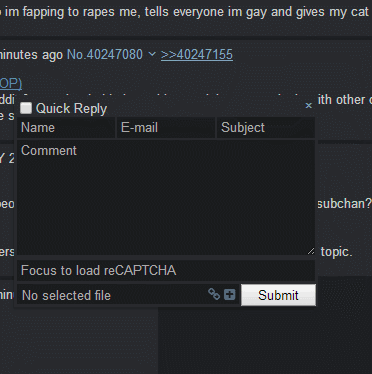
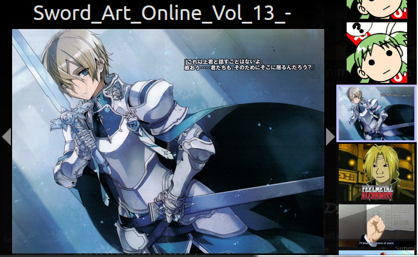
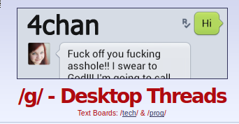
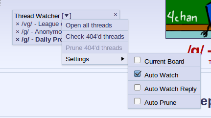
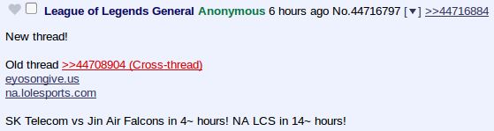

### v1.7.55 
*2014-06-11*

**ccd0**
- Hide subject field when replying to a thread from the index.
- Add option `Show Name and Subject` (off by default) to show the name and subject field even if they are not used by 4chan (forced-anon boards and replies to threads).  Material entered in the name or subject field in such cases is not submitted to 4chan.  Enabling this option should allow Name Sync to work.

### v1.7.54 
*2014-06-09*

**ccd0**
- Remove captcha doubling from report form.
- Remove any whitespace trimming from captchas.

### v1.7.53 
*2014-06-08*

**ccd0**
- Remove name/subject fields from Quick Reply where applicable.
- Small Youtube/pastebin embedding improvements.

### v1.7.52 
*2014-06-02*

**ccd0**
- Add workaround for downloading with the original filename in Firefox.

### v1.7.51 
*2014-06-02*

**ccd0**
- Drop support for using JSON to navigate between boards and threads.  This should have no noticeable effect for users except for fixing various posting bugs.
- Get reply notifications (icon/title changes and desktop alerts) working when quote threading is enabled.
- Tag field no longer appears in QR when replying to an /f/ thread.

### v1.7.50 
*2014-05-30*

**pleebe**
- Archive list update.

### v1.7.49 
*2014-05-28*

**ccd0**
- Fix bug where hidden threads reappeared on index refresh.

### v1.7.48 
*2014-05-27*

**ccd0**
- Fix bug causing broken WebM files to be perpetually redownloaded.

### v1.7.47 
*2014-05-26*

**fgts**
- Move from fgts.eu to fgts.jp.

### v1.7.46 
*2014-05-24*

**ccd0**
- Fix some jsMath-related bugs.

### v1.7.45 
*2014-05-24*

**ccd0**
- Remove doubling of captcha response if only one word is entered.  Google has begun serving captchas consisting of one house number and nothing else, and the doubling caused responses to these captchas to be rejected.  As of now, the doubling is not needed anyway; submitting only the word known to Google is sufficient to pass a two-word captcha.

### v1.7.44 
*2014-05-20*

**fgts, DamonGant**
- Archive list update.

**ccd0**
- Fix bug in archive settings.

### v1.7.43 
*2014-05-18*

**ccd0**
- Support Chrome users on Windows.

### v1.7.42 
*2014-05-18*

**ccd0**
- Greasemonkey version may now work in dwb, but nothing is guaranteed, nor will I be regularly testing in this browser.

### v1.7.41 
*2014-05-17*

**ccd0, Zixaphir**
- Bug fixes.

### v1.7.40 
*2014-05-17*

**DamonGant**
- Add /g/ to Deniable Plausibility archive.

### v1.7.39 
*2014-05-16*

**seaweedchan**
- Add update and Quick Reply links to the bottom of the page.  The latter is enabled by new option `Bottom QR Link` (enabled by default).

**thetickleroftummies**
- Fix issue with truncated filenames and sauce links.

**ccd0**
- Put navigation links at bottom of the thread when JSON Navigation is enabled.
- Remove currently unneeded `Allow Sound` option.

### v1.7.38 
*2014-05-15*

**ccd0**
- Security enhancement: Remove a means by which an archive administrator could inject malicious Javascript into the page when 4chan X fetches a post from the archive.
- Rewrite lots of HTML-generating code to make it easier to check for script injection vulnerabilities.

### v1.7.37 
*2014-05-14*

**DamonGant**
- Innovandalism Archive is now Deniable Plausibility.

**ccd0**
- Disable HTML both in custom board titles and file info formatting. This shuts down a means for a malicious script injected into the page to permanently install itself, to be run each time you browse 4chan. I expect few or no people were actually using their own HTML in these fields; if you want it back, make a request on the [issues](https://github.com/ccd0/4chan-x/issues) page, and I will consider working on a secure implementation.
- Bug fixes.

### v1.7.36 
*2014-05-13*

**ccd0**
- Fix an issue that allowed Javascript running on the page access to the Greasemonkey / Chrome extension APIs.
- Minor fixes.

**Zixaphir**
- Drop links to dead 4index.gropes.us catalog.

**fgts**
- Archive list update; now archiving /b/.

**MayhemYDG**
- Fix #58.

### v1.7.35 
*2014-05-12*

**ccd0**
- Bugfixes.

### v1.7.34 
*2014-05-11*

**Zixaphir**
- JSON Navigation now works for backlinks (when Quote Inlining is disabled) and backlink hashlinks.
- Many spiffy performance, state awareness, and sanity improvements to JSON Navigation.

**ccd0**
- Additional JSON Navigation bugfixes.

### v1.7.33 
*2014-05-10*

**DamonGant**
- Add Innovandalism Archive.

**ccd0**
- Update archive list.
- Add "disabled" option when Foolz Beta is the only choice.

### v1.7.32 
*2014-05-10*

**Zixaphir, ccd0**
- Bug fixes in linkification/embedding.

**ccd0**
- Begin refactoring code to reduce potential for introducing Javascript injection bugs.

### v1.7.31 
*2014-05-08*

**Zixaphir**
- Refactoring, bug fixes.

**ccd0**
- Fix some potential Javascript injection issues.
- Bug fixes.

### v1.7.30 
*2014-05-05*

**thebladeee**
- Update archives.

### v1.7.29 
*2014-05-03*

**ccd0**:
- If the original post form not hidden, it is expanded (except on the catalog page).
- 4chan's horizontal rules are no longer hidden. If you want to hide them as before, add the old code to your custom CSS:

        body > hr,
        #blotter hr,
        .desktop > hr,
        #delform > hr,
        #content > hr {
          display: none;
        }
        :root.index .board > hr:last-of-type,
        :root.thread .board > hr {
          border: 0px;
          margin: 0px;
        }

### v1.7.28 
*2014-05-03*

**ccd0**:
- Copy Mayhem's fix for 4chan post form changes.

### v1.7.27 
*2014-05-02*

**ccd0**
- Update due to more Recaptcha changes.

### v1.7.26 
*2014-05-02*

**woxxy**
Remove /v/ from stable Foolz archive.

### v1.7.25 
*2014-05-01*

**ccd0**
- For single files, file errors are reported but no longer stop you from attempting to post. Files with errors are still removed when posting multiple files.
- Fix small bugs in file checking, uploading from URLs.
- WebM files are checked for audio before posting (Firefox only).
- Max resolution updated, now 10000x10000.

### v1.7.24 
*2014-04-30*

**ccd0**
- Fix bug where multiple images selected for posting were out of order.
- Check dimensions and duration of .webm files before posting.

### v1.7.23 
*2014-04-29*

**ccd0**
- Partly restore Mayhem's captcha changes reverted in last version. Captchas are now destroyed after posting instead of reloaded, unless `Auto-load captcha` is checked. Captcha caching is still enabled.
- Update for changes in Recaptcha, in particular `Recaptcha.reload("t")` no longer working.
- Various captcha-related bugfixes.
- Thumbnails for .webm files in Quick Reply.

### v1.7.22 
*2014-04-27*

**ccd0**
- Revert captcha fixes of 1.4.2 as Google appears to have reverted the changes on its end. This restores captcha caching.

### v1.7.21 
*2014-04-27*

**ccd0**
- Quick fix for moot breaking captcha.

### v1.7.20 
*2014-04-27*

**ccd0**
- Fix features broken/disabled in catalog: settings link, thread watcher, start thread button, and keybinds.

### v1.7.19 
*2014-04-25*

**fgts**
- Update archive list.

### v1.7.18 
*2014-04-20*

**ccd0**
- CSS bugfix.

### v1.7.17 
*2014-04-20*

**ccd0**
- More bugfixes.
- Restore `Comment Expansion`.

### v1.7.16 
*2014-04-19*

**ccd0**
- Another update to handle HTML changes.

### v1.7.15 
*2014-04-19*

**ccd0**
- Fix Unread Line (broken in 1.7.11)

### v1.7.14 
*2014-04-19*

**ccd0**
- Use new URLs.

### v1.7.13 
*2014-04-19*

**ccd0**
- More fixes for new HTML.

### v1.7.12 
*2014-04-19*

**ccd0**
- Fix conflict of previous version with Exlinks.

### v1.7.11 
*2014-04-19*

**ccd0**
- Start transition to new HTML.

### v1.7.10 
*2014-04-17*

**ccd0**
- Change Shift+arrow default keybinds Ctrl+arrow to avoid conflict with text selection
- Fix (You) in backlinks.

### v1.7.9 
*2014-04-13*

**ccd0**
- Bugfixes in JSON navigation and embedding.
- More work toward compatibility with new URLs.

### v1.7.8 
*2014-04-12*

**ccd0**
- Some keybind bugfixes.
- Begin work toward compatibility with new URLs.

### v1.7.7 
*2014-04-10*

**fgts**
- Update archive list.

### v1.7.6 
*2014-04-10*

**ccd0**
- `Loop in New Tab` (enabled by default) causes videos opened in a separate tab to loop, and applies your settings for inline expanded videos to them.

### v1.7.5 
*2014-04-09*
**ccd0**
- Add WebM support to gallery (currently no controls).
- Add PDF support to gallery, disabled by default. Enable with `PDF in Gallery`.

### v1.7.4 
*2014-04-08*

**Nebukazar**
- `Quote Threading` disabled by default
- Added missing titles to Header icons

**ccd0**
- Fix bug in gallery introduced in 1.7.3.

### v1.7.3 
*2014-04-07*

**ccd0**
- Fix behavior of .webm videos expanded within inline quotes.
- Contract thumbnails in quoted previews to avoid crashes caused by videos in quoted previews on some systems.
- Change interface when both `Autoplay` and `Show Controls` are unchecked. In this mode, videos are now activated by clicking on them. The first click expands the video, the second click plays the video, and the third click contracts it.
- Add item `Expand videos` in `Image Expansion` menu, which enables expansion of videos by `Expand All Images`. Disabled by default. Previously videos were expanded.
- Disable autoplay for videos expanded by `Expand All Images`.

### v1.7.2 
*2014-04-07*

**ccd0**
- Restore thread expansion with JSON navigation disabled.

### v1.7.1 
*2014-04-06*

**ccd0**
- Fix minimum width bug.
- `JSON Navigation` is now disabled by default.

## v1.7.0 
*2014-04-06*

**Zixaphir** 
- Reload captcha if there are posts in the queue.

**ccd0**
- In v1.5.1, image/video hover was changed to hide and re-use the images/videos to avoid crashes.
  Fixing bugs caused by this change.

**duckness**
- Allow disabling upgrade nag message.

### v1.5.2 
*2014-04-04*

**Zixaphir**:
- Fix file info bug.
**ccd0**:
- Fix memory issue.

### v1.5.1 
*2014-04-04*

**ccd0**:
- Support hover for .webm videos.
- Add .webm to supported posting types.
- Add option `Allow Sound` to enable/disable sound. Enabled by default.

## v1.5.0 
*2014-04-04*

**ccd0**:
- Support expansion of .webm videos.
- New setting: `Autoplay`, enabled by default. Causes videos to play immediately when expanded.
- New setting: `Show Controls`, enabled by default. Shows native controls on videos.

### v1.4.7 
*2014-04-03*

**ccd0**:
- Fix updating of Chrom* extension.

### v1.4.6 
*2014-04-03*

**ccd0**:
- Update archives with data from MayhemYDG fork.

### v1.4.5 
*2014-04-03*

**ccd0**:
- Add updater for Chrom* extension.

### v1.4.4 
*2014-04-03*

**ccd0**:
- Fix flag selector not being removed from post form.

### v1.4.3 
*2014-04-03*

**ccd0**:
- Fix [navigation bug](https://github.com/ccd0/4chan-x/issues/14)

### v1.4.2 
*2014-04-02*

**MayhemYDG**:
- Fix captcha not refreshing.
- Fix captcha submission: 
  Captchas were reloaded the instant a post was submitted to 4chan. Unfortunately, a recent change to reCAPTCHA made it so reloading captchas invalidates the ones that loaded but not yet used. This is now fixed by only unloading the captcha, and only load new ones after the post is submitted. 
  This also kills captcha caching, so the feature was removed.
**duckness**:
- Merge changes from Mayhem fork
**ccd0**:
- Embedding for direct video links
- Merge changes from Mayhem fork

### v1.4.1 
*2014-03-01*

**Spittie**
- Check image dimension before uploading

- Bug fixes
- Update archives

## v1.4.0 
*2014-02-24*

**ParrotParrot**:
- Added `Original filename` variable to Sauce panel.

**MayhemYDG**:

- Added a Reset Settings button in the settings.
- More stability update.
- Stability update.

**Zixaphir**:
- Merge changes from Mayhem fork

### v1.3.9 
*2014-02-20*

**Spittie**
- Fix uploading (>me in charge of not being an idiot)

### v1.3.8 
*2014-02-20*

**MayhemYDG**
- Fix QR

**Spittie**
- Better url handling

### v1.3.7 
*2014-02-15*

**Spittie**
- Add Twitter embedding
- Add .xpi for Firefox Mobile
- Add /biz/

### v1.3.6 
*2014-02-13*

**Spittie**
- Upload images directly from urls
 

- Add gfycat.com embedding
- Replace some icons with fontawesome
- Add Metro favicons (lel)

### v1.3.5 
*2014-02-10*

**Spittie**
- Fix Chrome (aka copy from Appchan)
- Add option to load the captcha when you open a thread
- Add OpenSUSE emoji

### v1.3.4 
*2014-02-10*

**Spittie**
- Fix Chrome (Maybe? Hopefully I haven't fucked everything)
- Add fgst.eu
- Add mawa.re

### v1.3.3 
*2014-02-09*

**MayhemYDG**
- Fix new captcha

**Spittie**
- Add archive.installgentoo.com

### v1.3.2 
*2014-01-12*

**seaweedchan**:
- Fix Menu errors on older Firefox versions, such as the ESR

### v1.3.1 
*2014-01-12*

**seaweeedchan**:
- Turn infinite scrolling into new index mode
- Fix style issues with non-fixed header

**Zixaphir**:
- Add old infinite scrolling functionality
- Fix Redirect errors

## v1.3.0 
*2014-01-10*

**MayhemYDG**:
- **New option**: `Auto-hide header on scroll`.
- Added support for `4cdn.org`.
- Index navigation improvements:
 - Searching in the index is now possible and will show matched OPs by:
 <ul>
  <li> comment
  <li> subject
  <li> filename
  <li> name
  <li> tripcode
  <li> e-mail
 </ul>
 - The page number on which threads are will now be displayed in OPs, to easily identify where threads are located when:
 <ul>
  <li> searching through the index.
  <li> using different index modes and sorting types.
  <li> threads highlighted by the filter are moved to the top and move other threads down.
 </ul>
 - The elapsed time since the last index refresh is now indicated at the top of the index.
 - New setting: `Show replies`, enabled by default. Disable it to only show OPs in the index.
 - New setting: `Anchor Hidden Threads`, enabled by default. Hidden threads will be moved at the end of the index to fill the first pages.
 - New setting: `Refreshed Navigation`, disabled by default. When enabled, navigating through pages will refresh the index.
 - The last index refresh timer will now indicate the last time the index changed from 4chan's side, instead of the last time you refreshed the index.
 - You can now refresh the index page you are on with the refresh shortcut in the header bar or the same keybind for refreshing threads.
 - You can now switch between paged and all-threads index modes via the "Index Navigation" header sub-menu (note that this replaces infinite scrolling): 
  
 - Threads in the index can now be sorted by:
 <ul>
  <li> Bump order
  <li> Last reply
  <li> Creation date
  <li> Reply count
  <li> File count
 </ul>
 - Navigating across index pages is now instantaneous.
 - The index refreshing notification will now only appear on initial page load with slow connections.
- Added a keybind to open the catalog search field on index pages.
- Minor cooldown fix:
 - You cannot post an image reply immediately after a non-image reply anymore.
- Various minor fixes

**seaweedchan**:
- Various fixes and improvements for the JSONified index
- Removed index refresh notifications
- Various style tweaks

**Zixaphir**:
- FappeTyme and WerkTyme now persist across sessions.
- Various fixes and improvements for the JSONified index

### v1.2.45 
*2014-01-07*

**seaweedchan**:
- Remove moot's plea to remove ad-blocker
- Hopefully fix NSFW themes and 404 image redirecting
- Update archive list

**Zixaphir**:
- Fix optional increase for thread updater

### v1.2.44 
*2013-12-06*

**MayhemYDG**:
- Cooldown fix (You can no longer post an image reply immediately after a text reply)
- Fix for 4chan markup change that caused a lot of errors

**seaweedchan**:
- Fix catalog links option

### v1.2.43 
*2013-11-10*

**noface**:
- Strawpoll.me embedding support (as usual, only works on HTTP 4chan due to lack of HTTPS)

### v1.2.42 
*2013-10-22*

**Zixaphir**:
- Better MediaCru.sh embedding
- Infinite Scrolling

### v1.2.41 
*2013-10-03*

**MayhemYDG**:
- Minor Chrome 30 fix

### v1.2.40 
*2013-09-22*

**MayhemYDG**:
- /pol/ flag selector

**seaweedchan**:
- Delete cooldown update
- Small bug fixes
- Don't show warnings AND desktop notifications at the same time, and prefer QR warnings unless the document is hidden

### v1.2.39 
*2013-09-19*

**seaweedchan**:
- Fix thread updater bug introduced in last version

### v1.2.38 
*2013-09-19*

**MayhemYDG**:
- Update posting cooldown timers to match 4chan settings:
  - Cooldown may vary between inter-thread and intra-thread replies.
  - Cooldown may vary when posting a file or not.
  - Cooldown does not take sageing into account anymore.
  - Timers vary across boards.

### v1.2.37 
*2013-09-12*

**seaweedchan**:
- Just some small fixes.

### v1.2.36 
*2013-08-26*

**MayhemYDG**:
- New desktop notification:
  * The QR will now warn you when you are running low on cached captchas while auto-posting.

**seaweedchan**:
 - Visual overhaul for gallery mode

**Zixaphir**:
 - Fix an issue with the file dialog randomly opening multiple times (with seaweedchan)

- Add new feature: `Gallery`.
  * Opens images in a lightweight Gallery script.
  * If enabled while Image Expansion is disabled, will takeover as the default action when images are clicked.
  * Supports several hotkeys: left is previous, right and enter are next, escape closes.
  * Works with Thread Updater to add new images to the Gallery while its open.
  * BLINK/WEBKIT ONLY: Clicking the file title will download the image with the original name.
  * Menu button to hide thumbnails, enable/disable fit width/height
  * Thumbnails scroll with the active image

### v1.2.35 
*2013-08-20*

**seaweedchan**:
- Fix Mayhem breaking input history (names, emails, subjects) in Firefox

### v1.2.34 
*2013-08-19*

**seaweedchan**:
- `.icon` to `.fourchanx-icon` to avoid conflicts with 4chan's CSS

### v1.2.33 
*2013-08-18*

**MayhemYDG**:
- Added new option: `Desktop Notifications`
- Implement filename editing
- Replace shortcuts with icons

**seaweedchan**:
- Made shortcut icons optional under the Header submenu, disabled by default, as well as edited some of the icons
- Disabled desktop notifications by default
- Edited filename editing to require a ctrl+click, so otherwise the file input will look and behave the same as before
- Added `.you` class to quotelinks that quote you

**Zixaphir**:
- Forked and minimized the Font Awesome CSS used for the shortcut icons
- Some more linkifier improvements

### v1.2.32 
*2013-08-16*

**seaweedchan**:
- Optimizations for the banner and board title code, including a fix for boards without subtitles throwing an error

### v1.2.31 
*2013-08-16*

**seaweedchan**:

- Ported `Custom Board Titles` feature from Appchan X (with Zixaphir)
  - This allows you to edit the board title and subtitle in real-time by ctrl+clicking them
- Ported ability to change to a new random banner image on click from Appchan X

**Zixaphir**:
- Small linkifier fix

### v1.2.30 
*2013-08-15*

**seaweedchan**:
- Fix Color User IDs
- Fix Mayhem breaking uploading images in Pale Moon (and other forks based on Firefox <22)

**Zixaphir**:
- More under-the-hood linkifier changes, including support for all top-level domains (with seaweedchan)
- Fix header auto-hide toggle keybind

### v1.2.29 
*2013-08-14*

**Zixaphir**:
- Fix issue that caused 4chan X to show settings after every page load

### v1.2.28 
*2013-08-14*

**MayhemYDG**:

- Greatly improved thread watcher
  - Added submenu with ability to prune 404'd threads, filter by current board, etc
  - Periodically checks which threads have 404'd and indicates them with a strikethrough
- Removed `Check for Updates` as your browser should now handle this automatically
- Fixed an error for Firefox <23 users
- Add a message for Chrome users who experience the Corrupted File bug

**seaweedchan**:
- Changed class `.fourchanx-link` for brackets to `.brackets-wrap` to be consistent with Mayhem's 4chan X
- Added `.seaweedchan` class to the document for those that need a way to tell this fork from other forks for CSS/JS

**Zixaphir**:

- Drastically improved the accuracy and quality of the linkifier (with seaweedchan)
- Removed `Allow False Positives` option due to the accuracy of the new linkifier regex

### v1.2.27
*2013-08-12*

**seaweedchan**:
- Fix minor class name change from last version's merge

### v1.2.26
*2013-08-12*

**MayhemYDG**:
- Show dice rolls that were entered into the email field on /tg/.
- Fix flag filtering on /sp/ and /int/.
- Minor fixes.
- Minor optimizations.

**seaweedchan**:
- Change new error message to link to ban page just in case

**Zixaphir**:
- Linkifier Rewrite.
- Added Twitch.tv and Vine embedding (with @ihavenoface)
- Keybinds to scroll to posts that quote you.
- Minor optimizations.
- Minor fixes.

### v1.2.25
*2013-08-04*

**seaweedchan**:
- Fix issues with having two options called `Reveal Spoilers`. 
- Update archive.

### v1.2.24
*2013-07-24*

**seaweedchan**:
- Update archives (warosu is back up, and with it, the option to use it).

### v1.2.23
*2013-07-23*

**matt4682**:
- Small fix for new error message.

### v1.2.22
*2013-07-23*

**seaweedchan**:
- Update archives.

### v1.2.21
*2013-07-22*

**seaweedchan**:
- Fix /f/ posting.
- Change the "Connection error" message, and point to my own FAQ instead of Mayhem's.

### v1.2.20
*2013-07-22*

**MayhemYDG**:
- Fixed captcha caching not syncing across open threads.

**seaweedchan**:
- Changed some defaults around

### v1.2.19
*2013-07-14*

**seaweedchan**:
- Update archives. LoveIsOver is going down permanently until it can find a host, some boards were removed by archivers, and Warosu has been down for 2 days now.
- Add a new option to hide "4chan X has been updated to ____" notifications for those having issues with them.

### v1.2.18
*2013-06-27*

**seaweedchan**:
- Update archives

### v1.2.17
*2013-06-17*
**seaweedchan**:
- Fix full images being forced onto their own line

### v1.2.16
*2013-06-16*

**seaweedchan**:
- Add `.active` class to `.menu-button` when clicked (and remove on menu close)
- Move /v/ and /vg/ back to Foolz archive

### v1.2.15
*2013-06-14*

**seaweedchan**:
- Revert Mayhem's updater changes which caused silly issues
- Make thumbnails in QR show (or most of) the whole image

### v1.2.14
*2013-06-14*

**MayhemYDG**:
- Remove /s4s/ from warosu archive
- Fix CAPTCHA duplication on the report page
- Small bug fixes

**seaweedchan**:
- Rename `Indicate Spoilers` to `Reveal Spoilers`
- If `Reveal Spoilers` is enabled but `Remove Spoilers` is not, act as if the spoiler is hovered

**Tracerneo**:
- Add ID styling for IDs with black text

### v1.2.13
*2013-05-28*

**seaweedchan**:
- Small bug fixes

### v1.2.12
*2013-05-27*

**MayhemYDG**:
- Fix `Jump to Next Reply` keybind not accounting for posts after unread line

**seaweedchan**:
- Added `.hasInline` (if replyContainer contains .inline) for userstyle/script maintainers

### v1.2.11
*2013-05-27*

**MayhemYDG**:
- Add page count to thread stats
- Better performance for Fit Height by using vh

**seaweedchan**:
- Added OpenSettings event on 4chan X settings/sections open for userscripts like OneeChan and 4chan Style Script
- Changed defaults that use the arrow keys to shift+arrow key to not conflict with scrolling
- Made Mayhem's page count in thread stats optional

### v1.2.10
*2013-05-25*

**seaweedchan**:
- Small bug fixes

### v1.2.9
*2013-05-25*

**seaweedchan**:
- Fix YouTube videos in Firefox taking z-index priority
- Fix Persistent QR not working for /f/

**zixaphir**:
- New option: `Image Prefetching`. Adds a toggle to the header menu for per-thread prefetching.
- Make Advance on contract work with Fappe Tyme

### v1.2.8
*2013-05-20*

**MayhemYDG**:
- Tiny fixes

**seaweedchan**:
- New image expansion option: `Advance on contract`. Advances to next post unless Fappe Tyme is enabled (temporary)
- Change `.qr-link` to `.qr-link-container` and `.qr-link>a` to `.qr-link`

**Wohlfe**:
- Add /pol/ archiving for FoolzaShit

### v1.2.7
*2013-05-18*

**seaweedchan**:
- Update /q/'s posting cooldown
- Make "___ omitted. Click here to view." text change when thread is expanded.
- Restrict "Reply to Thread" click event to the link itself
- Fix Nyafuu being undefined

### v1.2.6
*2013-05-16*

**seaweedchan**:
- Fix bug with theme switching

### v1.2.5
*2013-05-15*

**seaweedchan**:
- New option `Captcha Warning Notifications`
 - When disabled, shows a red border around the captcha to indicate captcha errors. Goes back to normal when any key is pressed.
- Color Quick Reply's inputs in Tomorrow to match the theme
- Revert some of Mayhem's changes that caused new bugs

### v1.2.4
*2013-05-14*

**seaweedchan**:
- Don't let QR shortcut close a Persistent QR
- Don't let Reply to Thread link close the QR -- it should only do what it implies

**zixaphir**:
- Add board selection to archiver options
- Fix bug where image hover would close when hitting Enter while typing
- Add `Quoted Title` option which adds (!) text to title when user is quoted

### v1.2.3
*2013-05-14*

**MayhemYDG**:
- Add new archive selection

**seaweedchan**:
- Change watcher favicon to a heart. Change class name from `.favicon` to `.watch-thread-link`. Add `.watched` if thread is watched.
- Remove new archive selection back into Advanced
- Some styling fixes

**zixaphir**:
- Make new archive selection not depend on a JSON file
- Remove some code from May Ham's 4chan X that sends user errors back to his server (we didn't have a working link anyway)

### v1.2.2
*2013-05-11*

**seaweedchan**:
- Small bug fixes
- Changed `Persistent Thread Watcher` option to `Toggleable Thread Watcher`. 
  - When disabled, the [Watcher] shortcut is no longer added, and the watcher stays at the top of the page.

### v1.2.1
*2013-05-10*

**seaweedchan**:
- Small bug fixes

## v1.2.0 - "Youmu" 
*2013-05-10*

**MayhemYDG**:
- Added Foolzashit archive
- Added `blink` class to document in preparation for future versions of Chrome and Opera
- Take advantage of announcement's new `data-utc` value for hiding
  - `data-utc` is a timestamp, this allows us to not have to store the entire text content of the announcement

**seaweedchan**:
- Turn all brackets into pseudo-elements. Brackets can be changed by overwriting the `content` of `.fourchanx-link::before` (`[`) and `.fourchanx-link::after` (`]`), or removed entirely with ease.
  - Note: This does not change the default brackets around `toggle-all` in the custom navigation. These are up to the user.
- Fix file input in Opera
- External link support in Custom Board Navigation!
  - `external-text:"Google","http://www.google.com"`
- Fix JIDF flag on /pol/ when post is fetched by updater

**zixaphir**:
- Change Custom Board Navigation input into textarea, new lines will convert to spaces
- Fix auto-scrolling in Chrome
- Fix wrapping of #dump-list in Chrome
- Fix (You) not being added in expanded comments

### v1.1.18
*2013-05-09*

**seaweedchan**:
- Hide stub link added in menus of stubs
- #dump-button moved into #qr-filename-container as a simple + link
- QR with 4chan Pass made a little wider
- Styling changes for spoiler label, also added `.has-spoiler` class for QR

### v1.1.17
*2013-05-08*

**seaweedchan**:
- Bug fixes

### v1.1.16
*2013-05-07*

**seaweedchan**:
- Add `Centered links` option for header
- Add `Persistent Thread Watcher` option
- Watcher styling changes

**zixaphir**:
- Simpler update checking

### v1.1.15
*2013-05-07*

**seaweedchan**:
- Fix update and download urls for Greasemonkey

### v1.1.14
*2013-05-07*

**seaweedchan**:
- Fix catalog content sometimes disappearing due to issue with 4chan's javascript

**zixaphir**:
- Re-added `Quote Hash Navigation` option

### v1.1.13
*2013-05-06*

**seaweedchan**:
- Disable settings removing scroll bar when opened, thus fixing the issue where it jumps up the page randomly
- Hide watcher by default, add [Watcher] shortcut.

### v1.1.12
*2013-05-06*

**detharonil**:
- Support for %Y in time formatting
- More future-proof %y

**MayhemYDG**:
- Fix whitespaces not being preserved in code tags in /g/.

**seaweedchan**:
- Fix QR not being able to drag to the top with fixed header disabled

**zixaphir**:
- Fix custom CSS
- Fix [Deleted] showing up randomly after submitting a post

### v1.1.11
*2013-05-04*

**seaweedchan**:
- Add `Highlight Posts Quoting You` option
- Add 'catalog', 'index', or 'thread' classes to document depending on what's open
- Add `Filtered Backlinks` options that when disabled, hides filtered backlinks

### v1.1.10
*2013-05-03*

**seaweedchan**:
- Fix update checking

### v1.1.9
*2013-05-02*

**seaweedchan**
- Fix boards with previously deleted archives not switching to new archives 

**ihavenoface**:
- 4chan Pass link by the style selector

**zixaphir**:
- Make Allow False Positives option more efficient

### v1.1.8
*2013-05-01*

**seaweedchan**:
- Fix QR not clearing on submit with Posting Success Notifications disabled
- New archives for /h/, /v/, and /vg/

### v1.1.7
*2013-05-01*

**seaweedchan**:
- External image embedding
- Account for time options in youtube links for embedding
- Once again remove /v/ and /vg/ archiving... ;_;
- Add paste.installgentoo.com embedding
- Added `Posting Success Notifications` option to make "Post Successful!" and "_____ uploaded" notifications optional
- Added `Allow False Positives` option under Linkification, giving the user more control over what's linkified.

### v1.1.6
*2013-05-01*

**seaweedchan**:
- Fix Gist links if no username is specificed

**MayhemYDG**:
 - Access it in the `Advanced` tab of the Settings window.

**zixaphir**:
- Add Gist link titles

### v1.1.5
*2013-04-30*

**seaweedchan**:
- Fix various embedding issues
- Fix Link Title depending on Embedding
- Added favicons to links that can be embedded
- Add gist embedding

### v1.1.4
*2013-04-29*

**seaweedchan**:
- Change ESC functionality in QR to autohide if Persistent QR is enabled
- Add /v/ and /vg/ archiving to archive.nihil-ad-rem.net, and make sure Archiver Selection settings actually switch to it
- Add option to toggle between updater and stats fixed in header or floating

**MayhemYDG**: 
- Add nyafuu archiving for /w/
- Add /d/ archive

### v1.1.3
*2013-04-28*

**seaweedchan**:
- Chrome doesn't get .null, so don't style it
- Fix count when auto update is disabled and set updater text to "Update"
- Remove /v/ and /vg/ redirection from Foolz.
- Toggle keybind for header auto-hiding

**MayhemYDG**:
- Fix Unread Count taking into account hidden posts.

### v1.1.2
*2013-04-26*

**seaweedchan**:
- Fix emoji and favicon previews not updating on change.
- Fix issue with dragging thread watcher
- Fix some settings not importing when coming from Mayhem's v3
- Fix menu z-index

**MayhemYDG**:
- Fix bug where a thread would freeze on load.

**zixaphir**:
- Fix preview with favicons and emoji
- Fix NaN error on Thread Updater Interval
- Draggable UI can no longer overlap the Header.
  - Setting the header to Autohide also increases its z-index to overlap other UI

### v1.1.1
*2013-04-26*

**zixaphir**:
- Fix script on Opera

**MayhemYDG**:
- Minor fixes.
- Chrome only: Due to technical limitations, Filter lists and Custom CSS will not by synchronized across devices anymore.

**seaweedchan**:
- Allow thread watcher to load on catalog

### v1.0.10
*2013-04-23*

- Add message pertaining to rewrite

### v1.0.9
*2013-04-17*

**ihavenoface**:
- Implement Announcement Hiding

**seaweedchan**:
- Change #options back to inheriting colors from replies
- Fix script breaking when disabling image expansion

### v1.0.8
*2013-04-15*

**seaweedchan**:
- Redo settings menu styling
- Move Export/Import buttons and dialog
- Update license and use banner.js for license

### v1.0.7
*2013-04-14*

qqueue:
- Relative post dates

**MayhemYDG**:
- Exporting/importing settings

### v1.0.6
*2013-04-13*

**seaweedchan**:
- Update supported boards for archive redirection and custom navigation
- Point to github.io instead of github.com for pages
- Fix post archive link for InstallGentoo and Foolz
- Make InstallGentoo default for /g/
- Fix embedding issues

### v1.0.5
*2013-04-09*

**seaweedchan**:
- Added keybind to toggle Fappe Tyme
- Fix code tag keybind

**zixaphir**:
- Add 'yourPost' class to own replies

### v1.0.4
*2013-04-08*

**seaweedchan**:
- Fix Fappe Tyme
- Re- add label for image expanding
- Move restore button to left side as per RiDeag

### v1.0.3
*2013-03-23*

**seaweedchan**:
- Add ad- blocking CSS into Custom CSS examples

**zixaphir**:
- Fix ctrl+s bringing up save dialog
- Fix issues with soundcloud embedding

### v1.0.2
*2013-03-14*

**seaweedchan**:
- New Rice option: Emoji Position
- New layout for Rice tab
- No more Yotsuba / Yotsuba B in options

### v1.0.1
*2013-03-14*

- New option: Emoji
- New Rice option: Sage Emoji

**seaweedchan**:
- Prettier error messages

### v1.0.0
*2013-03-13*

- Initial release

**zixaphir**:
- Fix unread post count for filtered posts
- Fix issues when switching from ihavenoface's fork
- Fix backlinks not receiving filtered class
- Fix QR position not saving on refresh
