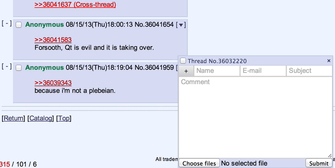

**MayhemYDG**:

- The QR now allows you to edit the filename on the fly:

### v1.2.32 
*2013-08-16*

**seaweedchan**:
- Optimizations for the banner and board title code, including a fix for boards without subtitles throwing an error

### v1.2.31 
*2013-08-16*

**seaweedchan**:

- Ported `Custom Board Titles` feature from Appchan X (with Zixaphir)
  - This allows you to edit the board title and subtitle in real-time by ctrl+clicking them
- Ported ability to change to a new random banner image on click from Appchan X

**Zixaphir**:
- Small linkifier fix

### v1.2.30 
*2013-08-15*

**seaweedchan**:
- Fix Color User IDs
- Fix Mayhem breaking uploading images in Pale Moon (and other forks based on Firefox <22)

**Zixaphir**:
- More under-the-hood linkifier changes, including support for all top-level domains (with seaweedchan)
- Fix header auto-hide toggle keybind

### v1.2.29 
*2013-08-14*

**Zixaphir**:
- Fix issue that caused 4chan X to show settings after every page load

### v1.2.28 
*2013-08-14*

**MayhemYDG**:

- Greatly improved thread watcher
  - Added submenu with ability to prune 404'd threads, filter by current board, etc
  - Periodically checks which threads have 404'd and indicates them with a strikethrough
- Removed `Check for Updates` as your browser should now handle this automatically
- Fixed an error for Firefox <23 users
- Add a message for Chrome users who experience the Corrupted File bug

**seaweedchan**:
- Changed class `.fourchanx-link` for brackets to `.brackets-wrap` to be consistent with Mayhem's 4chan X
- Added `.seaweedchan` class to the document for those that need a way to tell this fork from other forks for CSS/JS

**Zixaphir**:

- Drastically improved the accuracy and quality of the linkifier (with seaweedchan)
- Removed `Allow False Positives` option due to the accuracy of the new linkifier regex

### v1.2.27
*2013-08-12*

**seaweedchan**:
- Fix minor class name change from last version's merge

### v1.2.26
*2013-08-12*

**MayhemYDG**:
- Show dice rolls that were entered into the email field on /tg/.
- Fix flag filtering on /sp/ and /int/.
- Minor fixes.
- Minor optimizations.

**seaweedchan**:
- Change new error message to link to ban page just in case

**Zixaphir**:
- Linkifier Rewrite.
- Added Twitch.tv and Vine embedding (with @ihavenoface)
- Keybinds to scroll to posts that quote you.
- Minor optimizations.
- Minor fixes.

### v1.2.25
*2013-08-04*

**seaweedchan**:
- Fix issues with having two options called `Reveal Spoilers`. 
- Update archive.

### v1.2.24
*2013-07-24*

**seaweedchan**:
- Update archives (warosu is back up, and with it, the option to use it).

### v1.2.23
*2013-07-23*

**matt4682**:
- Small fix for new error message.

### v1.2.22
*2013-07-23*

**seaweedchan**:
- Update archives.

### v1.2.21
*2013-07-22*

**seaweedchan**:
- Fix /f/ posting.
- Change the "Connection error" message, and point to my own FAQ instead of Mayhem's.

### v1.2.20
*2013-07-22*

**MayhemYDG**:
- Fixed captcha caching not syncing across open threads.

**seaweedchan**:
- Changed some defaults around

### v1.2.19
*2013-07-14*

**seaweedchan**:
- Update archives. LoveIsOver is going down permanently until it can find a host, some boards were removed by archivers, and Warosu has been down for 2 days now.
- Add a new option to hide "4chan X has been updated to ____" notifications for those having issues with them.

### v1.2.18
*2013-06-27*

**seaweedchan**:
- Update archives

### v1.2.17
*2013-06-17*
**seaweedchan**:
- Fix full images being forced onto their own line

### v1.2.16
*2013-06-16*

**seaweedchan**:
- Add `.active` class to `.menu-button` when clicked (and remove on menu close)
- Move /v/ and /vg/ back to Foolz archive

### v1.2.15
*2013-06-14*

**seaweedchan**:
- Revert Mayhem's updater changes which caused silly issues
- Make thumbnails in QR show (or most of) the whole image

### v1.2.14
*2013-06-14*

**MayhemYDG**:
- Remove /s4s/ from warosu archive
- Fix CAPTCHA duplication on the report page
- Small bug fixes

**seaweedchan**:
- Rename `Indicate Spoilers` to `Reveal Spoilers`
- If `Reveal Spoilers` is enabled but `Remove Spoilers` is not, act as if the spoiler is hovered

**Tracerneo**:
- Add ID styling for IDs with black text

### v1.2.13
*2013-05-28*

**seaweedchan**:
- Small bug fixes

### v1.2.12
*2013-05-27*

**MayhemYDG**:
- Fix `Jump to Next Reply` keybind not accounting for posts after unread line

**seaweedchan**:
- Added `.hasInline` (if replyContainer contains .inline) for userstyle/script maintainers

### v1.2.11
*2013-05-27*

**MayhemYDG**:
- Add page count to thread stats
- Better performance for Fit Height by using vh

**seaweedchan**:
- Added OpenSettings event on 4chan X settings/sections open for userscripts like OneeChan and 4chan Style Script
- Changed defaults that use the arrow keys to shift+arrow key to not conflict with scrolling
- Made Mayhem's page count in thread stats optional

### v1.2.10
*2013-05-25*

**seaweedchan**:
- Small bug fixes

### v1.2.9
*2013-05-25*

**seaweedchan**:
- Fix YouTube videos in Firefox taking z-index priority
- Fix Persistent QR not working for /f/

**zixaphir**:
- New option: `Image Prefetching`. Adds a toggle to the header menu for per-thread prefetching.
- Make Advance on contract work with Fappe Tyme

### v1.2.8
*2013-05-20*

**MayhemYDG**:
- Tiny fixes

**seaweedchan**:
- New image expansion option: `Advance on contract`. Advances to next post unless Fappe Tyme is enabled (temporary)
- Change `.qr-link` to `.qr-link-container` and `.qr-link>a` to `.qr-link`

**Wohlfe**:
- Add /pol/ archiving for FoolzaShit

### v1.2.7
*2013-05-18*

**seaweedchan**:
- Update /q/'s posting cooldown
- Make "___ omitted. Click here to view." text change when thread is expanded.
- Restrict "Reply to Thread" click event to the link itself
- Fix Nyafuu being undefined

### v1.2.6
*2013-05-16*

**seaweedchan**:
- Fix bug with theme switching

### v1.2.5
*2013-05-15*

**seaweedchan**:
- New option `Captcha Warning Notifications`
 - When disabled, shows a red border around the captcha to indicate captcha errors. Goes back to normal when any key is pressed.
- Color Quick Reply's inputs in Tomorrow to match the theme
- Revert some of Mayhem's changes that caused new bugs

### v1.2.4
*2013-05-14*

**seaweedchan**:
- Don't let QR shortcut close a Persistent QR
- Don't let Reply to Thread link close the QR -- it should only do what it implies

**zixaphir**:
- Add board selection to archiver options
- Fix bug where image hover would close when hitting Enter while typing
- Add `Quoted Title` option which adds (!) text to title when user is quoted

### v1.2.3
*2013-05-14*

**MayhemYDG**:
- Add new archive selection

**seaweedchan**:
- Change watcher favicon to a heart. Change class name from `.favicon` to `.watch-thread-link`. Add `.watched` if thread is watched.
- Remove new archive selection back into Advanced
- Some styling fixes

**zixaphir**:
- Make new archive selection not depend on a JSON file
- Remove some code from May Ham's 4chan X that sends user errors back to his server (we didn't have a working link anyway)

### v1.2.2
*2013-05-11*

**seaweedchan**:
- Small bug fixes
- Changed `Persistent Thread Watcher` option to `Toggleable Thread Watcher`. 
  - When disabled, the [Watcher] shortcut is no longer added, and the watcher stays at the top of the page.

### v1.2.1
*2013-05-10*

**seaweedchan**:
- Small bug fixes

## v1.2.0 - "Youmu" 
*2013-05-10*

**MayhemYDG**:
- Added Foolzashit archive
- Added `blink` class to document in preparation for future versions of Chrome and Opera
- Take advantage of announcement's new `data-utc` value for hiding
  - `data-utc` is a timestamp, this allows us to not have to store the entire text content of the announcement

**seaweedchan**:
- Turn all brackets into pseudo-elements. Brackets can be changed by overwriting the `content` of `.fourchanx-link::before` (`[`) and `.fourchanx-link::after` (`]`), or removed entirely with ease.
  - Note: This does not change the default brackets around `toggle-all` in the custom navigation. These are up to the user.
- Fix file input in Opera
- External link support in Custom Board Navigation!
  - `external-text:"Google","http://www.google.com"`
- Fix JIDF flag on /pol/ when post is fetched by updater

**zixaphir**:
- Change Custom Board Navigation input into textarea, new lines will convert to spaces
- Fix auto-scrolling in Chrome
- Fix wrapping of #dump-list in Chrome
- Fix (You) not being added in expanded comments

### v1.1.18
*2013-05-09*

**seaweedchan**:
- Hide stub link added in menus of stubs
- #dump-button moved into #qr-filename-container as a simple + link
- QR with 4chan Pass made a little wider
- Styling changes for spoiler label, also added `.has-spoiler` class for QR

### v1.1.17
*2013-05-08*

**seaweedchan**:
- Bug fixes

### v1.1.16
*2013-05-07*

**seaweedchan**:
- Add `Centered links` option for header
- Add `Persistent Thread Watcher` option
- Watcher styling changes

**zixaphir**:
- Simpler update checking

### v1.1.15
*2013-05-07*

**seaweedchan**:
- Fix update and download urls for Greasemonkey

### v1.1.14
*2013-05-07*

**seaweedchan**:
- Fix catalog content sometimes disappearing due to issue with 4chan's javascript

**zixaphir**:
- Re-added `Quote Hash Navigation` option

### v1.1.13
*2013-05-06*

**seaweedchan**:
- Disable settings removing scroll bar when opened, thus fixing the issue where it jumps up the page randomly
- Hide watcher by default, add [Watcher] shortcut.

### v1.1.12
*2013-05-06*

**detharonil**:
- Support for %Y in time formatting
- More future-proof %y

**MayhemYDG**:
- Fix whitespaces not being preserved in code tags in /g/.

**seaweedchan**:
- Fix QR not being able to drag to the top with fixed header disabled

**zixaphir**:
- Fix custom CSS
- Fix [Deleted] showing up randomly after submitting a post

### v1.1.11
*2013-05-04*

**seaweedchan**:
- Add `Highlight Posts Quoting You` option
- Add 'catalog', 'index', or 'thread' classes to document depending on what's open
- Add `Filtered Backlinks` options that when disabled, hides filtered backlinks

### v1.1.10
*2013-05-03*

**seaweedchan**:
- Fix update checking

### v1.1.9
*2013-05-02*

**seaweedchan**
- Fix boards with previously deleted archives not switching to new archives 

**ihavenoface**:
- 4chan Pass link by the style selector

**zixaphir**:
- Make Allow False Positives option more efficient

### v1.1.8
*2013-05-01*

**seaweedchan**:
- Fix QR not clearing on submit with Posting Success Notifications disabled
- New archives for /h/, /v/, and /vg/

### v1.1.7
*2013-05-01*

**seaweedchan**:
- External image embedding
- Account for time options in youtube links for embedding
- Once again remove /v/ and /vg/ archiving... ;_;
- Add paste.installgentoo.com embedding
- Added `Posting Success Notifications` option to make "Post Successful!" and "_____ uploaded" notifications optional
- Added `Allow False Positives` option under Linkification, giving the user more control over what's linkified.

### v1.1.6
*2013-05-01*

**seaweedchan**:
- Fix Gist links if no username is specificed

**MayhemYDG**:
 - Access it in the `Advanced` tab of the Settings window.

**zixaphir**:
- Add Gist link titles

### v1.1.5
*2013-04-30*

**seaweedchan**:
- Fix various embedding issues
- Fix Link Title depending on Embedding
- Added favicons to links that can be embedded
- Add gist embedding

### v1.1.4
*2013-04-29*

**seaweedchan**:
- Change ESC functionality in QR to autohide if Persistent QR is enabled
- Add /v/ and /vg/ archiving to archive.nihil-ad-rem.net, and make sure Archiver Selection settings actually switch to it
- Add option to toggle between updater and stats fixed in header or floating

**MayhemYDG**: 
- Add nyafuu archiving for /w/
- Add /d/ archive

### v1.1.3
*2013-04-28*

**seaweedchan**:
- Chrome doesn't get .null, so don't style it
- Fix count when auto update is disabled and set updater text to "Update"
- Remove /v/ and /vg/ redirection from Foolz.
- Toggle keybind for header auto-hiding

**MayhemYDG**:
- Fix Unread Count taking into account hidden posts.

### v1.1.2
*2013-04-26*

**seaweedchan**:
- Fix emoji and favicon previews not updating on change.
- Fix issue with dragging thread watcher
- Fix some settings not importing when coming from Mayhem's v3
- Fix menu z-index

**MayhemYDG**:
- Fix bug where a thread would freeze on load.

**zixaphir**:
- Fix preview with favicons and emoji
- Fix NaN error on Thread Updater Interval
- Draggable UI can no longer overlap the Header.
  - Setting the header to Autohide also increases its z-index to overlap other UI

### v1.1.1
*2013-04-26*

**zixaphir**:
- Fix script on Opera

**MayhemYDG**:
- Minor fixes.
- Chrome only: Due to technical limitations, Filter lists and Custom CSS will not by synchronized across devices anymore.

**seaweedchan**:
- Allow thread watcher to load on catalog

### v1.0.10
*2013-04-23*

- Add message pertaining to rewrite

### v1.0.9
*2013-04-17*

**ihavenoface**:
- Implement Announcement Hiding

**seaweedchan**:
- Change #options back to inheriting colors from replies
- Fix script breaking when disabling image expansion

### v1.0.8
*2013-04-15*

**seaweedchan**:
- Redo settings menu styling
- Move Export/Import buttons and dialog
- Update license and use banner.js for license

### v1.0.7
*2013-04-14*

qqueue:
- Relative post dates

**MayhemYDG**:
- Exporting/importing settings

### v1.0.6
*2013-04-13*

**seaweedchan**:
- Update supported boards for archive redirection and custom navigation
- Point to github.io instead of github.com for pages
- Fix post archive link for InstallGentoo and Foolz
- Make InstallGentoo default for /g/
- Fix embedding issues

### v1.0.5
*2013-04-09*

**seaweedchan**:
- Added keybind to toggle Fappe Tyme
- Fix code tag keybind

**zixaphir**:
- Add 'yourPost' class to own replies

### v1.0.4
*2013-04-08*

**seaweedchan**:
- Fix Fappe Tyme
- Re- add label for image expanding
- Move restore button to left side as per RiDeag

### v1.0.3
*2013-03-23*

**seaweedchan**:
- Add ad- blocking CSS into Custom CSS examples

**zixaphir**:
- Fix ctrl+s bringing up save dialog
- Fix issues with soundcloud embedding

### v1.0.2
*2013-03-14*

**seaweedchan**:
- New Rice option: Emoji Position
- New layout for Rice tab
- No more Yotsuba / Yotsuba B in options

### v1.0.1
*2013-03-14*

- New option: Emoji
- New Rice option: Sage Emoji

**seaweedchan**:
- Prettier error messages

### v1.0.0
*2013-03-13*

- Initial release

**zixaphir**:
- Fix unread post count for filtered posts
- Fix issues when switching from ihavenoface's fork
- Fix backlinks not receiving filtered class
- Fix QR position not saving on refresh
