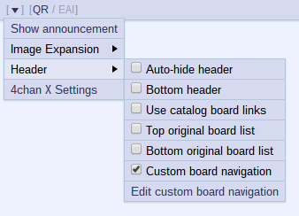

- **New feature**: `Desktop Notifications`
 - Enabled by default, but you will have to grant your browser permissions to display them or disable them altogether: 
  
 - Clicking on a notification will bring up the relevant tab. (Does not work on Firefox unfortunately, [see bug 874050](https://bugzilla.mozilla.org/show_bug.cgi?id=874050).)
 - Notifications will appear when someone quotes you, clicking such notification will also scroll the thread to the relevant post.
 - Notifications will appear for posting errors instead of alert popups.
 - Opera does *not* support desktop notifications yet.

## 3.8.0 - *2013-08-15*

- The QR now allows you to edit the filename on the fly: 

### 3.7.1 - *2013-08-13*

- Fixed an error for Firefox <23 users.

## 3.7.0 - *2013-08-13*

- **Thread Watcher** improvements:
 - It is now possible to open all watched threads via the `Open all threads` button in the Thread Watcher's menu.
 - Added the `Current Board` setting to switch between showing watched threads from the current board or all boards, disabled by default.
 - About dead (404'd) threads:
 <ul>
  <li> Dead threads will be typographically indicated with a strikethrough.
  <li> Dead threads will directly link to the corresponding archive when available.
  <li> A button to prune all 404'd threads from the list is now available.
  <li> Added the `Auto Prune` setting to automatically prune 404'd threads, disabled by default.
 </ul>
 - The current thread is now highlighted in the list of watched threads.
 - Watching the current thread can be done in the Header's menu too.
- Removed the `Check for Updates` setting:
 - Your browser/userscript manager should handle updates itself automatically.

## 3.6.0 - *2013-08-10*

- **New feature**: `Show Dice Roll`
 - Shows dice that were entered into the email field on /tg/.
- Fix impossibility to create new threads when in dead threads.

### 3.5.7 - *2013-07-13*

- Drop Opera <15 support.

### 3.5.6 - *2013-07-02*

- Fix flag filtering on /sp/ and /int/.

### 3.5.5 - *2013-06-20*

- Minor fixes.

### 3.5.4 - *2013-06-11*

- Fix regression.

### 3.5.3 - *2013-06-11*

- Minor fixes.

### 3.5.2 - *2013-06-01*

- Fix minor regression.

### 3.5.1 - *2013-06-01*

- Added the `Deselect reply` keybind.
- Minor fixes.

## 3.5.0 - *2013-05-26*

- The Thread Stats counters now include the number of the page where the thread is.

### 3.4.3 - *2013-05-17*

- More minor fixes.

### 3.4.2 - *2013-05-14*

- Minor fixes.

### 3.4.1 - *2013-05-13*

- Added a button in the Archives settings to update the list now.
- Added the option `Tab to Choose Files First`, disabled by default.

## 3.4.0 - *2013-05-06*

- **New feature**: `Archive selection`
 - Select which archive you want for specific boards and redirection type.
 - Access it in the `Archives` tab of the Settings window.
- The list of archived boards will now update automatically, separately from 4chan X updates.
 - If you're an archiver and want [data](https://github.com/MayhemYDG/4chan-x/blob/v3/json/archives.json) about your archive to be updated, added or removed: send a PR or open an issue.
- Fix quote previews getting 'stuck' in Opera.

### 3.3.1 - *2013-05-04*

- Fix whitespaces not being preserved in code tags in /g/.

## 3.3.0 - *2013-05-02*

- **New feature**: `Quick Reply Personas`
 - Add custom auto-completion for the name, e-mail and subject inputs.
 - Always use a specific persona.
 - Per-board configuration.
 - Access it in the `QR` tab of the Settings window.
- Updated archive redirection for /h/, /v/ and /vg/.

### 3.2.3 - *2013-04-30*

- Update archive redirection for /c/, /d/, /v/, /vg/, /w/ and /wg/.
- Minor fixes.

### 3.2.2 - *2013-04-27*

- Fix Unread Count taking into account hidden posts.
- Fix bug where a thread would freeze on load.

### 3.2.1 - *2013-04-26*

- Minor fixes.
- Chrome only: Due to technical limitations, Filter lists and Custom CSS will not by synchronized across devices anymore.

## 3.2.0 - *2013-04-23*

- The top and bottom original board lists are now optional, disabled by default.
- The button to show a hidden announcement is now inside the header's menu.
- Reorganized Header menu: 
- Added the `board-replace` setting to Custom Board Navigation ricing.
- Added the option `Cooldown Prediction`, enabled by default.
- Added the option `Hide Unread Count at (0)`, disabled by default.

### 3.1.4 - *2013-04-17*

- Fix QR remembering the file spoiler state when it shouldn't, for real this time.
- Fix inputs in the `Rice` tab being empty when `Custom Board Navigation` is disabled.

### 3.1.3 - *2013-04-16*

- Fix Chrome freezing when switching from the `Filter` tab to another tab in the settings.

### 3.1.2 - *2013-04-16*

- Fix error with successful posting.

### 3.1.1 - *2013-04-16*

- Styling adjustments for the announcement toggler.

## 3.1.0 - *2013-04-16*

- **New feature**: `Announcement Hiding`, enabled by default.
- Fix support for www.4chan.org/frames on Chrome.
- Fix quote features not working on dead quotelinks in inlined posts.
- Fix resurrecting dead quotelinks on HTTP.

### 3.0.6 - *2013-04-14*

- Fix regression concerning thread selection when quoting on the index.

### 3.0.5 - *2013-04-14*

- `Scroll to Last Read Post` is now optional, enabled by default.
- The QR won't auto-hide when auto-hide is enabled and one of its input is focused. Doesn't work on Firefox.
- Added the `Remember QR Size` setting back in, disabled by default. Only on Firefox.
- Fix QR remembering the file spoiler state when it shouldn't.
- Fix QR cooldown in Opera.

### 3.0.4 - *2013-04-11*

- More minor fixes.

### 3.0.3 - *2013-04-10*

- Minor fixes.

### 3.0.2 - *2013-04-09*

- Added a setting in the Header's menu to move it at the bottom of the screen.
- Added the `Cooldown` setting back in.
- Fixed the Header going above posts when following quotelinks for example.
- Fixed a bug where dead quotelinks would disappear.

### 3.0.1 - *2013-04-08*

- Added the possibility to combine board-list toggle and custom text.
- Added Reply Navigation back in, disabled by default.
- Fixed Thread Hiding initialization error.

# 3.0.0 - *2013-04-07*

**Major rewrite of 4chan X.**

Header:
 - Easily access features and the boards list directly from the Header.
 - The board list can be customized.
 - The Header can be automatically hidden.

Extension-related changes for Chrome and Opera:
 - Installing and updating is now pain-free on Chrome.
 - Settings will persist on different subdomains and protocols (HTTP/HTTPS).
 - Settings will persist in Incognito on Chrome.
 - Clearing your cookies won't erase your settings anymore.
 - Fixed Chrome's install warning saying that 4chan X would run on all web sites.

Egocentrism:
 - `(You)` will be added to quotes linking to your posts.
 - The Unread tab icon will indicate new unread posts quoting you with an exclamation mark.

Quick Reply changes:
 - Opening text files will insert their content in the comment field.
 - Pasting files/images (e.g. from another website) in Chrome will open them in the QR.
 - Cooldown start time is now more accurate, which means shorter cooldown period and faster auto-posting.
 - Cooldown remaining time will adjust to your upload speed and file size for faster auto-posting.
 - Clicking the submit button while uploading will abort the upload and won't start re-uploading automatically anymore.
 - Closing the QR while uploading will abort the upload and won't close the QR anymore.
 - Creating threads outside of the index is now possible.
 - Selection-to-quote also applies to selected text inside the post, not just inside the comment.
 - Added support for thread creation in the catalog.
 - Added thumbnailing support for Opera.

Image Expansion changes:
 - The toggle and settings are now located in the Header's shortcuts and menu.
 - Expanding spoilers along with all non-spoiler images is now optional, and disabled by default.
 - Expanding OP images won't squish replies anymore.

Thread Updater changes:
 - The Thread Updater will now notify of sticky/closed status change and update the icons.
 - The Thread Updater will pause when offline, and resume when online.
 - Added a setting to always auto-scroll to the bottom instead of the first new post.

Unread posts changes:
 - Added a line to distinguish read posts from unread ones.
 - Read posts won't be marked as unread after reloading a thread.
 - The page will scroll to the last read post after reloading a thread.
 - Visible posts will not be taken into account towards the unread count.

Thread Stats changes:
 - Post and file count will now adjust with deleted posts.
 - The post count will now become red past the bump limit.
 - The file count will not become red anymore inside sticky threads.

Thread/Post Hiding changes:
 - Added Thread & Post Hiding in the Menu, with individual settings.
 - Thread & Post Hiding Buttons can now be disabled in the settings.
 - Recursive Hiding will be automatically applied when manually showing/hiding a post.

Other:
 - Added touch and multi-touch support for dragging windows.
 - Added [eqn] and [math] tags keybind.
 - Fix Chrome's install warning saying that 4chan X would execute on all domains.
 - Fix Quote Backlinks and Quote Highlighting not affecting inlined quotes.
 - Fix unreadable inlined posts with the Tomorrow theme.
 - Fix user ID highlighting on fetched posts.
 - More fixes and improvements.
