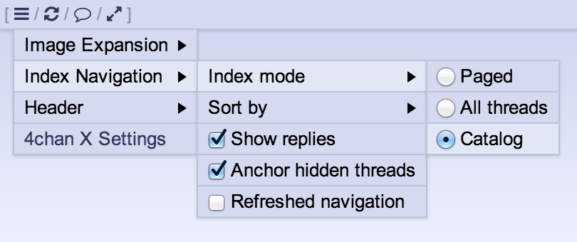

**vampiricwulf**:
- Fix Reveal Spoilers.

**Zixaphir**:
- JSON Navigation (Index, Catalog) performance improvements.
- Fix Reveal Spoiler Thumbnails.
- Fix post hide / hide show menu not working on Filtered posts.
- Fix prev/next page keybinds.
- Update Custom Navigation legend to reflect index mode changes.
- JSON Navigation now works for backlinks (when Quote Inlining is disabled) and backlink hashlinks.

### v2.9.2 
*2014-03-10*

**Zixaphir**:
- Bugfixes for Thread Updater Auto Scroll and Post Highlighting.
- The catalog now works with JSON Navigation disabled.
- Added a return button to the JSON Navigation that will switch you back to non-catalog view (requires NavLinks not to be hidden).

### v2.9.1 
*2014-03-09*

**Zixaphir**:
- Bugfixes for post hiding, thread updater, and keybinds.

## v2.9.0 
*2014-03-08*

**MayhemYDG**:
- Thread and post hiding changes:
 - The posts' menu now has a label entry listing the reasons why a post got hidden or highlighted.
 - `Thread Hiding` and `Reply Hiding` settings are merged into one: `Post Hiding`.
 - `Thread Hiding Link` and `Reply Hiding Link` settings are merged into one: `Post Hiding Link`.
 - Hiding a thread removes it from the index in `Paged` or `All threads` modes.
 <ul>
  <li> Hidden threads can be seen by clicking the `[Show]` button the the top of the index.
  <li> The `Anchor Hidden Threads` setting has been removed.
 </ul>
- Added `Image Size` setting for the catalog.
- Added `Open threads in a new tab` setting for the catalog.
- Added `board-mode:"type"` and `board-sort:"type"` parameters to custom board navigation.
- Added OP name/date tooltip in the catalog.
- Added a keybind to cycle through index sort types, `Ctrl+x` by default.
- Added keybindings for index modes, `Ctrl+{1,2,3}` by default.
- `Index Mode` and `Index Sort` have been moved out of the header's menu into the index page.
- Minor captcha fixes.
- New setting: `Quote Markers`, enabled by default
 - This merges `Mark Quotes of You`, `Mark OP Quotes` and `Mark Cross-thread Quotes` into one feature.
 - Backlinks now also get these markers.
 - Multiple markers are now more compact, for example `>>123 (You/OP)` instead of `>>123 (You) (OP)`.
- New setting: `Image Hover in Catalog`
 - Like `Image Hover`, but for the catalog only.
- Added `Archive link` to the Custom Board Navigation Rice
- Added a setting to configure the number of threads per page for the paged mode of the index.
- Dropped support for the official catalog.
- More index navigation improvements:
 - Threads in catalog mode have the usual menu.
 - When in catalog mode, the menu now also allows to pin/unpin threads.
 - The index will now display how many threads are hidden.
 - When in catalog mode, you can toggle between hidden/non-hidden threads.
 - New index mode: `catalog` 
  
 - When in catalog mode, use `Shift+Click` to hide, and `Alt+Click` to pin threads.
 - Existing features affect the catalog mode such as:
 <ul>
  <li> Filter (hiding, highlighting)
  <li> Thread Hiding
  <li> Linkify
  <li> Auto-GIF
  <li> Image Hover
 </ul>
 - Support for the official catalog will be removed in the future, once the catalog mode for the index is deemed satisfactory.
- Added `Original filename` variable to Sauce panel.
- Fixed a bug which prevented QR cooldowns from being pruned from storage.
 - On Chrome, the storage could reach the quota and prevent 4chan X from saving data like QR name/mail or auto-watch for example.
- Added a Reset Settings button in the settings.
- More stability update.
- Stability update.

**Spittie**
- Check image dimension before uploading

**Vampiricwulf**
- Flash embedding and other Flash features.

**Zixaphir**
- Added a nifty bread-crumb for the JSON Navigation.
- Many spiffy performance, state awareness, and sanity improvements to JSON Navigation.
- Bugfixes.

- Bug fixes
- Update archives

### v2.8.11 
*2014-02-16*

**MayhemYDG**
- Fix QR

**Spittie**
- Better url handling
- Add Twitter embedding
- Add .xpi for Firefox Mobile
- Add /biz/
- Add gfycat.com embedding
- Replace some icons with fontawesome
- Add Metro favicons (lel)
- Fix Chrome (aka copy from Appchan)
- Add option to load the captcha when you open a thread
- Add OpenSUSE emoji
- Fix Chrome (Maybe? Hopefully I haven't fucked everything)
- Add fgst.eu
- Add mawa.re
- Fix new captcha
- Add archive.installgentoo.com
- Upload images directly from urls

**Zixaphir**:
- Bugfixes.

### v2.8.8 
*2014-01-30*

**MayhemYDG**:
- Added a `Reset Settings` button in the settings.
- More stability update.
- Stability update.

**ParrotParrot**:
- Added `Original filename` variable to Sauce panel.

**Zixaphir**:
- Bugfixes

### v2.8.7 
*2014-01-19*

**Zixaphir**:
- Fix posting.

### v2.8.6 
*2014-01-19*

**Zixaphir**:
- General improvements all across our current JSON Navigation implementations.

### v2.8.5 
*2014-01-14*

**Zixaphir**:
- Reimplemented mascot importing.
- The "Questionable" mascot category has been emptied. All of the mascots within it can be reimported from https://raw.github.com/zixaphir/appchan-x/master/questionable.json
- Added a category for custom mascots.

### v2.8.4 
*2014-01-13*

bugfix

### v2.8.3 
*2014-01-13*

bugfix

### v2.8.2 
*2014-01-13*

**Zixaphir**:
- Infinite Scrolling no longer dynamically changes the URL.
- JSON Navigation and Index features are now optional.
- Fixed several small issues with themes and mascots.

### v2.8.1 
*2014-01-13*

**seaweeedchan**:
- Convert infinite scrolling into an Index Mode, rather than being forced
- Fix Menu errors on older Firefox versions, such as the ESR

**Zixaphir**:
- Fix an issue where changing the current archive would crash the redirect features.
- Themes and Mascots will now switch when navigating between NSFW and SFW boards if those options are in use.
- Pagination will now properly hide while in thread view.
- The captcha filter is now [finally] optional.
- Some more FontAwesome icons.
- Fix a bug causing appchan to [incorrectly] report that QR Personas were disabled. They cannot be disabled.
- The SFW status of boards is no longer hard-coded and therefore will require no changes when boards are added or removed.
- Removed and forced the `Force Reply Break` on Chrome. Disabling it didn't work and broke the page layout.

### v2.8.0
*2014-01-11*

**seaweedchan**:
- Various fixes and improvements for the JSONified index
- Removed unnecessary index refresh notifications
- Various style tweaks

**Zixaphir**:
- Various fixes and improvements for the JSONified index
- We now use JSON for navigating between boards and threads. This should result in various bandwidth and performance improvements. Probably.
- Users are now subjected to whatever terrible code went into that previous feature. :3
- Infinite Scrolling restored.

### v2.7.4 
*2013-12-27*

**Zixaphir**:
- Bugfixes.

### v2.7.3 
*2013-12-26*

**Zixaphir**:
- If I had realized that people actually used the catalog, I would have pushed a new stable last night. :/

### v2.7.2 
*2013-12-25*

**MayhemYDG**:
- Performance improvements.

**Zixaphir**:
- Moar bugfixes.

**Zixaphir**:
- Bug fixes and optimizations

### v2.7.1 
*2013-12-24*

**Zixaphir**:
- Bug fixes and optimizations

## v2.7.0 
*2013-12-16*

**MayhemYDG**:
- More Index Improvements:
 - New setting: `Anchor Hidden Threads`, enabled by default. Hidden threads will be moved at the end of the index to fill the first pages.
 - New setting: `Refreshed Navigation`, disabled by default. When enabled, navigating through pages will refresh the index.
 - The last index refresh timer will now indicate the last time the index changed from 4chan's side, instead of the last time you refreshed the index.

**noface**:
- Strawpoll.me embedding support (as usual, only works on HTTP 4chan due to lack of HTTPS)

**Zixaphir**:
- FappeTyme and WerkTyme now persist across sessions.
- Bugfixes everywhere.

### v2.6.1 
*2013-11-27*

**Zixaphir**:
- Fix an incorrect classname resulting in icons not showing correctly.

## v2.6.0 
*2013-11-27*

**MayhemYDG**:
- **New option**: `Auto-hide header on scroll`.
- Added support for `4cdn.org`.
- Index navigation improvements:
 - Searching in the index is now possible and will show matched OPs by:
 <ul>
  <li> comment
  <li> subject
  <li> filename
  <li> name
  <li> tripcode
  <li> e-mail
 </ul>
 - The page number on which threads are will now be displayed in OPs, to easily identify where threads are located when:
 <ul>
  <li> searching through the index.
  <li> using different index modes and sorting types.
  <li> threads highlighted by the filter are moved to the top and move other threads down.
 </ul>
 - The elapsed time since the last index refresh is now indicated at the top of the index.
 - New setting: `Show replies`, enabled by default. Disable it to only show OPs in the index.
 - New setting: `Anchor Hidden Threads`, enabled by default. Hidden threads will be moved at the end of the index to fill the first pages.
 - New setting: `Refreshed Navigation`, disabled by default. When enabled, navigating through pages will refresh the index.
 - The last index refresh timer will now indicate the last time the index changed from 4chan's side, instead of the last time you refreshed the index.
 - You can now refresh the index page you are on with the refresh shortcut in the header bar or the same keybind for refreshing threads.
 - You can now switch between paged and all-threads index modes via the "Index Navigation" header sub-menu (note that this replaces infinite scrolling): 
  
 - Threads in the index can now be sorted by:
 <ul>
  <li> Bump order
  <li> Last reply
  <li> Creation date
  <li> Reply count
  <li> File count
 </ul>
 - Navigating across index pages is now instantaneous.
 - The index refreshing notification will now only appear on initial page load with slow connections.
- Added a keybind to open the catalog search field on index pages.
- Minor cooldown fix:
 - You cannot post an image reply immediately after a non-image reply anymore.
- Various minor fixes

### v2.5.1 
*2013-10-20*
**Zixaphir**:
- Infinite Scrolling Bugfix (chrome)

### v2.4.1 
*2013-10-13*

**Zixaphir**:
- Bugfixes

## v2.4.0 
*2013-10-13*

**MayhemYDG**:
- Tiny posting cooldown adjustment:
  * You can post an image reply immediately after a non-image reply.
- Update posting cooldown timers to match 4chan settings:
  * Cooldown may vary between inter-thread and intra-thread replies.
  * Cooldown may vary when posting a file or not.
  * Cooldown does not take sageing into account anymore.
  * Timers vary across boards.
- Updated post and deletion cooldown timers to match 4chan changes: they are now twice longer.
- Added support for the flag selector on /pol/.
- Minor Chrome 30 fix.

**seaweedchan**:
- Fix thread updater bug introduced in last version
- Just some small fixes.
- Delete cooldown update
- Small bug fixes
- Don't show warnings AND desktop notifications at the same time, and prefer QR warnings unless the document is hidden

**zixaphir**:
- Some changes to mascots
  * Silhouette mascots are now generated dynamically with the silhouette filter
  * Images are now compressed client side before being uploaded via the upload interface (this is only for mascots, not posts)
- Fix an issue with Linkifier linkifying replaced spoilers
- Fix an issue with "fit height" in the gallery on Chrome
- Small thread updater fixes

### v2.3.10 
*2013-08-31*

**Zixaphir**:
- Catalog bugfix

### v2.3.9 
*2013-08-30*

**MayhemYDG**:
- New desktop notification:
  * The QR will now warn you when you are running low on cached captchas while auto-posting.

**seaweedchan**:
- Gallery Bugfix: hide thumbnails

**Zixaphir**:
- Add some css flex support
- General bugfixes

### v2.3.8 
*2013-08-25*

- I accidentally z-index

### v2.3.7 
*2013-08-25*

**Zixaphir**:
- Some new gallery features
  * Fit Width
  * Fit Height
  * Hide Thumbnails
  * The gallery thumbnail bar will now scroll to the current thumbnail if it is out of the visible range.
  * Now enabled by default (but won't be used as the default thumbnail option without disabling Image Expansion)
- Bugfixes

**seaweedchan**: 
- Gallery layout and aesthetics overhaul

### v2.3.6 
*2013-08-21*

**Zixaphir**:

- **New Feature**: `Gallery`.
  * Disabled by default.
  * Opens images in a lightweight Gallery script.
  * If enabled while Image Expansion is disabled, will takeover as the default action when images are clicked.
  * Supports several hotkeys: left is previous, right and enter are next, escape closes.
  * Works with Thread Updater to add new images to the Gallery while its open.
  * BLINK/WEBKIT ONLY: Clicking the file title will download the image with the original name.

### v2.3.5 
*2013-08-19*

**Zixaphir**:
- Bugfixes on catalog, /sp/, and /int/

### v2.3.4 
*2013-08-18*

**MayhemYDG**:
- Added new option: `Desktop Notifications`
- Implement filename editing
- Replace shortcuts with icons

**seaweedchan**:
- Made shortcut icons optional under the Header submenu, disabled by default, as well as edited some of the icons
- Disabled desktop notifications by default
- Edited filename editing to require a ctrl+click, so otherwise the file input will look and behave the same as before
- Added `.you` class to quotelinks that quote you

**Zixaphir**:
- Forked and minimized the Font Awesome CSS used for the shortcut icons
- Some more linkifier improvements

**seaweedchan**:
- Optimizations for the banner and board title code

**zixaphir**:
- Bugfixes, mostly

### v2.3.3 
*2013-08-16*

**seaweedchan**:
- Fix Color User IDs

**MayhemYDG**:

- Greatly improved thread watcher
  - Added submenu with ability to prune 404'd threads, filter by current board, etc
  - Periodically checks which threads have 404'd and indicates them with a strikethrough
- Removed `Check for Updates` as your browser should now handle this automatically
- Fixed an error for Firefox <23 users
- Add a message for Chrome users who experience the Corrupted File bug

**Zixaphir**:

- Drastically improved the accuracy and quality of the linkifier (with seaweedchan)
- More under-the-hood linkifier changes, including support for all top-level domains (with seaweedchan)
- Removed `Allow False Positives` option due to the accuracy of the new linkifier regex

### 2.3.2 - *2013-08-12*

**zixaphir**:
- Fix Linkifier bug in Chrome.

### 2.3.1 - *2013-08-11*

**zixaphir**:
- Fix issue with release process not properly reversioning.

## 2.3.0 - *2013-08-10*

**aeosynth**:
- Update Gruntfile.coffee.

**Zixaphir**:
- Added Twitch.tv and Vine embedding (with @ihavenoface)
- Keybinds to scroll to posts that quote you.
- New Feature: toggle between image banners by clicking them.
- Minor optimizations.
- Minor fixes.

**MayhemYDG**:
- Show dice rolls that were entered into the email field on /tg/.
- Fix flag filtering on /sp/ and /int/.
- Minor fixes.
- Minor optimizations.

**seaweedchan**:
- Fix issues with having two options called `Reveal Spoilers`. 
- Update archive.

**Zixaphir**:

### v2.2.2
*2013-08-01*
**zixaphir**:
- Fix opening new threads and posts in a new tab.
- Minimum Chrome Version is now 27.
- Minimum Firefox Version is now 22.
- Minimum Opera version is now 15.
  * BUG REPORTS FILED WITH BROWSERS THAT DO NOT MEET THESE REQUIREMENTS WILL BE CLOSED AND IGNORED.

**MayhemYDG**:
- Fix QR Cooldown and clearing bugs.

### v2.2.1
*2013-07-27*

**zixaphir**:
- Fix exif hiding on /p/.

## v2.2.0
*2013-07-25*

**MayhemYDG**:
- Remove /s4s/ from warosu archive.
- Fix CAPTCHA duplication on the report page.
- Fix impossibility to create new threads when in dead threads.
- Drop Opera <15 support.
- Fix flag filtering on /sp/ and /int/.
- Minor fixes.

**seaweedchan**:
- Add `.active` class to `.menu-button` when clicked (and remove on menu close)
- Move /v/ and /vg/ back to Foolz archive
- Revert Mayhem's updater changes which caused silly issues
- Rename `Indicate Spoilers` to `Reveal Spoilers`
- If `Reveal Spoilers` is enabled but `Remove Spoilers` is not, act as if the spoiler is hovered
- Add a new option to hide "4chan X has been updated to ____" notifications for those having issues with them.
- Update archives
- Add `.active` class to `.menu-button` when clicked (and remove on menu close)
- Move /v/ and /vg/ back to Foolz archive

**Tracerneo**:
- Add ID styling for IDs with black text

**zixaphir**:
- Completely redo mascot positions to not depend on other elements to work
- Add a mascot silhouette feature (this will be available on a per-mascot basis at some point)
- Fixed Mascot Offsets
- Fix several bugs with the mascot and theme editors
- Add an option to toggle between mascots by clicking the current mascot
- Fix "Fit Height" image expansion option
- Post Form Decorations now use appchan's dialog colors (instead of random background and border colors)
  * This may cause some themes to look weird. Please report any issues with the default themes and post form colors
- 4chan Dark Upgrade's reply backgrounds are consistent now
- Rewrote Emoji CSS
- Presto versions of Opera are no longer supported (a Webkit/Blink version is in the works/mostly works)
- Tiny CSS touch-ups

### v2.1.3
*2013-06-04*

**zixaphir**:
- Fixed a small CSS error resulting in invisible mascot options

### v2.1.2
*2013-06-04*

**zixaphir**:
- Remove shitty menu placeholder icon
  * replace it with settings icon
  * move settings link into menu
- Fix autoupdating in greasemonkey, apparently
- Add front page styling (http://www.4chan.org/)
- Clean up CSS a bit
  * Remove mascot positioning based on post form decorations
  * Remove 4sight support

### v2.1.1
*2013-06-02*

**zixaphir**:
- Changed close character from '×' to '✖'
- Bugfixes

## v2.1.0
*2013-06-01*

**zixaphir**:
- CSS ~70% (maybe?) rewritten to account for class-based options
- Fixed CSS filters on webkit
- Hopefully better mascot positioning
- Fix issues with dialog width and small sidebar with vertical icons

### v2.0.6
*2013-05-29*

**zixaphir**:
- Fix a small CSS bug resulting in backlinks being the wrong color

### v2.0.5
*2013-05-28*

**MayhemYDG**:
- Tiny fixes
- Add page count to thread stats
- Better performance for Fit Height by using vh
- Fix `Jump to Next Reply` keybind not accounting for posts after unread line

**seaweedchan**:
- Added OpenSettings event on 4chan X settings/sections open for userscripts like OneeChan and 4chan Style Script
- Changed defaults that use the arrow keys to shift+arrow key to not conflict with scrolling
- Made Mayhem's page count in thread stats optional
- Small bug fixes
- Fix YouTube videos in Firefox taking z-index priority
- Fix Persistent QR not working for /f/
- New image expansion option: `Advance on contract`. Advances to next post unless Fappe Tyme is enabled (temporary)
- Change `.qr-link` to `.qr-link-container` and `.qr-link>a` to `.qr-link`
- Update /q/'s posting cooldown
- Make "___ omitted. Click here to view." text change when thread is expanded.
- Restrict "Reply to Thread" click event to the link itself
- Fix Nyafuu being undefined
- New option `Captcha Warning Notifications`
 - When disabled, shows a red border around the captcha to indicate captcha errors. Goes back to normal when any key is pressed.
- Color Quick Reply's inputs in Tomorrow to match the theme
- Revert some of Mayhem's changes that caused new bugs
- Added `.hasInline` (if replyContainer contains .inline) for userstyle/script maintainers

**Wohlfe**:
- Add /pol/ archiving for FoolzaShit

**zixaphir**:
- New option: `Image Prefetching`. Adds a toggle to the header menu for per-thread prefetching.
- Make Advance on contract work with Fappe Tyme
- Fix various options and functions that were not working as intended or were unintuitive
  * Filter Highlighting
  * Highlight Owned Posts
  * Highlight Posts Quoting You
  * Mascot and Theme Exporting will now save as a named JSON file by default
  * On side pagination
  * Banner Reflections
  * Replies with inlined posts will not shrink in Fit Width mode anymore.
- Fixed odd spacing issues with shortcuts and other bracketed elements

### v2.0.4
*2013-05-15*
**MayhemYDG**:
- Add new archive selection

**seaweedchan**:
- Change watcher favicon to a heart. Change class name from `.favicon` to `.watch-thread-link`. Add `.watched` if thread is watched.
- Remove new archive selection back into Advanced
- Some styling fixes

**zixaphir**:
- Make new archive selection not depend on a JSON file
- Remove some code that sends user errors back to us (we didn't have a working link anyway)
- Add board selection to archiver options
- Fix bug where image hover would close when hitting Enter while typing
- Add `Quoted Title` option which adds (!) text to title when user is quoted
- Add option to indent replies.

### v2.0.3
*2013-05-10*
**seaweedchan**:
- bug fixes

**zixaphir**:
- Change Custom Board Navigation input into textarea, new lines will convert to spaces
- Fix auto-scrolling in Chrome
- Fix wrapping of #dump-list in Chrome
- Fix (You) not being added in expanded comments
- bugfixes
- Some extra changes on top of seaweed's QR changes for our ricey nature
- New theme, Generigray
- New theme, Frost

**MayhemYDG**:
- Added Foolzashit archive
- Added `blink` class to document in preparation for future versions of Chrome and Opera
- Take advantage of announcement's new `data-utc` value for hiding
  - `data-utc` is a timestamp, this allows us to not have to store the entire text content of the announcement

**seaweedchan**:
- Turn all brackets into pseudo-elements. Brackets can be changed by overwriting the `content` of `.fourchanx-link::before` (`[`) and `.fourchanx-link::after` (`]`), or removed entirely with ease.
  - Note: This does not change the default brackets around `toggle-all` in the custom navigation. These are up to the user.
- Fix file input in Opera
- External link support in Custom Board Navigation!
  - `external-text:"Google","http://www.google.com"`
- Fix JIDF flag on /pol/ when post is fetched by updater
- Hide stub link added in menus of stubs
- #dump-button moved into #qr-filename-container as a simple + link
- QR with 4chan Pass made a little wider
- Styling changes for spoiler label, also added `.has-spoiler` class for QR

### 2.0.2 - 2013-05-09
**zixaphir**:
- More mascot and theme editor fixes
- Fix stubs in reply hiding menu not following stubs config
- Fix thread hiding
- Fix Board Subtitle option
- Revert to Mayhem-style notifications
- Add options for adding QR Shortcuts to the header or page
- Try to tighten up mascot positions in relation to the post form

### 2.0.1 - 2013-05-08
**seaweed**:
- Fix an issue with custom board navigation catalog links

**zixaphir**:
- Fix Fappe Tyme always being enabled
- Fix z-index issues in Chrome
- Fix theme creation and deletion
- Separate Updater status and count better
- Fix posting from Index
- Prevent Style.init() from crashing on Chrome

# 2.0.0 - 2013-05-07
Completely rebased off https://github.com/seaweedchan/4chan-x/ 1.1.16
I hate changelogs so I'd rather not talk about it, but rest assured it
comes with various performance improvements, layout changes, and the
like. If you don't like it, I'm sorry, but change comes with sacrifice,
and we've certainly gained more than we've lost
