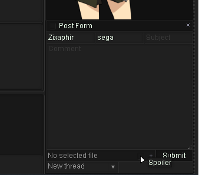
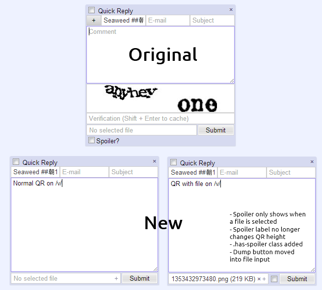

## v2.2.0
*2013-07-25*

**MayhemYDG**:
- Remove /s4s/ from warosu archive
- Fix CAPTCHA duplication on the report page
- Fix impossibility to create new threads when in dead threads.
- Drop Opera <15 support.
- Fix flag filtering on /sp/ and /int/.
- Minor fixes.

**seaweedchan**:
- Add `.active` class to `.menu-button` when clicked (and remove on menu close)
- Move /v/ and /vg/ back to Foolz archive
- Revert Mayhem's updater changes which caused silly issues
- Rename `Indicate Spoilers` to `Reveal Spoilers`
- If `Reveal Spoilers` is enabled but `Remove Spoilers` is not, act as if the spoiler is hovered
- Add a new option to hide "4chan X has been updated to ____" notifications for those having issues with them.
- Update archives
- Add `.active` class to `.menu-button` when clicked (and remove on menu close)
- Move /v/ and /vg/ back to Foolz archive

**Tracerneo**:
- Add ID styling for IDs with black text

**zixaphir**:
- Completely redo mascot positions to not depend on other elements to work
- Add a mascot silhouette feature (this will be available on a per-mascot basis at some point)
- Fixed Mascot Offsets
- Fix several bugs with the mascot and theme editors
- Add an option to toggle between mascots by clicking the current mascot
- Fix "Fit Height" image expansion option
- Post Form Decorations now use appchan's dialog colors (instead of random background and border colors)
  * This may cause some themes to look weird. Please report any issues with the default themes and post form colors
- 4chan Dark Upgrade's reply backgrounds are consistent now
- Rewrote Emoji CSS
- Presto versions of Opera are no longer supported (a Webkit/Blink version is in the works/mostly works)
- Tiny CSS touch-ups

### v2.1.3
*2013-06-04*

**zixaphir**:
- Fixed a small CSS error resulting in invisible mascot options

### v2.1.2
*2013-06-04*

**zixaphir**:
- Remove shitty menu placeholder icon
  * replace it with settings icon
  * move settings link into menu
- Fix autoupdating in greasemonkey, apparently
- Add front page styling (http://www.4chan.org/)
- Clean up CSS a bit
  * Remove mascot positioning based on post form decorations
  * Remove 4sight support

### v2.1.1
*2013-06-02*

**zixaphir**:
- Changed close character from '×' to '✖'
- Bugfixes

## v2.1.0
*2013-06-01*

**zixaphir**:
- CSS ~70% (maybe?) rewritten to account for class-based options
- Fixed CSS filters on webkit
- Hopefully better mascot positioning
- Fix issues with dialog width and small sidebar with vertical icons

### v2.0.6
*2013-05-29*

**zixaphir**:
- Fix a small CSS bug resulting in backlinks being the wrong color

### v2.0.5
*2013-05-28*

**MayhemYDG**:
- Tiny fixes
- Add page count to thread stats
- Better performance for Fit Height by using vh
- Fix `Jump to Next Reply` keybind not accounting for posts after unread line

**seaweedchan**:
- Added OpenSettings event on 4chan X settings/sections open for userscripts like OneeChan and 4chan Style Script
- Changed defaults that use the arrow keys to shift+arrow key to not conflict with scrolling
- Made Mayhem's page count in thread stats optional
- Small bug fixes
- Fix YouTube videos in Firefox taking z-index priority
- Fix Persistent QR not working for /f/
- New image expansion option: `Advance on contract`. Advances to next post unless Fappe Tyme is enabled (temporary)
- Change `.qr-link` to `.qr-link-container` and `.qr-link>a` to `.qr-link`
- Update /q/'s posting cooldown
- Make "___ omitted. Click here to view." text change when thread is expanded.
- Restrict "Reply to Thread" click event to the link itself
- Fix Nyafuu being undefined
- New option `Captcha Warning Notifications`
 - When disabled, shows a red border around the captcha to indicate captcha errors. Goes back to normal when any key is pressed.
- Color Quick Reply's inputs in Tomorrow to match the theme
- Revert some of Mayhem's changes that caused new bugs
- Added `.hasInline` (if replyContainer contains .inline) for userstyle/script maintainers

**Wohlfe**:
- Add /pol/ archiving for FoolzaShit

**zixaphir**:
- New option: `Image Prefetching`. Adds a toggle to the header menu for per-thread prefetching.
- Make Advance on contract work with Fappe Tyme
- Fix various options and functions that were not working as intended or were unintuitive
  * Filter Highlighting
  * Highlight Owned Posts
  * Highlight Posts Quoting You
  * Mascot and Theme Exporting will now save as a named JSON file by default
  * On side pagination
  * Banner Reflections
  * Replies with inlined posts will not shrink in Fit Width mode anymore.
- Fixed odd spacing issues with shortcuts and other bracketed elements

### v2.0.4
*2013-05-15*
**MayhemYDG**:
- Add new archive selection

**seaweedchan**:
- Change watcher favicon to a heart. Change class name from `.favicon` to `.watch-thread-link`. Add `.watched` if thread is watched.
- Remove new archive selection back into Advanced
- Some styling fixes

**zixaphir**:
- Make new archive selection not depend on a JSON file
- Remove some code that sends user errors back to us (we didn't have a working link anyway)
- Add board selection to archiver options
- Fix bug where image hover would close when hitting Enter while typing
- Add `Quoted Title` option which adds (!) text to title when user is quoted
- Add option to indent replies.

### v2.0.3
*2013-05-10*
**seaweedchan**:
- bug fixes

**zixaphir**:
- Change Custom Board Navigation input into textarea, new lines will convert to spaces
- Fix auto-scrolling in Chrome
- Fix wrapping of #dump-list in Chrome
- Fix (You) not being added in expanded comments
- bugfixes
- Some extra changes on top of seaweed's QR changes for our ricey nature
- New theme, Generigray
- New theme, Frost

**MayhemYDG**:
- Added Foolzashit archive
- Added `blink` class to document in preparation for future versions of Chrome and Opera
- Take advantage of announcement's new `data-utc` value for hiding
  - `data-utc` is a timestamp, this allows us to not have to store the entire text content of the announcement

**seaweedchan**:
- Turn all brackets into pseudo-elements. Brackets can be changed by overwriting the `content` of `.fourchanx-link::before` (`[`) and `.fourchanx-link::after` (`]`), or removed entirely with ease.
  - Note: This does not change the default brackets around `toggle-all` in the custom navigation. These are up to the user.
- Fix file input in Opera
- External link support in Custom Board Navigation!
  - `external-text:"Google","http://www.google.com"`
- Fix JIDF flag on /pol/ when post is fetched by updater
- Hide stub link added in menus of stubs
- #dump-button moved into #qr-filename-container as a simple + link
- QR with 4chan Pass made a little wider
- Styling changes for spoiler label, also added `.has-spoiler` class for QR

### 2.0.2 - 2013-05-09
**zixaphir**:
- More mascot and theme editor fixes
- Fix stubs in reply hiding menu not following stubs config
- Fix thread hiding
- Fix Board Subtitle option
- Revert to Mayhem-style notifications
- Add options for adding QR Shortcuts to the header or page
- Try to tighten up mascot positions in relation to the post form

### 2.0.1 - 2013-05-08
**seaweed**:
- Fix an issue with custom board navigation catalog links

**zixaphir**:
- Fix Fappe Tyme always being enabled
- Fix z-index issues in Chrome
- Fix theme creation and deletion
- Separate Updater status and count better
- Fix posting from Index
- Prevent Style.init() from crashing on Chrome

# 2.0.0 - 2013-05-07
Completely rebased off https://github.com/seaweedchan/4chan-x/ 1.1.16
I hate changelogs so I'd rather not talk about it, but rest assured it
comes with various performance improvements, layout changes, and the
like. If you don't like it, I'm sorry, but change comes with sacrifice,
and we've certainly gained more than we've lost
