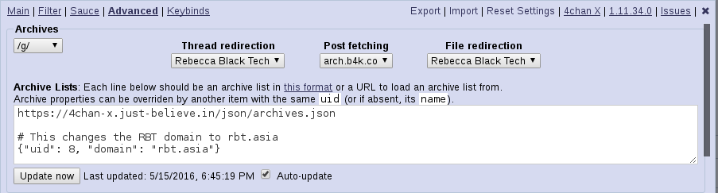
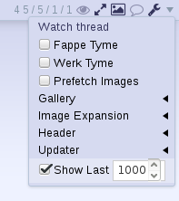
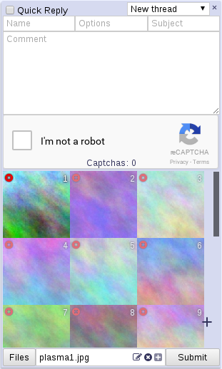
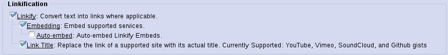
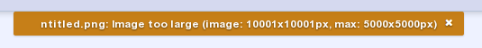
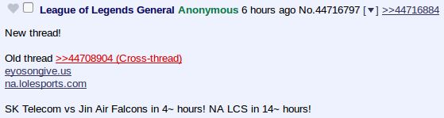

**Note**: Installing the script from one of the links below will disable automatic updates. If you want automatic updates, install the script from the links on the [main page](https://www.4chan-x.net/).

-Sometimes the changelog has notes (not comprehensive) acknowledging people's work. This does not mean the changes are their fault, only that their code was used. All changes to the script are chosen by and the fault of the maintainer (ccd0).

### v1.14.12

**v1.14.12.9** *(2019-08-22)* - [[Userscript](https://raw.githubusercontent.com/ccd0/4chan-x/1.14.12.9/builds/4chan-X-noupdate.user.js)] [[Chrome extension](https://raw.githubusercontent.com/ccd0/4chan-x/1.14.12.9/builds/4chan-X-noupdate.crx)]
- Add option to enable/disable notification on quick filtering MD5s. #2408
- Suggest disabling JSON Index if catalog.json is loading slowly. #2412

**v1.14.12.8** *(2019-08-18)* - [[Userscript](https://raw.githubusercontent.com/ccd0/4chan-x/1.14.12.8/builds/4chan-X-noupdate.user.js)] [[Chrome extension](https://raw.githubusercontent.com/ccd0/4chan-x/1.14.12.8/builds/4chan-X-noupdate.crx)]
- Fix bug from v1.14.7.0 (commit af00c711ff) causing excerpt in thread watcher to not be set. #2404
- Workaround for issue with new Chrome layout engine. #2397
- Fix workaround for Chrome CORB bug breaking posting in old versions of Chrome. #2396
- Maintain old default boardlist for people upgrading from previous versions.

**v1.14.12.7** *(2019-08-18)* - [[Userscript](https://raw.githubusercontent.com/ccd0/4chan-x/1.14.12.7/builds/4chan-X-noupdate.user.js)] [[Chrome extension](https://raw.githubusercontent.com/ccd0/4chan-x/1.14.12.7/builds/4chan-X-noupdate.crx)]
- Enable 4chan X by default on more sites.
- Add small announcement on /qa/.
- Remove 4chan boards from default custom board list.
- Workarounds for clashes between header and fixed elements on some sites.

**v1.14.12.6** *(2019-08-16)* - [[Userscript](https://raw.githubusercontent.com/ccd0/4chan-x/1.14.12.6/builds/4chan-X-noupdate.user.js)] [[Chrome extension](https://raw.githubusercontent.com/ccd0/4chan-x/1.14.12.6/builds/4chan-X-noupdate.crx)]
- Fix bug in Replace [filetype] features from v1.14.12.4.
- Enable by default on kissu.moe.

**v1.14.12.5** *(2019-08-12)* - [[Userscript](https://raw.githubusercontent.com/ccd0/4chan-x/1.14.12.5/builds/4chan-X-noupdate.user.js)] [[Chrome extension](https://raw.githubusercontent.com/ccd0/4chan-x/1.14.12.5/builds/4chan-X-noupdate.crx)]
- Make date parsing work on onesixtwo.club and avoid errors when we fail to parse the date.
- Minor bugfixes.

**v1.14.12.4** *(2019-08-11)* - [[Userscript](https://raw.githubusercontent.com/ccd0/4chan-x/1.14.12.4/builds/4chan-X-noupdate.user.js)] [[Chrome extension](https://raw.githubusercontent.com/ccd0/4chan-x/1.14.12.4/builds/4chan-X-noupdate.crx)]
- Move prefetch toggle from header menu to shortcut icons and make the option show up by default.

**v1.14.12.3** *(2019-08-09)* - [[Userscript](https://raw.githubusercontent.com/ccd0/4chan-x/1.14.12.3/builds/4chan-X-noupdate.user.js)] [[Chrome extension](https://raw.githubusercontent.com/ccd0/4chan-x/1.14.12.3/builds/4chan-X-noupdate.crx)]
- Merge v1.14.11.4: Assume Chrome is broken by default. #2378

**v1.14.12.2** *(2019-08-09)* - [[Userscript](https://raw.githubusercontent.com/ccd0/4chan-x/1.14.12.2/builds/4chan-X-noupdate.user.js)] [[Chrome extension](https://raw.githubusercontent.com/ccd0/4chan-x/1.14.12.2/builds/4chan-X-noupdate.crx)]
- Merge v1.14.11.3: Reduce default thread updater interval from 30 seconds to 5 seconds.

**v1.14.12.1** *(2019-08-07)* - [[Userscript](https://raw.githubusercontent.com/ccd0/4chan-x/1.14.12.1/builds/4chan-X-noupdate.user.js)] [[Chrome extension](https://raw.githubusercontent.com/ccd0/4chan-x/1.14.12.1/builds/4chan-X-noupdate.crx)]
- Merge v1.14.11.2: - Fix error from Catalog Links feature in native catalog when /f/ is in the custom board list. #2390
- Fix custom board links for boards without native catalog/archive being changed to nonexistent native catalog/archive links on catalog/archive pages. #2390
- Fix spacing in /qa/ board title. #2369

**v1.14.12.0** *(2019-08-05)* - [[Userscript](https://raw.githubusercontent.com/ccd0/4chan-x/1.14.12.0/builds/4chan-X-noupdate.user.js)] [[Chrome extension](https://raw.githubusercontent.com/ccd0/4chan-x/1.14.12.0/builds/4chan-X-noupdate.crx)]
- Based on v1.14.11.1.
- Shift+click on the Quick Reply submit button will now attempt to post regardless of cooldowns or other errors.
- Improved error reporting. #862
- Detect conflicts with native extension and show appropriate error message. #1627
- Only show MD5 quick filter notification when using keybind. #2385
- Update Loopvid embedding.
- Update settings import from loadletter fork.
- (saxamaphone69) Make text areas in settings resize vertically only.
- Fix cooldown when the time is an exact number of minutes. #2301
- Cache titles to reduce title requests. #2327
- Other bugfixes.

### v1.14.11

**v1.14.11.4** *(2019-08-09)* - [[Userscript](https://raw.githubusercontent.com/ccd0/4chan-x/1.14.11.4/builds/4chan-X-noupdate.user.js)] [[Chrome extension](https://raw.githubusercontent.com/ccd0/4chan-x/1.14.11.4/builds/4chan-X-noupdate.crx)]
- Assume Chrome is broken by default. #2378

**v1.14.11.3** *(2019-08-09)* - [[Userscript](https://raw.githubusercontent.com/ccd0/4chan-x/1.14.11.3/builds/4chan-X-noupdate.user.js)] [[Chrome extension](https://raw.githubusercontent.com/ccd0/4chan-x/1.14.11.3/builds/4chan-X-noupdate.crx)]
- Reduce default thread updater interval from 30 seconds to 5 seconds.

**v1.14.11.2** *(2019-08-07)* - [[Userscript](https://raw.githubusercontent.com/ccd0/4chan-x/1.14.11.2/builds/4chan-X-noupdate.user.js)] [[Chrome extension](https://raw.githubusercontent.com/ccd0/4chan-x/1.14.11.2/builds/4chan-X-noupdate.crx)]
- Fix error from Catalog Links feature in native catalog when /f/ is in the custom board list. #2390

**v1.14.11.1** *(2019-08-03)* - [[Userscript](https://raw.githubusercontent.com/ccd0/4chan-x/1.14.11.1/builds/4chan-X-noupdate.user.js)] [[Chrome extension](https://raw.githubusercontent.com/ccd0/4chan-x/1.14.11.1/builds/4chan-X-noupdate.crx)]
- Security improvements.
- Fix 2captcha on Chrome extension. #2375
- Minor bugfixes.

**v1.14.11.0** *(2019-07-24)* - [[Userscript](https://raw.githubusercontent.com/ccd0/4chan-x/1.14.11.0/builds/4chan-X-noupdate.user.js)] [[Chrome extension](https://raw.githubusercontent.com/ccd0/4chan-x/1.14.11.0/builds/4chan-X-noupdate.crx)]
- Based on v1.14.10.3.
- Make applicable keybinds work on Tinyboard/vichan. #2171
- Make Index Navigation buttons work on Tinyboard/vichan. #2171
- Make Catalog Links toggle work for links to Tinyboard/vichan sites in header. #2171
- Display notification when MD5s are quick filtered with link to undo. #2221
- Remove as many hardcoded board names as possible. #525
- Make list of boards with external catalog user-editable. #570, #525
- Use external catalog (catalog.neet.tv) on /f/ for catalog keybind and header links.
- Link from native catalog to external catalog now reads 'External Catalog'.
- Make list of banners configurable.
- Fix highlighting of left margin (of posts by/quoting you) when whole post is highlighted (by opening link to post or using keybinds). #585

### v1.14.10

**v1.14.10.3** *(2019-07-24)* - [[Userscript](https://raw.githubusercontent.com/ccd0/4chan-x/1.14.10.3/builds/4chan-X-noupdate.user.js)] [[Chrome extension](https://raw.githubusercontent.com/ccd0/4chan-x/1.14.10.3/builds/4chan-X-noupdate.crx)]
- Fix bugs in gallery when rotating images with Fit Height enabled.

**v1.14.10.2** *(2019-07-23)* - [[Userscript](https://raw.githubusercontent.com/ccd0/4chan-x/1.14.10.2/builds/4chan-X-noupdate.user.js)] [[Chrome extension](https://raw.githubusercontent.com/ccd0/4chan-x/1.14.10.2/builds/4chan-X-noupdate.crx)]
- Limit number of autoretries on posting error to reduce likelihood of "excessive server request" bans. #1302
- Fix bug from v1.14.10.0 causing full image and thumbnail to briefly appear simultaneously while contracting images and causing unwanted scrolling.
- Fix bug causing issues in inlined quotes such as "You" in post menu being unchecked and posts sometimes being wrongly marked as deleted.

**v1.14.10.1** *(2019-07-19)* - [[Userscript](https://raw.githubusercontent.com/ccd0/4chan-x/1.14.10.1/builds/4chan-X-noupdate.user.js)] [[Chrome extension](https://raw.githubusercontent.com/ccd0/4chan-x/1.14.10.1/builds/4chan-X-noupdate.crx)]
- Merge v1.14.9.2: Fix regression causing thread watcher to stop highlighting active thread.
- Add option `Filter in Native Catalog` to apply 4chan X filters on native catalog. Also works on vichan sites. Enabled by default for new installs only. #2351
- (droM4X) Add keybinds to rotate images in Gallery.
- Other minor bugfixes.

**v1.14.10.0** *(2019-07-17)* - [[Userscript](https://raw.githubusercontent.com/ccd0/4chan-x/1.14.10.0/builds/4chan-X-noupdate.user.js)] [[Chrome extension](https://raw.githubusercontent.com/ccd0/4chan-x/1.14.10.0/builds/4chan-X-noupdate.crx)]
- Based on v1.14.9.1.
- 4chan X features such as Image Hover, Sauce, Gallery, etc. now work on multiple files per post on vichan sites. #2171
- Make Thread Stats work on Tinyboard/vichan sites. #2171
- Fix bug in highlighting of page number in Thread Stats when a sticky causes an 11th page. #753
- Change `Last Reply` index/catalog sort mode to sort by last reply that's neither hidden or filtered.
- Support the same options for the `boards:` option in Sauce that we do for Filter.
- Add `Dismiss posts quoting you` item to Thread Watcher menu to unhighlight the icon and threads until there are new replies quoting you.
- Prevent Thread Watcher from showing unread posts in a thread if all unread posts are hidden/filtered.
- Fix excessive Thread Watcher checking on switching tabs when cookies are disabled.
- (saxamaphone69) HTML/CSS improvements for settings dialog.
- Other minor bugfixes.

### v1.14.9

**v1.14.9.2** *(2019-07-19)* - [[Userscript](https://raw.githubusercontent.com/ccd0/4chan-x/1.14.9.2/builds/4chan-X-noupdate.user.js)] [[Chrome extension](https://raw.githubusercontent.com/ccd0/4chan-x/1.14.9.2/builds/4chan-X-noupdate.crx)]
- Fix regression causing thread watcher to stop highlighting active thread.

**v1.14.9.1** *(2019-07-11)* - [[Userscript](https://raw.githubusercontent.com/ccd0/4chan-x/1.14.9.1/builds/4chan-X-noupdate.user.js)] [[Chrome extension](https://raw.githubusercontent.com/ccd0/4chan-x/1.14.9.1/builds/4chan-X-noupdate.crx)]
- "Change `Use Faster Image Host` setting to `Override 4chan Image Host` in Advanced menu, which can be set to whichever image host you want to use. #2046
- Change announcement hiding link to FontAwesome minus button and make it work on Tinyboard/vichan sites. #2171
- Fix Tinyboard/vichan post form redirecting before your posts can be recorded as yours. #2171
- Fix posts made by you appearing to the side of the last post on Tinyboard/vichan. #2217
- Make `Fappe Tyme`, `Werk Tyme`, `Volume in New Tab`, `Loop in New Tab`, and `Normalize URL` work on Tinyboard/vichan. #2171
- Other small bugfixes.

**v1.14.9.0** *(2019-07-09)* - [[Userscript](https://raw.githubusercontent.com/ccd0/4chan-x/1.14.9.0/builds/4chan-X-noupdate.user.js)] [[Chrome extension](https://raw.githubusercontent.com/ccd0/4chan-x/1.14.9.0/builds/4chan-X-noupdate.crx)]
- Based on v1.14.8.0.
- (ebinBuddha) Implement `Unique ID and Capcode Navigation` feature to rapidly navigate all posts from an ID/capcode.
- (koma-cute) Update Sauce links for HTTPS support changes.
- Support captcha solving services.
- Implement new APIs: `LoadCaptcha`, `RequestCaptcha`, and `AbortCaptcha`.
- Add link to header menu to mark all posts in a thread as unread. #1299
- Support searching index for threads by regular expressions on a given field using syntax field:/regexp/
- Fix bugs in highlighting of own posts / posts quoting you / filter-highlighted posts on Tinyboard/vichan sites. #2169
- Fix ID colors on Tinyboard/vichan sites. #2355
- Fix thread stubs on Tinyboard/vichan sites.
- Update Yandex image search URL again. #2349
- Various bugfixes, especially for Tinyboard/vichan sites.

### v1.14.8

**v1.14.8.0** *(2019-06-24)* - [[Userscript](https://raw.githubusercontent.com/ccd0/4chan-x/1.14.8.0/builds/4chan-X-noupdate.user.js)] [[Chrome extension](https://raw.githubusercontent.com/ccd0/4chan-x/1.14.8.0/builds/4chan-X-noupdate.crx)]
- Based on v1.14.7.4.
- Work around issues with blocked AJAX requests in Chrome extension. #2228
- Update Yandex image search URL. #2330
- Add contact links to mod and other capcode posts.
- (wlerin) Add Streamable embedding.
- Add BitChute embedding. #2038
- Add PeerTube embedding.
- Handle failures of Greasemonkey API better.

### v1.14.7

**v1.14.7.4** *(2019-05-19)* - [[Userscript](https://raw.githubusercontent.com/ccd0/4chan-x/1.14.7.4/builds/4chan-X-noupdate.user.js)] [[Chrome extension](https://raw.githubusercontent.com/ccd0/4chan-x/1.14.7.4/builds/4chan-X-noupdate.crx)]
- Fix conflict with thread-stats element on some vichan boards.
- Update ad blocker workaround for 4channel domain.

**v1.14.7.3** *(2019-04-22)* - [[Userscript](https://raw.githubusercontent.com/ccd0/4chan-x/1.14.7.3/builds/4chan-X-noupdate.user.js)] [[Chrome extension](https://raw.githubusercontent.com/ccd0/4chan-x/1.14.7.3/builds/4chan-X-noupdate.crx)]
- Change default title on /qa/ to something more accurate. Users can, as always, edit it to whatever they want.
- Minor CSS fixes.

**v1.14.7.2** *(2019-04-11)* - [[Userscript](https://raw.githubusercontent.com/ccd0/4chan-x/1.14.7.2/builds/4chan-X-noupdate.user.js)] [[Chrome extension](https://raw.githubusercontent.com/ccd0/4chan-x/1.14.7.2/builds/4chan-X-noupdate.crx)]
- Fix dragging left to contract WebMs in Firefox. #1547
- Remove query string from filename in Post from URL feature.
- Speed up Post from URL on some platforms.
- Fix issue making WebM title fetching needlessly slow on Chrome extension.

**v1.14.7.1** *(2019-04-09)* - [[Userscript](https://raw.githubusercontent.com/ccd0/4chan-x/1.14.7.1/builds/4chan-X-noupdate.user.js)] [[Chrome extension](https://raw.githubusercontent.com/ccd0/4chan-x/1.14.7.1/builds/4chan-X-noupdate.crx)]
- Tolerate broken HTML better.
- Fix 4chan/4channel not being correct in certain links.
- Use boards.json to determine whether to activate [code] and [math] tag related functions. #525

**v1.14.7.0** *(2019-04-07)* - [[Userscript](https://raw.githubusercontent.com/ccd0/4chan-x/1.14.7.0/builds/4chan-X-noupdate.user.js)] [[Chrome extension](https://raw.githubusercontent.com/ccd0/4chan-x/1.14.7.0/builds/4chan-X-noupdate.crx)]
- Based on v1.14.6.8.
- (Teasday) Hotkey to toggle quote threading, `Shift+t` by default.
- Show what pages watched threads are on. Can be disabled by unchecking `Show Page` in the thread watcher menu. #1030
- Move Thread Watcher settings out of submenu.
- Restore filtering on the email field. #2171
- Support specifying the sites that filters apply to. #2171
- Make per-board filtering work on boards with unusual characters in the name (e.g. certain lainchan boards).
- Board names in filters are now case-sensitive.

### v1.14.6

**v1.14.6.8** *(2019-04-06)* - [[Userscript](https://raw.githubusercontent.com/ccd0/4chan-x/1.14.6.8/builds/4chan-X-noupdate.user.js)] [[Chrome extension](https://raw.githubusercontent.com/ccd0/4chan-x/1.14.6.8/builds/4chan-X-noupdate.crx)]
- Update list of boards on https://catalog.neet.tv/.

**v1.14.6.7** *(2019-04-05)* - [[Userscript](https://raw.githubusercontent.com/ccd0/4chan-x/1.14.6.7/builds/4chan-X-noupdate.user.js)] [[Chrome extension](https://raw.githubusercontent.com/ccd0/4chan-x/1.14.6.7/builds/4chan-X-noupdate.crx)]
- Update .crx files to CRX3. This should fix the errors when attempting to install them on newer versions of Chromium.

**v1.14.6.6** *(2019-04-05)* - [[Userscript](https://raw.githubusercontent.com/ccd0/4chan-x/1.14.6.6/builds/4chan-X-noupdate.user.js)] [[Chrome extension](https://raw.githubusercontent.com/ccd0/4chan-x/1.14.6.6/builds/4chan-X-noupdate.crx)]
- Sauce: Update DeviantArt filename format. #2237
- Sauce: Replace unmatched regex groups with empty string, not 'undefined'
- Whether to add parameter to avoid cache should be based on site being queried, not site currenly on.

**v1.14.6.5** *(2019-04-04)* - [[Userscript](https://raw.githubusercontent.com/ccd0/4chan-x/1.14.6.5/builds/4chan-X-noupdate.user.js)] [[Chrome extension](https://raw.githubusercontent.com/ccd0/4chan-x/1.14.6.5/builds/4chan-X-noupdate.crx)]
- Fix Thread Watcher bug that in certain circumstances caused the last check of an archived thread for new replies to be skipped.

**v1.14.6.4** *(2019-04-02)* - [[Userscript](https://raw.githubusercontent.com/ccd0/4chan-x/1.14.6.4/builds/4chan-X-noupdate.user.js)] [[Chrome extension](https://raw.githubusercontent.com/ccd0/4chan-x/1.14.6.4/builds/4chan-X-noupdate.crx)]
- Merge v1.14.5.16: Remove score/perks message. Fix Posting Success Notifications.
- Merge v1.14.5.16: Remove like buttons. Continue to show like counts and scores where given in API.
- Bugfix: Account for posts added by thread expansion when marking read from index.

**v1.14.6.3** *(2019-04-01)* - [[Userscript](https://raw.githubusercontent.com/ccd0/4chan-x/1.14.6.3/builds/4chan-X-noupdate.user.js)] [[Chrome extension](https://raw.githubusercontent.com/ccd0/4chan-x/1.14.6.3/builds/4chan-X-noupdate.crx)]
- Merge v1.14.5.15: Show info relating to April 2019 event. #2266

**v1.14.6.2** *(2019-03-31)* - [[Userscript](https://raw.githubusercontent.com/ccd0/4chan-x/1.14.6.2/builds/4chan-X-noupdate.user.js)] [[Chrome extension](https://raw.githubusercontent.com/ccd0/4chan-x/1.14.6.2/builds/4chan-X-noupdate.crx)]
- Support filters that apply to multiple post fields joined by newline characters.

**v1.14.6.1** *(2019-03-30)* - [[Userscript](https://raw.githubusercontent.com/ccd0/4chan-x/1.14.6.1/builds/4chan-X-noupdate.user.js)] [[Chrome extension](https://raw.githubusercontent.com/ccd0/4chan-x/1.14.6.1/builds/4chan-X-noupdate.crx)]
- Fix errors in certain userscript managers introduced in v1.14.6.0. #2256

**v1.14.6.0** *(2019-03-25)* - [[Userscript](https://raw.githubusercontent.com/ccd0/4chan-x/1.14.6.0/builds/4chan-X-noupdate.user.js)] [[Chrome extension](https://raw.githubusercontent.com/ccd0/4chan-x/1.14.6.0/builds/4chan-X-noupdate.crx)]
- Based on v1.14.5.14.
- (ebinBuddha) Added desktop notification for filters (`notify` option).
- Make it possible to filter posts without ID (use `//`). #1578
- Add `file` option to filter only posts with/without files.
- Improvements in Thread Watcher efficiency, particularly when using it with multiple sites.
- Allow image hover previews to use full width of screen even in cases where it covers the thumbnail.
- Make movement of image hover / quote preview with mouse optional; option is `Follow Cursor`. #471, #2245
- Fix image/video hover in case where dimensions are not available. #2197
- Implement pruning of data for dead threads on vichan sites with JSON API. #2171
- Override 4chan CSS causing sauce links to get cut off. #2193
- Change export URL from data: to blob: so larger settings files can be exported. #2255
- Unbreak warning in Chrome extension to reload the page after an update.
- Various minor bugfixes.

### v1.14.5

**v1.14.5.16** *(2019-04-02)* - [[Userscript](https://raw.githubusercontent.com/ccd0/4chan-x/1.14.5.16/builds/4chan-X-noupdate.user.js)] [[Chrome extension](https://raw.githubusercontent.com/ccd0/4chan-x/1.14.5.16/builds/4chan-X-noupdate.crx)]
- Remove score/perks message. Fix Posting Success Notifications.
- Remove like buttons. Continue to show like counts and scores where given in API.

**v1.14.5.15** *(2019-04-01)* - [[Userscript](https://raw.githubusercontent.com/ccd0/4chan-x/1.14.5.15/builds/4chan-X-noupdate.user.js)] [[Chrome extension](https://raw.githubusercontent.com/ccd0/4chan-x/1.14.5.15/builds/4chan-X-noupdate.crx)]
- Show info relating to April 2019 event. #2266
- Override 4chan CSS causing sauce links to get cut off. #2193
- Unbreak warning in Chrome extension to reload the page after an update.

**v1.14.5.14** *(2019-03-22)* - [[Userscript](https://raw.githubusercontent.com/ccd0/4chan-x/1.14.5.14/builds/4chan-X-noupdate.user.js)] [[Chrome extension](https://raw.githubusercontent.com/ccd0/4chan-x/1.14.5.14/builds/4chan-X-noupdate.crx)]
- Add message alerting Chrome extension users to disable chrome://flags/#network-service
- Minor bugfix in catalog/index loading.

**v1.14.5.13** *(2019-03-08)* - [[Userscript](https://raw.githubusercontent.com/ccd0/4chan-x/1.14.5.13/builds/4chan-X-noupdate.user.js)] [[Chrome extension](https://raw.githubusercontent.com/ccd0/4chan-x/1.14.5.13/builds/4chan-X-noupdate.crx)]
- Fix bugs related to additional permissions requests. #2230
- Revert changes in thread watcher that caused performance decrease.
- Fix thread watcher highlighting when quoted on boards with unusual characters in name (e.g. some lainchan boards).

**v1.14.5.12** *(2019-01-28)* - [[Userscript](https://raw.githubusercontent.com/ccd0/4chan-x/1.14.5.12/builds/4chan-X-noupdate.user.js)] [[Chrome extension](https://raw.githubusercontent.com/ccd0/4chan-x/1.14.5.12/builds/4chan-X-noupdate.crx)]
- Recover as well as possible from data corruption caused by ad filter interaction with Tampermonkey. #2218

**v1.14.5.11** *(2019-01-26)* - [[Userscript](https://raw.githubusercontent.com/ccd0/4chan-x/1.14.5.11/builds/4chan-X-noupdate.user.js)] [[Chrome extension](https://raw.githubusercontent.com/ccd0/4chan-x/1.14.5.11/builds/4chan-X-noupdate.crx)]
- Fix regression that broke favicon turning red on thread archival/404. #2190
- Fix 'Auto Watch Reply' in corner cases when not all thread info is available.

**v1.14.5.10** *(2019-01-25)* - [[Userscript](https://raw.githubusercontent.com/ccd0/4chan-x/1.14.5.10/builds/4chan-X-noupdate.user.js)] [[Chrome extension](https://raw.githubusercontent.com/ccd0/4chan-x/1.14.5.10/builds/4chan-X-noupdate.crx)]
- Fix performance issues with video hover preview in long threads. #2214

**v1.14.5.9** *(2019-01-24)* - [[Userscript](https://raw.githubusercontent.com/ccd0/4chan-x/1.14.5.9/builds/4chan-X-noupdate.user.js)] [[Chrome extension](https://raw.githubusercontent.com/ccd0/4chan-x/1.14.5.9/builds/4chan-X-noupdate.crx)]
- Don't re-insert unread line unless it needs to move. #2214

**v1.14.5.8** *(2019-01-24)* - [[Userscript](https://raw.githubusercontent.com/ccd0/4chan-x/1.14.5.8/builds/4chan-X-noupdate.user.js)] [[Chrome extension](https://raw.githubusercontent.com/ccd0/4chan-x/1.14.5.8/builds/4chan-X-noupdate.crx)]
- Restore updating faster than 30 seconds after 4chan change.
- Fix false detection of posts added by updater on Tinyboard as own posts.
- Support recognizing quotelinks to pages with extensions other than .html.
- Add FLAC and M4A to embeddable audio types. #2202
- Fix issue from v1.14.5.6 causing display of 'NaN seconds' before index is loaded.

**v1.14.5.7** *(2019-01-06)* - [[Userscript](https://raw.githubusercontent.com/ccd0/4chan-x/1.14.5.7/builds/4chan-X-noupdate.user.js)] [[Chrome extension](https://raw.githubusercontent.com/ccd0/4chan-x/1.14.5.7/builds/4chan-X-noupdate.crx)]
- Work when site uses extensions for pages other than .html

**v1.14.5.6** *(2018-12-16)* - [[Userscript](https://raw.githubusercontent.com/ccd0/4chan-x/1.14.5.6/builds/4chan-X-noupdate.user.js)] [[Chrome extension](https://raw.githubusercontent.com/ccd0/4chan-x/1.14.5.6/builds/4chan-X-noupdate.crx)]
- Fix bug causing Last Index Refresh time to not update with passing time until index/catalog reloaded.
- Treat .bmp files as images.
- Support current-catalog link in custom board list on Tinyboard/vichan.
- Quick fix for issues on lainchan due to not accounting for post container.

**v1.14.5.5** *(2018-12-09)* - [[Userscript](https://raw.githubusercontent.com/ccd0/4chan-x/1.14.5.5/builds/4chan-X-noupdate.user.js)] [[Chrome extension](https://raw.githubusercontent.com/ccd0/4chan-x/1.14.5.5/builds/4chan-X-noupdate.crx)]
- Fix bug causing errors on threads in overboards from boards with unusual characters in the name.

**v1.14.5.4** *(2018-12-08)* - [[Userscript](https://raw.githubusercontent.com/ccd0/4chan-x/1.14.5.4/builds/4chan-X-noupdate.user.js)] [[Chrome extension](https://raw.githubusercontent.com/ccd0/4chan-x/1.14.5.4/builds/4chan-X-noupdate.crx)]
- Tinyboard/vichan improvements: Process posts added by thread updating, thread expansion, and infinite scrolling scripts.
- Fire a `PostsRemoved` event when posts are removed.

**v1.14.5.3** *(2018-12-07)* - [[Userscript](https://raw.githubusercontent.com/ccd0/4chan-x/1.14.5.3/builds/4chan-X-noupdate.user.js)] [[Chrome extension](https://raw.githubusercontent.com/ccd0/4chan-x/1.14.5.3/builds/4chan-X-noupdate.crx)]
- Fix bugs in cross-site data access.

**v1.14.5.2** *(2018-12-07)* - [[Userscript](https://raw.githubusercontent.com/ccd0/4chan-x/1.14.5.2/builds/4chan-X-noupdate.user.js)] [[Chrome extension](https://raw.githubusercontent.com/ccd0/4chan-x/1.14.5.2/builds/4chan-X-noupdate.crx)]
- All Thread Watcher functionality is now supported on and across Tinyboard/vichan sites, including auto-updating, the unread count, and lighting up upon replies, with the exception that threads from sites without JSON APIs will not be updated when the thread watcher is refreshed.
- The `Unread Count`, `Unread Line`, `Scroll to Last Read Post`, and `Desktop Notifications` are now supported on Tinyboard/vichan sites.
- Replies made AJAX on Tinyboard/vichan sites are now marked as yours.

**v1.14.5.1** *(2018-12-06)* - [[Userscript](https://raw.githubusercontent.com/ccd0/4chan-x/1.14.5.1/builds/4chan-X-noupdate.user.js)] [[Chrome extension](https://raw.githubusercontent.com/ccd0/4chan-x/1.14.5.1/builds/4chan-X-noupdate.crx)]
- Support style switcher and non-default styles on Tinyboard.

**v1.14.5.0** *(2018-12-06)* - [[Userscript](https://raw.githubusercontent.com/ccd0/4chan-x/1.14.5.0/builds/4chan-X-noupdate.user.js)] [[Chrome extension](https://raw.githubusercontent.com/ccd0/4chan-x/1.14.5.0/builds/4chan-X-noupdate.crx)]
- Based on v1.14.4.7.
- Show threads from other sites in Thread Watcher. When threads from multiple sites are shown, a prefix is added before the board name to distinguish sites. The prefix can be disabled by unchecking `Show Site Prefix` preference in thread watcher menu. More work remains; refreshing is still only working on 4chan, and the unread count still only works for 4chan threads.
- Fix bug affecting boards with names containing characters escaped in URLs.

### v1.14.4

**v1.14.4.7** *(2018-12-04)* - [[Userscript](https://raw.githubusercontent.com/ccd0/4chan-x/1.14.4.7/builds/4chan-X-noupdate.user.js)] [[Chrome extension](https://raw.githubusercontent.com/ccd0/4chan-x/1.14.4.7/builds/4chan-X-noupdate.crx)]
- Display links to NSFW boards in bottom board list. #2158
- Remove empty space from unloaded ads.

**v1.14.4.6** *(2018-11-25)* - [[Userscript](https://raw.githubusercontent.com/ccd0/4chan-x/1.14.4.6/builds/4chan-X-noupdate.user.js)] [[Chrome extension](https://raw.githubusercontent.com/ccd0/4chan-x/1.14.4.6/builds/4chan-X-noupdate.crx)]
- Use now working sys.4channel.org for posting to worksafe boards; should fix some issues with posting. #2140 #2149
- Fix catalog/search link rewriting. #2151
- Make URLs in thread watcher point to appropriate domain. #2143
- Make cross-domain quotes of you light up thread watcher.

**v1.14.4.5** *(2018-11-23)* - [[Userscript](https://raw.githubusercontent.com/ccd0/4chan-x/1.14.4.5/builds/4chan-X-noupdate.user.js)] [[Chrome extension](https://raw.githubusercontent.com/ccd0/4chan-x/1.14.4.5/builds/4chan-X-noupdate.crx)]
- Fix bug in previous version causing 4channel.org to be seen as separate site in thread watcher etc.

**v1.14.4.4** *(2018-11-23)* - [[Userscript](https://raw.githubusercontent.com/ccd0/4chan-x/1.14.4.4/builds/4chan-X-noupdate.user.js)] [[Chrome extension](https://raw.githubusercontent.com/ccd0/4chan-x/1.14.4.4/builds/4chan-X-noupdate.crx)]
- Update for 4channel.org
- Don't remove code paste field if the captcha is refusing to serve a challenge.

**v1.14.4.3** *(2018-11-08)* - [[Userscript](https://raw.githubusercontent.com/ccd0/4chan-x/1.14.4.3/builds/4chan-X-noupdate.user.js)] [[Chrome extension](https://raw.githubusercontent.com/ccd0/4chan-x/1.14.4.3/builds/4chan-X-noupdate.crx)]
- Add extra collapse link at bottom of expanded threads.
- Add option `Expand thread only` in `Image Expansion` menu; makes expanding all images when in index only operate within current thread.
- Keep threads from moving off screen when contracted via keybind.
- Make `Mark Read` button extend across whole document.
- Add keybind to mark thread read from index (if `Unread Line in Index` enabled). Default is `Ctrl+0`.
- Make `Scroll to Last Read Post` operate in index if `Unread Line in Index` enabled.

**v1.14.4.2** *(2018-10-31)* - [[Userscript](https://raw.githubusercontent.com/ccd0/4chan-x/1.14.4.2/builds/4chan-X-noupdate.user.js)] [[Chrome extension](https://raw.githubusercontent.com/ccd0/4chan-x/1.14.4.2/builds/4chan-X-noupdate.crx)]
- Fix unread line becoming invisible on Halloween theme.

**v1.14.4.1** *(2018-10-29)* - [[Userscript](https://raw.githubusercontent.com/ccd0/4chan-x/1.14.4.1/builds/4chan-X-noupdate.user.js)] [[Chrome extension](https://raw.githubusercontent.com/ccd0/4chan-x/1.14.4.1/builds/4chan-X-noupdate.crx)]
- Move drawing of QR file onto Tegaki canvas into 4chan X so it is less likely to be affected by ad blocking.
- Add link to FAQ section in 'Could not open file.' error.
- Make metadata for files selected in Quick Reply available as data-type, data-height, data-width, and data-duration attributes on thumbnail.

**v1.14.4.0** *(2018-10-22)* - [[Userscript](https://raw.githubusercontent.com/ccd0/4chan-x/1.14.4.0/builds/4chan-X-noupdate.user.js)] [[Chrome extension](https://raw.githubusercontent.com/ccd0/4chan-x/1.14.4.0/builds/4chan-X-noupdate.crx)]
- Based on v1.14.3.2.
- (pentargency) Add field in Advanced settings allowing user to customize filename of images pasted into Quick Reply box
- (HushBugger) Embed images that have Twitter-style suffixes (e.g. .jpg:orig)
- The `PostsInserted` event is now fired on the common ancestor of the inserted posts. It bubbles, so listeners registered on the document will still work.
- Load Tegaki from rawgit.com if loading from s.4cdn.org fails or is blocked.
- Add `Unread Line in Index` option (default: off), which adds a line to threads in the index showing which posts are new, and adds a link to mark them read.
- Minor bugfixes.

### v1.14.3

**v1.14.3.2** *(2018-10-22)* - [[Userscript](https://raw.githubusercontent.com/ccd0/4chan-x/1.14.3.2/builds/4chan-X-noupdate.user.js)] [[Chrome extension](https://raw.githubusercontent.com/ccd0/4chan-x/1.14.3.2/builds/4chan-X-noupdate.crx)]
- whatanime.ga is now trace.moe #2106

**v1.14.3.1** *(2018-09-19)* - [[Userscript](https://raw.githubusercontent.com/ccd0/4chan-x/1.14.3.1/builds/4chan-X-noupdate.user.js)] [[Chrome extension](https://raw.githubusercontent.com/ccd0/4chan-x/1.14.3.1/builds/4chan-X-noupdate.crx)]
- Fix ad blocking related issues with image downloading. #2066
- Fix bug with hidden posts count on button in settings.
- Update reporting to archive to work with new report form. This still doesn't work with ad blocking enabled, but you can add `@@||$xmlhttprequest,domain=sys.4chan.org` to your filters to make it work.
- Uncheck 'Report to Archives' checkbox and disable details field by default. #1745

**v1.14.3.0** *(2018-09-18)* - [[Userscript](https://raw.githubusercontent.com/ccd0/4chan-x/1.14.3.0/builds/4chan-X-noupdate.user.js)] [[Chrome extension](https://raw.githubusercontent.com/ccd0/4chan-x/1.14.3.0/builds/4chan-X-noupdate.crx)]
- Based on v1.14.2.1.
- Fix issues with archives, Link Title, and Github Gist embedding caused by ad blocking changes.

### v1.14.2

**v1.14.2.1** *(2018-06-22)* - [[Userscript](https://raw.githubusercontent.com/ccd0/4chan-x/1.14.2.1/builds/4chan-X-noupdate.user.js)] [[Chrome extension](https://raw.githubusercontent.com/ccd0/4chan-x/1.14.2.1/builds/4chan-X-noupdate.crx)]
- New fix for data loss issues. #1910

**v1.14.2.0** *(2018-06-05)* - [[Userscript](https://raw.githubusercontent.com/ccd0/4chan-x/1.14.2.0/builds/4chan-X-noupdate.user.js)] [[Chrome extension](https://raw.githubusercontent.com/ccd0/4chan-x/1.14.2.0/builds/4chan-X-noupdate.crx)]
- Based on v1.14.1.2.
- Revert workaround for #1323 (7b8c2df5e4aae96b47771c0bb90989765d719d5c) which may be contributing for data corruption issues. #1910

### v1.14.1

**v1.14.1.2** *(2018-05-25)* - [[Userscript](https://raw.githubusercontent.com/ccd0/4chan-x/1.14.1.2/builds/4chan-X-noupdate.user.js)] [[Chrome extension](https://raw.githubusercontent.com/ccd0/4chan-x/1.14.1.2/builds/4chan-X-noupdate.crx)]
- Disable JS whitelist if 4chan X loads too late for it to be effective.

**v1.14.1.1** *(2018-05-18)* - [[Userscript](https://raw.githubusercontent.com/ccd0/4chan-x/1.14.1.1/builds/4chan-X-noupdate.user.js)] [[Chrome extension](https://raw.githubusercontent.com/ccd0/4chan-x/1.14.1.1/builds/4chan-X-noupdate.crx)]
- Possible fix for data loss issues. #1875

**v1.14.1.0** *(2018-05-17)* - [[Userscript](https://raw.githubusercontent.com/ccd0/4chan-x/1.14.1.0/builds/4chan-X-noupdate.user.js)] [[Chrome extension](https://raw.githubusercontent.com/ccd0/4chan-x/1.14.1.0/builds/4chan-X-noupdate.crx)]
- Based on v1.14.0.15.
- Allow the Quick Reply to be used on pages without an original post form such as archived threads. #242
- Only autorefresh thread watcher from current tab.

## v1.14.0

**v1.14.0.15** *(2018-05-05)* - [[Userscript](https://raw.githubusercontent.com/ccd0/4chan-x/1.14.0.15/builds/4chan-X-noupdate.user.js)] [[Chrome extension](https://raw.githubusercontent.com/ccd0/4chan-x/1.14.0.15/builds/4chan-X-noupdate.crx)]
- Merge v1.13.15.12: Update workaround for ad breaking 4chan, take two.

**v1.14.0.14** *(2018-05-05)* - [[Userscript](https://raw.githubusercontent.com/ccd0/4chan-x/1.14.0.14/builds/4chan-X-noupdate.user.js)] [[Chrome extension](https://raw.githubusercontent.com/ccd0/4chan-x/1.14.0.14/builds/4chan-X-noupdate.crx)]
- Merge v1.13.15.11: Fix issue with HTTPS Redirect. #1876
- Merge v1.13.15.11: Update workaround for ad breaking 4chan.
- (saxamaphone69) Support Vocaroo HTTPS embedding.

**v1.14.0.13** *(2018-05-01)* - [[Userscript](https://raw.githubusercontent.com/ccd0/4chan-x/1.14.0.13/builds/4chan-X-noupdate.user.js)] [[Chrome extension](https://raw.githubusercontent.com/ccd0/4chan-x/1.14.0.13/builds/4chan-X-noupdate.crx)]
- Fix some bugs in data storage.

**v1.14.0.12** *(2018-04-01)* - [[Userscript](https://raw.githubusercontent.com/ccd0/4chan-x/1.14.0.12/builds/4chan-X-noupdate.user.js)] [[Chrome extension](https://raw.githubusercontent.com/ccd0/4chan-x/1.14.0.12/builds/4chan-X-noupdate.crx)]
- Merge v1.13.15.10: Show 2018 Apr 01 team names in thread updates and other posts generated from JSON.

**v1.14.0.11** *(2018-03-23)* - [[Userscript](https://raw.githubusercontent.com/ccd0/4chan-x/1.14.0.11/builds/4chan-X-noupdate.user.js)] [[Chrome extension](https://raw.githubusercontent.com/ccd0/4chan-x/1.14.0.11/builds/4chan-X-noupdate.crx)]
- Fix anti-autoplay regression causing some videos not to show up.

**v1.14.0.10** *(2018-02-20)* - [[Userscript](https://raw.githubusercontent.com/ccd0/4chan-x/1.14.0.10/builds/4chan-X-noupdate.user.js)] [[Chrome extension](https://raw.githubusercontent.com/ccd0/4chan-x/1.14.0.10/builds/4chan-X-noupdate.crx)]
- Support VidLii embedding.

**v1.14.0.9** *(2018-02-17)* - [[Userscript](https://raw.githubusercontent.com/ccd0/4chan-x/1.14.0.9/builds/4chan-X-noupdate.user.js)] [[Chrome extension](https://raw.githubusercontent.com/ccd0/4chan-x/1.14.0.9/builds/4chan-X-noupdate.crx)]
- Revert "Possible workaround for Cloudflare 503 issue. #1746"

**v1.14.0.8** *(2018-02-17)* - [[Userscript](https://raw.githubusercontent.com/ccd0/4chan-x/1.14.0.8/builds/4chan-X-noupdate.user.js)] [[Chrome extension](https://raw.githubusercontent.com/ccd0/4chan-x/1.14.0.8/builds/4chan-X-noupdate.crx)]
- Possible workaround for Cloudflare 503 issue. #1746
- Strawpoll embedding update.

**v1.14.0.7** *(2018-02-09)* - [[Userscript](https://raw.githubusercontent.com/ccd0/4chan-x/1.14.0.7/builds/4chan-X-noupdate.user.js)] [[Chrome extension](https://raw.githubusercontent.com/ccd0/4chan-x/1.14.0.7/builds/4chan-X-noupdate.crx)]
- Merge v1.13.15.9: Fix 404 redirection on error pages without doctype. #1811

**v1.14.0.6** *(2018-02-04)* - [[Userscript](https://raw.githubusercontent.com/ccd0/4chan-x/1.14.0.6/builds/4chan-X-noupdate.user.js)] [[Chrome extension](https://raw.githubusercontent.com/ccd0/4chan-x/1.14.0.6/builds/4chan-X-noupdate.crx)]
- Fix bug from v1.14.0.0 that broke 404 redirect and other features on image URLs. #1789

**v1.14.0.5** *(2018-02-01)* - [[Userscript](https://raw.githubusercontent.com/ccd0/4chan-x/1.14.0.5/builds/4chan-X-noupdate.user.js)] [[Chrome extension](https://raw.githubusercontent.com/ccd0/4chan-x/1.14.0.5/builds/4chan-X-noupdate.crx)]
- Merge branch v1.13.15.8: Captcha bypass cookie does not work for starting threads. Updating to treat this case correctly.

**v1.14.0.4** *(2018-01-27)* - [[Userscript](https://raw.githubusercontent.com/ccd0/4chan-x/1.14.0.4/builds/4chan-X-noupdate.user.js)] [[Chrome extension](https://raw.githubusercontent.com/ccd0/4chan-x/1.14.0.4/builds/4chan-X-noupdate.crx)]
- Merge v1.13.15.7: Show video contract button unconditionally for now due to changes in Firefox.
- Merge v1.13.15.7: Fix webm_audio undefined error shown on first install of script. #1778
- Time Formatting whitespace fix for Tinyboard.

**v1.14.0.3** *(2018-01-25)* - [[Userscript](https://raw.githubusercontent.com/ccd0/4chan-x/1.14.0.3/builds/4chan-X-noupdate.user.js)] [[Chrome extension](https://raw.githubusercontent.com/ccd0/4chan-x/1.14.0.3/builds/4chan-X-noupdate.crx)]
- Merge v1.13.15.6: Bugfix to captcha opening logic. Don't ask user for new captchas when we have a bypass cookie or at least one captcha, even when many posts are queued.
- Merge v1.13.15.6: Do not save captchas to disk or share them between tabs. They are too short-lived to be worth it now. This should reduce associated I/O errors.

**v1.14.0.2** *(2018-01-24)* - [[Userscript](https://raw.githubusercontent.com/ccd0/4chan-x/1.14.0.2/builds/4chan-X-noupdate.user.js)] [[Chrome extension](https://raw.githubusercontent.com/ccd0/4chan-x/1.14.0.2/builds/4chan-X-noupdate.crx)]
- Small bugfixes for Tinyboard.

**v1.14.0.1** *(2018-01-24)* - [[Userscript](https://raw.githubusercontent.com/ccd0/4chan-x/1.14.0.1/builds/4chan-X-noupdate.user.js)] [[Chrome extension](https://raw.githubusercontent.com/ccd0/4chan-x/1.14.0.1/builds/4chan-X-noupdate.crx)]
- Fix custom navigation bug from v1.14.0.0 #1774 and older issues #384, #642.

**v1.14.0.0** *(2018-01-24)* - [[Userscript](https://raw.githubusercontent.com/ccd0/4chan-x/1.14.0.0/builds/4chan-X-noupdate.user.js)] [[Chrome extension](https://raw.githubusercontent.com/ccd0/4chan-x/1.14.0.0/builds/4chan-X-noupdate.crx)]
- Based on v1.13.15.5.
- Preliminary support for Tinyboard / vichan based imageboards. Only a subset of features are working. To use 4chan X on a site, use the userscript version of 4chan X and add the site the user `@match` rules. In the instructions below, replace "examplechan.com" with the site you want to add:
  - Greasemonkey 4: [Not implemented yet](https://github.com/greasemonkey/greasemonkey/issues/2728). Use Violentmonkey or Tampermonkey for now, or edit the script if you are not auto-updating.
  - Greasemonkey 3: Go to the "User Scripts" tab of about:addons, find 4chan X, and click "Options". On the "User Settings" tab, click the "Add" button next to "Matched Pages". Enter `https://examplechan.com/*`.
  - Violentmonkey: Open the Violentmonkey settings page and find 4chan X. Click the edit button (looks like `</>`). Go to the "Settings" tab and enter `https://examplechan.com/*` in the "@match rules" field. Click save.
  - Tampermonkey: Open the Tampermonkey settings page, go to the "Installed userscripts" tab, and find 4chan X. Click the edit button (pencil on paper). Go to the "Settings" tab and click the "Add" button below "User matches". Enter `https://examplechan.com/*`.
  - If you are not auto-updating 4chan X, you can also edit the script, adding `// @match https://examplechan.com/*` (recommended) or `// @include https://examplechan.com/*` (some browsers / script engines may not support `@match`) after the existing `// @include` lines.

### v1.13.15

**v1.13.15.12** *(2018-05-05)* - [[Userscript](https://raw.githubusercontent.com/ccd0/4chan-x/1.13.15.12/builds/4chan-X-noupdate.user.js)] [[Chrome extension](https://raw.githubusercontent.com/ccd0/4chan-x/1.13.15.12/builds/4chan-X-noupdate.crx)]
- Update workaround for ad breaking 4chan, take two.

**v1.13.15.11** *(2018-05-05)* - [[Userscript](https://raw.githubusercontent.com/ccd0/4chan-x/1.13.15.11/builds/4chan-X-noupdate.user.js)] [[Chrome extension](https://raw.githubusercontent.com/ccd0/4chan-x/1.13.15.11/builds/4chan-X-noupdate.crx)]
- Fix issue with HTTPS Redirect. #1876
- Update workaround for ad breaking 4chan.

**v1.13.15.10** *(2018-04-01)* - [[Userscript](https://raw.githubusercontent.com/ccd0/4chan-x/1.13.15.10/builds/4chan-X-noupdate.user.js)] [[Chrome extension](https://raw.githubusercontent.com/ccd0/4chan-x/1.13.15.10/builds/4chan-X-noupdate.crx)]
- Fix anti-autoplay regression causing some videos not to show up.
- Show 2018 Apr 01 team names in thread updates and other posts generated from JSON.

**v1.13.15.9** *(2018-02-09)* - [[Userscript](https://raw.githubusercontent.com/ccd0/4chan-x/1.13.15.9/builds/4chan-X-noupdate.user.js)] [[Chrome extension](https://raw.githubusercontent.com/ccd0/4chan-x/1.13.15.9/builds/4chan-X-noupdate.crx)]
- Fix 404 redirection on error pages without doctype. #1811

**v1.13.15.8** *(2018-02-01)* - [[Userscript](https://raw.githubusercontent.com/ccd0/4chan-x/1.13.15.8/builds/4chan-X-noupdate.user.js)] [[Chrome extension](https://raw.githubusercontent.com/ccd0/4chan-x/1.13.15.8/builds/4chan-X-noupdate.crx)]
- Captcha bypass cookie does not work for starting threads. Updating to treat this case correctly.

**v1.13.15.7** *(2018-01-27)* - [[Userscript](https://raw.githubusercontent.com/ccd0/4chan-x/1.13.15.7/builds/4chan-X-noupdate.user.js)] [[Chrome extension](https://raw.githubusercontent.com/ccd0/4chan-x/1.13.15.7/builds/4chan-X-noupdate.crx)]
- Show video contract button unconditionally for now due to changes in Firefox.
- Fix webm_audio undefined error shown on first install of script. #1778

**v1.13.15.6** *(2018-01-25)* - [[Userscript](https://raw.githubusercontent.com/ccd0/4chan-x/1.13.15.6/builds/4chan-X-noupdate.user.js)] [[Chrome extension](https://raw.githubusercontent.com/ccd0/4chan-x/1.13.15.6/builds/4chan-X-noupdate.crx)]
- Bugfix to captcha opening logic. Don't ask user for new captchas when we have a bypass cookie or at least one captcha, even when many posts are queued.
- Don't save captchas to disk or share them between tabs. They are too short-lived to be worth it now. This should reduce associated I/O errors.

**v1.13.15.5** *(2018-01-23)* - [[Userscript](https://raw.githubusercontent.com/ccd0/4chan-x/1.13.15.5/builds/4chan-X-noupdate.user.js)] [[Chrome extension](https://raw.githubusercontent.com/ccd0/4chan-x/1.13.15.5/builds/4chan-X-noupdate.crx)]
- Add link in settings to captcha FAQ.

**v1.13.15.4** *(2018-01-23)* - [[Userscript](https://raw.githubusercontent.com/ccd0/4chan-x/1.13.15.4/builds/4chan-X-noupdate.user.js)] [[Chrome extension](https://raw.githubusercontent.com/ccd0/4chan-x/1.13.15.4/builds/4chan-X-noupdate.crx)]
- Remove Recaptcha v1 options.
- Don't require captcha if cookie is set indicating captcha not needed yet. #1767
- Revert race condition bugfixes from v1.13.15.0 until I'm sure they're not making things worse.

**v1.13.15.3** *(2018-01-02)* - [[Userscript](https://raw.githubusercontent.com/ccd0/4chan-x/1.13.15.3/builds/4chan-X-noupdate.user.js)] [[Chrome extension](https://raw.githubusercontent.com/ccd0/4chan-x/1.13.15.3/builds/4chan-X-noupdate.crx)]
- Fix removal of stale cached thread data on index refresh which was broken by updates for GM4.

**v1.13.15.2** *(2017-12-28)* - [[Userscript](https://raw.githubusercontent.com/ccd0/4chan-x/1.13.15.2/builds/4chan-X-noupdate.user.js)] [[Chrome extension](https://raw.githubusercontent.com/ccd0/4chan-x/1.13.15.2/builds/4chan-X-noupdate.crx)]
- Fix scroll wheel volume adjustment on /r/ and /wsr/. Also read list of boards allowing audio from 4chan's boards.json.
- Minor Fixes to `Disable Autoplaying Sounds`.
- Use HTTPS for catalog.neet.tv if on HTTPS 4chan page.
- (pentargency) Prevent filtering of own posts.

**v1.13.15.1** *(2017-12-18)* - [[Userscript](https://raw.githubusercontent.com/ccd0/4chan-x/1.13.15.1/builds/4chan-X-noupdate.user.js)] [[Chrome extension](https://raw.githubusercontent.com/ccd0/4chan-x/1.13.15.1/builds/4chan-X-noupdate.crx)]
- Merge v1.13.14.13: Quick workaround for new ad breaking 4chan.

**v1.13.15.0** *(2017-12-11)* - [[Userscript](https://raw.githubusercontent.com/ccd0/4chan-x/1.13.15.0/builds/4chan-X-noupdate.user.js)] [[Chrome extension](https://raw.githubusercontent.com/ccd0/4chan-x/1.13.15.0/builds/4chan-X-noupdate.crx)]
- Based on v1.13.14.12.
- Better protection against race conditions that can lead to data loss.

### v1.13.14

**v1.13.14.13** *(2017-12-18)* - [[Userscript](https://raw.githubusercontent.com/ccd0/4chan-x/1.13.14.13/builds/4chan-X-noupdate.user.js)] [[Chrome extension](https://raw.githubusercontent.com/ccd0/4chan-x/1.13.14.13/builds/4chan-X-noupdate.crx)]
- Quick workaround for new ad breaking 4chan.

**v1.13.14.12** *(2017-12-10)* - [[Userscript](https://raw.githubusercontent.com/ccd0/4chan-x/1.13.14.12/builds/4chan-X-noupdate.user.js)] [[Chrome extension](https://raw.githubusercontent.com/ccd0/4chan-x/1.13.14.12/builds/4chan-X-noupdate.crx)]
- Feedback request.

**v1.13.14.11** *(2017-12-10)* - [[Userscript](https://raw.githubusercontent.com/ccd0/4chan-x/1.13.14.11/builds/4chan-X-noupdate.user.js)] [[Chrome extension](https://raw.githubusercontent.com/ccd0/4chan-x/1.13.14.11/builds/4chan-X-noupdate.crx)]
- Fix bug causing Quick Reply errors. #1652

**v1.13.14.10** *(2017-11-20)* - [[Userscript](https://raw.githubusercontent.com/ccd0/4chan-x/1.13.14.10/builds/4chan-X-noupdate.user.js)] [[Chrome extension](https://raw.githubusercontent.com/ccd0/4chan-x/1.13.14.10/builds/4chan-X-noupdate.crx)]
- Attempt to fix navigation keybind issue in Violentmonkey. #1656

**v1.13.14.9** *(2017-11-17)* - [[Userscript](https://raw.githubusercontent.com/ccd0/4chan-x/1.13.14.9/builds/4chan-X-noupdate.user.js)] [[Chrome extension](https://raw.githubusercontent.com/ccd0/4chan-x/1.13.14.9/builds/4chan-X-noupdate.crx)]
- Hard disable 'Force Noscript Captcha for v1' in GM4 for now.
- Work around double loading issue in Greasemonkey 4. #1629
- Fix 'Open front page' keybind in Tampermonkey.

**v1.13.14.8** *(2017-11-16)* - [[Userscript](https://raw.githubusercontent.com/ccd0/4chan-x/1.13.14.8/builds/4chan-X-noupdate.user.js)] [[Chrome extension](https://raw.githubusercontent.com/ccd0/4chan-x/1.13.14.8/builds/4chan-X-noupdate.crx)]
- Yet more Greasemonkey 4 related fixes.

**v1.13.14.7** *(2017-11-15)* - [[Userscript](https://raw.githubusercontent.com/ccd0/4chan-x/1.13.14.7/builds/4chan-X-noupdate.user.js)] [[Chrome extension](https://raw.githubusercontent.com/ccd0/4chan-x/1.13.14.7/builds/4chan-X-noupdate.crx)]
- More Greasemonkey 4 related fixes.

**v1.13.14.6** *(2017-11-05)* - [[Userscript](https://raw.githubusercontent.com/ccd0/4chan-x/1.13.14.6/builds/4chan-X-noupdate.user.js)] [[Chrome extension](https://raw.githubusercontent.com/ccd0/4chan-x/1.13.14.6/builds/4chan-X-noupdate.crx)]
- Turn 'Force Noscript Captcha for v1' off by default in GM4 due to missing frame support.
- Fix bugs related to 4chan's ads.

**v1.13.14.5** *(2017-10-30)* - [[Userscript](https://raw.githubusercontent.com/ccd0/4chan-x/1.13.14.5/builds/4chan-X-noupdate.user.js)] [[Chrome extension](https://raw.githubusercontent.com/ccd0/4chan-x/1.13.14.5/builds/4chan-X-noupdate.crx)]
- Merge v1.13.13.3: Update for Halloween theme compatibility.

**v1.13.14.4** *(2017-10-27)* - [[Userscript](https://raw.githubusercontent.com/ccd0/4chan-x/1.13.14.4/builds/4chan-X-noupdate.user.js)] [[Chrome extension](https://raw.githubusercontent.com/ccd0/4chan-x/1.13.14.4/builds/4chan-X-noupdate.crx)]
- Merge v1.13.13.2: Drop now redundant /qa/ message.
- Read /pol/ flags from 4chan API instead of hardcoding them.

**v1.13.14.3** *(2017-10-23)* - [[Userscript](https://raw.githubusercontent.com/ccd0/4chan-x/1.13.14.3/builds/4chan-X-noupdate.user.js)] [[Chrome extension](https://raw.githubusercontent.com/ccd0/4chan-x/1.13.14.3/builds/4chan-X-noupdate.crx)]
- CSS tweaks to bottom backlinks.

**v1.13.14.2** *(2017-10-23)* - [[Userscript](https://raw.githubusercontent.com/ccd0/4chan-x/1.13.14.2/builds/4chan-X-noupdate.user.js)] [[Chrome extension](https://raw.githubusercontent.com/ccd0/4chan-x/1.13.14.2/builds/4chan-X-noupdate.crx)]
- Fix bottom backlinks related error.

**v1.13.14.1** *(2017-10-23)* - [[Userscript](https://raw.githubusercontent.com/ccd0/4chan-x/1.13.14.1/builds/4chan-X-noupdate.user.js)] [[Chrome extension](https://raw.githubusercontent.com/ccd0/4chan-x/1.13.14.1/builds/4chan-X-noupdate.crx)]
- Bugfix: hide OP bottom backlinks in catalog mode.

**v1.13.14.0** *(2017-10-23)* - [[Userscript](https://raw.githubusercontent.com/ccd0/4chan-x/1.13.14.0/builds/4chan-X-noupdate.user.js)] [[Chrome extension](https://raw.githubusercontent.com/ccd0/4chan-x/1.13.14.0/builds/4chan-X-noupdate.crx)]
- Based on v1.13.13.1.
- (saxamaphone69) Implement `Bottom Backlinks` option to place backlinks below the post content rather than above it. #101

### v1.13.13

**v1.13.13.3** *(2017-10-30)* - [[Userscript](https://raw.githubusercontent.com/ccd0/4chan-x/1.13.13.3/builds/4chan-X-noupdate.user.js)] [[Chrome extension](https://raw.githubusercontent.com/ccd0/4chan-x/1.13.13.3/builds/4chan-X-noupdate.crx)]
- Update for Halloween theme compatibility.

**v1.13.13.2** *(2017-10-27)* - [[Userscript](https://raw.githubusercontent.com/ccd0/4chan-x/1.13.13.2/builds/4chan-X-noupdate.user.js)] [[Chrome extension](https://raw.githubusercontent.com/ccd0/4chan-x/1.13.13.2/builds/4chan-X-noupdate.crx)]
- Drop now redundant /qa/ message.
- Add Catalonia to /pol/ flags.

**v1.13.13.1** *(2017-10-18)* - [[Userscript](https://raw.githubusercontent.com/ccd0/4chan-x/1.13.13.1/builds/4chan-X-noupdate.user.js)] [[Chrome extension](https://raw.githubusercontent.com/ccd0/4chan-x/1.13.13.1/builds/4chan-X-noupdate.crx)]
- Fix setting clearing/importing in GM4. #1531
- Fix issue with new Tampermonkey version on Edge. #1534

**v1.13.13.0** *(2017-10-09)* - [[Userscript](https://raw.githubusercontent.com/ccd0/4chan-x/1.13.13.0/builds/4chan-X-noupdate.user.js)] [[Chrome extension](https://raw.githubusercontent.com/ccd0/4chan-x/1.13.13.0/builds/4chan-X-noupdate.crx)]
- Based on v1.13.12.3.
- Experimental support for installing the Chrome extension version in Firefox.
- Minor bugfixes.

### v1.13.12

**v1.13.12.3** *(2017-10-02)* - [[Userscript](https://raw.githubusercontent.com/ccd0/4chan-x/1.13.12.3/builds/4chan-X-noupdate.user.js)] [[Chrome extension](https://raw.githubusercontent.com/ccd0/4chan-x/1.13.12.3/builds/4chan-X-noupdate.crx)]
- Fix QR resizing bug in Chrome. #1516

**v1.13.12.2** *(2017-10-02)* - [[Userscript](https://raw.githubusercontent.com/ccd0/4chan-x/1.13.12.2/builds/4chan-X-noupdate.user.js)] [[Chrome extension](https://raw.githubusercontent.com/ccd0/4chan-x/1.13.12.2/builds/4chan-X-noupdate.crx)]
- Workaround for Twitter embed height issues. #1517

**v1.13.12.1** *(2017-09-29)* - [[Userscript](https://raw.githubusercontent.com/ccd0/4chan-x/1.13.12.1/builds/4chan-X-noupdate.user.js)] [[Chrome extension](https://raw.githubusercontent.com/ccd0/4chan-x/1.13.12.1/builds/4chan-X-noupdate.crx)]
- Merge v1.13.11.5: Fix lag after settings changes.

**v1.13.12.0** *(2017-09-28)* - [[Userscript](https://raw.githubusercontent.com/ccd0/4chan-x/1.13.12.0/builds/4chan-X-noupdate.user.js)] [[Chrome extension](https://raw.githubusercontent.com/ccd0/4chan-x/1.13.12.0/builds/4chan-X-noupdate.crx)]
- Based on v1.13.11.4.
- Preliminary support for Greasemonkey 4.
- Minor custom cooldown bugfix.
- (BeltranBot) Fix 'open thread in new tab' keybind for VM/TM

### v1.13.11

**v1.13.11.5** *(2017-09-29)* - [[Userscript](https://raw.githubusercontent.com/ccd0/4chan-x/1.13.11.5/builds/4chan-X-noupdate.user.js)] [[Chrome extension](https://raw.githubusercontent.com/ccd0/4chan-x/1.13.11.5/builds/4chan-X-noupdate.crx)]
- Fix lag after settings changes.

**v1.13.11.4** *(2017-08-24)* - [[Userscript](https://raw.githubusercontent.com/ccd0/4chan-x/1.13.11.4/builds/4chan-X-noupdate.user.js)] [[Chrome extension](https://raw.githubusercontent.com/ccd0/4chan-x/1.13.11.4/builds/4chan-X-noupdate.crx)]
- Merge v1.13.10.7: Fix quote preview bug when reply is in index data but no thread object exists. #1478

**v1.13.11.3** *(2017-08-13)* - [[Userscript](https://raw.githubusercontent.com/ccd0/4chan-x/1.13.11.3/builds/4chan-X-noupdate.user.js)] [[Chrome extension](https://raw.githubusercontent.com/ccd0/4chan-x/1.13.11.3/builds/4chan-X-noupdate.crx)]
- Add language setting for time formatting.

**v1.13.11.2** *(2017-08-12)* - [[Userscript](https://raw.githubusercontent.com/ccd0/4chan-x/1.13.11.2/builds/4chan-X-noupdate.user.js)] [[Chrome extension](https://raw.githubusercontent.com/ccd0/4chan-x/1.13.11.2/builds/4chan-X-noupdate.crx)]
- Last Long Reply order will now ignore hidden and filtered replies.

**v1.13.11.1** *(2017-08-10)* - [[Userscript](https://raw.githubusercontent.com/ccd0/4chan-x/1.13.11.1/builds/4chan-X-noupdate.user.js)] [[Chrome extension](https://raw.githubusercontent.com/ccd0/4chan-x/1.13.11.1/builds/4chan-X-noupdate.crx)]
- Merge v1.13.10.6: Disable 'Redirect to HTTPS' on platforms where we use localStorage for saving settings.

**v1.13.11.0** *(2017-08-08)* - [[Userscript](https://raw.githubusercontent.com/ccd0/4chan-x/1.13.11.0/builds/4chan-X-noupdate.user.js)] [[Chrome extension](https://raw.githubusercontent.com/ccd0/4chan-x/1.13.11.0/builds/4chan-X-noupdate.crx)]
- Based on v1.13.10.5.
- Support [spoiler] and [code] tags in 'Copy Text' menu item.
- Trim quoted text to text fully inside post. #1108

### v1.13.10

**v1.13.10.7** *(2017-08-24)* - [[Userscript](https://raw.githubusercontent.com/ccd0/4chan-x/1.13.10.7/builds/4chan-X-noupdate.user.js)] [[Chrome extension](https://raw.githubusercontent.com/ccd0/4chan-x/1.13.10.7/builds/4chan-X-noupdate.crx)]
- Fix quote preview bug when reply is in index data but no thread object exists. #1478

**v1.13.10.6** *(2017-08-10)* - [[Userscript](https://raw.githubusercontent.com/ccd0/4chan-x/1.13.10.6/builds/4chan-X-noupdate.user.js)] [[Chrome extension](https://raw.githubusercontent.com/ccd0/4chan-x/1.13.10.6/builds/4chan-X-noupdate.crx)]
- Disable 'Redirect to HTTPS' on platforms where we use localStorage for saving settings.

**v1.13.10.5** *(2017-08-04)* - [[Userscript](https://raw.githubusercontent.com/ccd0/4chan-x/1.13.10.5/builds/4chan-X-noupdate.user.js)] [[Chrome extension](https://raw.githubusercontent.com/ccd0/4chan-x/1.13.10.5/builds/4chan-X-noupdate.crx)]
- Better parsing of archive links for Quote Inlining / Hover.
- Add Board Tips.

**v1.13.10.4** *(2017-07-29)* - [[Userscript](https://raw.githubusercontent.com/ccd0/4chan-x/1.13.10.4/builds/4chan-X-noupdate.user.js)] [[Chrome extension](https://raw.githubusercontent.com/ccd0/4chan-x/1.13.10.4/builds/4chan-X-noupdate.crx)]
- Reduce disk reads preformed by QR Cooldown.
- Change the MD5 Quick Filter button from a trash can to an X.

**v1.13.10.3** *(2017-07-26)* - [[Userscript](https://raw.githubusercontent.com/ccd0/4chan-x/1.13.10.3/builds/4chan-X-noupdate.user.js)] [[Chrome extension](https://raw.githubusercontent.com/ccd0/4chan-x/1.13.10.3/builds/4chan-X-noupdate.crx)]
- Fix double sticky icon bug on /f/.

**v1.13.10.2** *(2017-07-20)* - [[Userscript](https://raw.githubusercontent.com/ccd0/4chan-x/1.13.10.2/builds/4chan-X-noupdate.user.js)] [[Chrome extension](https://raw.githubusercontent.com/ccd0/4chan-x/1.13.10.2/builds/4chan-X-noupdate.crx)]
- Add an API for adding captchas to 4chan X's cache (`SaveCaptcha` event).

**v1.13.10.1** *(2017-07-16)* - [[Userscript](https://raw.githubusercontent.com/ccd0/4chan-x/1.13.10.1/builds/4chan-X-noupdate.user.js)] [[Chrome extension](https://raw.githubusercontent.com/ccd0/4chan-x/1.13.10.1/builds/4chan-X-noupdate.crx)]
- Add `Redirect to HTTPS` setting and turn it on by default. #885
- Turn `Force Noscript Captcha for v1` on by default.
- Add "General" filter category for filters that apply to multiple fields given by `type` option. #1124
- Various embedding updates and bugfixes, including Link Title support for Clyp.
- (friendlyanon) Add menu item to copy a post's clean text.

**v1.13.10.0** *(2017-07-11)* - [[Userscript](https://raw.githubusercontent.com/ccd0/4chan-x/1.13.10.0/builds/4chan-X-noupdate.user.js)] [[Chrome extension](https://raw.githubusercontent.com/ccd0/4chan-x/1.13.10.0/builds/4chan-X-noupdate.crx)]
- Based on v1.13.9.6.
- Support adjusting the length thresholds for 'Last Long Reply' order. Thresholds can be set separately for replies with and without images.
- In Last Long Reply order, if no visible reply meets threshold and there are omitted replies, sort by first visible reply.
- When multiple filters hide a post, non-stub filters should override with-stub filters. #1414
- (rivertam) Add more customizable keybindings for gallery image navigation.

### v1.13.9

**v1.13.9.6** *(2017-06-28)* - [[Userscript](https://raw.githubusercontent.com/ccd0/4chan-x/1.13.9.6/builds/4chan-X-noupdate.user.js)] [[Chrome extension](https://raw.githubusercontent.com/ccd0/4chan-x/1.13.9.6/builds/4chan-X-noupdate.crx)]
- Include link to FAQ entry about [blob: blocking issue](https://github.com/ccd0/4chan-x/wiki/Frequently-Asked-Questions#error-reading-metadata) in warning message when can't read file metadata. #1417

**v1.13.9.5** *(2017-06-27)* - [[Userscript](https://raw.githubusercontent.com/ccd0/4chan-x/1.13.9.5/builds/4chan-X-noupdate.user.js)] [[Chrome extension](https://raw.githubusercontent.com/ccd0/4chan-x/1.13.9.5/builds/4chan-X-noupdate.crx)]
- Support /pol/ custom flags in archive-related features. #1403

**v1.13.9.4** *(2017-06-13)* - [[Userscript](https://raw.githubusercontent.com/ccd0/4chan-x/1.13.9.4/builds/4chan-X-noupdate.user.js)] [[Chrome extension](https://raw.githubusercontent.com/ccd0/4chan-x/1.13.9.4/builds/4chan-X-noupdate.crx)]
- Update for restoration of custom flags on /pol/. #1403

**v1.13.9.3** *(2017-05-14)* - [[Userscript](https://raw.githubusercontent.com/ccd0/4chan-x/1.13.9.3/builds/4chan-X-noupdate.user.js)] [[Chrome extension](https://raw.githubusercontent.com/ccd0/4chan-x/1.13.9.3/builds/4chan-X-noupdate.crx)]
- Merge v1.13.8.7: Fix MathJax on /sci/. #1356
- Merge v1.13.8.7: Minor fixes for new board /bant/.
- Restore 'Use Recaptcha v1 in Reports' functionality when reporting from native catalog. #1346
- Fix noscript captcha in original post form on /f/.
- (mahkoh) Hide related videos when a youtube video is paused.

**v1.13.9.2** *(2017-04-26)* - [[Userscript](https://raw.githubusercontent.com/ccd0/4chan-x/1.13.9.2/builds/4chan-X-noupdate.user.js)] [[Chrome extension](https://raw.githubusercontent.com/ccd0/4chan-x/1.13.9.2/builds/4chan-X-noupdate.crx)]
- Workaround for issues with cooldown timer and other things starting in Firefox 53. #1323

**v1.13.9.1** *(2017-04-23)* - [[Userscript](https://raw.githubusercontent.com/ccd0/4chan-x/1.13.9.1/builds/4chan-X-noupdate.user.js)] [[Chrome extension](https://raw.githubusercontent.com/ccd0/4chan-x/1.13.9.1/builds/4chan-X-noupdate.crx)]
- Fix captcha cleanup. #1341

**v1.13.9.0** *(2017-04-16)* - [[Userscript](https://raw.githubusercontent.com/ccd0/4chan-x/1.13.9.0/builds/4chan-X-noupdate.user.js)] [[Chrome extension](https://raw.githubusercontent.com/ccd0/4chan-x/1.13.9.0/builds/4chan-X-noupdate.crx)]
- Based on v1.13.8.5.
- Restore support for noscript fallback version of Recaptcha v1. Can be activated through new `Force Noscript Captcha for v1` option. Only working on HTTPS currently. If used, this will validate captchas before posting.
- `Use Recaptcha v1` will no longer replace the captcha in the original post form.
- Make possible filtering threads without subject. #1328
- (saxamaphone69) Small CSS fixes. #1326

### v1.13.8

**v1.13.8.8** *(2017-06-13)* - [[Userscript](https://raw.githubusercontent.com/ccd0/4chan-x/1.13.8.8/builds/4chan-X-noupdate.user.js)] [[Chrome extension](https://raw.githubusercontent.com/ccd0/4chan-x/1.13.8.8/builds/4chan-X-noupdate.crx)]
- Update for restoration of custom flags on /pol/. #1403

**v1.13.8.7** *(2017-05-13)* - [[Userscript](https://raw.githubusercontent.com/ccd0/4chan-x/1.13.8.7/builds/4chan-X-noupdate.user.js)] [[Chrome extension](https://raw.githubusercontent.com/ccd0/4chan-x/1.13.8.7/builds/4chan-X-noupdate.crx)]
- Fix MathJax on /sci/. #1356
- Minor fixes for new board /bant/.

**v1.13.8.6** *(2017-04-26)* - [[Userscript](https://raw.githubusercontent.com/ccd0/4chan-x/1.13.8.6/builds/4chan-X-noupdate.user.js)] [[Chrome extension](https://raw.githubusercontent.com/ccd0/4chan-x/1.13.8.6/builds/4chan-X-noupdate.crx)]
- Workaround for issues with cooldown timer and other things starting in Firefox 53. #1323
- Fix captcha cleanup. #1341

**v1.13.8.5** *(2017-03-13)* - [[Userscript](https://raw.githubusercontent.com/ccd0/4chan-x/1.13.8.5/builds/4chan-X-noupdate.user.js)] [[Chrome extension](https://raw.githubusercontent.com/ccd0/4chan-x/1.13.8.5/builds/4chan-X-noupdate.crx)]
- WebM with audio is now allowed on /wsr/ and /r/. #1319
- Minor bugfixes.

**v1.13.8.4** *(2017-02-21)* - [[Userscript](https://raw.githubusercontent.com/ccd0/4chan-x/1.13.8.4/builds/4chan-X-noupdate.user.js)] [[Chrome extension](https://raw.githubusercontent.com/ccd0/4chan-x/1.13.8.4/builds/4chan-X-noupdate.crx)]
- As a workaround for 4chan's recent removal of the ability to start new threads using the v1 (text) Recaptcha, the `Use Recaptcha v1` option now only applies within threads. You can enable the new option `Use Recaptcha v1 on Index` to get Recaptcha v1 in the index and catalog, but unless 4chan's change is reverted, this will interfere with starting threads.

**v1.13.8.3** *(2017-02-11)* - [[Userscript](https://raw.githubusercontent.com/ccd0/4chan-x/1.13.8.3/builds/4chan-X-noupdate.user.js)] [[Chrome extension](https://raw.githubusercontent.com/ccd0/4chan-x/1.13.8.3/builds/4chan-X-noupdate.crx)]
- Make posts from archives with files deleted (by archive) show as "File Deleted". #1287

**v1.13.8.2** *(2017-02-11)* - [[Userscript](https://raw.githubusercontent.com/ccd0/4chan-x/1.13.8.2/builds/4chan-X-noupdate.user.js)] [[Chrome extension](https://raw.githubusercontent.com/ccd0/4chan-x/1.13.8.2/builds/4chan-X-noupdate.crx)]
- Update for recent site changes. Fixes quote preview on archive page.

**v1.13.8.1** *(2017-02-10)* - [[Userscript](https://raw.githubusercontent.com/ccd0/4chan-x/1.13.8.1/builds/4chan-X-noupdate.user.js)] [[Chrome extension](https://raw.githubusercontent.com/ccd0/4chan-x/1.13.8.1/builds/4chan-X-noupdate.crx)]
- Fix bug from v1.13.8.0 causing v1 captcha sometimes not to reload when needed.

**v1.13.8.0** *(2017-02-07)* - [[Userscript](https://raw.githubusercontent.com/ccd0/4chan-x/1.13.8.0/builds/4chan-X-noupdate.user.js)] [[Chrome extension](https://raw.githubusercontent.com/ccd0/4chan-x/1.13.8.0/builds/4chan-X-noupdate.crx)]
- Based on v1.13.7.2.
- Retry posting on connection errors using the same captcha.
- Don't autohide QR while uploading is in progress. (#222) Also, `Auto Hide QR` is now a suboption of `Persistent QR`.
- Various minor captcha-related bugfixes and improvements.
- Sauce link optimizations and bugfixes.
- Move You checkbox down in menu (beneath Archive). #1277
- Turn `Download Link` off by default in new installs. #1222

### v1.13.7

**v1.13.7.2** *(2017-02-06)* - [[Userscript](https://raw.githubusercontent.com/ccd0/4chan-x/1.13.7.2/builds/4chan-X-noupdate.user.js)] [[Chrome extension](https://raw.githubusercontent.com/ccd0/4chan-x/1.13.7.2/builds/4chan-X-noupdate.crx)]
- Add `Require OP Quote Link` option (off by default in new installs) to Thread Watcher menu: For purposes of thread watcher highlighting, only consider posts with a quote link to the OP as replies to the OP.
- Turn on `Require OP Quote Link` for upgrading users as it is the old behavior.

**v1.13.7.1** *(2017-02-02)* - [[Userscript](https://raw.githubusercontent.com/ccd0/4chan-x/1.13.7.1/builds/4chan-X-noupdate.user.js)] [[Chrome extension](https://raw.githubusercontent.com/ccd0/4chan-x/1.13.7.1/builds/4chan-X-noupdate.crx)]
- Merge v1.13.5.3: Update for Recaptcha changes.

**v1.13.7.0** *(2017-02-01)* - [[Userscript](https://raw.githubusercontent.com/ccd0/4chan-x/1.13.7.0/builds/4chan-X-noupdate.user.js)] [[Chrome extension](https://raw.githubusercontent.com/ccd0/4chan-x/1.13.7.0/builds/4chan-X-noupdate.crx)]
- Based on v1.13.6.1.
- Fix scroll bars sometimes appearing on noscript captcha in QR.

### v1.13.6

**v1.13.6.1** *(2017-01-31)* - [[Userscript](https://raw.githubusercontent.com/ccd0/4chan-x/1.13.6.1/builds/4chan-X-noupdate.user.js)] [[Chrome extension](https://raw.githubusercontent.com/ccd0/4chan-x/1.13.6.1/builds/4chan-X-noupdate.crx)]
- Add CSS class `toggle-you` to menu entry for marking posts as yours.

**v1.13.6.0** *(2017-01-30)* - [[Userscript](https://raw.githubusercontent.com/ccd0/4chan-x/1.13.6.0/builds/4chan-X-noupdate.user.js)] [[Chrome extension](https://raw.githubusercontent.com/ccd0/4chan-x/1.13.6.0/builds/4chan-X-noupdate.crx)]
- Based on v1.13.5.2.
- Add item in the post menu to mark/unmark posts as yours. #195
- When you are the OP of a thread, any unread reply to the thread will now light up the `Thread Watcher` icon, not just replies with quote links to you. #913
- Show `##Manager`, `##Founder`, and `##Verified` capcodes in posts loaded from the archives. Also support searching for them from the post menu.
- Make `Anonymize` more efficient, and extend it to the /f/ index and native catalog. #1111
- If `Quote Preview` is enabled, links to threads in the internal archive will show previews of the OP on hover, as in the native extension. #1256
- If we detect the QR paste icon isn't needed, hide it instead of disabling it so it can be brought back with CSS if necessary.
- Don't show archive report form on the "Report submitted!" page.

### v1.13.5

**v1.13.5.3** *(2017-02-02)* - [[Userscript](https://raw.githubusercontent.com/ccd0/4chan-x/1.13.5.3/builds/4chan-X-noupdate.user.js)] [[Chrome extension](https://raw.githubusercontent.com/ccd0/4chan-x/1.13.5.3/builds/4chan-X-noupdate.crx)]
- Update for Recaptcha changes.

**v1.13.5.2** *(2017-01-27)* - [[Userscript](https://raw.githubusercontent.com/ccd0/4chan-x/1.13.5.2/builds/4chan-X-noupdate.user.js)] [[Chrome extension](https://raw.githubusercontent.com/ccd0/4chan-x/1.13.5.2/builds/4chan-X-noupdate.crx)]
- Improvements to Sauce settings panel.
- Minor bugfixes.

**v1.13.5.1** *(2017-01-25)* - [[Userscript](https://raw.githubusercontent.com/ccd0/4chan-x/1.13.5.1/builds/4chan-X-noupdate.user.js)] [[Chrome extension](https://raw.githubusercontent.com/ccd0/4chan-x/1.13.5.1/builds/4chan-X-noupdate.crx)]
- Fix appearance of the new ##Verified capcode in posts added by updater and cross-thread quote previews.

**v1.13.5.0** *(2017-01-24)* - [[Userscript](https://raw.githubusercontent.com/ccd0/4chan-x/1.13.5.0/builds/4chan-X-noupdate.user.js)] [[Chrome extension](https://raw.githubusercontent.com/ccd0/4chan-x/1.13.5.0/builds/4chan-X-noupdate.crx)]
- Based on v1.13.4.1.
- Bring back `Archive Report` feature, now with reporting to multiple archives through the offsite reports API of https://github.com/pleebe/foolfuuka-plugin-popup-report. #1260
- Add filename regular expression matching to Sauce. Sauce will now recognize Pixiv, DeviantArt, Imgur, Flickr, and Facebook filenames and link to the page the image came from. #1183
- Update regex.info -> exif.regex.info in Sauce links.
- Parameters in Sauce links will only be expanded in the URL and displayed text.
- Posts fetched from an archive now have their file links point to the archive chosen by the user for file redirection, rather than the URL given by the archive. #1255
- Minor bugfixes.

### v1.13.4

**v1.13.4.1** *(2017-01-07)* - [[Userscript](https://raw.githubusercontent.com/ccd0/4chan-x/1.13.4.1/builds/4chan-X-noupdate.user.js)] [[Chrome extension](https://raw.githubusercontent.com/ccd0/4chan-x/1.13.4.1/builds/4chan-X-noupdate.crx)]
- Revert Data Saver workarounds. They didn't work. This release is the same as v1.13.3.0 except for the version number. #1241

**v1.13.4.0** *(2017-01-07)* - [[Userscript](https://raw.githubusercontent.com/ccd0/4chan-x/1.13.4.0/builds/4chan-X-noupdate.user.js)] [[Chrome extension](https://raw.githubusercontent.com/ccd0/4chan-x/1.13.4.0/builds/4chan-X-noupdate.crx)]
- Based on v1.13.3.0.
- Tell Chrome Data Saver not to convert images to WebP when posting images from URLs. #1241

### v1.13.3

**v1.13.3.0** *(2017-01-06)* - [[Userscript](https://raw.githubusercontent.com/ccd0/4chan-x/1.13.3.0/builds/4chan-X-noupdate.user.js)] [[Chrome extension](https://raw.githubusercontent.com/ccd0/4chan-x/1.13.3.0/builds/4chan-X-noupdate.crx)]
- Based on v1.13.2.4.
- Full support for new is2.4chan.org host.
- Use is.4chan.org for building posts if `Use Faster Image Host` is off.

### v1.13.2

**v1.13.2.4** *(2017-01-05)* - [[Userscript](https://raw.githubusercontent.com/ccd0/4chan-x/1.13.2.4/builds/4chan-X-noupdate.user.js)] [[Chrome extension](https://raw.githubusercontent.com/ccd0/4chan-x/1.13.2.4/builds/4chan-X-noupdate.crx)]
- Change is2.4chan.org image links to i.4cdn.org also.

**v1.13.2.3** *(2016-12-21)* - [[Userscript](https://raw.githubusercontent.com/ccd0/4chan-x/1.13.2.3/builds/4chan-X-noupdate.user.js)] [[Chrome extension](https://raw.githubusercontent.com/ccd0/4chan-x/1.13.2.3/builds/4chan-X-noupdate.crx)]
- Update for new Recaptcha URL. Restores image selection by keyboard. #1234

**v1.13.2.2** *(2016-11-29)* - [[Userscript](https://raw.githubusercontent.com/ccd0/4chan-x/1.13.2.2/builds/4chan-X-noupdate.user.js)] [[Chrome extension](https://raw.githubusercontent.com/ccd0/4chan-x/1.13.2.2/builds/4chan-X-noupdate.crx)]
- Drop support for is.4chan.org in posts generated from JSON for now. (This only affects users with `Use Faster Image Host` off.)

**v1.13.2.1** *(2016-11-27)* - [[Userscript](https://raw.githubusercontent.com/ccd0/4chan-x/1.13.2.1/builds/4chan-X-noupdate.user.js)] [[Chrome extension](https://raw.githubusercontent.com/ccd0/4chan-x/1.13.2.1/builds/4chan-X-noupdate.crx)]
- Fix bug from v1.13.2.0 causing errors when non-embeddable link is in inlined/previewed quote.

**v1.13.2.0** *(2016-11-27)* - [[Userscript](https://raw.githubusercontent.com/ccd0/4chan-x/1.13.2.0/builds/4chan-X-noupdate.user.js)] [[Chrome extension](https://raw.githubusercontent.com/ccd0/4chan-x/1.13.2.0/builds/4chan-X-noupdate.crx)]
- Based on v1.13.1.12.
- (ihavenoface) Add `Cover Preview` function: Show preview of supported links on hover.
  - Currently supported: Youtube and Dailymotion.
- (ihavenoface) Keep floating embeds visible while moving the window.
- Various embedding-related bugfixes, including performance issue from v1.13.0.0 when switching to catalog.
- Make floating updater draggable by any edge so it doesn't get stuck at the top. #1031

### v1.13.1

**v1.13.1.12** *(2016-11-27)* - [[Userscript](https://raw.githubusercontent.com/ccd0/4chan-x/1.13.1.12/builds/4chan-X-noupdate.user.js)] [[Chrome extension](https://raw.githubusercontent.com/ccd0/4chan-x/1.13.1.12/builds/4chan-X-noupdate.crx)]
- Fix race condition bug from v1.13.0.0 causing 'Watch thread' item to sometimes not appear in header menu.
- Turn `Auto Prune` in Thread Watcher options back off by default.

**v1.13.1.11** *(2016-11-26)* - [[Userscript](https://raw.githubusercontent.com/ccd0/4chan-x/1.13.1.11/builds/4chan-X-noupdate.user.js)] [[Chrome extension](https://raw.githubusercontent.com/ccd0/4chan-x/1.13.1.11/builds/4chan-X-noupdate.crx)]
- Revert performance issue fix from v1.13.1.10 as it may cause more issues than it solves.

**v1.13.1.10** *(2016-11-26)* - [[Userscript](https://raw.githubusercontent.com/ccd0/4chan-x/1.13.1.10/builds/4chan-X-noupdate.user.js)] [[Chrome extension](https://raw.githubusercontent.com/ccd0/4chan-x/1.13.1.10/builds/4chan-X-noupdate.crx)]
- Fix bug from v1.13.0.0 causing `Auto-embed` to sometimes not work.
- Fix performance issue from v1.13.0.0 due to all link embeds in OPs being reloaded upon switching to catalog mode.
- Include Yandex in default sauce links.

**v1.13.1.9** *(2016-11-20)* - [[Userscript](https://raw.githubusercontent.com/ccd0/4chan-x/1.13.1.9/builds/4chan-X-noupdate.user.js)] [[Chrome extension](https://raw.githubusercontent.com/ccd0/4chan-x/1.13.1.9/builds/4chan-X-noupdate.crx)]
- Change replies-quoting-you exclamation mark from red to green on dead-thread icon in 4chanJS set.

**v1.13.1.8** *(2016-11-19)* - [[Userscript](https://raw.githubusercontent.com/ccd0/4chan-x/1.13.1.8/builds/4chan-X-noupdate.user.js)] [[Chrome extension](https://raw.githubusercontent.com/ccd0/4chan-x/1.13.1.8/builds/4chan-X-noupdate.crx)]
- Rearrange some options.

**v1.13.1.7** *(2016-11-18)* - [[Userscript](https://raw.githubusercontent.com/ccd0/4chan-x/1.13.1.7/builds/4chan-X-noupdate.user.js)] [[Chrome extension](https://raw.githubusercontent.com/ccd0/4chan-x/1.13.1.7/builds/4chan-X-noupdate.crx)]
- Fix in-comment links to is.4chan.org.

**v1.13.1.6** *(2016-11-14)* - [[Userscript](https://raw.githubusercontent.com/ccd0/4chan-x/1.13.1.6/builds/4chan-X-noupdate.user.js)] [[Chrome extension](https://raw.githubusercontent.com/ccd0/4chan-x/1.13.1.6/builds/4chan-X-noupdate.crx)]
- (desaku) Update 4chanJS favicons to reflect the native extension. #1038
- Fix reply-to-you favicons in `xat-` set looking blurry.
- Show all icons in Favicon settings. #1191

**v1.13.1.5** *(2016-11-13)* - [[Userscript](https://raw.githubusercontent.com/ccd0/4chan-x/1.13.1.5/builds/4chan-X-noupdate.user.js)] [[Chrome extension](https://raw.githubusercontent.com/ccd0/4chan-x/1.13.1.5/builds/4chan-X-noupdate.crx)]
- Merge v1.13.0.25: Fix bug from v1.13.0.0 causing errors on index refresh in certain cases when creating threads with cookies disabled. #1184
- Merge v1.13.0.25: Better link text in file error message: 'delete' -> 'delete post'. #1186
- Merge v1.13.0.25: Fix bug causing auto-pruning if you refreshed the index too soon after creating a thread.
- Add `Catalog Hover Toggle` setting, which sets whether clicking in the catalog toggles `Catalog Hover Expand`.
- Improved support for those who want to unblock the top banner ads. See the [FAQ](https://github.com/ccd0/4chan-x/wiki/Frequently-Asked-Questions#ads) for how to do so.

**v1.13.1.4** *(2016-11-09)* - [[Userscript](https://raw.githubusercontent.com/ccd0/4chan-x/1.13.1.4/builds/4chan-X-noupdate.user.js)] [[Chrome extension](https://raw.githubusercontent.com/ccd0/4chan-x/1.13.1.4/builds/4chan-X-noupdate.crx)]
- Fix deletion cooldown bug from v1.13.1.0.

**v1.13.1.3** *(2016-11-09)* - [[Userscript](https://raw.githubusercontent.com/ccd0/4chan-x/1.13.1.3/builds/4chan-X-noupdate.user.js)] [[Chrome extension](https://raw.githubusercontent.com/ccd0/4chan-x/1.13.1.3/builds/4chan-X-noupdate.crx)]
- Merge v1.13.0.24: Fix bug from v1.13.0.0 causing lack of scroll bar when `Fit width` is disabled and images overflow screen.

**v1.13.1.2** *(2016-11-08)* - [[Userscript](https://raw.githubusercontent.com/ccd0/4chan-x/1.13.1.2/builds/4chan-X-noupdate.user.js)] [[Chrome extension](https://raw.githubusercontent.com/ccd0/4chan-x/1.13.1.2/builds/4chan-X-noupdate.crx)]
- Merge v1.13.0.23: Fix bug from v1.13.0.0 affecting the catalog sorting order of recently hidden/shown threads.
- Merge v1.13.0.23: Cosmetic fixes for bottom ad changes.
- Reply Pruning is no longer activated by default except in stickies. Added `Prune All Threads` option (default: false) to activate Reply Pruning by default in all threads.
- Reply Pruning will no longer be deactivated by `Scroll to Last Read Post` in order to unhide the last read post, or by following links to the OP.
- Add option for quick MD5-filtering button (`%f`) to File Info Formatting (Advanced settings tab).
- Add keybind for filtering image MD5s (default: `5`).
- (ihavenoface) Add Bing reverse image search to Sauce examples.
- Various minor bugfixes.

**v1.13.1.1** *(2016-11-07)* - [[Userscript](https://raw.githubusercontent.com/ccd0/4chan-x/1.13.1.1/builds/4chan-X-noupdate.user.js)] [[Chrome extension](https://raw.githubusercontent.com/ccd0/4chan-x/1.13.1.1/builds/4chan-X-noupdate.crx)]
- Fix bug causing replies to not immediately show when catalog thread is clicked.

**v1.13.1.0** *(2016-11-07)* - [[Userscript](https://raw.githubusercontent.com/ccd0/4chan-x/1.13.1.0/builds/4chan-X-noupdate.user.js)] [[Chrome extension](https://raw.githubusercontent.com/ccd0/4chan-x/1.13.1.0/builds/4chan-X-noupdate.crx)]
- Based on v1.13.0.22.
- Only activate `Catalog Hover Expand` when catalog is clicked. Deactivate on second click. Turn `Catalog Hover Expand` back on by default.
- (Koushien) Add checkbox after Index dropdowns to reverse the sort order of the index. Also:
  - Let custom board navigation accept "rev" option as part of the sort option, e.g. `g-sort:"creation date rev"`.
  - Support hash commands of the form `#bump-order-rev` to open the index with reverse sorting on.
- Prevent auto-posting when editing any part of the first post in the last 5 seconds of the cooldown, not just when editing the comment.
- Make rewriting of is.4chan.org links to i.4cdn.org optional (`Use Faster Image Host`, default: true).
- Include rolls and fortunes in filterable text but continue removing them from notifications and thread excerpts.
- Various minor bugfixes.

## v1.13.0

**v1.13.0.25** *(2016-11-13)* - [[Userscript](https://raw.githubusercontent.com/ccd0/4chan-x/1.13.0.25/builds/4chan-X-noupdate.user.js)] [[Chrome extension](https://raw.githubusercontent.com/ccd0/4chan-x/1.13.0.25/builds/4chan-X-noupdate.crx)]
- Fix bug from v1.13.0.0 causing errors on index refresh in certain cases when creating threads with cookies disabled. #1184
- Better link text in file error message: 'delete' -> 'delete post'. #1186
- Fix bug causing auto-pruning if you refreshed the index too soon after creating a thread.

**v1.13.0.24** *(2016-11-09)* - [[Userscript](https://raw.githubusercontent.com/ccd0/4chan-x/1.13.0.24/builds/4chan-X-noupdate.user.js)] [[Chrome extension](https://raw.githubusercontent.com/ccd0/4chan-x/1.13.0.24/builds/4chan-X-noupdate.crx)]
- Fix bug from v1.13.0.0 causing lack of scroll bar when `Fit width` is disabled and images overflow screen.

**v1.13.0.23** *(2016-11-08)* - [[Userscript](https://raw.githubusercontent.com/ccd0/4chan-x/1.13.0.23/builds/4chan-X-noupdate.user.js)] [[Chrome extension](https://raw.githubusercontent.com/ccd0/4chan-x/1.13.0.23/builds/4chan-X-noupdate.crx)]
- Fix bug from v1.13.0.0 affecting the catalog sorting order of recently hidden/shown threads.
- Cosmetic fixes for bottom ad changes.

**v1.13.0.22** *(2016-11-07)* - [[Userscript](https://raw.githubusercontent.com/ccd0/4chan-x/1.13.0.22/builds/4chan-X-noupdate.user.js)] [[Chrome extension](https://raw.githubusercontent.com/ccd0/4chan-x/1.13.0.22/builds/4chan-X-noupdate.crx)]
- Turn `Catalog Hover Expand` off by default for now.
- Adjust catalog CSS; opt for more entries displayed as it was previously.

**v1.13.0.21** *(2016-11-06)* - [[Userscript](https://raw.githubusercontent.com/ccd0/4chan-x/1.13.0.21/builds/4chan-X-noupdate.user.js)] [[Chrome extension](https://raw.githubusercontent.com/ccd0/4chan-x/1.13.0.21/builds/4chan-X-noupdate.crx)]
- Prevent hovered catalog threads from going offscreen if the extra padding on `.board` is removed.

**v1.13.0.20** *(2016-11-05)* - [[Userscript](https://raw.githubusercontent.com/ccd0/4chan-x/1.13.0.20/builds/4chan-X-noupdate.user.js)] [[Chrome extension](https://raw.githubusercontent.com/ccd0/4chan-x/1.13.0.20/builds/4chan-X-noupdate.crx)]
- Bugfix: Don't add embedding window to error pages.
- Hide EXIF data in /p/ catalog except on hover.

**v1.13.0.19** *(2016-10-31)* - [[Userscript](https://raw.githubusercontent.com/ccd0/4chan-x/1.13.0.19/builds/4chan-X-noupdate.user.js)] [[Chrome extension](https://raw.githubusercontent.com/ccd0/4chan-x/1.13.0.19/builds/4chan-X-noupdate.crx)]
- Bring back CSS tweaks for Halloween theme.

**v1.13.0.18** *(2016-10-31)* - [[Userscript](https://raw.githubusercontent.com/ccd0/4chan-x/1.13.0.18/builds/4chan-X-noupdate.user.js)] [[Chrome extension](https://raw.githubusercontent.com/ccd0/4chan-x/1.13.0.18/builds/4chan-X-noupdate.crx)]
- Improve robustness against invalid settings data, including thread watcher timestamps from future.

**v1.13.0.17** *(2016-10-30)* - [[Userscript](https://raw.githubusercontent.com/ccd0/4chan-x/1.13.0.17/builds/4chan-X-noupdate.user.js)] [[Chrome extension](https://raw.githubusercontent.com/ccd0/4chan-x/1.13.0.17/builds/4chan-X-noupdate.crx)]
- Various regression and bug fixes.

**v1.13.0.16** *(2016-10-27)* - [[Userscript](https://raw.githubusercontent.com/ccd0/4chan-x/1.13.0.16/builds/4chan-X-noupdate.user.js)] [[Chrome extension](https://raw.githubusercontent.com/ccd0/4chan-x/1.13.0.16/builds/4chan-X-noupdate.crx)]
- Merge v1.12.3.11: Update due to 4chan's ad changes, part two.

**v1.13.0.15** *(2016-10-27)* - [[Userscript](https://raw.githubusercontent.com/ccd0/4chan-x/1.13.0.15/builds/4chan-X-noupdate.user.js)] [[Chrome extension](https://raw.githubusercontent.com/ccd0/4chan-x/1.13.0.15/builds/4chan-X-noupdate.crx)]
- Merge v1.12.3.10: Update due to 4chan's ad changes.

**v1.13.0.14** *(2016-10-23)* - [[Userscript](https://raw.githubusercontent.com/ccd0/4chan-x/1.13.0.14/builds/4chan-X-noupdate.user.js)] [[Chrome extension](https://raw.githubusercontent.com/ccd0/4chan-x/1.13.0.14/builds/4chan-X-noupdate.crx)]
- Fix bug from v1.13.0.3 causing index/catalog search to not search comment.

**v1.13.0.13** *(2016-10-15)* - [[Userscript](https://raw.githubusercontent.com/ccd0/4chan-x/1.13.0.13/builds/4chan-X-noupdate.user.js)] [[Chrome extension](https://raw.githubusercontent.com/ccd0/4chan-x/1.13.0.13/builds/4chan-X-noupdate.crx)]
- Add styling guide link to custom CSS section.
- Add basic support for is.4chan.org domain.

**v1.13.0.12** *(2016-10-14)* - [[Userscript](https://raw.githubusercontent.com/ccd0/4chan-x/1.13.0.12/builds/4chan-X-noupdate.user.js)] [[Chrome extension](https://raw.githubusercontent.com/ccd0/4chan-x/1.13.0.12/builds/4chan-X-noupdate.crx)]
- Switch back to using `border` rather than `outline` for highlighting watched threads in catalog.
- Restore hiding of extra linebreaks in catalog. Show them at reduced height on hover.

**v1.13.0.11** *(2016-10-13)* - [[Userscript](https://raw.githubusercontent.com/ccd0/4chan-x/1.13.0.11/builds/4chan-X-noupdate.user.js)] [[Chrome extension](https://raw.githubusercontent.com/ccd0/4chan-x/1.13.0.11/builds/4chan-X-noupdate.crx)]
- Merge v1.12.3.8: Don't run 4chan X on the donation or advertisement purchase pages (it already didn't run on the pass purchase page).

**v1.13.0.10** *(2016-10-09)* - [[Userscript](https://raw.githubusercontent.com/ccd0/4chan-x/1.13.0.10/builds/4chan-X-noupdate.user.js)] [[Chrome extension](https://raw.githubusercontent.com/ccd0/4chan-x/1.13.0.10/builds/4chan-X-noupdate.crx)]
- Merge v1.12.3.7: Workaround for problem on 4chan's end with images not loading.

**v1.13.0.9** *(2016-10-09)* - [[Userscript](https://raw.githubusercontent.com/ccd0/4chan-x/1.13.0.9/builds/4chan-X-noupdate.user.js)] [[Chrome extension](https://raw.githubusercontent.com/ccd0/4chan-x/1.13.0.9/builds/4chan-X-noupdate.crx)]
- Fix bug from v1.13.0.0 that broke Quote Inlining / Previewing of OPs on /f/.

**v1.13.0.8** *(2016-10-08)* - [[Userscript](https://raw.githubusercontent.com/ccd0/4chan-x/1.13.0.8/builds/4chan-X-noupdate.user.js)] [[Chrome extension](https://raw.githubusercontent.com/ccd0/4chan-x/1.13.0.8/builds/4chan-X-noupdate.crx)]
- (AchtBit) Add keybind for toggling custom cooldown (default: `Alt+Comma`).
- Add keybind to post file from URL (default: `Alt+l`).
- Add keybind for adding new post to QR dump list (default: `Alt+n`).

**v1.13.0.7** *(2016-10-05)* - [[Userscript](https://raw.githubusercontent.com/ccd0/4chan-x/1.13.0.7/builds/4chan-X-noupdate.user.js)] [[Chrome extension](https://raw.githubusercontent.com/ccd0/4chan-x/1.13.0.7/builds/4chan-X-noupdate.crx)]
- Fix filenames not being properly unescaped in catalog replies.

**v1.13.0.6** *(2016-10-05)* - [[Userscript](https://raw.githubusercontent.com/ccd0/4chan-x/1.13.0.6/builds/4chan-X-noupdate.user.js)] [[Chrome extension](https://raw.githubusercontent.com/ccd0/4chan-x/1.13.0.6/builds/4chan-X-noupdate.crx)]
- Fix bug from v1.13.0.3 causing threads to be incorrectly pruned / marked dead in Thread Watcher.

**v1.13.0.5** *(2016-10-04)* - [[Userscript](https://raw.githubusercontent.com/ccd0/4chan-x/1.13.0.5/builds/4chan-X-noupdate.user.js)] [[Chrome extension](https://raw.githubusercontent.com/ccd0/4chan-x/1.13.0.5/builds/4chan-X-noupdate.crx)]
- (dzamie) `sfw` and `nsfw` can be used in the `boards` options of filters.
- Mirror most of `Index Navigation` menu settings in main settings panel.
- Fix a hidden threads related bug from v1.13.0.4.

**v1.13.0.4** *(2016-10-03)* - [[Userscript](https://raw.githubusercontent.com/ccd0/4chan-x/1.13.0.4/builds/4chan-X-noupdate.user.js)] [[Chrome extension](https://raw.githubusercontent.com/ccd0/4chan-x/1.13.0.4/builds/4chan-X-noupdate.crx)]
- Performance work and bug fixes related to recent catalog changes.
- Don't show excerpts of hidden or filtered replies in the catalog.

**v1.13.0.3** *(2016-10-02)* - [[Userscript](https://raw.githubusercontent.com/ccd0/4chan-x/1.13.0.3/builds/4chan-X-noupdate.user.js)] [[Chrome extension](https://raw.githubusercontent.com/ccd0/4chan-x/1.13.0.3/builds/4chan-X-noupdate.crx)]
- Add `Pass Date` to filterable items.
- Show Pass flair in posts constructed from JSON.
- Anonymize will now hide Pass flair.
- Change reply cooldowns to their reduced values for Pass users.
- Make the JSON index load quicker.

**v1.13.0.2** *(2016-10-01)* - [[Userscript](https://raw.githubusercontent.com/ccd0/4chan-x/1.13.0.2/builds/4chan-X-noupdate.user.js)] [[Chrome extension](https://raw.githubusercontent.com/ccd0/4chan-x/1.13.0.2/builds/4chan-X-noupdate.crx)]
- Party hat CSS tweaks.

**v1.13.0.1** *(2016-10-01)* - [[Userscript](https://raw.githubusercontent.com/ccd0/4chan-x/1.13.0.1/builds/4chan-X-noupdate.user.js)] [[Chrome extension](https://raw.githubusercontent.com/ccd0/4chan-x/1.13.0.1/builds/4chan-X-noupdate.crx)]
- Merge v1.12.3.5: Fix cooldowns.
- Merge v1.12.3.5: Fix party hat alignment when Thread Hiding Buttons are enabled.

**v1.13.0.0** *(2016-09-29)* - [[Userscript](https://raw.githubusercontent.com/ccd0/4chan-x/1.13.0.0/builds/4chan-X-noupdate.user.js)] [[Chrome extension](https://raw.githubusercontent.com/ccd0/4chan-x/1.13.0.0/builds/4chan-X-noupdate.crx)]
- Based on v1.12.3.4.
- Major rework of the 4chan X catalog:
  - Hovering over a thread in the catalog now shows the full comment, as well as the poster name, flag (if available), post date, file info, and if `Show replies` is checked in the `Index Navigation` submenu in the header, excerpts of the last few replies along with how long ago they were made. The full reply can be shown by hovering over the "..." at the end of the excerpt. This can all be disabled by unchecking `Catalog hover expand`, also under `Index Navigation` in the header menu.
  - The `Quote Preview`, `Resurrect Quotes` (from the archives), `Mark Quotes of You`, `Embedding` (via floating embeds), and `Gallery` features now work in the catalog, and the `File Info Formatting`, `Time Formatting`, `Relative Post Dates`, and `Relative Date Title` settings apply to the extra details shown on hover.
  - The appearance of the catalog when `Werk Tyme` (thumbnail hiding) is enabled has been redesigned.
  - HTML-wise, the posts shown in the catalog are now normal posts that have been restyled, and to which `.catalog-link`, `.catalog-stats`, and `.catalog-replies` elements have been added. The class names on the post and its immediate ancestors are `post catalog-post`, `postContainer catalog-container`, and `thread catalog-thread` (only the last of which is a newly created element for the catalog). You may need to update your custom CSS due to the changes.
- The default `File Info Formatting` setting has been changed to "%L %d (%p%s, %r%g)". It now includes a download button by default (the "%d").
- The `(You)`, `(OP)`, `(Cross-thread)` and `(Dead)` quote markers are now inside `` elements with the CSS classes `qmark-you`, `qmark-op`, `qmark-ct`, and `qmark-dead`, respectively, making it possible to style them.
- 4chan's default strikethrough is only removed from dead quotelinks if `Resurrect Quotes` is enabled.
- The thread watcher header icon, which lights up when you are replied to, will no longer go out when the thread watcher is opened.
- The index is no longer immedately resorted when `Pin watched threads` is enabled and you watch/unwatch a thread, and is only resorted when you refresh. The catalog is still immediately resorted.
- The `Persistent Thread Watcher` loads a little quicker.
- Very long filenames in posts now wrap properly, at least in Webkit-based browsers, and possibly at a later date in others.
- The error messages displayed when the Chrome extension updates but the tab has not been reloaded have been replaced with a single warning message asking you to reload the tab.
- API change: The conditions under which the `IndexRefresh` event is fired have changed to better serve the needs of clients (particularly Name Sync, which is the only extension I know of using this). It now fires whenever new posts are added to the index (including the initial ones, and including posts in the non-JSON index), and always fires after `4chanXInitFinished`.

### v1.12.3

**v1.12.3.11** *(2016-10-27)* - [[Userscript](https://raw.githubusercontent.com/ccd0/4chan-x/1.12.3.11/builds/4chan-X-noupdate.user.js)] [[Chrome extension](https://raw.githubusercontent.com/ccd0/4chan-x/1.12.3.11/builds/4chan-X-noupdate.crx)]
- Update due to 4chan's ad changes, part two.

**v1.12.3.10** *(2016-10-27)* - [[Userscript](https://raw.githubusercontent.com/ccd0/4chan-x/1.12.3.10/builds/4chan-X-noupdate.user.js)] [[Chrome extension](https://raw.githubusercontent.com/ccd0/4chan-x/1.12.3.10/builds/4chan-X-noupdate.crx)]
- Update due to 4chan's ad changes.

**v1.12.3.9** *(2016-10-18)* - [[Userscript](https://raw.githubusercontent.com/ccd0/4chan-x/1.12.3.9/builds/4chan-X-noupdate.user.js)] [[Chrome extension](https://raw.githubusercontent.com/ccd0/4chan-x/1.12.3.9/builds/4chan-X-noupdate.crx)]
- Add basic support for is.4chan.org domain.

**v1.12.3.8** *(2016-10-13)* - [[Userscript](https://raw.githubusercontent.com/ccd0/4chan-x/1.12.3.8/builds/4chan-X-noupdate.user.js)] [[Chrome extension](https://raw.githubusercontent.com/ccd0/4chan-x/1.12.3.8/builds/4chan-X-noupdate.crx)]
- Don't run 4chan X on the donation or advertisement purchase pages (it already didn't run on the pass purchase page).

**v1.12.3.7** *(2016-10-09)* - [[Userscript](https://raw.githubusercontent.com/ccd0/4chan-x/1.12.3.7/builds/4chan-X-noupdate.user.js)] [[Chrome extension](https://raw.githubusercontent.com/ccd0/4chan-x/1.12.3.7/builds/4chan-X-noupdate.crx)]
- Workaround for problem on 4chan's end with images not loading.
- The error messages displayed when the Chrome extension updates but the tab has not been reloaded have been replaced with a single warning message asking you to reload the tab.

**v1.12.3.6** *(2016-10-03)* - [[Userscript](https://raw.githubusercontent.com/ccd0/4chan-x/1.12.3.6/builds/4chan-X-noupdate.user.js)] [[Chrome extension](https://raw.githubusercontent.com/ccd0/4chan-x/1.12.3.6/builds/4chan-X-noupdate.crx)]
- Add `Pass Date` to filterable items.
- Show Pass flair in posts constructed from JSON.
- Anonymize will now hide Pass flair.
- Change reply cooldowns to their reduced values for Pass users.

**v1.12.3.5** *(2016-10-01)* - [[Userscript](https://raw.githubusercontent.com/ccd0/4chan-x/1.12.3.5/builds/4chan-X-noupdate.user.js)] [[Chrome extension](https://raw.githubusercontent.com/ccd0/4chan-x/1.12.3.5/builds/4chan-X-noupdate.crx)]
- Fix cooldowns.
- Fix party hat alignment when Thread Hiding Buttons are enabled.

**v1.12.3.4** *(2016-09-28)* - [[Userscript](https://raw.githubusercontent.com/ccd0/4chan-x/1.12.3.4/builds/4chan-X-noupdate.user.js)] [[Chrome extension](https://raw.githubusercontent.com/ccd0/4chan-x/1.12.3.4/builds/4chan-X-noupdate.crx)]
- Let board banners show. You may need to add the an exception to your ad blocker's cosmetic filters: `boards.4chan.org#@#.middlead` If you do want to hide them, you can add `.middlead {display: none;}` to custom CSS.

**v1.12.3.3** *(2016-09-25)* - [[Userscript](https://raw.githubusercontent.com/ccd0/4chan-x/1.12.3.3/builds/4chan-X-noupdate.user.js)] [[Chrome extension](https://raw.githubusercontent.com/ccd0/4chan-x/1.12.3.3/builds/4chan-X-noupdate.crx)]
- Fix `Loop in New Tab` and `Volume in New Tab` which were broken by a regression in v1.12.1.3.

**v1.12.3.2** *(2016-09-18)* - [[Userscript](https://raw.githubusercontent.com/ccd0/4chan-x/1.12.3.2/builds/4chan-X-noupdate.user.js)] [[Chrome extension](https://raw.githubusercontent.com/ccd0/4chan-x/1.12.3.2/builds/4chan-X-noupdate.crx)]
- Fix Thread Watcher icon not lighting up when `Persistent Thread Watcher` is enabled.
- Fix TeX sometimes not working in /sci/ catalog.

**v1.12.3.1** *(2016-09-16)* - [[Userscript](https://raw.githubusercontent.com/ccd0/4chan-x/1.12.3.1/builds/4chan-X-noupdate.user.js)] [[Chrome extension](https://raw.githubusercontent.com/ccd0/4chan-x/1.12.3.1/builds/4chan-X-noupdate.crx)]
- Fix scrollbar in captcha bug.

**v1.12.3.0** *(2016-09-12)* - [[Userscript](https://raw.githubusercontent.com/ccd0/4chan-x/1.12.3.0/builds/4chan-X-noupdate.user.js)] [[Chrome extension](https://raw.githubusercontent.com/ccd0/4chan-x/1.12.3.0/builds/4chan-X-noupdate.crx)]
- Based on v1.12.2.1.
- Support comments in `Javascript Whitelist`.
- `Image Hover in Catalog`, `Auto Watch`, `Auto Watch Reply`, and `Auto Prune` are now on by default in new installs.
- Various bug fixes.

### v1.12.2

**v1.12.2.1** *(2016-07-11)* - [[Userscript](https://raw.githubusercontent.com/ccd0/4chan-x/1.12.2.1/builds/4chan-X-noupdate.user.js)] [[Chrome extension](https://raw.githubusercontent.com/ccd0/4chan-x/1.12.2.1/builds/4chan-X-noupdate.crx)]
- Fix frequent connection errors from timeout fetching board configuration.

**v1.12.2.0** *(2016-07-10)* - [[Userscript](https://raw.githubusercontent.com/ccd0/4chan-x/1.12.2.0/builds/4chan-X-noupdate.user.js)] [[Chrome extension](https://raw.githubusercontent.com/ccd0/4chan-x/1.12.2.0/builds/4chan-X-noupdate.crx)]
- Based on v1.12.1.5.
- Support image pasting in Firefox 50+ without selecting paste icon in Quick Reply.
- Improve 4chan X's ability to deal with 4chan changes without a script update.

### v1.12.1

**v1.12.1.5** *(2016-07-10)* - [[Userscript](https://raw.githubusercontent.com/ccd0/4chan-x/1.12.1.5/builds/4chan-X-noupdate.user.js)] [[Chrome extension](https://raw.githubusercontent.com/ccd0/4chan-x/1.12.1.5/builds/4chan-X-noupdate.crx)]
- Restore `Remove Thread Excerpt` option.

**v1.12.1.4** *(2016-07-09)* - [[Userscript](https://raw.githubusercontent.com/ccd0/4chan-x/1.12.1.4/builds/4chan-X-noupdate.user.js)] [[Chrome extension](https://raw.githubusercontent.com/ccd0/4chan-x/1.12.1.4/builds/4chan-X-noupdate.crx)]
- Re-fix scrolling on space in captcha in Chromium-based browsers.

**v1.12.1.3** *(2016-07-07)* - [[Userscript](https://raw.githubusercontent.com/ccd0/4chan-x/1.12.1.3/builds/4chan-X-noupdate.user.js)] [[Chrome extension](https://raw.githubusercontent.com/ccd0/4chan-x/1.12.1.3/builds/4chan-X-noupdate.crx)]
- Fix error message in MathJax popups in Firefox.

**v1.12.1.2** *(2016-07-07)* - [[Userscript](https://raw.githubusercontent.com/ccd0/4chan-x/1.12.1.2/builds/4chan-X-noupdate.user.js)] [[Chrome extension](https://raw.githubusercontent.com/ccd0/4chan-x/1.12.1.2/builds/4chan-X-noupdate.crx)]
- Merge v1.12.0.9: Partially revert removal of workarounds for old Chromium versions.

**v1.12.1.1** *(2016-07-07)* - [[Userscript](https://raw.githubusercontent.com/ccd0/4chan-x/1.12.1.1/builds/4chan-X-noupdate.user.js)] [[Chrome extension](https://raw.githubusercontent.com/ccd0/4chan-x/1.12.1.1/builds/4chan-X-noupdate.crx)]
- Merge v1.12.0.8: Restore `Restart when Opened` option.

**v1.12.1.0** *(2016-07-06)* - [[Userscript](https://raw.githubusercontent.com/ccd0/4chan-x/1.12.1.0/builds/4chan-X-noupdate.user.js)] [[Chrome extension](https://raw.githubusercontent.com/ccd0/4chan-x/1.12.1.0/builds/4chan-X-noupdate.crx)]
- Based on v1.12.0.7.
- (dzamie) Replace `Toggleable Thread Watcher` setting with `Persistent Thread Watcher` setting (off by default). With `Persistent Thread Watcher` on, the thread watcher is shown by default, but can still be hidden.
- (dzamie) Add `Toggle thread watcher` keybind (default: "t").
- Make 'all websites' permission optional for Chrome extension.

## v1.12.0

**v1.12.0.9** *(2016-07-07)* - [[Userscript](https://raw.githubusercontent.com/ccd0/4chan-x/1.12.0.9/builds/4chan-X-noupdate.user.js)] [[Chrome extension](https://raw.githubusercontent.com/ccd0/4chan-x/1.12.0.9/builds/4chan-X-noupdate.crx)]
- Partially revert removal of workarounds for old Chromium versions.

**v1.12.0.8** *(2016-07-07)* - [[Userscript](https://raw.githubusercontent.com/ccd0/4chan-x/1.12.0.8/builds/4chan-X-noupdate.user.js)] [[Chrome extension](https://raw.githubusercontent.com/ccd0/4chan-x/1.12.0.8/builds/4chan-X-noupdate.crx)]
- Restore `Restart when Opened` option.

**v1.12.0.7** *(2016-07-06)* - [[Userscript](https://raw.githubusercontent.com/ccd0/4chan-x/1.12.0.7/builds/4chan-X-noupdate.user.js)] [[Chrome extension](https://raw.githubusercontent.com/ccd0/4chan-x/1.12.0.7/builds/4chan-X-noupdate.crx)]
- Restore `Open Post in New Tab` option.

**v1.12.0.6** *(2016-06-28)* - [[Userscript](https://raw.githubusercontent.com/ccd0/4chan-x/1.12.0.6/builds/4chan-X-noupdate.user.js)] [[Chrome extension](https://raw.githubusercontent.com/ccd0/4chan-x/1.12.0.6/builds/4chan-X-noupdate.crx)]
- Merge v1.11.35.9: Update archive list, and update cuckchan.org -> desuarchive.org in sauce examples.

**v1.12.0.5** *(2016-06-25)* - [[Userscript](https://raw.githubusercontent.com/ccd0/4chan-x/1.12.0.5/builds/4chan-X-noupdate.user.js)] [[Chrome extension](https://raw.githubusercontent.com/ccd0/4chan-x/1.12.0.5/builds/4chan-X-noupdate.crx)]
- Merge v1.11.35.8: Update desustorage.org -> cuckchan.org in sauce examples.

**v1.12.0.4** *(2016-06-25)* - [[Userscript](https://raw.githubusercontent.com/ccd0/4chan-x/1.12.0.4/builds/4chan-X-noupdate.user.js)] [[Chrome extension](https://raw.githubusercontent.com/ccd0/4chan-x/1.12.0.4/builds/4chan-X-noupdate.crx)]
- Update default archive list.

**v1.12.0.3** *(2016-06-23)* - [[Userscript](https://raw.githubusercontent.com/ccd0/4chan-x/1.12.0.3/builds/4chan-X-noupdate.user.js)] [[Chrome extension](https://raw.githubusercontent.com/ccd0/4chan-x/1.12.0.3/builds/4chan-X-noupdate.crx)]
- Merge v1.11.35.7: Fix banner contest form not showing up with JS disabled.

**v1.12.0.2** *(2016-06-20)* - [[Userscript](https://raw.githubusercontent.com/ccd0/4chan-x/1.12.0.2/builds/4chan-X-noupdate.user.js)] [[Chrome extension](https://raw.githubusercontent.com/ccd0/4chan-x/1.12.0.2/builds/4chan-X-noupdate.crx)]
- Fix issue with disabling native extension on Pale Moon with cookies disabled on 4chan.

**v1.12.0.1** *(2016-06-19)* - [[Userscript](https://raw.githubusercontent.com/ccd0/4chan-x/1.12.0.1/builds/4chan-X-noupdate.user.js)] [[Chrome extension](https://raw.githubusercontent.com/ccd0/4chan-x/1.12.0.1/builds/4chan-X-noupdate.crx)]
- Implement `Count Posts by ID`.

**v1.12.0.0** *(2016-06-19)* - [[Userscript](https://raw.githubusercontent.com/ccd0/4chan-x/1.12.0.0/builds/4chan-X-noupdate.user.js)] [[Chrome extension](https://raw.githubusercontent.com/ccd0/4chan-x/1.12.0.0/builds/4chan-X-noupdate.crx)]
- Based on v1.11.35.6.
- Some workarounds for old browsers have been dropped. Those using versions older than Chromium/Chrome 38, Maxthon 4.9, or SeaMonkey 2.35 may need to upgrade for 4chan X to work.
- Some obsolete or not-often-used options have been removed.  Please speak up if you want any of these options restored by [opening an issue](https://gitreports.com/issue/ccd0/4chan-x).
  - `Archive Report`, `Restart when Opened`, `Show Name and Subject`, `Thread Excerpt`, and `Remove Thread Excerpt` have been removed.
  - The options to disable `QR Shortcut`, `Bottom QR Link`, and `Open Post in New Tab` have been removed.
  - The `disabled` option in the archive choices section of the Advanced settings have been removed. A better way to disable access to a particular archive is to add (using 4plebs as an example) `{"uid": 3, "boards": []}` to the `Archive Lists` setting.
  - The `sandbox` setting for Sauce links has been removed. Its purpose is better served by ad blockers.
  - In some cases, the behavior of the removed options can be emulated by adding lines to your custom CSS (on the `Advanced` settings tab). These will also be automatically added when you upgrade.
    - `Show Name and Subject` enabled: `#qr .persona .field {display: block !important;}`
    - `QR Shortcut` disabled: `#shortcut-qr {display: none;}`
    - `Bottom QR Link` disabled: `.qr-link-container-bottom {display: none;}`
- You may need to make some changes to your custom CSS:
  - The non-prefixed `blink`, `webkit`, `gecko`, and `edge` classes added to the document based on detected user agent, which were replaced by `ua-blink`, `ua-webkit`, `ua-gecko`, and `ua-edge`, have now been removed.
  - `.index-refresh-shortcut` is now `#shortcut-index-refresh > a`
  - `#fappe-indicator` is now `#shortcut-fappe`
  - `#werk-indicator` is now `#shortcut-werk`
  - `#appchan-gal` is now `#shortcut-gallery > a`
  - `.qr-shortcut` is now `#shortcut-qr > a`
- The captcha complaint links have been removed.
- The options `Exempt Archives from Encryption` and `Show New Thread Option in Threads` will be enabled by default in new installs.

### v1.11.35

**v1.11.35.9** *(2016-06-28)* - [[Userscript](https://raw.githubusercontent.com/ccd0/4chan-x/1.11.35.9/builds/4chan-X-noupdate.user.js)] [[Chrome extension](https://raw.githubusercontent.com/ccd0/4chan-x/1.11.35.9/builds/4chan-X-noupdate.crx)]
- Update default archive list.
- Update cuckchan.org -> desuarchive.org in sauce examples.

**v1.11.35.8** *(2016-06-25)* - [[Userscript](https://raw.githubusercontent.com/ccd0/4chan-x/1.11.35.8/builds/4chan-X-noupdate.user.js)] [[Chrome extension](https://raw.githubusercontent.com/ccd0/4chan-x/1.11.35.8/builds/4chan-X-noupdate.crx)]
- Update default archive list.
- Update desustorage.org -> cuckchan.org in sauce examples.

**v1.11.35.7** *(2016-06-23)* - [[Userscript](https://raw.githubusercontent.com/ccd0/4chan-x/1.11.35.7/builds/4chan-X-noupdate.user.js)] [[Chrome extension](https://raw.githubusercontent.com/ccd0/4chan-x/1.11.35.7/builds/4chan-X-noupdate.crx)]
- Fix banner contest form not showing up with JS disabled.

**v1.11.35.6** *(2016-06-18)* - [[Userscript](https://raw.githubusercontent.com/ccd0/4chan-x/1.11.35.6/builds/4chan-X-noupdate.user.js)] [[Chrome extension](https://raw.githubusercontent.com/ccd0/4chan-x/1.11.35.6/builds/4chan-X-noupdate.crx)]
- Use backslashes instead of concatenation for multiline strings. Fixes issue causing script to stop working for some users in Chrome 53.

**v1.11.35.5** *(2016-06-14)* - [[Userscript](https://raw.githubusercontent.com/ccd0/4chan-x/1.11.35.5/builds/4chan-X-noupdate.user.js)] [[Chrome extension](https://raw.githubusercontent.com/ccd0/4chan-x/1.11.35.5/builds/4chan-X-noupdate.crx)]
- Fix blocking of MathJax script on /sci/.

**v1.11.35.4** *(2016-06-13)* - [[Userscript](https://raw.githubusercontent.com/ccd0/4chan-x/1.11.35.4/builds/4chan-X-noupdate.user.js)] [[Chrome extension](https://raw.githubusercontent.com/ccd0/4chan-x/1.11.35.4/builds/4chan-X-noupdate.crx)]
- Update default archive list.

**v1.11.35.3** *(2016-06-12)* - [[Userscript](https://raw.githubusercontent.com/ccd0/4chan-x/1.11.35.3/builds/4chan-X-noupdate.user.js)] [[Chrome extension](https://raw.githubusercontent.com/ccd0/4chan-x/1.11.35.3/builds/4chan-X-noupdate.crx)]
- Make `Display Upload Progress` optional. Try disabling this option if you are having connection problems.

**v1.11.35.2** *(2016-06-12)* - [[Userscript](https://raw.githubusercontent.com/ccd0/4chan-x/1.11.35.2/builds/4chan-X-noupdate.user.js)] [[Chrome extension](https://raw.githubusercontent.com/ccd0/4chan-x/1.11.35.2/builds/4chan-X-noupdate.crx)]
- Add @connect to userscript metadata to reduce annoying permission requests in Tampermonkey.
- Switch [complain] links back to https://www.4chan.org/feedback.

**v1.11.35.1** *(2016-06-07)* - [[Userscript](https://raw.githubusercontent.com/ccd0/4chan-x/1.11.35.1/builds/4chan-X-noupdate.user.js)] [[Chrome extension](https://raw.githubusercontent.com/ccd0/4chan-x/1.11.35.1/builds/4chan-X-noupdate.crx)]
- Merge v1.11.34.10: Fix blocking of CloudFlare scripts.

**v1.11.35.0** *(2016-06-05)* - [[Userscript](https://raw.githubusercontent.com/ccd0/4chan-x/1.11.35.0/builds/4chan-X-noupdate.user.js)] [[Chrome extension](https://raw.githubusercontent.com/ccd0/4chan-x/1.11.35.0/builds/4chan-X-noupdate.crx)]
- Based on v1.11.34.9.
- Prefix the `gecko`, `blink`, `webkit`, and `edge` classes added to the document depending on the detected browser engine with `ua-`. The old versions are still available for now, but will be removed in the near future.
- Add https://whatanime.ga/ to the Sauce list.
- Various minor bugfixes.

### v1.11.34

**v1.11.34.10** *(2016-06-07)* - [[Userscript](https://raw.githubusercontent.com/ccd0/4chan-x/1.11.34.10/builds/4chan-X-noupdate.user.js)] [[Chrome extension](https://raw.githubusercontent.com/ccd0/4chan-x/1.11.34.10/builds/4chan-X-noupdate.crx)]
- Fix blocking of CloudFlare scripts.

**v1.11.34.9** *(2016-06-03)* - [[Userscript](https://raw.githubusercontent.com/ccd0/4chan-x/1.11.34.9/builds/4chan-X-noupdate.user.js)] [[Chrome extension](https://raw.githubusercontent.com/ccd0/4chan-x/1.11.34.9/builds/4chan-X-noupdate.crx)]
- Fix loading icon getting stuck on in Firefox.

**v1.11.34.8** *(2016-06-03)* - [[Userscript](https://raw.githubusercontent.com/ccd0/4chan-x/1.11.34.8/builds/4chan-X-noupdate.user.js)] [[Chrome extension](https://raw.githubusercontent.com/ccd0/4chan-x/1.11.34.8/builds/4chan-X-noupdate.crx)]
- Replace malicious ad blacklist with a Javascript whitelist, which can be configured on the `Advanced` settings tab.

**v1.11.34.7** *(2016-05-21)* - [[Userscript](https://raw.githubusercontent.com/ccd0/4chan-x/1.11.34.7/builds/4chan-X-noupdate.user.js)] [[Chrome extension](https://raw.githubusercontent.com/ccd0/4chan-x/1.11.34.7/builds/4chan-X-noupdate.crx)]
- Merge v1.11.33.7: Fix blinking in older browsers.
- Merge v1.11.33.7: Allow 4chan's blinking animations to work.

**v1.11.34.6** *(2016-05-21)* - [[Userscript](https://raw.githubusercontent.com/ccd0/4chan-x/1.11.34.6/builds/4chan-X-noupdate.user.js)] [[Chrome extension](https://raw.githubusercontent.com/ccd0/4chan-x/1.11.34.6/builds/4chan-X-noupdate.crx)]
- Merge v1.11.33.6: Quick fix for blinking.

**v1.11.34.5** *(2016-05-19)* - [[Userscript](https://raw.githubusercontent.com/ccd0/4chan-x/1.11.34.5/builds/4chan-X-noupdate.user.js)] [[Chrome extension](https://raw.githubusercontent.com/ccd0/4chan-x/1.11.34.5/builds/4chan-X-noupdate.crx)]
- Merge v1.11.33.5: Update ad server blacklist.
- Change link on report form to 4chan IRC.

**v1.11.34.4** *(2016-05-18)* - [[Userscript](https://raw.githubusercontent.com/ccd0/4chan-x/1.11.34.4/builds/4chan-X-noupdate.user.js)] [[Chrome extension](https://raw.githubusercontent.com/ccd0/4chan-x/1.11.34.4/builds/4chan-X-noupdate.crx)]
- Add search by flag to archive link menu.

**v1.11.34.3** *(2016-05-18)* - [[Userscript](https://raw.githubusercontent.com/ccd0/4chan-x/1.11.34.3/builds/4chan-X-noupdate.user.js)] [[Chrome extension](https://raw.githubusercontent.com/ccd0/4chan-x/1.11.34.3/builds/4chan-X-noupdate.crx)]
- Improve handling of errors due to interaction of 4chan X with ad blockers and NoScript.

**v1.11.34.2** *(2016-05-17)* - [[Userscript](https://raw.githubusercontent.com/ccd0/4chan-x/1.11.34.2/builds/4chan-X-noupdate.user.js)] [[Chrome extension](https://raw.githubusercontent.com/ccd0/4chan-x/1.11.34.2/builds/4chan-X-noupdate.crx)]
- Approximately sync replaced WebM thumbnails with hover preview.
- Change default archive list update URL to https://mayhemydg.github.io/archives.json/archives.json.

**v1.11.34.1** *(2016-05-17)* - [[Userscript](https://raw.githubusercontent.com/ccd0/4chan-x/1.11.34.1/builds/4chan-X-noupdate.user.js)] [[Chrome extension](https://raw.githubusercontent.com/ccd0/4chan-x/1.11.34.1/builds/4chan-X-noupdate.crx)]
- Fix some download button / menu item bugs.

**v1.11.34.0** *(2016-05-16)* - [[Userscript](https://raw.githubusercontent.com/ccd0/4chan-x/1.11.34.0/builds/4chan-X-noupdate.user.js)] [[Chrome extension](https://raw.githubusercontent.com/ccd0/4chan-x/1.11.34.0/builds/4chan-X-noupdate.crx)]
- Based on v1.11.33.3.
- The archive list will now auto-update separately from the script. Archive updating settings are in the `Advanced` settings tab in the `Archives` section.
  - Automatic archive list updating can be turned off by unchecking `Auto-update`.
  - By default the updates come from https://4chan-x.just-believe.in/json/archives.json, but you can change the URL, add additional URLs, and add your own list locally. This is set by the `Archive Lists` field.
  - The canonical `archive.rebeccablacktech.com` domain will once again be used for Rebecca Black Tech by default. If you want to use `rbt.asia`, add `{"uid": 8, "domain": "rbt.asia"}` to your `Archive Lists` field.

  

- Direct links to the archives can now be previewed and inlined like quote links.
- `Restart when Opened` is now off by default.
- Menus now have a `data-type` attribute to indicate what type (post, header, thread watcher, gallery) they are.
- Minor bugfixes and embedding updates.

### v1.11.33

**v1.11.33.7** *(2016-05-21)* - [[Userscript](https://raw.githubusercontent.com/ccd0/4chan-x/1.11.33.7/builds/4chan-X-noupdate.user.js)] [[Chrome extension](https://raw.githubusercontent.com/ccd0/4chan-x/1.11.33.7/builds/4chan-X-noupdate.crx)]
- Fix blinking in older browsers.
- Allow 4chan's blinking animations to work.

**v1.11.33.6** *(2016-05-21)* - [[Userscript](https://raw.githubusercontent.com/ccd0/4chan-x/1.11.33.6/builds/4chan-X-noupdate.user.js)] [[Chrome extension](https://raw.githubusercontent.com/ccd0/4chan-x/1.11.33.6/builds/4chan-X-noupdate.crx)]
- Quick fix for blinking.

**v1.11.33.5** *(2016-05-19)* - [[Userscript](https://raw.githubusercontent.com/ccd0/4chan-x/1.11.33.5/builds/4chan-X-noupdate.user.js)] [[Chrome extension](https://raw.githubusercontent.com/ccd0/4chan-x/1.11.33.5/builds/4chan-X-noupdate.crx)]
- Update ad server blacklist.

**v1.11.33.4** *(2016-05-17)* - [[Userscript](https://raw.githubusercontent.com/ccd0/4chan-x/1.11.33.4/builds/4chan-X-noupdate.user.js)] [[Chrome extension](https://raw.githubusercontent.com/ccd0/4chan-x/1.11.33.4/builds/4chan-X-noupdate.crx)]
- Archive list: waruso.org is back; also temporarily add fgts.jp (still down) as last option in list.

**v1.11.33.3** *(2016-05-15)* - [[Userscript](https://raw.githubusercontent.com/ccd0/4chan-x/1.11.33.3/builds/4chan-X-noupdate.user.js)] [[Chrome extension](https://raw.githubusercontent.com/ccd0/4chan-x/1.11.33.3/builds/4chan-X-noupdate.crx)]
- Fix StrawPoll embedding on HTTPS pages.
- (pleebe) Archive list: remove /film/ from 4plebs.

**v1.11.33.2** *(2016-05-14)* - [[Userscript](https://raw.githubusercontent.com/ccd0/4chan-x/1.11.33.2/builds/4chan-X-noupdate.user.js)] [[Chrome extension](https://raw.githubusercontent.com/ccd0/4chan-x/1.11.33.2/builds/4chan-X-noupdate.crx)]
- (r3c0d3x) Archive list: temporarily remove fgts.jp due to downtime.

**v1.11.33.1** *(2016-05-10)* - [[Userscript](https://raw.githubusercontent.com/ccd0/4chan-x/1.11.33.1/builds/4chan-X-noupdate.user.js)] [[Chrome extension](https://raw.githubusercontent.com/ccd0/4chan-x/1.11.33.1/builds/4chan-X-noupdate.crx)]
- Minor bugfixes.

**v1.11.33.0** *(2016-05-08)* - [[Userscript](https://raw.githubusercontent.com/ccd0/4chan-x/1.11.33.0/builds/4chan-X-noupdate.user.js)] [[Chrome extension](https://raw.githubusercontent.com/ccd0/4chan-x/1.11.33.0/builds/4chan-X-noupdate.crx)]
- Based on v1.11.32.5.
- Add new option `%d` to `File Info Formatting` to add a one-click download button.
- Add openings.moe embedding, and update embedding in general.
- Work around issue causing scrolling to the top of the page on thread updates / expanding all images for Chrome 52 + Tampermonkey 4.0 users.
- Minor bugfixes.

### v1.11.32

**v1.11.32.5** *(2016-05-07)* - [[Userscript](https://raw.githubusercontent.com/ccd0/4chan-x/1.11.32.5/builds/4chan-X-noupdate.user.js)] [[Chrome extension](https://raw.githubusercontent.com/ccd0/4chan-x/1.11.32.5/builds/4chan-X-noupdate.crx)]
- (r3c0d3x) Archive list: temporarily remove waruso.org due to downtime.

**v1.11.32.4** *(2016-05-05)* - [[Userscript](https://raw.githubusercontent.com/ccd0/4chan-x/1.11.32.4/builds/4chan-X-noupdate.user.js)] [[Chrome extension](https://raw.githubusercontent.com/ccd0/4chan-x/1.11.32.4/builds/4chan-X-noupdate.crx)]
- Increase margin on Fappe/Werk Tyme indicators.

**v1.11.32.3** *(2016-05-05)* - [[Userscript](https://raw.githubusercontent.com/ccd0/4chan-x/1.11.32.3/builds/4chan-X-noupdate.user.js)] [[Chrome extension](https://raw.githubusercontent.com/ccd0/4chan-x/1.11.32.3/builds/4chan-X-noupdate.crx)]
- Fix bug in crash reporting from v1.11.32.2.

**v1.11.32.2** *(2016-05-04)* - [[Userscript](https://raw.githubusercontent.com/ccd0/4chan-x/1.11.32.2/builds/4chan-X-noupdate.user.js)] [[Chrome extension](https://raw.githubusercontent.com/ccd0/4chan-x/1.11.32.2/builds/4chan-X-noupdate.crx)]
- Support /s4s/ fortune text and new /qst/ BBCode tags in posts fetched from archive.
- Improve crash reports.

**v1.11.32.1** *(2016-05-01)* - [[Userscript](https://raw.githubusercontent.com/ccd0/4chan-x/1.11.32.1/builds/4chan-X-noupdate.user.js)] [[Chrome extension](https://raw.githubusercontent.com/ccd0/4chan-x/1.11.32.1/builds/4chan-X-noupdate.crx)]
- Support embedding of .ogg files as either video or audio, as appropriate, and add embedding for .oga files.

**v1.11.32.0** *(2016-04-30)* - [[Userscript](https://raw.githubusercontent.com/ccd0/4chan-x/1.11.32.0/builds/4chan-X-noupdate.user.js)] [[Chrome extension](https://raw.githubusercontent.com/ccd0/4chan-x/1.11.32.0/builds/4chan-X-noupdate.crx)]
- Based on v1.11.31.4.
- Support searching the archive by MD5 on /f/, and using MD5 in Sauce links there.
- Add indicator in header bar when Fappe or Werk Tyme are on.
- Edit list of Sauce examples, and update 3d.iqdb.org links (no longer HTTP-only).
- Bug fixes.

### v1.11.31

**v1.11.31.4** *(2016-04-30)* - [[Userscript](https://raw.githubusercontent.com/ccd0/4chan-x/1.11.31.4/builds/4chan-X-noupdate.user.js)] [[Chrome extension](https://raw.githubusercontent.com/ccd0/4chan-x/1.11.31.4/builds/4chan-X-noupdate.crx)]
- `Disable Autoplaying Sounds`: Fix hidden YT video in https://boards.4chan.org/tv/thread/68928572.

**v1.11.31.3** *(2016-04-28)* - [[Userscript](https://raw.githubusercontent.com/ccd0/4chan-x/1.11.31.3/builds/4chan-X-noupdate.user.js)] [[Chrome extension](https://raw.githubusercontent.com/ccd0/4chan-x/1.11.31.3/builds/4chan-X-noupdate.crx)]
- (pleebe) Archive list: add /film/ (board has since been deleted on 4chan).
- (bstats) Archive list: add /qst/.

**v1.11.31.2** *(2016-04-25)* - [[Userscript](https://raw.githubusercontent.com/ccd0/4chan-x/1.11.31.2/builds/4chan-X-noupdate.user.js)] [[Chrome extension](https://raw.githubusercontent.com/ccd0/4chan-x/1.11.31.2/builds/4chan-X-noupdate.crx)]
- Fix regression from v1.11.31.0 that caused 4chan X to stop working in some userscript engines.

**v1.11.31.1** *(2016-04-23)* - [[Userscript](https://raw.githubusercontent.com/ccd0/4chan-x/1.11.31.1/builds/4chan-X-noupdate.user.js)] [[Chrome extension](https://raw.githubusercontent.com/ccd0/4chan-x/1.11.31.1/builds/4chan-X-noupdate.crx)]
- Fix regression from v1.11.31.0 causing "Post successful" notifications not to appear.
- Fix fullscreen for Vimeo embeds.
- Update Twitch embedding.

**v1.11.31.0** *(2016-04-21)* - [[Userscript](https://raw.githubusercontent.com/ccd0/4chan-x/1.11.31.0/builds/4chan-X-noupdate.user.js)] [[Chrome extension](https://raw.githubusercontent.com/ccd0/4chan-x/1.11.31.0/builds/4chan-X-noupdate.crx)]
- Based on v1.11.30.3.
- Fix scrolling issue that happened when `Reply Pruning` removes posts from above you in a thread.
- Fix race condition causing persona data to occasionally not be filled into posts.
- Improve connection error message, remove link to banned page.

### v1.11.30

**v1.11.30.3** *(2016-04-09)* - [[Userscript](https://raw.githubusercontent.com/ccd0/4chan-x/1.11.30.3/builds/4chan-X-noupdate.user.js)] [[Chrome extension](https://raw.githubusercontent.com/ccd0/4chan-x/1.11.30.3/builds/4chan-X-noupdate.crx)]
- Remove CSS fixes specific to April 1 theme.

**v1.11.30.2** *(2016-04-04)* - [[Userscript](https://raw.githubusercontent.com/ccd0/4chan-x/1.11.30.2/builds/4chan-X-noupdate.user.js)] [[Chrome extension](https://raw.githubusercontent.com/ccd0/4chan-x/1.11.30.2/builds/4chan-X-noupdate.crx)]
- Fix Reply Pruning bug from v1.11.30.0 causing errors in older browsers.

**v1.11.30.1** *(2016-04-04)* - [[Userscript](https://raw.githubusercontent.com/ccd0/4chan-x/1.11.30.1/builds/4chan-X-noupdate.user.js)] [[Chrome extension](https://raw.githubusercontent.com/ccd0/4chan-x/1.11.30.1/builds/4chan-X-noupdate.crx)]
- Scrolling to a post hidden by `Reply Pruning` unhides the posts. This includes `Scroll to Last Read Post`.
- Opening a thread by the link to the OP turns unhides the posts hidden by `Reply Pruning`.
- The `Show Last ___` checkbox to hide or show the posts hidden by `Reply Pruning` is no longer persistent. If `Reply Pruning` is enabled, it will be turned on when the thread is opened unless there is a reason for it to be turned off (quote threading, linking to a hidden post or the OP).

**v1.11.30.0** *(2016-04-03)* - [[Userscript](https://raw.githubusercontent.com/ccd0/4chan-x/1.11.30.0/builds/4chan-X-noupdate.user.js)] [[Chrome extension](https://raw.githubusercontent.com/ccd0/4chan-x/1.11.30.0/builds/4chan-X-noupdate.crx)]
- Based on v1.11.29.6.
- 4chan X now remembers the state of the `Threading` checkbox added to the header menu by the `Quote Threading` feature. This allows you to have threading off by default, yet turn it on when you want it without reloading the page. By default `Quote Threading` will now be on with the `Threading` checkbox off.
- Pruning threads to the last 1000 replies (number adjustable) has been improved:
  - When the number of replies exceed the threshold, a link is placed at the top of the thread to show/hide the excess posts.
  - While still not compatible with quote threading, you can now switch between threading and pruning in the header menu without reloading.
  - The feature can be turned off entirely by unchecking `Reply Pruning` in the settings.
- Pruning threads to the last 1000 replies is now on by default.
- Various bugfixes.

### v1.11.29

**v1.11.29.6** *(2016-04-02)* - [[Userscript](https://raw.githubusercontent.com/ccd0/4chan-x/1.11.29.6/builds/4chan-X-noupdate.user.js)] [[Chrome extension](https://raw.githubusercontent.com/ccd0/4chan-x/1.11.29.6/builds/4chan-X-noupdate.crx)]
- (bstats) Archive list: add https://archive.b-stats.org/.

**v1.11.29.5** *(2016-04-02)* - [[Userscript](https://raw.githubusercontent.com/ccd0/4chan-x/1.11.29.5/builds/4chan-X-noupdate.user.js)] [[Chrome extension](https://raw.githubusercontent.com/ccd0/4chan-x/1.11.29.5/builds/4chan-X-noupdate.crx)]
- Remove upvotes.

**v1.11.29.4** *(2016-04-01)* - [[Userscript](https://raw.githubusercontent.com/ccd0/4chan-x/1.11.29.4/builds/4chan-X-noupdate.user.js)] [[Chrome extension](https://raw.githubusercontent.com/ccd0/4chan-x/1.11.29.4/builds/4chan-X-noupdate.crx)]
- Fix image expansion under current 4chan theme.

**v1.11.29.3** *(2016-04-01)* - [[Userscript](https://raw.githubusercontent.com/ccd0/4chan-x/1.11.29.3/builds/4chan-X-noupdate.user.js)] [[Chrome extension](https://raw.githubusercontent.com/ccd0/4chan-x/1.11.29.3/builds/4chan-X-noupdate.crx)]
- More CSS fixes for current 4chan theme.

**v1.11.29.2** *(2016-04-01)* - [[Userscript](https://raw.githubusercontent.com/ccd0/4chan-x/1.11.29.2/builds/4chan-X-noupdate.user.js)] [[Chrome extension](https://raw.githubusercontent.com/ccd0/4chan-x/1.11.29.2/builds/4chan-X-noupdate.crx)]
- Update archive list: Nyafuu added /news/.
- CSS fixes for current 4chan theme.

**v1.11.29.1** *(2016-03-31)* - [[Userscript](https://raw.githubusercontent.com/ccd0/4chan-x/1.11.29.1/builds/4chan-X-noupdate.user.js)] [[Chrome extension](https://raw.githubusercontent.com/ccd0/4chan-x/1.11.29.1/builds/4chan-X-noupdate.crx)]
- Remove default upvote text.

**v1.11.29.0** *(2016-03-31)* - [[Userscript](https://raw.githubusercontent.com/ccd0/4chan-x/1.11.29.0/builds/4chan-X-noupdate.user.js)] [[Chrome extension](https://raw.githubusercontent.com/ccd0/4chan-x/1.11.29.0/builds/4chan-X-noupdate.crx)]
- Based on v1.11.28.3.
- Add upvote count and button.

### v1.11.28

**v1.11.28.3** *(2016-03-27)* - [[Userscript](https://raw.githubusercontent.com/ccd0/4chan-x/1.11.28.3/builds/4chan-X-noupdate.user.js)] [[Chrome extension](https://raw.githubusercontent.com/ccd0/4chan-x/1.11.28.3/builds/4chan-X-noupdate.crx)]
- Archive list: Love is Over is back.

**v1.11.28.2** *(2016-03-17)* - [[Userscript](https://raw.githubusercontent.com/ccd0/4chan-x/1.11.28.2/builds/4chan-X-noupdate.user.js)] [[Chrome extension](https://raw.githubusercontent.com/ccd0/4chan-x/1.11.28.2/builds/4chan-X-noupdate.crx)]
- Minor captcha update.

**v1.11.28.1** *(2016-03-16)* - [[Userscript](https://raw.githubusercontent.com/ccd0/4chan-x/1.11.28.1/builds/4chan-X-noupdate.user.js)] [[Chrome extension](https://raw.githubusercontent.com/ccd0/4chan-x/1.11.28.1/builds/4chan-X-noupdate.crx)]
- Add option to the header menu in threads to set the maximum number of replies to show. Currently off by default. Not yet compatible with `Quote Threading`.

  

**v1.11.28.0** *(2016-03-13)* - [[Userscript](https://raw.githubusercontent.com/ccd0/4chan-x/1.11.28.0/builds/4chan-X-noupdate.user.js)] [[Chrome extension](https://raw.githubusercontent.com/ccd0/4chan-x/1.11.28.0/builds/4chan-X-noupdate.crx)]
- Based on v1.11.27.2.
- New sorting mode: `Last long reply` sorts threads by time of last visible reply over 100 characters, or time of creation if no such reply exists.
- More hash commands for the JSON Index:
  - `#bump-order`, `#last-reply`, `#last-long-reply`, `#creation-date`, `#reply-count`, and `#file-count` set the sort mode of the index.
  - `#infinite-scrolling` and `#all-threads` added as alternatives to `#infinite` and `#all-pages`.
  - Multiple commands may now be separated by slashes (e.g. https://boards.4chan.org/g/#catalog/s=programming switches to catalog mode and searches for "programming").
- New option `Per-board sort type`, added under `Index Navigation` in header menu, controls whether the sorting order you set applies to individual boards or for all boards.
- Add `mode` and `sort` options for custom header board links; for example, `g-mode:"infinite scrolling"` opens /g/ sorted in infinite scrolling mode.
- Remove `<wbr>` tags from posts containing `[math]` or `[eqn]` tags so that the TeX equations aren't broken.

### v1.11.27

**v1.11.27.2** *(2016-03-03)* - [[Userscript](https://raw.githubusercontent.com/ccd0/4chan-x/1.11.27.2/builds/4chan-X-noupdate.user.js)] [[Chrome extension](https://raw.githubusercontent.com/ccd0/4chan-x/1.11.27.2/builds/4chan-X-noupdate.crx)]
- Archive list: restore warosu to original position, remove Love is Over for now.

**v1.11.27.1** *(2016-03-01)* - [[Userscript](https://raw.githubusercontent.com/ccd0/4chan-x/1.11.27.1/builds/4chan-X-noupdate.user.js)] [[Chrome extension](https://raw.githubusercontent.com/ccd0/4chan-x/1.11.27.1/builds/4chan-X-noupdate.crx)]
- Merge v1.11.26.6: (anounyym1) Archive list: remove /qa/ from RBT.
- Merge v1.11.26.6: Fix 4chan CSS bug causing captcha to obscure report submit button.

**v1.11.27.0** *(2016-02-27)* - [[Userscript](https://raw.githubusercontent.com/ccd0/4chan-x/1.11.27.0/builds/4chan-X-noupdate.user.js)] [[Chrome extension](https://raw.githubusercontent.com/ccd0/4chan-x/1.11.27.0/builds/4chan-X-noupdate.crx)]
- Based on v1.11.26.5.
- (paradox460) Multiline dumplist and related improvements. (If you prefer the old single-line dumplist, add `#dump-list {flex-wrap: nowrap;}` to custom CSS.)

  

- (vampiricwulf) Show Purge Position in place of Page Count on /f/.
- Add `Beep Quoting You` to updater options (default: off). Beeps when someone replies to you in another tab.

### v1.11.26

**v1.11.26.6** *(2016-03-01)* - [[Userscript](https://raw.githubusercontent.com/ccd0/4chan-x/1.11.26.6/builds/4chan-X-noupdate.user.js)] [[Chrome extension](https://raw.githubusercontent.com/ccd0/4chan-x/1.11.26.6/builds/4chan-X-noupdate.crx)]
- (anounyym1) Archive list: remove /qa/ from RBT.
- Fix 4chan CSS bug causing captcha to obscure report submit button.

**v1.11.26.5** *(2016-02-25)* - [[Userscript](https://raw.githubusercontent.com/ccd0/4chan-x/1.11.26.5/builds/4chan-X-noupdate.user.js)] [[Chrome extension](https://raw.githubusercontent.com/ccd0/4chan-x/1.11.26.5/builds/4chan-X-noupdate.crx)]
- Update for Recaptcha changes.

**v1.11.26.4** *(2016-02-24)* - [[Userscript](https://raw.githubusercontent.com/ccd0/4chan-x/1.11.26.4/builds/4chan-X-noupdate.user.js)] [[Chrome extension](https://raw.githubusercontent.com/ccd0/4chan-x/1.11.26.4/builds/4chan-X-noupdate.crx)]
- (desustorage) Archive list update: Add /gif/.

**v1.11.26.3** *(2016-02-16)* - [[Userscript](https://raw.githubusercontent.com/ccd0/4chan-x/1.11.26.3/builds/4chan-X-noupdate.user.js)] [[Chrome extension](https://raw.githubusercontent.com/ccd0/4chan-x/1.11.26.3/builds/4chan-X-noupdate.crx)]
- Merge v1.11.25.5: Fix regression from v1.11.24.0 causing replies to you not to change thread watcher color on native catalog and archive pages.

**v1.11.26.2** *(2016-02-15)* - [[Userscript](https://raw.githubusercontent.com/ccd0/4chan-x/1.11.26.2/builds/4chan-X-noupdate.user.js)] [[Chrome extension](https://raw.githubusercontent.com/ccd0/4chan-x/1.11.26.2/builds/4chan-X-noupdate.crx)]
- Bug fixes.
- Drop StrawPoll link titles for now.

**v1.11.26.1** *(2016-02-14)* - [[Userscript](https://raw.githubusercontent.com/ccd0/4chan-x/1.11.26.1/builds/4chan-X-noupdate.user.js)] [[Chrome extension](https://raw.githubusercontent.com/ccd0/4chan-x/1.11.26.1/builds/4chan-X-noupdate.crx)]
- Fix fullscreen in Dailymotion embeds.

**v1.11.26.0** *(2016-02-14)* - [[Userscript](https://raw.githubusercontent.com/ccd0/4chan-x/1.11.26.0/builds/4chan-X-noupdate.user.js)] [[Chrome extension](https://raw.githubusercontent.com/ccd0/4chan-x/1.11.26.0/builds/4chan-X-noupdate.crx)]
- Based on v1.11.25.4.
- (Matěj Grabovský) Add keybind for refreshing thread watcher (default: `Shift+r`).
- Add Dailymotion embedding and StrawPoll link titles.
- Move image editing button to the menu. It is now enabled/disables by the `Edit Link` setting.
- Turn `Inline Cross-thread Quotes Only` back off in new installs.
- Reduce number of tabs to get to submit button in forms using v2 Recaptcha.

### v1.11.25

**v1.11.25.5** *(2016-02-16)* - [[Userscript](https://raw.githubusercontent.com/ccd0/4chan-x/1.11.25.5/builds/4chan-X-noupdate.user.js)] [[Chrome extension](https://raw.githubusercontent.com/ccd0/4chan-x/1.11.25.5/builds/4chan-X-noupdate.crx)]
- Fix regression from v1.11.24.0 causing replies to you not to change thread watcher color on native catalog and archive pages.

**v1.11.25.4** *(2016-02-13)* - [[Userscript](https://raw.githubusercontent.com/ccd0/4chan-x/1.11.25.4/builds/4chan-X-noupdate.user.js)] [[Chrome extension](https://raw.githubusercontent.com/ccd0/4chan-x/1.11.25.4/builds/4chan-X-noupdate.crx)]
- (Bui, anounyym1) Update archive list: Remove 4ch.be and remove /w/ from RBT.

**v1.11.25.3** *(2016-02-12)* - [[Userscript](https://raw.githubusercontent.com/ccd0/4chan-x/1.11.25.3/builds/4chan-X-noupdate.user.js)] [[Chrome extension](https://raw.githubusercontent.com/ccd0/4chan-x/1.11.25.3/builds/4chan-X-noupdate.crx)]
- Fix serious bug in v1.11.25.2.

**v1.11.25.2** *(2016-02-12)* - [[Userscript](https://raw.githubusercontent.com/ccd0/4chan-x/1.11.25.2/builds/4chan-X-noupdate.user.js)] [[Chrome extension](https://raw.githubusercontent.com/ccd0/4chan-x/1.11.25.2/builds/4chan-X-noupdate.crx)]
- Fix regression from v1.11.23.0 causing simultaneous requests for the same URL to be handled wrongly.

**v1.11.25.1** *(2016-02-12)* - [[Userscript](https://raw.githubusercontent.com/ccd0/4chan-x/1.11.25.1/builds/4chan-X-noupdate.user.js)] [[Chrome extension](https://raw.githubusercontent.com/ccd0/4chan-x/1.11.25.1/builds/4chan-X-noupdate.crx)]
- Bugfix for 2x4 image captcha.

**v1.11.25.0** *(2016-02-11)* - [[Userscript](https://raw.githubusercontent.com/ccd0/4chan-x/1.11.25.0/builds/4chan-X-noupdate.user.js)] [[Chrome extension](https://raw.githubusercontent.com/ccd0/4chan-x/1.11.25.0/builds/4chan-X-noupdate.crx)]
- Based on v1.11.24.2.
- Support new 2x4 image captcha.

### v1.11.24

**v1.11.24.2** *(2016-02-08)* - [[Userscript](https://raw.githubusercontent.com/ccd0/4chan-x/1.11.24.2/builds/4chan-X-noupdate.user.js)] [[Chrome extension](https://raw.githubusercontent.com/ccd0/4chan-x/1.11.24.2/builds/4chan-X-noupdate.crx)]
- (bakugo) Update archive list: add /jp/ to arch.b4k.co.

**v1.11.24.1** *(2016-02-05)* - [[Userscript](https://raw.githubusercontent.com/ccd0/4chan-x/1.11.24.1/builds/4chan-X-noupdate.user.js)] [[Chrome extension](https://raw.githubusercontent.com/ccd0/4chan-x/1.11.24.1/builds/4chan-X-noupdate.crx)]
- Disrupt loading of ads from malicious/irresponsible providers.

**v1.11.24.0** *(2016-01-31)* - [[Userscript](https://raw.githubusercontent.com/ccd0/4chan-x/1.11.24.0/builds/4chan-X-noupdate.user.js)] [[Chrome extension](https://raw.githubusercontent.com/ccd0/4chan-x/1.11.24.0/builds/4chan-X-noupdate.crx)]
- Based on v1.11.23.2.
- Bug fixes.
- `JSON Navigation` option is now `JSON Index` to more accurately reflect what it does.

### v1.11.23

**v1.11.23.2** *(2016-01-28)* - [[Userscript](https://raw.githubusercontent.com/ccd0/4chan-x/1.11.23.2/builds/4chan-X-noupdate.user.js)] [[Chrome extension](https://raw.githubusercontent.com/ccd0/4chan-x/1.11.23.2/builds/4chan-X-noupdate.crx)]
- Move fgts archive back to normal place in list (moved to end in v1.11.22.4).

**v1.11.23.1** *(2016-01-25)* - [[Userscript](https://raw.githubusercontent.com/ccd0/4chan-x/1.11.23.1/builds/4chan-X-noupdate.user.js)] [[Chrome extension](https://raw.githubusercontent.com/ccd0/4chan-x/1.11.23.1/builds/4chan-X-noupdate.crx)]
- Show dark theme captcha in the Quick Reply if the document has the class `dark-captcha`.

**v1.11.23.0** *(2016-01-24)* - [[Userscript](https://raw.githubusercontent.com/ccd0/4chan-x/1.11.23.0/builds/4chan-X-noupdate.user.js)] [[Chrome extension](https://raw.githubusercontent.com/ccd0/4chan-x/1.11.23.0/builds/4chan-X-noupdate.crx)]
- Based on v1.11.22.4.
- Show warnings when running multiple copies of 4chan X or the page doesn't load completely.
- Minor bugfixes.

### v1.11.22

**v1.11.22.4** *(2016-01-23)* - [[Userscript](https://raw.githubusercontent.com/ccd0/4chan-x/1.11.22.4/builds/4chan-X-noupdate.user.js)] [[Chrome extension](https://raw.githubusercontent.com/ccd0/4chan-x/1.11.22.4/builds/4chan-X-noupdate.crx)]
- Fix regression from v1.11.21.0 causing inlined quotelinks to not be removed if the inlined post failed to load.
- Temporarily move archives experiencing downtime to the end of the list so different ones are used by default.

**v1.11.22.3** *(2016-01-18)* - [[Userscript](https://raw.githubusercontent.com/ccd0/4chan-x/1.11.22.3/builds/4chan-X-noupdate.user.js)] [[Chrome extension](https://raw.githubusercontent.com/ccd0/4chan-x/1.11.22.3/builds/4chan-X-noupdate.crx)]
- Report captcha related bug fixes.

**v1.11.22.2** *(2016-01-18)* - [[Userscript](https://raw.githubusercontent.com/ccd0/4chan-x/1.11.22.2/builds/4chan-X-noupdate.user.js)] [[Chrome extension](https://raw.githubusercontent.com/ccd0/4chan-x/1.11.22.2/builds/4chan-X-noupdate.crx)]
- Update due to 4chan changing to Recaptcha v2 on report form.

**v1.11.22.1** *(2016-01-12)* - [[Userscript](https://raw.githubusercontent.com/ccd0/4chan-x/1.11.22.1/builds/4chan-X-noupdate.user.js)] [[Chrome extension](https://raw.githubusercontent.com/ccd0/4chan-x/1.11.22.1/builds/4chan-X-noupdate.crx)]
- Update archive image search URL, avoiding problem with image search on fireden.net.
- Add `%sMD5` (MD5 in URL-safe base64) and `%hMD5` (MD5 in hexadecimal) to available sauce parameters.
- Improve Violentmonkey support.

**v1.11.22.0** *(2016-01-10)* - [[Userscript](https://raw.githubusercontent.com/ccd0/4chan-x/1.11.22.0/builds/4chan-X-noupdate.user.js)] [[Chrome extension](https://raw.githubusercontent.com/ccd0/4chan-x/1.11.22.0/builds/4chan-X-noupdate.crx)]
- Based on v1.11.21.5.
- Disable safe search in Google image search links.
- Work around EasyList false positives on /adv/.
- Minor bugfixes.

### v1.11.21

**v1.11.21.5** *(2015-12-24)* - [[Userscript](https://raw.githubusercontent.com/ccd0/4chan-x/1.11.21.5/builds/4chan-X-noupdate.user.js)] [[Chrome extension](https://raw.githubusercontent.com/ccd0/4chan-x/1.11.21.5/builds/4chan-X-noupdate.crx)]
- Update archive list: Add /wsr/ to Nyafuu.

**v1.11.21.4** *(2015-12-20)* - [[Userscript](https://raw.githubusercontent.com/ccd0/4chan-x/1.11.21.4/builds/4chan-X-noupdate.user.js)] [[Chrome extension](https://raw.githubusercontent.com/ccd0/4chan-x/1.11.21.4/builds/4chan-X-noupdate.crx)]
- (Bui) Update archive list: Add /wsr/ to 4ch.be.

**v1.11.21.3** *(2015-12-15)* - [[Userscript](https://raw.githubusercontent.com/ccd0/4chan-x/1.11.21.3/builds/4chan-X-noupdate.user.js)] [[Chrome extension](https://raw.githubusercontent.com/ccd0/4chan-x/1.11.21.3/builds/4chan-X-noupdate.crx)]
- Add `Remember Your Posts` option to control enable/disable posting history, previously controlled by `Mark Quotes of You`.

**v1.11.21.2** *(2015-12-15)* - [[Userscript](https://raw.githubusercontent.com/ccd0/4chan-x/1.11.21.2/builds/4chan-X-noupdate.user.js)] [[Chrome extension](https://raw.githubusercontent.com/ccd0/4chan-x/1.11.21.2/builds/4chan-X-noupdate.crx)]
- Fix minor bugs in migration of old sauce settings.

**v1.11.21.1** *(2015-12-15)* - [[Userscript](https://raw.githubusercontent.com/ccd0/4chan-x/1.11.21.1/builds/4chan-X-noupdate.user.js)] [[Chrome extension](https://raw.githubusercontent.com/ccd0/4chan-x/1.11.21.1/builds/4chan-X-noupdate.crx)]
- Merge v1.11.20.4: Make Google search for full images work again.

**v1.11.21.0** *(2015-12-13)* - [[Userscript](https://raw.githubusercontent.com/ccd0/4chan-x/1.11.21.0/builds/4chan-X-noupdate.user.js)] [[Chrome extension](https://raw.githubusercontent.com/ccd0/4chan-x/1.11.21.0/builds/4chan-X-noupdate.crx)]
- Based on v1.11.20.3.
- (human) Add `exclude:` option to filters to apply filter to all boards except the specified ones.
- The dashed underlining on the matching quotelink within a post previewed from a backlink (or vice versa) has been extended to links in inlined posts.
- Various minor quotelink-related bugfixes.

### v1.11.20

**v1.11.20.4** *(2015-12-15)* - [[Userscript](https://raw.githubusercontent.com/ccd0/4chan-x/1.11.20.4/builds/4chan-X-noupdate.user.js)] [[Chrome extension](https://raw.githubusercontent.com/ccd0/4chan-x/1.11.20.4/builds/4chan-X-noupdate.crx)]
- Make Google search for full images work again.

**v1.11.20.3** *(2015-12-11)* - [[Userscript](https://raw.githubusercontent.com/ccd0/4chan-x/1.11.20.3/builds/4chan-X-noupdate.user.js)] [[Chrome extension](https://raw.githubusercontent.com/ccd0/4chan-x/1.11.20.3/builds/4chan-X-noupdate.crx)]
- Turn `Pass Link` off and `Inline Cross-thread Quotes Only` on in new installs.

**v1.11.20.2** *(2015-12-08)* - [[Userscript](https://raw.githubusercontent.com/ccd0/4chan-x/1.11.20.2/builds/4chan-X-noupdate.user.js)] [[Chrome extension](https://raw.githubusercontent.com/ccd0/4chan-x/1.11.20.2/builds/4chan-X-noupdate.crx)]
- Possible fix for errors on index page in Safari.

**v1.11.20.1** *(2015-12-07)* - [[Userscript](https://raw.githubusercontent.com/ccd0/4chan-x/1.11.20.1/builds/4chan-X-noupdate.user.js)] [[Chrome extension](https://raw.githubusercontent.com/ccd0/4chan-x/1.11.20.1/builds/4chan-X-noupdate.crx)]
- Fix 4chan X scrolling to wrong position when back button is used.

**v1.11.20.0** *(2015-12-07)* - [[Userscript](https://raw.githubusercontent.com/ccd0/4chan-x/1.11.20.0/builds/4chan-X-noupdate.user.js)] [[Chrome extension](https://raw.githubusercontent.com/ccd0/4chan-x/1.11.20.0/builds/4chan-X-noupdate.crx)]
- Based on v1.11.19.5.
- Cosmetic fixes for blocked ads.
- Add `Inline Cross-thread Quotes Only` option (default: off).

### v1.11.19

**v1.11.19.5** *(2015-12-06)* - [[Userscript](https://raw.githubusercontent.com/ccd0/4chan-x/1.11.19.5/builds/4chan-X-noupdate.user.js)] [[Chrome extension](https://raw.githubusercontent.com/ccd0/4chan-x/1.11.19.5/builds/4chan-X-noupdate.crx)]
- Work around bug causing desktop notifications to not focus the window when clicked in Tampermonkey.

**v1.11.19.4** *(2015-12-04)* - [[Userscript](https://raw.githubusercontent.com/ccd0/4chan-x/1.11.19.4/builds/4chan-X-noupdate.user.js)] [[Chrome extension](https://raw.githubusercontent.com/ccd0/4chan-x/1.11.19.4/builds/4chan-X-noupdate.crx)]
- Update Vocaroo embedding.

**v1.11.19.3** *(2015-12-04)* - [[Userscript](https://raw.githubusercontent.com/ccd0/4chan-x/1.11.19.3/builds/4chan-X-noupdate.user.js)] [[Chrome extension](https://raw.githubusercontent.com/ccd0/4chan-x/1.11.19.3/builds/4chan-X-noupdate.crx)]
- Support warnings formerly shown on every page load have been moved to the settings panel. The `Show Support Message` option has thus been retired.
- Add warning about the [ad situation](https://boards.4chan.org/qa/thread/362590).

**v1.11.19.2** *(2015-12-02)* - [[Userscript](https://raw.githubusercontent.com/ccd0/4chan-x/1.11.19.2/builds/4chan-X-noupdate.user.js)] [[Chrome extension](https://raw.githubusercontent.com/ccd0/4chan-x/1.11.19.2/builds/4chan-X-noupdate.crx)]
- Minor bug fixes.

**v1.11.19.1** *(2015-12-01)* - [[Userscript](https://raw.githubusercontent.com/ccd0/4chan-x/1.11.19.1/builds/4chan-X-noupdate.user.js)] [[Chrome extension](https://raw.githubusercontent.com/ccd0/4chan-x/1.11.19.1/builds/4chan-X-noupdate.crx)]
- Try to reduce false positives in detection of links split across two lines.

**v1.11.19.0** *(2015-11-29)* - [[Userscript](https://raw.githubusercontent.com/ccd0/4chan-x/1.11.19.0/builds/4chan-X-noupdate.user.js)] [[Chrome extension](https://raw.githubusercontent.com/ccd0/4chan-x/1.11.19.0/builds/4chan-X-noupdate.crx)]
- Based on v1.11.18.7.
- Add preference `Remember Last Read Post` (on by default). Turning this off disables 4chan X recording your place in threads.
- Turning off `Mark Quotes of You` should now turn off recording your post history immediately in all tabs. Turning it back on again may require a refresh.
- Again try removing the measure of preventing all scrolling while the captcha is focused. If you encounter anomalous scrolling while using the v2 captcha, please report it.

### v1.11.18

**v1.11.18.7** *(2015-11-28)* - [[Userscript](https://raw.githubusercontent.com/ccd0/4chan-x/1.11.18.7/builds/4chan-X-noupdate.user.js)] [[Chrome extension](https://raw.githubusercontent.com/ccd0/4chan-x/1.11.18.7/builds/4chan-X-noupdate.crx)]
- Re-fix imageless posting on /news/ after addition of file field to post form.

**v1.11.18.6** *(2015-11-28)* - [[Userscript](https://raw.githubusercontent.com/ccd0/4chan-x/1.11.18.6/builds/4chan-X-noupdate.user.js)] [[Chrome extension](https://raw.githubusercontent.com/ccd0/4chan-x/1.11.18.6/builds/4chan-X-noupdate.crx)]
- Fix max file size on /news/.

**v1.11.18.5** *(2015-11-27)* - [[Userscript](https://raw.githubusercontent.com/ccd0/4chan-x/1.11.18.5/builds/4chan-X-noupdate.user.js)] [[Chrome extension](https://raw.githubusercontent.com/ccd0/4chan-x/1.11.18.5/builds/4chan-X-noupdate.crx)]
- Update Quick Reply to work on text-only boards such as /news/.

**v1.11.18.4** *(2015-11-25)* - [[Userscript](https://raw.githubusercontent.com/ccd0/4chan-x/1.11.18.4/builds/4chan-X-noupdate.user.js)] [[Chrome extension](https://raw.githubusercontent.com/ccd0/4chan-x/1.11.18.4/builds/4chan-X-noupdate.crx)]
- Merge v1.11.17.10: Fix captcha focusing bug.

**v1.11.18.3** *(2015-11-24)* - [[Userscript](https://raw.githubusercontent.com/ccd0/4chan-x/1.11.18.3/builds/4chan-X-noupdate.user.js)] [[Chrome extension](https://raw.githubusercontent.com/ccd0/4chan-x/1.11.18.3/builds/4chan-X-noupdate.crx)]
- Merge v1.11.17.9: Support solving 4x4 image captchas with keys in 7-0-/-M square.

**v1.11.18.2** *(2015-11-23)* - [[Userscript](https://raw.githubusercontent.com/ccd0/4chan-x/1.11.18.2/builds/4chan-X-noupdate.user.js)] [[Chrome extension](https://raw.githubusercontent.com/ccd0/4chan-x/1.11.18.2/builds/4chan-X-noupdate.crx)]
- The `Use Recaptcha v1` setting takes priority over `Force Noscript Captcha` again.

**v1.11.18.1** *(2015-11-22)* - [[Userscript](https://raw.githubusercontent.com/ccd0/4chan-x/1.11.18.1/builds/4chan-X-noupdate.user.js)] [[Chrome extension](https://raw.githubusercontent.com/ccd0/4chan-x/1.11.18.1/builds/4chan-X-noupdate.crx)]
- Shorten the text of some menu items and show the Alt/Shift+click shortcuts to watch/hide threads in the catalog thread menu.
- Minor bugfixes.

**v1.11.18.0** *(2015-11-21)* - [[Userscript](https://raw.githubusercontent.com/ccd0/4chan-x/1.11.18.0/builds/4chan-X-noupdate.user.js)] [[Chrome extension](https://raw.githubusercontent.com/ccd0/4chan-x/1.11.18.0/builds/4chan-X-noupdate.crx)]
- Based on v1.11.17.8.
- The `Force Noscript Captcha` option now works on the original post form, report form, /banned, and /feedback. For consistency, `Force Noscript Captcha` now overrides `Use Recaptcha v1`.
- 4chan X will now automatically copy all the codes Recaptcha sometimes asks you to copy and paste. This is included as part of `Captcha Fixes`.
- Other captcha-related fixes/improvements.
- The link to open the original post form is now shown beneath the Quick Reply button in a smaller font. The `Hide Original Post Form` option has been removed. If you want to hide even the small link to the original post form, you can add `#togglePostFormLink {display: none;}` to your custom CSS.

### v1.11.17

**v1.11.17.10** *(2015-11-25)* - [[Userscript](https://raw.githubusercontent.com/ccd0/4chan-x/1.11.17.10/builds/4chan-X-noupdate.user.js)] [[Chrome extension](https://raw.githubusercontent.com/ccd0/4chan-x/1.11.17.10/builds/4chan-X-noupdate.crx)]
- Fix captcha focusing bug.

**v1.11.17.9** *(2015-11-24)* - [[Userscript](https://raw.githubusercontent.com/ccd0/4chan-x/1.11.17.9/builds/4chan-X-noupdate.user.js)] [[Chrome extension](https://raw.githubusercontent.com/ccd0/4chan-x/1.11.17.9/builds/4chan-X-noupdate.crx)]
- Support solving 4x4 image captchas with keys in 7-0-/-M square.

**v1.11.17.8** *(2015-11-20)* - [[Userscript](https://raw.githubusercontent.com/ccd0/4chan-x/1.11.17.8/builds/4chan-X-noupdate.user.js)] [[Chrome extension](https://raw.githubusercontent.com/ccd0/4chan-x/1.11.17.8/builds/4chan-X-noupdate.crx)]
- A few more captcha focusing tweaks.

**v1.11.17.7** *(2015-11-20)* - [[Userscript](https://raw.githubusercontent.com/ccd0/4chan-x/1.11.17.7/builds/4chan-X-noupdate.user.js)] [[Chrome extension](https://raw.githubusercontent.com/ccd0/4chan-x/1.11.17.7/builds/4chan-X-noupdate.crx)]
- More captcha tweaks / fixes.

**v1.11.17.6** *(2015-11-19)* - [[Userscript](https://raw.githubusercontent.com/ccd0/4chan-x/1.11.17.6/builds/4chan-X-noupdate.user.js)] [[Chrome extension](https://raw.githubusercontent.com/ccd0/4chan-x/1.11.17.6/builds/4chan-X-noupdate.crx)]
- Make use of new HTTPS support on iqdb.org.

**v1.11.17.5** *(2015-11-19)* - [[Userscript](https://raw.githubusercontent.com/ccd0/4chan-x/1.11.17.5/builds/4chan-X-noupdate.user.js)] [[Chrome extension](https://raw.githubusercontent.com/ccd0/4chan-x/1.11.17.5/builds/4chan-X-noupdate.crx)]
- Merge v1.11.16.10: Fix captcha on feedback page covering submit button, broken again by bug in 4chan's CSS.

**v1.11.17.4** *(2015-11-18)* - [[Userscript](https://raw.githubusercontent.com/ccd0/4chan-x/1.11.17.4/builds/4chan-X-noupdate.user.js)] [[Chrome extension](https://raw.githubusercontent.com/ccd0/4chan-x/1.11.17.4/builds/4chan-X-noupdate.crx)]
- Don't record posts as yours when `Mark Quotes of You` is disabled.

**v1.11.17.3** *(2015-11-17)* - [[Userscript](https://raw.githubusercontent.com/ccd0/4chan-x/1.11.17.3/builds/4chan-X-noupdate.user.js)] [[Chrome extension](https://raw.githubusercontent.com/ccd0/4chan-x/1.11.17.3/builds/4chan-X-noupdate.crx)]
- Minor captcha fixes.

**v1.11.17.2** *(2015-11-15)* - [[Userscript](https://raw.githubusercontent.com/ccd0/4chan-x/1.11.17.2/builds/4chan-X-noupdate.user.js)] [[Chrome extension](https://raw.githubusercontent.com/ccd0/4chan-x/1.11.17.2/builds/4chan-X-noupdate.crx)]
- Merge v1.11.16.9: Bring back scrolling prevention when captcha is focused.

**v1.11.17.1** *(2015-11-15)* - [[Userscript](https://raw.githubusercontent.com/ccd0/4chan-x/1.11.17.1/builds/4chan-X-noupdate.user.js)] [[Chrome extension](https://raw.githubusercontent.com/ccd0/4chan-x/1.11.17.1/builds/4chan-X-noupdate.crx)]
- Merge v1.11.16.8: Remove obsolete captcha bug workaround that may be causing scrolling to top.

**v1.11.17.0** *(2015-11-15)* - [[Userscript](https://raw.githubusercontent.com/ccd0/4chan-x/1.11.17.0/builds/4chan-X-noupdate.user.js)] [[Chrome extension](https://raw.githubusercontent.com/ccd0/4chan-x/1.11.17.0/builds/4chan-X-noupdate.crx)]
- Based on v1.11.16.7.
- Experimental Maxthon support.
- `Persistent QR` is now off by default in new installs.
- `Color User IDs`, `Fappe Tyme`, `Werk Tyme`, `Highlight Posts Quoting You`, and `Highlight Own Posts` are now on by default in new installs.

### v1.11.16

**v1.11.16.10** *(2015-11-19)* - [[Userscript](https://raw.githubusercontent.com/ccd0/4chan-x/1.11.16.10/builds/4chan-X-noupdate.user.js)] [[Chrome extension](https://raw.githubusercontent.com/ccd0/4chan-x/1.11.16.10/builds/4chan-X-noupdate.crx)]
- Fix captcha on feedback page covering submit button, broken again by bug in 4chan's CSS.

**v1.11.16.9** *(2015-11-15)* - [[Userscript](https://raw.githubusercontent.com/ccd0/4chan-x/1.11.16.9/builds/4chan-X-noupdate.user.js)] [[Chrome extension](https://raw.githubusercontent.com/ccd0/4chan-x/1.11.16.9/builds/4chan-X-noupdate.crx)]
- Nope, it's on Google's end. Bringing back scrolling prevention.

**v1.11.16.8** *(2015-11-15)* - [[Userscript](https://raw.githubusercontent.com/ccd0/4chan-x/1.11.16.8/builds/4chan-X-noupdate.user.js)] [[Chrome extension](https://raw.githubusercontent.com/ccd0/4chan-x/1.11.16.8/builds/4chan-X-noupdate.crx)]
- Remove obsolete captcha bug workaround that may be causing scrolling to top.

**v1.11.16.7** *(2015-11-15)* - [[Userscript](https://raw.githubusercontent.com/ccd0/4chan-x/1.11.16.7/builds/4chan-X-noupdate.user.js)] [[Chrome extension](https://raw.githubusercontent.com/ccd0/4chan-x/1.11.16.7/builds/4chan-X-noupdate.crx)]
- (Bui) Update archive list: Add /news/ to 4ch.be.

**v1.11.16.6** *(2015-11-15)* - [[Userscript](https://raw.githubusercontent.com/ccd0/4chan-x/1.11.16.6/builds/4chan-X-noupdate.user.js)] [[Chrome extension](https://raw.githubusercontent.com/ccd0/4chan-x/1.11.16.6/builds/4chan-X-noupdate.crx)]
- Change link again from 4chan's hosting to `4chanpass@4chan.org`.

**v1.11.16.5** *(2015-11-15)* - [[Userscript](https://raw.githubusercontent.com/ccd0/4chan-x/1.11.16.5/builds/4chan-X-noupdate.user.js)] [[Chrome extension](https://raw.githubusercontent.com/ccd0/4chan-x/1.11.16.5/builds/4chan-X-noupdate.crx)]
- Change report form link from NCMEC to 4chan's hosting; only show below captcha.

**v1.11.16.4** *(2015-11-14)* - [[Userscript](https://raw.githubusercontent.com/ccd0/4chan-x/1.11.16.4/builds/4chan-X-noupdate.user.js)] [[Chrome extension](https://raw.githubusercontent.com/ccd0/4chan-x/1.11.16.4/builds/4chan-X-noupdate.crx)]
- Report window fixes: Restore backspace to refresh, unhide audio captcha, change pass ad to complaint link, and add NCMEC link.

**v1.11.16.3** *(2015-11-14)* - [[Userscript](https://raw.githubusercontent.com/ccd0/4chan-x/1.11.16.3/builds/4chan-X-noupdate.user.js)] [[Chrome extension](https://raw.githubusercontent.com/ccd0/4chan-x/1.11.16.3/builds/4chan-X-noupdate.crx)]
- Fix bug from v1.11.16.0 causing Quick Reply to stop working after an error.

**v1.11.16.2** *(2015-11-10)* - [[Userscript](https://raw.githubusercontent.com/ccd0/4chan-x/1.11.16.2/builds/4chan-X-noupdate.user.js)] [[Chrome extension](https://raw.githubusercontent.com/ccd0/4chan-x/1.11.16.2/builds/4chan-X-noupdate.crx)]
- CSS bugfix.

**v1.11.16.1** *(2015-11-09)* - [[Userscript](https://raw.githubusercontent.com/ccd0/4chan-x/1.11.16.1/builds/4chan-X-noupdate.user.js)] [[Chrome extension](https://raw.githubusercontent.com/ccd0/4chan-x/1.11.16.1/builds/4chan-X-noupdate.crx)]
- Remove the hopefully no longer necessary measure of preventing all scrolling while the captcha is focused.

**v1.11.16.0** *(2015-11-08)* - [[Userscript](https://raw.githubusercontent.com/ccd0/4chan-x/1.11.16.0/builds/4chan-X-noupdate.user.js)] [[Chrome extension](https://raw.githubusercontent.com/ccd0/4chan-x/1.11.16.0/builds/4chan-X-noupdate.crx)]
- Based on v1.11.15.7.
- 4chan X no longer requires local storage to be enabled when using Chromium-based browsers. In Firefox, local storage is still needed to sync settings between tabs, but it is no longer essential. Warnings about local storage being disabled can be turned off by disabling the `Show Support Message` setting. Local storage is still required in userscript engines that do not support the Greasemonkey API.
- The link to pass login window is now optional, controlled by `Pass Link` setting.
- The style changes to the board title have been moved to custom CSS (now on by default) so that users can easily remove them if they wish.
- Refactoring and bug fixes.

### v1.11.15

**v1.11.15.7** *(2015-11-07)* - [[Userscript](https://raw.githubusercontent.com/ccd0/4chan-x/1.11.15.7/builds/4chan-X-noupdate.user.js)] [[Chrome extension](https://raw.githubusercontent.com/ccd0/4chan-x/1.11.15.7/builds/4chan-X-noupdate.crx)]
- Fix cleaning of post history on /trash/ and remove links to nonexistent internal archive.

**v1.11.15.6** *(2015-11-07)* - [[Userscript](https://raw.githubusercontent.com/ccd0/4chan-x/1.11.15.6/builds/4chan-X-noupdate.user.js)] [[Chrome extension](https://raw.githubusercontent.com/ccd0/4chan-x/1.11.15.6/builds/4chan-X-noupdate.crx)]
- (desustorage, bui) Update archive list: Add /trash/.

**v1.11.15.5** *(2015-11-05)* - [[Userscript](https://raw.githubusercontent.com/ccd0/4chan-x/1.11.15.5/builds/4chan-X-noupdate.user.js)] [[Chrome extension](https://raw.githubusercontent.com/ccd0/4chan-x/1.11.15.5/builds/4chan-X-noupdate.crx)]
- Update report window resizing for recent captcha changes.

**v1.11.15.4** *(2015-11-05)* - [[Userscript](https://raw.githubusercontent.com/ccd0/4chan-x/1.11.15.4/builds/4chan-X-noupdate.user.js)] [[Chrome extension](https://raw.githubusercontent.com/ccd0/4chan-x/1.11.15.4/builds/4chan-X-noupdate.crx)]
- Work around new Recaptcha bug interfering with focusing on submit button.

**v1.11.15.3** *(2015-11-03)* - [[Userscript](https://raw.githubusercontent.com/ccd0/4chan-x/1.11.15.3/builds/4chan-X-noupdate.user.js)] [[Chrome extension](https://raw.githubusercontent.com/ccd0/4chan-x/1.11.15.3/builds/4chan-X-noupdate.crx)]
- Add 'sauce' CSS class to sauce links.

**v1.11.15.2** *(2015-11-01)* - [[Userscript](https://raw.githubusercontent.com/ccd0/4chan-x/1.11.15.2/builds/4chan-X-noupdate.user.js)] [[Chrome extension](https://raw.githubusercontent.com/ccd0/4chan-x/1.11.15.2/builds/4chan-X-noupdate.crx)]
- Add background color selector to oekaki controls in Quick Reply.

**v1.11.15.1** *(2015-11-01)* - [[Userscript](https://raw.githubusercontent.com/ccd0/4chan-x/1.11.15.1/builds/4chan-X-noupdate.user.js)] [[Chrome extension](https://raw.githubusercontent.com/ccd0/4chan-x/1.11.15.1/builds/4chan-X-noupdate.crx)]
- Fix some oekaki transparency related bugs.

**v1.11.15.0** *(2015-11-01)* - [[Userscript](https://raw.githubusercontent.com/ccd0/4chan-x/1.11.15.0/builds/4chan-X-noupdate.user.js)] [[Chrome extension](https://raw.githubusercontent.com/ccd0/4chan-x/1.11.15.0/builds/4chan-X-noupdate.crx)]
- Based on v1.11.14.12.
- Add `Open Threads in New Tab` option (off by default), which makes `[Reply]` links on threads and links in the 4chan X catalog open in a new tab.
- Bug fixes.

### v1.11.14

**v1.11.14.12** *(2015-10-31)* - [[Userscript](https://raw.githubusercontent.com/ccd0/4chan-x/1.11.14.12/builds/4chan-X-noupdate.user.js)] [[Chrome extension](https://raw.githubusercontent.com/ccd0/4chan-x/1.11.14.12/builds/4chan-X-noupdate.crx)]
- (Bui, Ayylmao69) Archive list update: Add /his/.

**v1.11.14.11** *(2015-10-31)* - [[Userscript](https://raw.githubusercontent.com/ccd0/4chan-x/1.11.14.11/builds/4chan-X-noupdate.user.js)] [[Chrome extension](https://raw.githubusercontent.com/ccd0/4chan-x/1.11.14.11/builds/4chan-X-noupdate.crx)]
- Match Halloween theme colors for users who haven't blocked it.

**v1.11.14.10** *(2015-10-31)* - [[Userscript](https://raw.githubusercontent.com/ccd0/4chan-x/1.11.14.10/builds/4chan-X-noupdate.user.js)] [[Chrome extension](https://raw.githubusercontent.com/ccd0/4chan-x/1.11.14.10/builds/4chan-X-noupdate.crx)]
- Fix 4chan X UI elements becoming transparent during Halloween theme.

**v1.11.14.9** *(2015-10-30)* - [[Userscript](https://raw.githubusercontent.com/ccd0/4chan-x/1.11.14.9/builds/4chan-X-noupdate.user.js)] [[Chrome extension](https://raw.githubusercontent.com/ccd0/4chan-x/1.11.14.9/builds/4chan-X-noupdate.crx)]
- (Bui) New archive: 4ch.be.
- Minor bugfixes.

**v1.11.14.8** *(2015-10-30)* - [[Userscript](https://raw.githubusercontent.com/ccd0/4chan-x/1.11.14.8/builds/4chan-X-noupdate.user.js)] [[Chrome extension](https://raw.githubusercontent.com/ccd0/4chan-x/1.11.14.8/builds/4chan-X-noupdate.crx)]
- Merge v1.11.13.12: Update for captcha changes.

**v1.11.14.7** *(2015-10-30)* - [[Userscript](https://raw.githubusercontent.com/ccd0/4chan-x/1.11.14.7/builds/4chan-X-noupdate.user.js)] [[Chrome extension](https://raw.githubusercontent.com/ccd0/4chan-x/1.11.14.7/builds/4chan-X-noupdate.crx)]
- Merge v1.11.13.11: Work around captcha bug causing captcha to go offscreen to the right.

**v1.11.14.6** *(2015-10-29)* - [[Userscript](https://raw.githubusercontent.com/ccd0/4chan-x/1.11.14.6/builds/4chan-X-noupdate.user.js)] [[Chrome extension](https://raw.githubusercontent.com/ccd0/4chan-x/1.11.14.6/builds/4chan-X-noupdate.crx)]
- Check for empty or quotelink-only comments before submitting posts on /r9k/.

**v1.11.14.5** *(2015-10-27)* - [[Userscript](https://raw.githubusercontent.com/ccd0/4chan-x/1.11.14.5/builds/4chan-X-noupdate.user.js)] [[Chrome extension](https://raw.githubusercontent.com/ccd0/4chan-x/1.11.14.5/builds/4chan-X-noupdate.crx)]
- Minor bugfixes.

**v1.11.14.4** *(2015-10-26)* - [[Userscript](https://raw.githubusercontent.com/ccd0/4chan-x/1.11.14.4/builds/4chan-X-noupdate.user.js)] [[Chrome extension](https://raw.githubusercontent.com/ccd0/4chan-x/1.11.14.4/builds/4chan-X-noupdate.crx)]
- Support drawing on frames from WebMs.

**v1.11.14.3** *(2015-10-25)* - [[Userscript](https://raw.githubusercontent.com/ccd0/4chan-x/1.11.14.3/builds/4chan-X-noupdate.user.js)] [[Chrome extension](https://raw.githubusercontent.com/ccd0/4chan-x/1.11.14.3/builds/4chan-X-noupdate.crx)]
- Support opening a blank canvas from boards other than /i/. With no file selected, oekaki button in QR shows/hides the new image controls.
- Support resume (retaining layers and undo history) in Tegaki when possible. Only available when re-opening the last image edited.
- The edit button now quotes the post with the image being edited.
- Minor bugfixes.

**v1.11.14.2** *(2015-10-25)* - [[Userscript](https://raw.githubusercontent.com/ccd0/4chan-x/1.11.14.2/builds/4chan-X-noupdate.user.js)] [[Chrome extension](https://raw.githubusercontent.com/ccd0/4chan-x/1.11.14.2/builds/4chan-X-noupdate.crx)]
- Merge v1.11.13.10: (MayhemYDG) Update archive list: Update fireden.net and remove poweredby.moe.

**v1.11.14.1** *(2015-10-25)* - [[Userscript](https://raw.githubusercontent.com/ccd0/4chan-x/1.11.14.1/builds/4chan-X-noupdate.user.js)] [[Chrome extension](https://raw.githubusercontent.com/ccd0/4chan-x/1.11.14.1/builds/4chan-X-noupdate.crx)]
- Add links to images to edit them in Tegaki (optional, controlled by `Oekaki Links` setting).

**v1.11.14.0** *(2015-10-25)* - [[Userscript](https://raw.githubusercontent.com/ccd0/4chan-x/1.11.14.0/builds/4chan-X-noupdate.user.js)] [[Chrome extension](https://raw.githubusercontent.com/ccd0/4chan-x/1.11.14.0/builds/4chan-X-noupdate.crx)]
- Based on v1.11.13.9.
- Allow editing Quick Reply images in 4chan's oekaki painter [Tegaki](https://github.com/desuwa/tegaki) on all boards.

### v1.11.13

**v1.11.13.12** *(2015-10-30)* - [[Userscript](https://raw.githubusercontent.com/ccd0/4chan-x/1.11.13.12/builds/4chan-X-noupdate.user.js)] [[Chrome extension](https://raw.githubusercontent.com/ccd0/4chan-x/1.11.13.12/builds/4chan-X-noupdate.crx)]
- Update for captcha changes.

**v1.11.13.11** *(2015-10-30)* - [[Userscript](https://raw.githubusercontent.com/ccd0/4chan-x/1.11.13.11/builds/4chan-X-noupdate.user.js)] [[Chrome extension](https://raw.githubusercontent.com/ccd0/4chan-x/1.11.13.11/builds/4chan-X-noupdate.crx)]
- Work around captcha bug causing captcha to go offscreen to the right.

**v1.11.13.10** *(2015-10-25)* - [[Userscript](https://raw.githubusercontent.com/ccd0/4chan-x/1.11.13.10/builds/4chan-X-noupdate.user.js)] [[Chrome extension](https://raw.githubusercontent.com/ccd0/4chan-x/1.11.13.10/builds/4chan-X-noupdate.crx)]
- (MayhemYDG) Update archive list: Update fireden.net and remove poweredby.moe.

**v1.11.13.9** *(2015-10-24)* - [[Userscript](https://raw.githubusercontent.com/ccd0/4chan-x/1.11.13.9/builds/4chan-X-noupdate.user.js)] [[Chrome extension](https://raw.githubusercontent.com/ccd0/4chan-x/1.11.13.9/builds/4chan-X-noupdate.crx)]
- Include /r9k/ mute time in cooldowns.

**v1.11.13.8** *(2015-10-23)* - [[Userscript](https://raw.githubusercontent.com/ccd0/4chan-x/1.11.13.8/builds/4chan-X-noupdate.user.js)] [[Chrome extension](https://raw.githubusercontent.com/ccd0/4chan-x/1.11.13.8/builds/4chan-X-noupdate.crx)]
- Bugfix: Fix case where LaTeX preview could not be turned off.

**v1.11.13.7** *(2015-10-23)* - [[Userscript](https://raw.githubusercontent.com/ccd0/4chan-x/1.11.13.7/builds/4chan-X-noupdate.user.js)] [[Chrome extension](https://raw.githubusercontent.com/ccd0/4chan-x/1.11.13.7/builds/4chan-X-noupdate.crx)]
- Update for more Google captcha changes.

**v1.11.13.6** *(2015-10-22)* - [[Userscript](https://raw.githubusercontent.com/ccd0/4chan-x/1.11.13.6/builds/4chan-X-noupdate.user.js)] [[Chrome extension](https://raw.githubusercontent.com/ccd0/4chan-x/1.11.13.6/builds/4chan-X-noupdate.crx)]
- CSS tweaks to spoiler checkbox to avoid breaking things in OneeChan.

**v1.11.13.5** *(2015-10-21)* - [[Userscript](https://raw.githubusercontent.com/ccd0/4chan-x/1.11.13.5/builds/4chan-X-noupdate.user.js)] [[Chrome extension](https://raw.githubusercontent.com/ccd0/4chan-x/1.11.13.5/builds/4chan-X-noupdate.crx)]
- Merge v1.11.12.9: Workarounds for Google's latest captcha bugs.
- Merge v1.11.12.9: Ignore `Force Noscript Captcha` if Recaptcha v1 is selected.
- Show spoiler checkbox as an "S" unless hovered, checked, or focused.
- Minor bugfixes.

**v1.11.13.4** *(2015-10-20)* - [[Userscript](https://raw.githubusercontent.com/ccd0/4chan-x/1.11.13.4/builds/4chan-X-noupdate.user.js)] [[Chrome extension](https://raw.githubusercontent.com/ccd0/4chan-x/1.11.13.4/builds/4chan-X-noupdate.crx)]
- Add TeX preview button to Quick Reply on /sci/.

**v1.11.13.3** *(2015-10-18)* - [[Userscript](https://raw.githubusercontent.com/ccd0/4chan-x/1.11.13.3/builds/4chan-X-noupdate.user.js)] [[Chrome extension](https://raw.githubusercontent.com/ccd0/4chan-x/1.11.13.3/builds/4chan-X-noupdate.crx)]
- Show "S" in spoiler checkbox in Quick Reply.
- Support Oekaki from Quick Reply on /i/.

**v1.11.13.2** *(2015-10-18)* - [[Userscript](https://raw.githubusercontent.com/ccd0/4chan-x/1.11.13.2/builds/4chan-X-noupdate.user.js)] [[Chrome extension](https://raw.githubusercontent.com/ccd0/4chan-x/1.11.13.2/builds/4chan-X-noupdate.crx)]
- Merge v1.11.12.8: Update to support MathJax on /sci/.
- Gallery bugfixes.

**v1.11.13.1** *(2015-10-16)* - [[Userscript](https://raw.githubusercontent.com/ccd0/4chan-x/1.11.13.1/builds/4chan-X-noupdate.user.js)] [[Chrome extension](https://raw.githubusercontent.com/ccd0/4chan-x/1.11.13.1/builds/4chan-X-noupdate.crx)]
- HTML/CSS tweaks for Mona font toggle button.

**v1.11.13.0** *(2015-10-14)* - [[Userscript](https://raw.githubusercontent.com/ccd0/4chan-x/1.11.13.0/builds/4chan-X-noupdate.user.js)] [[Chrome extension](https://raw.githubusercontent.com/ccd0/4chan-x/1.11.13.0/builds/4chan-X-noupdate.crx)]
- Based on v1.11.12.7.
- Add button to toggle Mona font in QR on /jp/.

### v1.11.12

**v1.11.12.9** *(2015-10-21)* - [[Userscript](https://raw.githubusercontent.com/ccd0/4chan-x/1.11.12.9/builds/4chan-X-noupdate.user.js)] [[Chrome extension](https://raw.githubusercontent.com/ccd0/4chan-x/1.11.12.9/builds/4chan-X-noupdate.crx)]
- Workarounds for Google's latest captcha bugs.
- Ignore `Force Noscript Captcha` if Recaptcha v1 is selected.

**v1.11.12.8** *(2015-10-18)* - [[Userscript](https://raw.githubusercontent.com/ccd0/4chan-x/1.11.12.8/builds/4chan-X-noupdate.user.js)] [[Chrome extension](https://raw.githubusercontent.com/ccd0/4chan-x/1.11.12.8/builds/4chan-X-noupdate.crx)]
- Update to support MathJax on /sci/.

**v1.11.12.7** *(2015-10-13)* - [[Userscript](https://raw.githubusercontent.com/ccd0/4chan-x/1.11.12.7/builds/4chan-X-noupdate.user.js)] [[Chrome extension](https://raw.githubusercontent.com/ccd0/4chan-x/1.11.12.7/builds/4chan-X-noupdate.crx)]
- Add keybind for `[sjis]` tags (default: `Alt+a`).
- Update max comment length on /jp/ (now 5000, read from board).

**v1.11.12.6** *(2015-10-12)* - [[Userscript](https://raw.githubusercontent.com/ccd0/4chan-x/1.11.12.6/builds/4chan-X-noupdate.user.js)] [[Chrome extension](https://raw.githubusercontent.com/ccd0/4chan-x/1.11.12.6/builds/4chan-X-noupdate.crx)]
- (fgts) Update archive list: Add /gd/, /out/, /po/ to fgts.

**v1.11.12.5** *(2015-10-10)* - [[Userscript](https://raw.githubusercontent.com/ccd0/4chan-x/1.11.12.5/builds/4chan-X-noupdate.user.js)] [[Chrome extension](https://raw.githubusercontent.com/ccd0/4chan-x/1.11.12.5/builds/4chan-X-noupdate.crx)]
- Point captcha error complaint link at https://www.4chan-x.net/captchas.html so it can be redirected as needed.

**v1.11.12.4** *(2015-10-09)* - [[Userscript](https://raw.githubusercontent.com/ccd0/4chan-x/1.11.12.4/builds/4chan-X-noupdate.user.js)] [[Chrome extension](https://raw.githubusercontent.com/ccd0/4chan-x/1.11.12.4/builds/4chan-X-noupdate.crx)]
- Exclude Twitch from auto-embedding due to autoplay bug.

**v1.11.12.3** *(2015-10-08)* - [[Userscript](https://raw.githubusercontent.com/ccd0/4chan-x/1.11.12.3/builds/4chan-X-noupdate.user.js)] [[Chrome extension](https://raw.githubusercontent.com/ccd0/4chan-x/1.11.12.3/builds/4chan-X-noupdate.crx)]
- Merge v1.11.11.8: (bakugo, MayhemYDG) Update archive list: arch.b4k.co updates and new archive archive.poweredby.moe.

**v1.11.12.2** *(2015-10-07)* - [[Userscript](https://raw.githubusercontent.com/ccd0/4chan-x/1.11.12.2/builds/4chan-X-noupdate.user.js)] [[Chrome extension](https://raw.githubusercontent.com/ccd0/4chan-x/1.11.12.2/builds/4chan-X-noupdate.crx)]
- Merge v1.11.11.7: (MayhemYDG) Update archive list: Desustorage changes including addition of /vr/.

**v1.11.12.1** *(2015-10-07)* - [[Userscript](https://raw.githubusercontent.com/ccd0/4chan-x/1.11.12.1/builds/4chan-X-noupdate.user.js)] [[Chrome extension](https://raw.githubusercontent.com/ccd0/4chan-x/1.11.12.1/builds/4chan-X-noupdate.crx)]
- Merge v1.11.11.6: (Hasumi, fgts, MayhemYDG, ccd0) Update archive list: Remove archive.moe, add boards picked up by https://desustorage.org/, https://fgts.jp/, and https://ff.b4k.co/.

**v1.11.12.0** *(2015-10-04)* - [[Userscript](https://raw.githubusercontent.com/ccd0/4chan-x/1.11.12.0/builds/4chan-X-noupdate.user.js)] [[Chrome extension](https://raw.githubusercontent.com/ccd0/4chan-x/1.11.12.0/builds/4chan-X-noupdate.crx)]
- Based on v1.11.11.5.
- Update Twitch, Vocaroo, and Clyp embedding.
- Links to images/videos on 4chan can now be embedded, with videos on 4chan set to loop by default.
- Remove link to HTTP version of post on links that can't be embedded in HTTPS.
- Add feedback page links to image captcha error messages.
- Minor bugfixes.

### v1.11.11

**v1.11.11.8** *(2015-10-08)* - [[Userscript](https://raw.githubusercontent.com/ccd0/4chan-x/1.11.11.8/builds/4chan-X-noupdate.user.js)] [[Chrome extension](https://raw.githubusercontent.com/ccd0/4chan-x/1.11.11.8/builds/4chan-X-noupdate.crx)]
- (bakugo, MayhemYDG) Update archive list: arch.b4k.co updates and new archive archive.poweredby.moe.

**v1.11.11.7** *(2015-10-07)* - [[Userscript](https://raw.githubusercontent.com/ccd0/4chan-x/1.11.11.7/builds/4chan-X-noupdate.user.js)] [[Chrome extension](https://raw.githubusercontent.com/ccd0/4chan-x/1.11.11.7/builds/4chan-X-noupdate.crx)]
- (MayhemYDG) Update archive list: Desustorage changes including addition of /vr/.

**v1.11.11.6** *(2015-10-07)* - [[Userscript](https://raw.githubusercontent.com/ccd0/4chan-x/1.11.11.6/builds/4chan-X-noupdate.user.js)] [[Chrome extension](https://raw.githubusercontent.com/ccd0/4chan-x/1.11.11.6/builds/4chan-X-noupdate.crx)]
- (Hasumi, fgts, MayhemYDG, ccd0) Update archive list: Remove archive.moe, add boards picked up by https://desustorage.org/, https://fgts.jp/, and https://ff.b4k.co/.

**v1.11.11.5** *(2015-10-03)* - [[Userscript](https://raw.githubusercontent.com/ccd0/4chan-x/1.11.11.5/builds/4chan-X-noupdate.user.js)] [[Chrome extension](https://raw.githubusercontent.com/ccd0/4chan-x/1.11.11.5/builds/4chan-X-noupdate.crx)]
- Add feedback page link to captcha error.

**v1.11.11.4** *(2015-10-01)* - [[Userscript](https://raw.githubusercontent.com/ccd0/4chan-x/1.11.11.4/builds/4chan-X-noupdate.user.js)] [[Chrome extension](https://raw.githubusercontent.com/ccd0/4chan-x/1.11.11.4/builds/4chan-X-noupdate.crx)]
- Remove post number from filter submenu.

**v1.11.11.3** *(2015-10-01)* - [[Userscript](https://raw.githubusercontent.com/ccd0/4chan-x/1.11.11.3/builds/4chan-X-noupdate.user.js)] [[Chrome extension](https://raw.githubusercontent.com/ccd0/4chan-x/1.11.11.3/builds/4chan-X-noupdate.crx)]
- Merge v1.11.10.8: (Hasumi) Update archive.moe: Add /aco/.

**v1.11.11.2** *(2015-09-30)* - [[Userscript](https://raw.githubusercontent.com/ccd0/4chan-x/1.11.11.2/builds/4chan-X-noupdate.user.js)] [[Chrome extension](https://raw.githubusercontent.com/ccd0/4chan-x/1.11.11.2/builds/4chan-X-noupdate.crx)]
- Merge v1.11.10.7: Show party hats in 4chan X catalog view.

**v1.11.11.1** *(2015-09-28)* - [[Userscript](https://raw.githubusercontent.com/ccd0/4chan-x/1.11.11.1/builds/4chan-X-noupdate.user.js)] [[Chrome extension](https://raw.githubusercontent.com/ccd0/4chan-x/1.11.11.1/builds/4chan-X-noupdate.crx)]
- Resurrected quotelinks now open in the same tab, consistent with normal quotelink behavior.

**v1.11.11.0** *(2015-09-28)* - [[Userscript](https://raw.githubusercontent.com/ccd0/4chan-x/1.11.11.0/builds/4chan-X-noupdate.user.js)] [[Chrome extension](https://raw.githubusercontent.com/ccd0/4chan-x/1.11.11.0/builds/4chan-X-noupdate.crx)]
- Based on v1.11.10.6.
- (Jonathan Gawrych) Add filtering by post number.

### v1.11.10

**v1.11.10.8** *(2015-10-01)* - [[Userscript](https://raw.githubusercontent.com/ccd0/4chan-x/1.11.10.8/builds/4chan-X-noupdate.user.js)] [[Chrome extension](https://raw.githubusercontent.com/ccd0/4chan-x/1.11.10.8/builds/4chan-X-noupdate.crx)]
- (Hasumi) Update archive.moe: Add /aco/.

**v1.11.10.7** *(2015-09-30)* - [[Userscript](https://raw.githubusercontent.com/ccd0/4chan-x/1.11.10.7/builds/4chan-X-noupdate.user.js)] [[Chrome extension](https://raw.githubusercontent.com/ccd0/4chan-x/1.11.10.7/builds/4chan-X-noupdate.crx)]
- Show party hats in 4chan X catalog view.

**v1.11.10.6** *(2015-09-24)* - [[Userscript](https://raw.githubusercontent.com/ccd0/4chan-x/1.11.10.6/builds/4chan-X-noupdate.user.js)] [[Chrome extension](https://raw.githubusercontent.com/ccd0/4chan-x/1.11.10.6/builds/4chan-X-noupdate.crx)]
- Update 4chan banner list.
- Update for Recaptcha changes.

**v1.11.10.5** *(2015-09-20)* - [[Userscript](https://raw.githubusercontent.com/ccd0/4chan-x/1.11.10.5/builds/4chan-X-noupdate.user.js)] [[Chrome extension](https://raw.githubusercontent.com/ccd0/4chan-x/1.11.10.5/builds/4chan-X-noupdate.crx)]
- 4chan change: "Admin Emeritus" capcode is now "Founder".

**v1.11.10.4** *(2015-09-01)* - [[Userscript](https://raw.githubusercontent.com/ccd0/4chan-x/1.11.10.4/builds/4chan-X-noupdate.user.js)] [[Chrome extension](https://raw.githubusercontent.com/ccd0/4chan-x/1.11.10.4/builds/4chan-X-noupdate.crx)]
- (pleebe) Update archive list: Merge not4plebs with 4plebs.

**v1.11.10.3** *(2015-08-26)* - [[Userscript](https://raw.githubusercontent.com/ccd0/4chan-x/1.11.10.3/builds/4chan-X-noupdate.user.js)] [[Chrome extension](https://raw.githubusercontent.com/ccd0/4chan-x/1.11.10.3/builds/4chan-X-noupdate.crx)]
- Merge v1.11.9.5: Fix regression from v1.11.8.0 causing delete link not to work when Cooldown is off.

**v1.11.10.2** *(2015-08-25)* - [[Userscript](https://raw.githubusercontent.com/ccd0/4chan-x/1.11.10.2/builds/4chan-X-noupdate.user.js)] [[Chrome extension](https://raw.githubusercontent.com/ccd0/4chan-x/1.11.10.2/builds/4chan-X-noupdate.crx)]
- Disable Alt+Number and Alt+Arrow keybinds in text fields to fix conflict with Alt+NumPad character input.

**v1.11.10.1** *(2015-08-22)* - [[Userscript](https://raw.githubusercontent.com/ccd0/4chan-x/1.11.10.1/builds/4chan-X-noupdate.user.js)] [[Chrome extension](https://raw.githubusercontent.com/ccd0/4chan-x/1.11.10.1/builds/4chan-X-noupdate.crx)]
- Merge v1.11.9.3: Try to support the new non-3x3 captchas. Note: not tested on non-3x3 captchas yet.
- Merge v1.11.9.4: Archive list update: desustorage.org -> archive.horse.
- Fix name of archive.horse as displayed in settings.
- Update settings import from loadletter fork.
- Settings import bugfixes.
- Fix posting image from URL in Pale Moon with patched GM3.

**v1.11.10.0** *(2015-08-20)* - [[Userscript](https://raw.githubusercontent.com/ccd0/4chan-x/1.11.10.0/builds/4chan-X-noupdate.user.js)] [[Chrome extension](https://raw.githubusercontent.com/ccd0/4chan-x/1.11.10.0/builds/4chan-X-noupdate.crx)]
- Based on v1.11.9.2.
- Support [port of Greasemonkey 3 to Pale Moon](https://github.com/janekptacijarabaci/greasemonkey/releases/latest).
- Fix bug causing updateless versions of userscript to check for and install updates.

### v1.11.9

**v1.11.9.5** *(2015-08-26)* - [[Userscript](https://raw.githubusercontent.com/ccd0/4chan-x/1.11.9.5/builds/4chan-X-noupdate.user.js)] [[Chrome extension](https://raw.githubusercontent.com/ccd0/4chan-x/1.11.9.5/builds/4chan-X-noupdate.crx)]
- Fix regression from v1.11.8.0 causing delete link not to work when Cooldown is off.

**v1.11.9.4** *(2015-08-22)* - [[Userscript](https://raw.githubusercontent.com/ccd0/4chan-x/1.11.9.4/builds/4chan-X-noupdate.user.js)] [[Chrome extension](https://raw.githubusercontent.com/ccd0/4chan-x/1.11.9.4/builds/4chan-X-noupdate.crx)]
- Archive list update: desustorage.org -> archive.horse.

**v1.11.9.3** *(2015-08-21)* - [[Userscript](https://raw.githubusercontent.com/ccd0/4chan-x/1.11.9.3/builds/4chan-X-noupdate.user.js)] [[Chrome extension](https://raw.githubusercontent.com/ccd0/4chan-x/1.11.9.3/builds/4chan-X-noupdate.crx)]
- Try to support the new non-3x3 captchas. Note: not tested on non-3x3 captchas yet.
- Fix bug causing updateless versions of userscript to check for and install updates.

**v1.11.9.2** *(2015-08-16)* - [[Userscript](https://raw.githubusercontent.com/ccd0/4chan-x/1.11.9.2/builds/4chan-X-noupdate.user.js)] [[Chrome extension](https://raw.githubusercontent.com/ccd0/4chan-x/1.11.9.2/builds/4chan-X-noupdate.crx)]
- Merge v1.11.8.9: Fix regression from v1.11.8.0 that caused the cooldown to stop working in certain circumstances.

**v1.11.9.1** *(2015-08-16)* - [[Userscript](https://raw.githubusercontent.com/ccd0/4chan-x/1.11.9.1/builds/4chan-X-noupdate.user.js)] [[Chrome extension](https://raw.githubusercontent.com/ccd0/4chan-x/1.11.9.1/builds/4chan-X-noupdate.crx)]
- Add more info and a reporting link to error messages.

**v1.11.9.0** *(2015-08-15)* - [[Userscript](https://raw.githubusercontent.com/ccd0/4chan-x/1.11.9.0/builds/4chan-X-noupdate.user.js)] [[Chrome extension](https://raw.githubusercontent.com/ccd0/4chan-x/1.11.9.0/builds/4chan-X-noupdate.crx)]
- Based on v1.11.8.8.
- Add `Randomize Filename` option: Replaces filenames with a random timestamp from the past year.
- Fix bugs with cached captchas when you change captcha settings.

### v1.11.8

**v1.11.8.9** *(2015-08-16)* - [[Userscript](https://raw.githubusercontent.com/ccd0/4chan-x/1.11.8.9/builds/4chan-X-noupdate.user.js)] [[Chrome extension](https://raw.githubusercontent.com/ccd0/4chan-x/1.11.8.9/builds/4chan-X-noupdate.crx)]
- Fix regression from v1.11.8.0 that caused the cooldown to stop working in certain circumstances.

**v1.11.8.8** *(2015-08-15)* - [[Userscript](https://raw.githubusercontent.com/ccd0/4chan-x/1.11.8.8/builds/4chan-X-noupdate.user.js)] [[Chrome extension](https://raw.githubusercontent.com/ccd0/4chan-x/1.11.8.8/builds/4chan-X-noupdate.crx)]
- Add link to new anonymous bug reporting form: https://gitreports.com/issue/ccd0/4chan-x

**v1.11.8.7** *(2015-08-14)* - [[Userscript](https://raw.githubusercontent.com/ccd0/4chan-x/1.11.8.7/builds/4chan-X-noupdate.user.js)] [[Chrome extension](https://raw.githubusercontent.com/ccd0/4chan-x/1.11.8.7/builds/4chan-X-noupdate.crx)]
- Fix captcha issues in Pale Moon in some cases where it was still not working.

**v1.11.8.6** *(2015-08-14)* - [[Userscript](https://raw.githubusercontent.com/ccd0/4chan-x/1.11.8.6/builds/4chan-X-noupdate.user.js)] [[Chrome extension](https://raw.githubusercontent.com/ccd0/4chan-x/1.11.8.6/builds/4chan-X-noupdate.crx)]
- Add .xyz to TLDs recognized by linkifier without http://.

**v1.11.8.5** *(2015-08-12)* - [[Userscript](https://raw.githubusercontent.com/ccd0/4chan-x/1.11.8.5/builds/4chan-X-noupdate.user.js)] [[Chrome extension](https://raw.githubusercontent.com/ccd0/4chan-x/1.11.8.5/builds/4chan-X-noupdate.crx)]
- Change script home page and update URLs to the new https://www.4chan-x.net/ site.

**v1.11.8.4** *(2015-08-10)* - [[Userscript](https://raw.githubusercontent.com/ccd0/4chan-x/1.11.8.4/builds/4chan-X-noupdate.user.js)] [[Chrome extension](https://raw.githubusercontent.com/ccd0/4chan-x/1.11.8.4/builds/4chan-X-noupdate.crx)]
- Merge v1.11.7.5: Fix captcha issues in Pale Moon.

**v1.11.8.3** *(2015-08-09)* - [[Userscript](https://raw.githubusercontent.com/ccd0/4chan-x/1.11.8.3/builds/4chan-X-noupdate.user.js)] [[Chrome extension](https://raw.githubusercontent.com/ccd0/4chan-x/1.11.8.3/builds/4chan-X-noupdate.crx)]
- Fix `Show Updated Notifications` setting.

**v1.11.8.2** *(2015-08-08)* - [[Userscript](https://raw.githubusercontent.com/ccd0/4chan-x/1.11.8.2/builds/4chan-X-noupdate.user.js)] [[Chrome extension](https://raw.githubusercontent.com/ccd0/4chan-x/1.11.8.2/builds/4chan-X-noupdate.crx)]
- Fix bug in infinite scrolling causing skipped pages.

**v1.11.8.1** *(2015-08-08)* - [[Userscript](https://raw.githubusercontent.com/ccd0/4chan-x/1.11.8.1/builds/4chan-X-noupdate.user.js)] [[Chrome extension](https://raw.githubusercontent.com/ccd0/4chan-x/1.11.8.1/builds/4chan-X-noupdate.crx)]
- Merge v1.11.7.4: Fix cooldown bug.

**v1.11.8.0** *(2015-08-08)* - [[Userscript](https://raw.githubusercontent.com/ccd0/4chan-x/1.11.8.0/builds/4chan-X-noupdate.user.js)] [[Chrome extension](https://raw.githubusercontent.com/ccd0/4chan-x/1.11.8.0/builds/4chan-X-noupdate.crx)]
- Based on v1.11.7.3.
- Posts selected for deletion will now be auto-deleted when 4chan's 60-second deletion cooldown expires.
- The setting `Except Archives from Encryption` has been changed to `Exempt Archives from Encryption`.
- Bug fixes.

### v1.11.7

**v1.11.7.5** *(2015-08-10)* - [[Userscript](https://raw.githubusercontent.com/ccd0/4chan-x/1.11.7.5/builds/4chan-X-noupdate.user.js)] [[Chrome extension](https://raw.githubusercontent.com/ccd0/4chan-x/1.11.7.5/builds/4chan-X-noupdate.crx)]
- Fix captcha issues in Pale Moon.

**v1.11.7.4** *(2015-08-08)* - [[Userscript](https://raw.githubusercontent.com/ccd0/4chan-x/1.11.7.4/builds/4chan-X-noupdate.user.js)] [[Chrome extension](https://raw.githubusercontent.com/ccd0/4chan-x/1.11.7.4/builds/4chan-X-noupdate.crx)]
- Fix cooldown bug.

**v1.11.7.3** *(2015-08-06)* - [[Userscript](https://raw.githubusercontent.com/ccd0/4chan-x/1.11.7.3/builds/4chan-X-noupdate.user.js)] [[Chrome extension](https://raw.githubusercontent.com/ccd0/4chan-x/1.11.7.3/builds/4chan-X-noupdate.crx)]
- Turn `Custom Board Navigation` back on by default for now until we support better migration of old settings.

**v1.11.7.2** *(2015-08-05)* - [[Userscript](https://raw.githubusercontent.com/ccd0/4chan-x/1.11.7.2/builds/4chan-X-noupdate.user.js)] [[Chrome extension](https://raw.githubusercontent.com/ccd0/4chan-x/1.11.7.2/builds/4chan-X-noupdate.crx)]
- Merge v1.11.6.2: Fix bug where clicking on scrollbar of captcha image selection bubble could mess up the captcha.
- Redirect threads deleted but with stubs left behind to archive.

**v1.11.7.1** *(2015-08-02)* - [[Userscript](https://raw.githubusercontent.com/ccd0/4chan-x/1.11.7.1/builds/4chan-X-noupdate.user.js)] [[Chrome extension](https://raw.githubusercontent.com/ccd0/4chan-x/1.11.7.1/builds/4chan-X-noupdate.crx)]
- Merge v1.11.6.1: Update banner list.

**v1.11.7.0** *(2015-08-02)* - [[Userscript](https://raw.githubusercontent.com/ccd0/4chan-x/1.11.7.0/builds/4chan-X-noupdate.user.js)] [[Chrome extension](https://raw.githubusercontent.com/ccd0/4chan-x/1.11.7.0/builds/4chan-X-noupdate.crx)]
- Based on v1.11.6.0.
- Turn `Custom Board Navigation` off by default. To turn it back on, check `Header` > `Custom board navigation` in the header menu.
- Experimental MS Edge support via https://github.com/ccd0/4chan-x-proxy.

### v1.11.6

**v1.11.6.2** *(2015-08-05)* - [[Userscript](https://raw.githubusercontent.com/ccd0/4chan-x/1.11.6.2/builds/4chan-X-noupdate.user.js)] [[Chrome extension](https://raw.githubusercontent.com/ccd0/4chan-x/1.11.6.2/builds/4chan-X-noupdate.crx)]
- Fix bug where clicking on scrollbar of captcha image selection bubble could mess up the captcha.

**v1.11.6.1** *(2015-08-02)* - [[Userscript](https://raw.githubusercontent.com/ccd0/4chan-x/1.11.6.1/builds/4chan-X-noupdate.user.js)] [[Chrome extension](https://raw.githubusercontent.com/ccd0/4chan-x/1.11.6.1/builds/4chan-X-noupdate.crx)]
- Update banner list.

**v1.11.6.0** *(2015-07-19)* - [[Userscript](https://raw.githubusercontent.com/ccd0/4chan-x/1.11.6.0/builds/4chan-X-noupdate.user.js)] [[Chrome extension](https://raw.githubusercontent.com/ccd0/4chan-x/1.11.6.0/builds/4chan-X-noupdate.crx)]
- Based on v1.11.5.2.
- Implement 404 Redirect for `sys.4chan.org/board/imgboard.php?res=` URLs.
- Index navigation bugfixes.

### v1.11.5

**v1.11.5.2** *(2015-07-15)* - [[Userscript](https://raw.githubusercontent.com/ccd0/4chan-x/1.11.5.2/builds/4chan-X-noupdate.user.js)] [[Chrome extension](https://raw.githubusercontent.com/ccd0/4chan-x/1.11.5.2/builds/4chan-X-noupdate.crx)]
- Update `Disable Autoplaying Sounds` so the video in https://boards.4chan.org/g/thread/49036627 is visible.
- Tweak position of expanded images.

**v1.11.5.1** *(2015-07-14)* - [[Userscript](https://raw.githubusercontent.com/ccd0/4chan-x/1.11.5.1/builds/4chan-X-noupdate.user.js)] [[Chrome extension](https://raw.githubusercontent.com/ccd0/4chan-x/1.11.5.1/builds/4chan-X-noupdate.crx)]
- Bugfixes.

**v1.11.5.0** *(2015-07-14)* - [[Userscript](https://raw.githubusercontent.com/ccd0/4chan-x/1.11.5.0/builds/4chan-X-noupdate.user.js)] [[Chrome extension](https://raw.githubusercontent.com/ccd0/4chan-x/1.11.5.0/builds/4chan-X-noupdate.crx)]
- Based on v1.11.4.1.
- When posting a reply with a file on /f/, add a link to it in the comment.

### v1.11.4

**v1.11.4.1** *(2015-07-13)* - [[Userscript](https://raw.githubusercontent.com/ccd0/4chan-x/1.11.4.1/builds/4chan-X-noupdate.user.js)] [[Chrome extension](https://raw.githubusercontent.com/ccd0/4chan-x/1.11.4.1/builds/4chan-X-noupdate.crx)]
- Merge v1.11.3.5: Fix video not being displayed when 'Disable Autoplaying Sounds' is enabled.

**v1.11.4.0** *(2015-07-12)* - [[Userscript](https://raw.githubusercontent.com/ccd0/4chan-x/1.11.4.0/builds/4chan-X-noupdate.user.js)] [[Chrome extension](https://raw.githubusercontent.com/ccd0/4chan-x/1.11.4.0/builds/4chan-X-noupdate.crx)]
- Based on v1.11.3.4.
- Show files in replies on /f/.
- Remove code that disabled the updater if you were offline since detection was too unreliable.

### v1.11.3

**v1.11.3.5** *(2015-07-13)* - [[Userscript](https://raw.githubusercontent.com/ccd0/4chan-x/1.11.3.5/builds/4chan-X-noupdate.user.js)] [[Chrome extension](https://raw.githubusercontent.com/ccd0/4chan-x/1.11.3.5/builds/4chan-X-noupdate.crx)]
- Fix video not being displayed when 'Disable Autoplaying Sounds' is enabled.

**v1.11.3.4** *(2015-07-12)* - [[Userscript](https://raw.githubusercontent.com/ccd0/4chan-x/1.11.3.4/builds/4chan-X-noupdate.user.js)] [[Chrome extension](https://raw.githubusercontent.com/ccd0/4chan-x/1.11.3.4/builds/4chan-X-noupdate.crx)]
- Fix captcha in original post form obscuring file field for some users.
- Turn `Ignore Offline Status` on by default.

**v1.11.3.3** *(2015-07-07)* - [[Userscript](https://raw.githubusercontent.com/ccd0/4chan-x/1.11.3.3/builds/4chan-X-noupdate.user.js)] [[Chrome extension](https://raw.githubusercontent.com/ccd0/4chan-x/1.11.3.3/builds/4chan-X-noupdate.crx)]
- Merge v1.11.2.5: Add fireden.net archive.

**v1.11.3.2** *(2015-07-05)* - [[Userscript](https://raw.githubusercontent.com/ccd0/4chan-x/1.11.3.2/builds/4chan-X-noupdate.user.js)] [[Chrome extension](https://raw.githubusercontent.com/ccd0/4chan-x/1.11.3.2/builds/4chan-X-noupdate.crx)]
- Get posting from URLs, WebM titles, and Vocaroo/Clyp embedding working in Safari.

**v1.11.3.1** *(2015-07-04)* - [[Userscript](https://raw.githubusercontent.com/ccd0/4chan-x/1.11.3.1/builds/4chan-X-noupdate.user.js)] [[Chrome extension](https://raw.githubusercontent.com/ccd0/4chan-x/1.11.3.1/builds/4chan-X-noupdate.crx)]
- Make posting from URL more efficient, and make it work in Tampermonkey.

**v1.11.3.0** *(2015-07-04)* - [[Userscript](https://raw.githubusercontent.com/ccd0/4chan-x/1.11.3.0/builds/4chan-X-noupdate.user.js)] [[Chrome extension](https://raw.githubusercontent.com/ccd0/4chan-x/1.11.3.0/builds/4chan-X-noupdate.crx)]
- Based on v1.11.2.4.
- Improved Tampermonkey and WebKit support.
- Minor bugfixes.

### v1.11.2

**v1.11.2.5** *(2015-07-07)* - [[Userscript](https://raw.githubusercontent.com/ccd0/4chan-x/1.11.2.5/builds/4chan-X-noupdate.user.js)] [[Chrome extension](https://raw.githubusercontent.com/ccd0/4chan-x/1.11.2.5/builds/4chan-X-noupdate.crx)]
- Add fireden.net archive.

**v1.11.2.4** *(2015-07-03)* - [[Userscript](https://raw.githubusercontent.com/ccd0/4chan-x/1.11.2.4/builds/4chan-X-noupdate.user.js)] [[Chrome extension](https://raw.githubusercontent.com/ccd0/4chan-x/1.11.2.4/builds/4chan-X-noupdate.crx)]
- Minor bugfixes.

**v1.11.2.3** *(2015-06-30)* - [[Userscript](https://raw.githubusercontent.com/ccd0/4chan-x/1.11.2.3/builds/4chan-X-noupdate.user.js)] [[Chrome extension](https://raw.githubusercontent.com/ccd0/4chan-x/1.11.2.3/builds/4chan-X-noupdate.crx)]
- Add 'webkit' CSS class to document when WebKit engine is detected.
- Various CSS-related bugfixes.

**v1.11.2.2** *(2015-06-30)* - [[Userscript](https://raw.githubusercontent.com/ccd0/4chan-x/1.11.2.2/builds/4chan-X-noupdate.user.js)] [[Chrome extension](https://raw.githubusercontent.com/ccd0/4chan-x/1.11.2.2/builds/4chan-X-noupdate.crx)]
- Fix bug from v1.11.2.0 that broke `Use Recaptcha v1` when the original post form was hidden.

**v1.11.2.1** *(2015-06-30)* - [[Userscript](https://raw.githubusercontent.com/ccd0/4chan-x/1.11.2.1/builds/4chan-X-noupdate.user.js)] [[Chrome extension](https://raw.githubusercontent.com/ccd0/4chan-x/1.11.2.1/builds/4chan-X-noupdate.crx)]
- CSS bugfixes for thread watcher and header.

**v1.11.2.0** *(2015-06-29)* - [[Userscript](https://raw.githubusercontent.com/ccd0/4chan-x/1.11.2.0/builds/4chan-X-noupdate.user.js)] [[Chrome extension](https://raw.githubusercontent.com/ccd0/4chan-x/1.11.2.0/builds/4chan-X-noupdate.crx)]
- Based on v1.11.1.3.
- `Use Recaptcha v1` option now works on the original post form.
- Captcha section of QR can now be opened with the space bar.
- Minor bugfixes.

### v1.11.1

**v1.11.1.3** *(2015-06-26)* - [[Userscript](https://raw.githubusercontent.com/ccd0/4chan-x/1.11.1.3/builds/4chan-X-noupdate.user.js)] [[Chrome extension](https://raw.githubusercontent.com/ccd0/4chan-x/1.11.1.3/builds/4chan-X-noupdate.crx)]
- Merge v1.11.0.10: (Hasumi) Update archive list.

**v1.11.1.2** *(2015-06-23)* - [[Userscript](https://raw.githubusercontent.com/ccd0/4chan-x/1.11.1.2/builds/4chan-X-noupdate.user.js)] [[Chrome extension](https://raw.githubusercontent.com/ccd0/4chan-x/1.11.1.2/builds/4chan-X-noupdate.crx)]
- Improved compatibility: Fix some issues in dwb and Midori; add partial support for Luakit.

**v1.11.1.1** *(2015-06-22)* - [[Userscript](https://raw.githubusercontent.com/ccd0/4chan-x/1.11.1.1/builds/4chan-X-noupdate.user.js)] [[Chrome extension](https://raw.githubusercontent.com/ccd0/4chan-x/1.11.1.1/builds/4chan-X-noupdate.crx)]
- Add `Use Recaptcha v2 in Reports` option to use the image selection captcha in the report window.

**v1.11.1.0** *(2015-06-22)* - [[Userscript](https://raw.githubusercontent.com/ccd0/4chan-x/1.11.1.0/builds/4chan-X-noupdate.user.js)] [[Chrome extension](https://raw.githubusercontent.com/ccd0/4chan-x/1.11.1.0/builds/4chan-X-noupdate.crx)]
- Based on v1.11.0.9.
- Add partial support for Midori and other browsers whose userscript engines don't implement the Greasemonkey API. Some features will not work in these browsers.

## v1.11.0

**v1.11.0.10** *(2015-06-25)* - [[Userscript](https://raw.githubusercontent.com/ccd0/4chan-x/1.11.0.10/builds/4chan-X-noupdate.user.js)] [[Chrome extension](https://raw.githubusercontent.com/ccd0/4chan-x/1.11.0.10/builds/4chan-X-noupdate.crx)]
- (Hasumi) Update archive list.

**v1.11.0.9** *(2015-06-21)* - [[Userscript](https://raw.githubusercontent.com/ccd0/4chan-x/1.11.0.9/builds/4chan-X-noupdate.user.js)] [[Chrome extension](https://raw.githubusercontent.com/ccd0/4chan-x/1.11.0.9/builds/4chan-X-noupdate.crx)]
- Fix caching of v1 captchas.
- Other minor bugfixes.

**v1.11.0.8** *(2015-06-21)* - [[Userscript](https://raw.githubusercontent.com/ccd0/4chan-x/1.11.0.8/builds/4chan-X-noupdate.user.js)] [[Chrome extension](https://raw.githubusercontent.com/ccd0/4chan-x/1.11.0.8/builds/4chan-X-noupdate.crx)]
- Support noscript version of Recaptcha v1.
- Captcha-related bugfixes/improvements.

**v1.11.0.7** *(2015-06-21)* - [[Userscript](https://raw.githubusercontent.com/ccd0/4chan-x/1.11.0.7/builds/4chan-X-noupdate.user.js)] [[Chrome extension](https://raw.githubusercontent.com/ccd0/4chan-x/1.11.0.7/builds/4chan-X-noupdate.crx)]
- Add `Use Recaptcha v1` option to use the old text-based captchas in the Quick Reply.

**v1.11.0.6** *(2015-06-20)* - [[Userscript](https://raw.githubusercontent.com/ccd0/4chan-x/1.11.0.6/builds/4chan-X-noupdate.user.js)] [[Chrome extension](https://raw.githubusercontent.com/ccd0/4chan-x/1.11.0.6/builds/4chan-X-noupdate.crx)]
- Support toggling images in the captcha with the number keys (as arranged in the numpad) and the UIOJKLM,. keys.
- Arrow key navigation now works in noscript captcha.
- Various captcha-related improvements/bugfixes.
- Support space bar, numbers in numpad, comma, and space in keybinds.

**v1.11.0.5** *(2015-06-20)* - [[Userscript](https://raw.githubusercontent.com/ccd0/4chan-x/1.11.0.5/builds/4chan-X-noupdate.user.js)] [[Chrome extension](https://raw.githubusercontent.com/ccd0/4chan-x/1.11.0.5/builds/4chan-X-noupdate.crx)]
- Add `Captcha Language` setting in the `Advanced` panel.
- Minor bugfixes.

**v1.11.0.4** *(2015-06-20)* - [[Userscript](https://raw.githubusercontent.com/ccd0/4chan-x/1.11.0.4/builds/4chan-X-noupdate.user.js)] [[Chrome extension](https://raw.githubusercontent.com/ccd0/4chan-x/1.11.0.4/builds/4chan-X-noupdate.crx)]
- Noscript captcha improvements, including the ability to click the image rather than the little checkbox.

**v1.11.0.3** *(2015-06-19)* - [[Userscript](https://raw.githubusercontent.com/ccd0/4chan-x/1.11.0.3/builds/4chan-X-noupdate.user.js)] [[Chrome extension](https://raw.githubusercontent.com/ccd0/4chan-x/1.11.0.3/builds/4chan-X-noupdate.crx)]
- Merge v1.10.14.4: Update script for new non-Javascript captcha using image selection.

**v1.11.0.2** *(2015-06-19)* - [[Userscript](https://raw.githubusercontent.com/ccd0/4chan-x/1.11.0.2/builds/4chan-X-noupdate.user.js)] [[Chrome extension](https://raw.githubusercontent.com/ccd0/4chan-x/1.11.0.2/builds/4chan-X-noupdate.crx)]
- Remove code that focused on first image of the captcha as Google now focuses on the refresh button.

**v1.11.0.1** *(2015-06-16)* - [[Userscript](https://raw.githubusercontent.com/ccd0/4chan-x/1.11.0.1/builds/4chan-X-noupdate.user.js)] [[Chrome extension](https://raw.githubusercontent.com/ccd0/4chan-x/1.11.0.1/builds/4chan-X-noupdate.crx)]
- Merge v1.10.14.3: Fix words being cut off in non-Javascript captcha.

**v1.11.0.0** *(2015-06-14)* - [[Userscript](https://raw.githubusercontent.com/ccd0/4chan-x/1.11.0.0/builds/4chan-X-noupdate.user.js)] [[Chrome extension](https://raw.githubusercontent.com/ccd0/4chan-x/1.11.0.0/builds/4chan-X-noupdate.crx)]
- Based on v1.10.14.2.
- Gallery now preloads the next image in sequence.
- `Stretch to Fit` option added to gallery.
- Various bug fixes.
- Drop workarounds for old versions of Chromium (< v34).

### v1.10.14

**v1.10.14.4** *(2015-06-19)* - [[Userscript](https://raw.githubusercontent.com/ccd0/4chan-x/1.10.14.4/builds/4chan-X-noupdate.user.js)] [[Chrome extension](https://raw.githubusercontent.com/ccd0/4chan-x/1.10.14.4/builds/4chan-X-noupdate.crx)]
- Update script for new non-Javascript captcha using image selection.

**v1.10.14.3** *(2015-06-16)* - [[Userscript](https://raw.githubusercontent.com/ccd0/4chan-x/1.10.14.3/builds/4chan-X-noupdate.user.js)] [[Chrome extension](https://raw.githubusercontent.com/ccd0/4chan-x/1.10.14.3/builds/4chan-X-noupdate.crx)]
- Fix words being cut off in non-Javascript captcha.

**v1.10.14.2** *(2015-06-11)* - [[Userscript](https://raw.githubusercontent.com/ccd0/4chan-x/1.10.14.2/builds/4chan-X-noupdate.user.js)] [[Chrome extension](https://raw.githubusercontent.com/ccd0/4chan-x/1.10.14.2/builds/4chan-X-noupdate.crx)]
- Bring back workaround for scrolling to top caused by captcha as some users are still reporting it happening.

**v1.10.14.1** *(2015-06-11)* - [[Userscript](https://raw.githubusercontent.com/ccd0/4chan-x/1.10.14.1/builds/4chan-X-noupdate.user.js)] [[Chrome extension](https://raw.githubusercontent.com/ccd0/4chan-x/1.10.14.1/builds/4chan-X-noupdate.crx)]
- Add ImgOps to default sauce examples: `//imgops.com/%URL;types:gif,jpg,png`

**v1.10.14.0** *(2015-06-07)* - [[Userscript](https://raw.githubusercontent.com/ccd0/4chan-x/1.10.14.0/builds/4chan-X-noupdate.user.js)] [[Chrome extension](https://raw.githubusercontent.com/ccd0/4chan-x/1.10.14.0/builds/4chan-X-noupdate.crx)]
- Based on v1.10.13.4.
- Fix board-specific filters in thread watcher (filters apply to unread posts quoting you).

### v1.10.13

**v1.10.13.4** *(2015-06-05)* - [[Userscript](https://raw.githubusercontent.com/ccd0/4chan-x/1.10.13.4/builds/4chan-X-noupdate.user.js)] [[Chrome extension](https://raw.githubusercontent.com/ccd0/4chan-x/1.10.13.4/builds/4chan-X-noupdate.crx)]
- Support selecting images in the image captcha with the space bar in addition to the enter key.

**v1.10.13.3** *(2015-06-03)* - [[Userscript](https://raw.githubusercontent.com/ccd0/4chan-x/1.10.13.3/builds/4chan-X-noupdate.user.js)] [[Chrome extension](https://raw.githubusercontent.com/ccd0/4chan-x/1.10.13.3/builds/4chan-X-noupdate.crx)]
- Merge v1.10.12.10: Revert workaround for scrolling to top as it seems to have been fixed on Google's end.

**v1.10.13.2** *(2015-06-03)* - [[Userscript](https://raw.githubusercontent.com/ccd0/4chan-x/1.10.13.2/builds/4chan-X-noupdate.user.js)] [[Chrome extension](https://raw.githubusercontent.com/ccd0/4chan-x/1.10.13.2/builds/4chan-X-noupdate.crx)]
- Merge v1.10.12.9: Update for captcha changes.
- Merge v1.10.12.9: Work around issue where the captcha causes scrolling to the top of the page.

**v1.10.13.1** *(2015-05-27)* - [[Userscript](https://raw.githubusercontent.com/ccd0/4chan-x/1.10.13.1/builds/4chan-X-noupdate.user.js)] [[Chrome extension](https://raw.githubusercontent.com/ccd0/4chan-x/1.10.13.1/builds/4chan-X-noupdate.crx)]
- Fix manual page number updating not working when `Updater and Stats in Header` is off.

**v1.10.13.0** *(2015-05-26)* - [[Userscript](https://raw.githubusercontent.com/ccd0/4chan-x/1.10.13.0/builds/4chan-X-noupdate.user.js)] [[Chrome extension](https://raw.githubusercontent.com/ccd0/4chan-x/1.10.13.0/builds/4chan-X-noupdate.crx)]
- Based on v1.10.12.8.
- You can now manually update the page number in thread stats by clicking on it.
- Page number in thread stats does not show on /f/.
- Change default gallery slideshow toggle keybind from `s` to `Ctrl+Right`.
- Add IJKL as an alternative to the arrow keys for the image captcha.
- Clicking on the thread watcher refresh button while it's loading threads aborts it.
- Make thread watcher a bit more efficient by fixing some cases where it wasn't sending `If-Modified-Since`.
- Restore clearing the unread count in the thread watcher when a thread 404's.
- Various minor bugfixes.

### v1.10.12

**v1.10.12.10** *(2015-06-03)* - [[Userscript](https://raw.githubusercontent.com/ccd0/4chan-x/1.10.12.10/builds/4chan-X-noupdate.user.js)] [[Chrome extension](https://raw.githubusercontent.com/ccd0/4chan-x/1.10.12.10/builds/4chan-X-noupdate.crx)]
- Revert workaround for scrolling to top as it seems to have been fixed on Google's end.

**v1.10.12.9** *(2015-06-03)* - [[Userscript](https://raw.githubusercontent.com/ccd0/4chan-x/1.10.12.9/builds/4chan-X-noupdate.user.js)] [[Chrome extension](https://raw.githubusercontent.com/ccd0/4chan-x/1.10.12.9/builds/4chan-X-noupdate.crx)]
- Update for captcha changes.
- Work around issue where the captcha causes scrolling to the top of the page.

**v1.10.12.8** *(2015-05-22)* - [[Userscript](https://raw.githubusercontent.com/ccd0/4chan-x/1.10.12.8/builds/4chan-X-noupdate.user.js)] [[Chrome extension](https://raw.githubusercontent.com/ccd0/4chan-x/1.10.12.8/builds/4chan-X-noupdate.crx)]
- Remove guard against dropping files into captcha due to continued reports of disabled captchas.

**v1.10.12.7** *(2015-05-15)* - [[Userscript](https://raw.githubusercontent.com/ccd0/4chan-x/1.10.12.7/builds/4chan-X-noupdate.user.js)] [[Chrome extension](https://raw.githubusercontent.com/ccd0/4chan-x/1.10.12.7/builds/4chan-X-noupdate.crx)]
- Fix bug where dragging and dropping disabled the captcha even after the drop was complete.

**v1.10.12.6** *(2015-05-15)* - [[Userscript](https://raw.githubusercontent.com/ccd0/4chan-x/1.10.12.6/builds/4chan-X-noupdate.user.js)] [[Chrome extension](https://raw.githubusercontent.com/ccd0/4chan-x/1.10.12.6/builds/4chan-X-noupdate.crx)]
- (Hasumi) Update archive.moe: Add /an/.

**v1.10.12.5** *(2015-05-14)* - [[Userscript](https://raw.githubusercontent.com/ccd0/4chan-x/1.10.12.5/builds/4chan-X-noupdate.user.js)] [[Chrome extension](https://raw.githubusercontent.com/ccd0/4chan-x/1.10.12.5/builds/4chan-X-noupdate.crx)]
- Fix bug where submit button was still getting unwanted focus under certain conditions.

**v1.10.12.4** *(2015-05-10)* - [[Userscript](https://raw.githubusercontent.com/ccd0/4chan-x/1.10.12.4/builds/4chan-X-noupdate.user.js)] [[Chrome extension](https://raw.githubusercontent.com/ccd0/4chan-x/1.10.12.4/builds/4chan-X-noupdate.crx)]
- Improve reporting to archive functionality.

**v1.10.12.3** *(2015-05-09)* - [[Userscript](https://raw.githubusercontent.com/ccd0/4chan-x/1.10.12.3/builds/4chan-X-noupdate.user.js)] [[Chrome extension](https://raw.githubusercontent.com/ccd0/4chan-x/1.10.12.3/builds/4chan-X-noupdate.crx)]
- Fix some captcha-related bugs.

**v1.10.12.2** *(2015-05-08)* - [[Userscript](https://raw.githubusercontent.com/ccd0/4chan-x/1.10.12.2/builds/4chan-X-noupdate.user.js)] [[Chrome extension](https://raw.githubusercontent.com/ccd0/4chan-x/1.10.12.2/builds/4chan-X-noupdate.crx)]
- Fix sandboxed HTTP sauce links not loading from HTTPS pages.

**v1.10.12.1** *(2015-05-04)* - [[Userscript](https://raw.githubusercontent.com/ccd0/4chan-x/1.10.12.1/builds/4chan-X-noupdate.user.js)] [[Chrome extension](https://raw.githubusercontent.com/ccd0/4chan-x/1.10.12.1/builds/4chan-X-noupdate.crx)]
- Give paste area cursor pointer like the other QR buttons.

**v1.10.12.0** *(2015-05-04)* - [[Userscript](https://raw.githubusercontent.com/ccd0/4chan-x/1.10.12.0/builds/4chan-X-noupdate.user.js)] [[Chrome extension](https://raw.githubusercontent.com/ccd0/4chan-x/1.10.12.0/builds/4chan-X-noupdate.crx)]
- Based on v1.10.11.12.
- Fix files dropped on captcha causing navigation to the file.
- Fix size of report window when Javascript is disabled.
- QR character count now handles surrogate pairs correctly and turns red when the limit of 2000 is reached.
- Add `;sandbox` option to sauce links to open links without scripts or popups. Re-add swfchan.

### v1.10.11

**v1.10.11.12** *(2015-05-03)* - [[Userscript](https://raw.githubusercontent.com/ccd0/4chan-x/1.10.11.12/builds/4chan-X-noupdate.user.js)] [[Chrome extension](https://raw.githubusercontent.com/ccd0/4chan-x/1.10.11.12/builds/4chan-X-noupdate.crx)]
- Add scrollbars to captcha popup when larger than window.

**v1.10.11.11** *(2015-05-03)* - [[Userscript](https://raw.githubusercontent.com/ccd0/4chan-x/1.10.11.11/builds/4chan-X-noupdate.user.js)] [[Chrome extension](https://raw.githubusercontent.com/ccd0/4chan-x/1.10.11.11/builds/4chan-X-noupdate.crx)]
- Remove swfchan from default sauce list.

**v1.10.11.10** *(2015-05-03)* - [[Userscript](https://raw.githubusercontent.com/ccd0/4chan-x/1.10.11.10/builds/4chan-X-noupdate.user.js)] [[Chrome extension](https://raw.githubusercontent.com/ccd0/4chan-x/1.10.11.10/builds/4chan-X-noupdate.crx)]
- Make link to MDN in filter guide stand out better.

**v1.10.11.9** *(2015-05-02)* - [[Userscript](https://raw.githubusercontent.com/ccd0/4chan-x/1.10.11.9/builds/4chan-X-noupdate.user.js)] [[Chrome extension](https://raw.githubusercontent.com/ccd0/4chan-x/1.10.11.9/builds/4chan-X-noupdate.crx)]
- Fix loading archived /f/ posts from before tag was recorded.

**v1.10.11.8** *(2015-05-02)* - [[Userscript](https://raw.githubusercontent.com/ccd0/4chan-x/1.10.11.8/builds/4chan-X-noupdate.user.js)] [[Chrome extension](https://raw.githubusercontent.com/ccd0/4chan-x/1.10.11.8/builds/4chan-X-noupdate.crx)]
- Fix some /f/-specific quotelink bugs.

**v1.10.11.7** *(2015-05-02)* - [[Userscript](https://raw.githubusercontent.com/ccd0/4chan-x/1.10.11.7/builds/4chan-X-noupdate.user.js)] [[Chrome extension](https://raw.githubusercontent.com/ccd0/4chan-x/1.10.11.7/builds/4chan-X-noupdate.crx)]
- Fix "PDF" being parsed as a Flash tag.

**v1.10.11.6** *(2015-04-26)* - [[Userscript](https://raw.githubusercontent.com/ccd0/4chan-x/1.10.11.6/builds/4chan-X-noupdate.user.js)] [[Chrome extension](https://raw.githubusercontent.com/ccd0/4chan-x/1.10.11.6/builds/4chan-X-noupdate.crx)]
- Fix size of window for reporting to fgts archive.

**v1.10.11.5** *(2015-04-26)* - [[Userscript](https://raw.githubusercontent.com/ccd0/4chan-x/1.10.11.5/builds/4chan-X-noupdate.user.js)] [[Chrome extension](https://raw.githubusercontent.com/ccd0/4chan-x/1.10.11.5/builds/4chan-X-noupdate.crx)]
- Reduce unwanted scrolling from captcha.

**v1.10.11.4** *(2015-04-26)* - [[Userscript](https://raw.githubusercontent.com/ccd0/4chan-x/1.10.11.4/builds/4chan-X-noupdate.user.js)] [[Chrome extension](https://raw.githubusercontent.com/ccd0/4chan-x/1.10.11.4/builds/4chan-X-noupdate.crx)]
- Don't apply filters to the unread post count in the thread watcher, but do apply them to unread posts quoting you.

**v1.10.11.3** *(2015-04-26)* - [[Userscript](https://raw.githubusercontent.com/ccd0/4chan-x/1.10.11.3/builds/4chan-X-noupdate.user.js)] [[Chrome extension](https://raw.githubusercontent.com/ccd0/4chan-x/1.10.11.3/builds/4chan-X-noupdate.crx)]
- Merge v1.10.10.4: Possible fix for bug causing scrolling to the top of the page upon loading image captcha.

**v1.10.11.2** *(2015-04-25)* - [[Userscript](https://raw.githubusercontent.com/ccd0/4chan-x/1.10.11.2/builds/4chan-X-noupdate.user.js)] [[Chrome extension](https://raw.githubusercontent.com/ccd0/4chan-x/1.10.11.2/builds/4chan-X-noupdate.crx)]
- Posts hidden by filtering are no longer counted as unread posts in the thread watcher.
- Add Flash tag (`%g`) to File Info Formatting.
- Fix subject not being displayed in old non-OP posts loaded from the archives.

**v1.10.11.1** *(2015-04-24)* - [[Userscript](https://raw.githubusercontent.com/ccd0/4chan-x/1.10.11.1/builds/4chan-X-noupdate.user.js)] [[Chrome extension](https://raw.githubusercontent.com/ccd0/4chan-x/1.10.11.1/builds/4chan-X-noupdate.crx)]
- Merge v1.10.10.3: Fix original post form not showing when JS is disabled.

**v1.10.11.0** *(2015-04-24)* - [[Userscript](https://raw.githubusercontent.com/ccd0/4chan-x/1.10.11.0/builds/4chan-X-noupdate.user.js)] [[Chrome extension](https://raw.githubusercontent.com/ccd0/4chan-x/1.10.11.0/builds/4chan-X-noupdate.crx)]
- Based on v1.10.10.2.
- Fix whitespace being stripped from the comment before filtering. This makes it possible to filter whitespace spam.

### v1.10.10

**v1.10.10.4** *(2015-04-26)* - [[Userscript](https://raw.githubusercontent.com/ccd0/4chan-x/1.10.10.4/builds/4chan-X-noupdate.user.js)] [[Chrome extension](https://raw.githubusercontent.com/ccd0/4chan-x/1.10.10.4/builds/4chan-X-noupdate.crx)]
- Possible fix for bug causing scrolling to the top of the page upon loading image captcha.

**v1.10.10.3** *(2015-04-24)* - [[Userscript](https://raw.githubusercontent.com/ccd0/4chan-x/1.10.10.3/builds/4chan-X-noupdate.user.js)] [[Chrome extension](https://raw.githubusercontent.com/ccd0/4chan-x/1.10.10.3/builds/4chan-X-noupdate.crx)]
- Fix original post form not showing when JS is disabled.

**v1.10.10.2** *(2015-04-21)* - [[Userscript](https://raw.githubusercontent.com/ccd0/4chan-x/1.10.10.2/builds/4chan-X-noupdate.user.js)] [[Chrome extension](https://raw.githubusercontent.com/ccd0/4chan-x/1.10.10.2/builds/4chan-X-noupdate.crx)]
- Add focus indication to verify button in captcha popup.

**v1.10.10.1** *(2015-04-19)* - [[Userscript](https://raw.githubusercontent.com/ccd0/4chan-x/1.10.10.1/builds/4chan-X-noupdate.user.js)] [[Chrome extension](https://raw.githubusercontent.com/ccd0/4chan-x/1.10.10.1/builds/4chan-X-noupdate.crx)]
- Merge v1.10.9.5: (thebladeee) Archive list: Transferred /w/ and /wg/ back to Nyafuu.

**v1.10.10.0** *(2015-04-18)* - [[Userscript](https://raw.githubusercontent.com/ccd0/4chan-x/1.10.10.0/builds/4chan-X-noupdate.user.js)] [[Chrome extension](https://raw.githubusercontent.com/ccd0/4chan-x/1.10.10.0/builds/4chan-X-noupdate.crx)]
- Based on v1.10.9.4.
- Make images in image captcha selectable with arrow keys.
- Add `Captcha Fixes` option (on by default) to control whether 4chan X runs inside the Javascript-based captcha.

### v1.10.9

**v1.10.9.5** *(2015-04-19)* - [[Userscript](https://raw.githubusercontent.com/ccd0/4chan-x/1.10.9.5/builds/4chan-X-noupdate.user.js)] [[Chrome extension](https://raw.githubusercontent.com/ccd0/4chan-x/1.10.9.5/builds/4chan-X-noupdate.crx)]
- (thebladeee) Archive list: Transferred /w/ and /wg/ back to Nyafuu.

**v1.10.9.4** *(2015-04-17)* - [[Userscript](https://raw.githubusercontent.com/ccd0/4chan-x/1.10.9.4/builds/4chan-X-noupdate.user.js)] [[Chrome extension](https://raw.githubusercontent.com/ccd0/4chan-x/1.10.9.4/builds/4chan-X-noupdate.crx)]
- (Hasumi) Update archive.moe: Add /gif/.

**v1.10.9.3** *(2015-04-17)* - [[Userscript](https://raw.githubusercontent.com/ccd0/4chan-x/1.10.9.3/builds/4chan-X-noupdate.user.js)] [[Chrome extension](https://raw.githubusercontent.com/ccd0/4chan-x/1.10.9.3/builds/4chan-X-noupdate.crx)]
- Resize report window as needed instead of opening it huge at beginning.

**v1.10.9.2** *(2015-04-16)* - [[Userscript](https://raw.githubusercontent.com/ccd0/4chan-x/1.10.9.2/builds/4chan-X-noupdate.user.js)] [[Chrome extension](https://raw.githubusercontent.com/ccd0/4chan-x/1.10.9.2/builds/4chan-X-noupdate.crx)]
- (aCarbon) Normal report size box if pass is logged in.
- Clean up leftover Recaptcha iframes to prevent memory leak.

**v1.10.9.1** *(2015-04-15)* - [[Userscript](https://raw.githubusercontent.com/ccd0/4chan-x/1.10.9.1/builds/4chan-X-noupdate.user.js)] [[Chrome extension](https://raw.githubusercontent.com/ccd0/4chan-x/1.10.9.1/builds/4chan-X-noupdate.crx)]
- Merge v1.10.8.11: Increase report window size to accomodate increasingly common image captchas.
- Fix report window closing before redirect.

**v1.10.9.0** *(2015-04-15)* - [[Userscript](https://raw.githubusercontent.com/ccd0/4chan-x/1.10.9.0/builds/4chan-X-noupdate.user.js)] [[Chrome extension](https://raw.githubusercontent.com/ccd0/4chan-x/1.10.9.0/builds/4chan-X-noupdate.crx)]
- Based on v1.10.8.10.
- Support reporting posts to fgts archive.
- Add capcode to archive search menu.

### v1.10.8

**v1.10.8.11** *(2015-04-15)* - [[Userscript](https://raw.githubusercontent.com/ccd0/4chan-x/1.10.8.11/builds/4chan-X-noupdate.user.js)] [[Chrome extension](https://raw.githubusercontent.com/ccd0/4chan-x/1.10.8.11/builds/4chan-X-noupdate.crx)]
- Increase report window size to accomodate increasingly common image captchas.

**v1.10.8.10** *(2015-04-13)* - [[Userscript](https://raw.githubusercontent.com/ccd0/4chan-x/1.10.8.10/builds/4chan-X-noupdate.user.js)] [[Chrome extension](https://raw.githubusercontent.com/ccd0/4chan-x/1.10.8.10/builds/4chan-X-noupdate.crx)]
- Fix unwanted focusing on the submit button if you focus on the comment field too soon after entering the captcha.

**v1.10.8.9** *(2015-04-13)* - [[Userscript](https://raw.githubusercontent.com/ccd0/4chan-x/1.10.8.9/builds/4chan-X-noupdate.user.js)] [[Chrome extension](https://raw.githubusercontent.com/ccd0/4chan-x/1.10.8.9/builds/4chan-X-noupdate.crx)]
- (fgts) Remove /fit/ from fgts archive.

**v1.10.8.8** *(2015-04-10)* - [[Userscript](https://raw.githubusercontent.com/ccd0/4chan-x/1.10.8.8/builds/4chan-X-noupdate.user.js)] [[Chrome extension](https://raw.githubusercontent.com/ccd0/4chan-x/1.10.8.8/builds/4chan-X-noupdate.crx)]
- Merge v1.10.7.8: (Hasumi) Update archive.moe: added /fit/ with full images, /r9k/ full images.

**v1.10.8.7** *(2015-04-08)* - [[Userscript](https://raw.githubusercontent.com/ccd0/4chan-x/1.10.8.7/builds/4chan-X-noupdate.user.js)] [[Chrome extension](https://raw.githubusercontent.com/ccd0/4chan-x/1.10.8.7/builds/4chan-X-noupdate.crx)]
- Fix missing /f/ tag selector when posting new thread from within thread.

**v1.10.8.6** *(2015-04-08)* - [[Userscript](https://raw.githubusercontent.com/ccd0/4chan-x/1.10.8.6/builds/4chan-X-noupdate.user.js)] [[Chrome extension](https://raw.githubusercontent.com/ccd0/4chan-x/1.10.8.6/builds/4chan-X-noupdate.crx)]
- Merge v1.10.7.7: (fgts) Add /fit/ to fgts archive.

**v1.10.8.5** *(2015-04-07)* - [[Userscript](https://raw.githubusercontent.com/ccd0/4chan-x/1.10.8.5/builds/4chan-X-noupdate.user.js)] [[Chrome extension](https://raw.githubusercontent.com/ccd0/4chan-x/1.10.8.5/builds/4chan-X-noupdate.crx)]
- Impose max height on thread watcher when not fixed rather than when not toggleable.

**v1.10.8.4** *(2015-04-07)* - [[Userscript](https://raw.githubusercontent.com/ccd0/4chan-x/1.10.8.4/builds/4chan-X-noupdate.user.js)] [[Chrome extension](https://raw.githubusercontent.com/ccd0/4chan-x/1.10.8.4/builds/4chan-X-noupdate.crx)]
- Revert the thread watcher remembering whether it was closed or open.
- Break up `Toggleable Thread Watcher` option into `Fixed Thread Watcher` and `Toggleable Thread Watcher`.

**v1.10.8.3** *(2015-04-06)* - [[Userscript](https://raw.githubusercontent.com/ccd0/4chan-x/1.10.8.3/builds/4chan-X-noupdate.user.js)] [[Chrome extension](https://raw.githubusercontent.com/ccd0/4chan-x/1.10.8.3/builds/4chan-X-noupdate.crx)]
- Don't clear the unread count of 404'd threads in the thread watcher until they're visited.

**v1.10.8.2** *(2015-04-06)* - [[Userscript](https://raw.githubusercontent.com/ccd0/4chan-x/1.10.8.2/builds/4chan-X-noupdate.user.js)] [[Chrome extension](https://raw.githubusercontent.com/ccd0/4chan-x/1.10.8.2/builds/4chan-X-noupdate.crx)]
- Merge v1.10.7.6: Add /b/ to fgts archive.

**v1.10.8.1** *(2015-04-05)* - [[Userscript](https://raw.githubusercontent.com/ccd0/4chan-x/1.10.8.1/builds/4chan-X-noupdate.user.js)] [[Chrome extension](https://raw.githubusercontent.com/ccd0/4chan-x/1.10.8.1/builds/4chan-X-noupdate.crx)]
- Merge v1.10.7.5: Fix 'Last Index Refresh' button refreshing twice when Refreshed Navigation is on.

**v1.10.8.0** *(2015-04-05)* - [[Userscript](https://raw.githubusercontent.com/ccd0/4chan-x/1.10.8.0/builds/4chan-X-noupdate.user.js)] [[Chrome extension](https://raw.githubusercontent.com/ccd0/4chan-x/1.10.8.0/builds/4chan-X-noupdate.crx)]
- Based on v1.10.7.4.
- Make the thread watcher remember whether it was closed or open.
- Remove the close button from the thread watcher when `Toggleable Thread Watcher` is disabled.
- Add an API for getting and setting the contents of the selected file in the Quick Reply (`QRGetFile`, `QRFile`, and `QRSetFile` events).

### v1.10.7

**v1.10.7.8** *(2015-04-10)* - [[Userscript](https://raw.githubusercontent.com/ccd0/4chan-x/1.10.7.8/builds/4chan-X-noupdate.user.js)] [[Chrome extension](https://raw.githubusercontent.com/ccd0/4chan-x/1.10.7.8/builds/4chan-X-noupdate.crx)]
- (Hasumi) Update archive.moe: added /fit/ with full images, /r9k/ full images.

**v1.10.7.7** *(2015-04-08)* - [[Userscript](https://raw.githubusercontent.com/ccd0/4chan-x/1.10.7.7/builds/4chan-X-noupdate.user.js)] [[Chrome extension](https://raw.githubusercontent.com/ccd0/4chan-x/1.10.7.7/builds/4chan-X-noupdate.crx)]
- (fgts) Add /fit/ to fgts archive.

**v1.10.7.6** *(2015-04-06)* - [[Userscript](https://raw.githubusercontent.com/ccd0/4chan-x/1.10.7.6/builds/4chan-X-noupdate.user.js)] [[Chrome extension](https://raw.githubusercontent.com/ccd0/4chan-x/1.10.7.6/builds/4chan-X-noupdate.crx)]
- Add /b/ to fgts archive.

**v1.10.7.5** *(2015-04-05)* - [[Userscript](https://raw.githubusercontent.com/ccd0/4chan-x/1.10.7.5/builds/4chan-X-noupdate.user.js)] [[Chrome extension](https://raw.githubusercontent.com/ccd0/4chan-x/1.10.7.5/builds/4chan-X-noupdate.crx)]
- Fix 'Last Index Refresh' button refreshing twice when Refreshed Navigation is on.

**v1.10.7.4** *(2015-04-05)* - [[Userscript](https://raw.githubusercontent.com/ccd0/4chan-x/1.10.7.4/builds/4chan-X-noupdate.user.js)] [[Chrome extension](https://raw.githubusercontent.com/ccd0/4chan-x/1.10.7.4/builds/4chan-X-noupdate.crx)]
- (fgts) Add /toy/ to fgts.jp.

**v1.10.7.3** *(2015-04-02)* - [[Userscript](https://raw.githubusercontent.com/ccd0/4chan-x/1.10.7.3/builds/4chan-X-noupdate.user.js)] [[Chrome extension](https://raw.githubusercontent.com/ccd0/4chan-x/1.10.7.3/builds/4chan-X-noupdate.crx)]
- Fix bug causing noscript captcha to not work within frames.

**v1.10.7.2** *(2015-04-01)* - [[Userscript](https://raw.githubusercontent.com/ccd0/4chan-x/1.10.7.2/builds/4chan-X-noupdate.user.js)] [[Chrome extension](https://raw.githubusercontent.com/ccd0/4chan-x/1.10.7.2/builds/4chan-X-noupdate.crx)]
- Fix posts from original post form not being marked as yours.

**v1.10.7.1** *(2015-03-31)* - [[Userscript](https://raw.githubusercontent.com/ccd0/4chan-x/1.10.7.1/builds/4chan-X-noupdate.user.js)] [[Chrome extension](https://raw.githubusercontent.com/ccd0/4chan-x/1.10.7.1/builds/4chan-X-noupdate.crx)]
- Merge refresh button in navigation links with the time since last refresh, and make it navigate to the front page.

**v1.10.7.0** *(2015-03-29)* - [[Userscript](https://raw.githubusercontent.com/ccd0/4chan-x/1.10.7.0/builds/4chan-X-noupdate.user.js)] [[Chrome extension](https://raw.githubusercontent.com/ccd0/4chan-x/1.10.7.0/builds/4chan-X-noupdate.crx)]
- Based on v1.10.6.7.
- Fix excessive loading of thumbnails in index.
- Refactoring (of HTML generation code) and minor bugfixes.

### v1.10.6

**v1.10.6.7** *(2015-03-26)* - [[Userscript](https://raw.githubusercontent.com/ccd0/4chan-x/1.10.6.7/builds/4chan-X-noupdate.user.js)] [[Chrome extension](https://raw.githubusercontent.com/ccd0/4chan-x/1.10.6.7/builds/4chan-X-noupdate.crx)]
- Move Firefox image-pasting icon and improve tooltip description.
- Change CSS classname of hidden original file info: `original-file-info` -> `fileText-original`

**v1.10.6.6** *(2015-03-25)* - [[Userscript](https://raw.githubusercontent.com/ccd0/4chan-x/1.10.6.6/builds/4chan-X-noupdate.user.js)] [[Chrome extension](https://raw.githubusercontent.com/ccd0/4chan-x/1.10.6.6/builds/4chan-X-noupdate.crx)]
- Work around issue where 4chan confirms post success before creating the thread, causing people to be sent to the 404 page instead of their thread.

**v1.10.6.5** *(2015-03-24)* - [[Userscript](https://raw.githubusercontent.com/ccd0/4chan-x/1.10.6.5/builds/4chan-X-noupdate.user.js)] [[Chrome extension](https://raw.githubusercontent.com/ccd0/4chan-x/1.10.6.5/builds/4chan-X-noupdate.crx)]
- Fix updater beeping on filtered posts / your own posts.

**v1.10.6.4** *(2015-03-24)* - [[Userscript](https://raw.githubusercontent.com/ccd0/4chan-x/1.10.6.4/builds/4chan-X-noupdate.user.js)] [[Chrome extension](https://raw.githubusercontent.com/ccd0/4chan-x/1.10.6.4/builds/4chan-X-noupdate.crx)]
- Merge v1.10.5.6: Fix QR file/submit button focus indication in Firefox.

**v1.10.6.3** *(2015-03-23)* - [[Userscript](https://raw.githubusercontent.com/ccd0/4chan-x/1.10.6.3/builds/4chan-X-noupdate.user.js)] [[Chrome extension](https://raw.githubusercontent.com/ccd0/4chan-x/1.10.6.3/builds/4chan-X-noupdate.crx)]
- Drop `Remove Original Link` option; work around DownThemAll limitations a better way.

**v1.10.6.2** *(2015-03-22)* - [[Userscript](https://raw.githubusercontent.com/ccd0/4chan-x/1.10.6.2/builds/4chan-X-noupdate.user.js)] [[Chrome extension](https://raw.githubusercontent.com/ccd0/4chan-x/1.10.6.2/builds/4chan-X-noupdate.crx)]
- Fix conflict with 4chan imgur thumbnail script, hopefully correctly this time.
- Add `Remove Original Link` suboption (default: off) to `File Info Formatting` to remove rather than hide the original link in the file info.
- Minor unread line bugfix.

**v1.10.6.1** *(2015-03-22)* - [[Userscript](https://raw.githubusercontent.com/ccd0/4chan-x/1.10.6.1/builds/4chan-X-noupdate.user.js)] [[Chrome extension](https://raw.githubusercontent.com/ccd0/4chan-x/1.10.6.1/builds/4chan-X-noupdate.crx)]
- Fix conflict with 4chan imgur thumbnail script.

**v1.10.6.0** *(2015-03-22)* - [[Userscript](https://raw.githubusercontent.com/ccd0/4chan-x/1.10.6.0/builds/4chan-X-noupdate.user.js)] [[Chrome extension](https://raw.githubusercontent.com/ccd0/4chan-x/1.10.6.0/builds/4chan-X-noupdate.crx)]
- Based on v1.10.5.3.
- Add workaround for pasting images to the Quick Reply in Firefox.

### v1.10.5

**v1.10.5.6** *(2015-03-24)* - [[Userscript](https://raw.githubusercontent.com/ccd0/4chan-x/1.10.5.6/builds/4chan-X-noupdate.user.js)] [[Chrome extension](https://raw.githubusercontent.com/ccd0/4chan-x/1.10.5.6/builds/4chan-X-noupdate.crx)]
- Fix QR file/submit button focus indication in Firefox.

**v1.10.5.5** *(2015-03-23)* - [[Userscript](https://raw.githubusercontent.com/ccd0/4chan-x/1.10.5.5/builds/4chan-X-noupdate.user.js)] [[Chrome extension](https://raw.githubusercontent.com/ccd0/4chan-x/1.10.5.5/builds/4chan-X-noupdate.crx)]
- Backport `File Info Formatting` fixes from v1.10.6.3.

**v1.10.5.4** *(2015-03-23)* - [[Userscript](https://raw.githubusercontent.com/ccd0/4chan-x/1.10.5.4/builds/4chan-X-noupdate.user.js)] [[Chrome extension](https://raw.githubusercontent.com/ccd0/4chan-x/1.10.5.4/builds/4chan-X-noupdate.crx)]
- Fix conflict with 4chan imgur thumbnail extension.

**v1.10.5.3** *(2015-03-21)* - [[Userscript](https://raw.githubusercontent.com/ccd0/4chan-x/1.10.5.3/builds/4chan-X-noupdate.user.js)] [[Chrome extension](https://raw.githubusercontent.com/ccd0/4chan-x/1.10.5.3/builds/4chan-X-noupdate.crx)]
- (MayhemYDG) Remove dead imcute.yt archive.
- Add DesuStorage archive.

**v1.10.5.2** *(2015-03-16)* - [[Userscript](https://raw.githubusercontent.com/ccd0/4chan-x/1.10.5.2/builds/4chan-X-noupdate.user.js)] [[Chrome extension](https://raw.githubusercontent.com/ccd0/4chan-x/1.10.5.2/builds/4chan-X-noupdate.crx)]
- Merge v1.10.4.8: Revert asking for popup permissions to work around Greasemonkey 3.0 bug. Users having problems with multiple tabs opening should update to [Greasemonkey 3.1](https://addons.mozilla.org/en-US/firefox/addon/greasemonkey/versions/) (currently in beta).

**v1.10.5.1** *(2015-03-15)* - [[Userscript](https://raw.githubusercontent.com/ccd0/4chan-x/1.10.5.1/builds/4chan-X-noupdate.user.js)] [[Chrome extension](https://raw.githubusercontent.com/ccd0/4chan-x/1.10.5.1/builds/4chan-X-noupdate.crx)]
- Merge v1.10.4.7: Fix maximum updater interval when `Optional Increase` is enabled.

**v1.10.5.0** *(2015-03-15)* - [[Userscript](https://raw.githubusercontent.com/ccd0/4chan-x/1.10.5.0/builds/4chan-X-noupdate.user.js)] [[Chrome extension](https://raw.githubusercontent.com/ccd0/4chan-x/1.10.5.0/builds/4chan-X-noupdate.crx)]
- Based on v1.10.4.6.
- (vampiricwulf) Activate native extension's Flash embedding on /f/ (option: `Enable Native Flash Embedding`).
- `Sauce`, `File Info Formatting`, and searching the filename in the archive now work in /f/ threads.
- Sauce links now support the `%IMG` parameter, which searches the full image for GIF, JPEG, and PNG file types, and the thumbnail for PDF and WEBM.
- SWFchan (`http://eye.swfchan.com/search/?q=%name;types:swf`) has been added to the default sauce links, and Yandex (`https://www.yandex.com/images/search?rpt=imageview&img_url=%IMG`) has been added to the default sauce link examples.
- You no longer need to make a post for 4chan X to remember changes to the name field. The options field is no longer remembered (use `Advanced` > `Quick Reply Personas` if you want certain options like `sage` by default).
- `Desktop Notifications` is now on by default.
- The `Captcha Warning Notifications` option has been removed. Captcha errors will always show a normal error notice.
- Various bugfixes.

### v1.10.4

**v1.10.4.8** *(2015-03-16)* - [[Userscript](https://raw.githubusercontent.com/ccd0/4chan-x/1.10.4.8/builds/4chan-X-noupdate.user.js)] [[Chrome extension](https://raw.githubusercontent.com/ccd0/4chan-x/1.10.4.8/builds/4chan-X-noupdate.crx)]
- Revert asking for popup permissions to work around Greasemonkey 3.0 bug. Users having problems with multiple tabs opening should update to [Greasemonkey 3.1](https://addons.mozilla.org/en-US/firefox/addon/greasemonkey/versions/) (currently in beta).

**v1.10.4.7** *(2015-03-15)* - [[Userscript](https://raw.githubusercontent.com/ccd0/4chan-x/1.10.4.7/builds/4chan-X-noupdate.user.js)] [[Chrome extension](https://raw.githubusercontent.com/ccd0/4chan-x/1.10.4.7/builds/4chan-X-noupdate.crx)]
- Fix maximum updater interval when `Optional Increase` is enabled.

**v1.10.4.6** *(2015-03-15)* - [[Userscript](https://raw.githubusercontent.com/ccd0/4chan-x/1.10.4.6/builds/4chan-X-noupdate.user.js)] [[Chrome extension](https://raw.githubusercontent.com/ccd0/4chan-x/1.10.4.6/builds/4chan-X-noupdate.crx)]
- Work around Greasemonkey 3.0 bug causing multiple tabs to be opened upon posting. For now, users will have to either enable popups on boards.4chan.org or downgrade to Greasemonkey 2.3.

**v1.10.4.5** *(2015-03-13)* - [[Userscript](https://raw.githubusercontent.com/ccd0/4chan-x/1.10.4.5/builds/4chan-X-noupdate.user.js)] [[Chrome extension](https://raw.githubusercontent.com/ccd0/4chan-x/1.10.4.5/builds/4chan-X-noupdate.crx)]
- Fix wait-to-post error messages pausing autoposting.

**v1.10.4.4** *(2015-03-13)* - [[Userscript](https://raw.githubusercontent.com/ccd0/4chan-x/1.10.4.4/builds/4chan-X-noupdate.user.js)] [[Chrome extension](https://raw.githubusercontent.com/ccd0/4chan-x/1.10.4.4/builds/4chan-X-noupdate.crx)]
- Update Strawpoll, Loopvid embedding; remove MediaCrush.
- API bug fix.

**v1.10.4.3** *(2015-03-10)* - [[Userscript](https://raw.githubusercontent.com/ccd0/4chan-x/1.10.4.3/builds/4chan-X-noupdate.user.js)] [[Chrome extension](https://raw.githubusercontent.com/ccd0/4chan-x/1.10.4.3/builds/4chan-X-noupdate.crx)]
- Fix false-positive deleted posts again.

**v1.10.4.2** *(2015-03-09)* - [[Userscript](https://raw.githubusercontent.com/ccd0/4chan-x/1.10.4.2/builds/4chan-X-noupdate.user.js)] [[Chrome extension](https://raw.githubusercontent.com/ccd0/4chan-x/1.10.4.2/builds/4chan-X-noupdate.crx)]
- Fix bugs when posts are previewed before they appear in the index (by links to future posts).

**v1.10.4.1** *(2015-03-09)* - [[Userscript](https://raw.githubusercontent.com/ccd0/4chan-x/1.10.4.1/builds/4chan-X-noupdate.user.js)] [[Chrome extension](https://raw.githubusercontent.com/ccd0/4chan-x/1.10.4.1/builds/4chan-X-noupdate.crx)]
- Fix updater beeping on posts to not completely read thread.

**v1.10.4.0** *(2015-03-09)* - [[Userscript](https://raw.githubusercontent.com/ccd0/4chan-x/1.10.4.0/builds/4chan-X-noupdate.user.js)] [[Chrome extension](https://raw.githubusercontent.com/ccd0/4chan-x/1.10.4.0/builds/4chan-X-noupdate.crx)]
- Based on v1.10.3.9.
- Add `Ignore Offline Status` option in the Updater header submenu to continue auto-updating even when your browser reports you are offline.
- Fix `Auto Scroll` not scrolling to the first new post.
- Restore `deletedPosts` and `deletedFiles` fields of the `ThreadUpdate` event, which will now each contain an array of the relevant posts' full IDs.

### v1.10.3

**v1.10.3.9** *(2015-03-07)* - [[Userscript](https://raw.githubusercontent.com/ccd0/4chan-x/1.10.3.9/builds/4chan-X-noupdate.user.js)] [[Chrome extension](https://raw.githubusercontent.com/ccd0/4chan-x/1.10.3.9/builds/4chan-X-noupdate.crx)]
- Fix focus outlines being activated by keybinds.

**v1.10.3.8** *(2015-03-05)* - [[Userscript](https://raw.githubusercontent.com/ccd0/4chan-x/1.10.3.8/builds/4chan-X-noupdate.user.js)] [[Chrome extension](https://raw.githubusercontent.com/ccd0/4chan-x/1.10.3.8/builds/4chan-X-noupdate.crx)]
- Make the Quick Reply look more consistent across browsers/platforms.

**v1.10.3.7** *(2015-03-04)* - [[Userscript](https://raw.githubusercontent.com/ccd0/4chan-x/1.10.3.7/builds/4chan-X-noupdate.user.js)] [[Chrome extension](https://raw.githubusercontent.com/ccd0/4chan-x/1.10.3.7/builds/4chan-X-noupdate.crx)]
- Fix alignment of /f/ tag selector.
- Change "Thread No." in thread selector to just "Thread".

**v1.10.3.6** *(2015-03-03)* - [[Userscript](https://raw.githubusercontent.com/ccd0/4chan-x/1.10.3.6/builds/4chan-X-noupdate.user.js)] [[Chrome extension](https://raw.githubusercontent.com/ccd0/4chan-x/1.10.3.6/builds/4chan-X-noupdate.crx)]
- Restore index notifications for users who select the new option `Index Refresh Notifications` (off by default).

**v1.10.3.5** *(2015-03-02)* - [[Userscript](https://raw.githubusercontent.com/ccd0/4chan-x/1.10.3.5/builds/4chan-X-noupdate.user.js)] [[Chrome extension](https://raw.githubusercontent.com/ccd0/4chan-x/1.10.3.5/builds/4chan-X-noupdate.crx)]
- Remove focus outlines around links only when they were focused with the mouse.

**v1.10.3.4** *(2015-03-02)* - [[Userscript](https://raw.githubusercontent.com/ccd0/4chan-x/1.10.3.4/builds/4chan-X-noupdate.user.js)] [[Chrome extension](https://raw.githubusercontent.com/ccd0/4chan-x/1.10.3.4/builds/4chan-X-noupdate.crx)]
- Merge v1.10.2.9: (pleebe) Add not4plebs archive.

**v1.10.3.3** *(2015-03-02)* - [[Userscript](https://raw.githubusercontent.com/ccd0/4chan-x/1.10.3.3/builds/4chan-X-noupdate.user.js)] [[Chrome extension](https://raw.githubusercontent.com/ccd0/4chan-x/1.10.3.3/builds/4chan-X-noupdate.crx)]
- Fix gallery menu closing during slideshow.

**v1.10.3.2** *(2015-03-01)* - [[Userscript](https://raw.githubusercontent.com/ccd0/4chan-x/1.10.3.2/builds/4chan-X-noupdate.user.js)] [[Chrome extension](https://raw.githubusercontent.com/ccd0/4chan-x/1.10.3.2/builds/4chan-X-noupdate.crx)]
- Fix highlighting of filename field when selected.

**v1.10.3.1** *(2015-03-01)* - [[Userscript](https://raw.githubusercontent.com/ccd0/4chan-x/1.10.3.1/builds/4chan-X-noupdate.user.js)] [[Chrome extension](https://raw.githubusercontent.com/ccd0/4chan-x/1.10.3.1/builds/4chan-X-noupdate.crx)]
- Remove outline around images in gallery.

**v1.10.3.0** *(2015-03-01)* - [[Userscript](https://raw.githubusercontent.com/ccd0/4chan-x/1.10.3.0/builds/4chan-X-noupdate.user.js)] [[Chrome extension](https://raw.githubusercontent.com/ccd0/4chan-x/1.10.3.0/builds/4chan-X-noupdate.crx)]
- Based on v1.10.2.8.
- Make the filename in the Quick Reply editable immediately without having to Control+click it.
- Add a "Files" button which can be used to open the file picker even if a file has already been selected. This also fixes issues with opening the file picker via keyboard on Firefox.
- Move the spoiler checkbox into the box containing the filename.
- Always merely warn about disallowed file types / sizes / dimensions, rather than outright preventing them from being posted. Links to `[delete]` and `[delete all]` such posts have been added to the warning messages to make removing the files from a dumplist convenient.
- Remove the "low on cached captchas" notifications as the 2-minute captcha expiry time has made them more annoying than useful.
- Stop hiding focus outlines around links.
- Minor bugfixes.

### v1.10.2

**v1.10.2.10** *(2015-03-05)* - [[Userscript](https://raw.githubusercontent.com/ccd0/4chan-x/1.10.2.10/builds/4chan-X-noupdate.user.js)] [[Chrome extension](https://raw.githubusercontent.com/ccd0/4chan-x/1.10.2.10/builds/4chan-X-noupdate.crx)]
- Fix Command+click to edit filename on OS X.

**v1.10.2.9** *(2015-03-02)* - [[Userscript](https://raw.githubusercontent.com/ccd0/4chan-x/1.10.2.9/builds/4chan-X-noupdate.user.js)] [[Chrome extension](https://raw.githubusercontent.com/ccd0/4chan-x/1.10.2.9/builds/4chan-X-noupdate.crx)]
- (pleebe) Add not4plebs archive.

**v1.10.2.8** *(2015-02-28)* - [[Userscript](https://raw.githubusercontent.com/ccd0/4chan-x/1.10.2.8/builds/4chan-X-noupdate.user.js)] [[Chrome extension](https://raw.githubusercontent.com/ccd0/4chan-x/1.10.2.8/builds/4chan-X-noupdate.crx)]
- Fix v1.10.2.0's unintentional increase in the number of tabs needed to get to submit button.

**v1.10.2.7** *(2015-02-27)* - [[Userscript](https://raw.githubusercontent.com/ccd0/4chan-x/1.10.2.7/builds/4chan-X-noupdate.user.js)] [[Chrome extension](https://raw.githubusercontent.com/ccd0/4chan-x/1.10.2.7/builds/4chan-X-noupdate.crx)]
- Fix header board list and floating embeds in older Webkit browsers such as dwb.

**v1.10.2.6** *(2015-02-27)* - [[Userscript](https://raw.githubusercontent.com/ccd0/4chan-x/1.10.2.6/builds/4chan-X-noupdate.user.js)] [[Chrome extension](https://raw.githubusercontent.com/ccd0/4chan-x/1.10.2.6/builds/4chan-X-noupdate.crx)]
- Fix captcha stealing focus from the submit button.

**v1.10.2.5** *(2015-02-26)* - [[Userscript](https://raw.githubusercontent.com/ccd0/4chan-x/1.10.2.5/builds/4chan-X-noupdate.user.js)] [[Chrome extension](https://raw.githubusercontent.com/ccd0/4chan-x/1.10.2.5/builds/4chan-X-noupdate.crx)]
- Merge v1.10.1.16: Fix thread watcher data corruption issue.

**v1.10.2.4** *(2015-02-23)* - [[Userscript](https://raw.githubusercontent.com/ccd0/4chan-x/1.10.2.4/builds/4chan-X-noupdate.user.js)] [[Chrome extension](https://raw.githubusercontent.com/ccd0/4chan-x/1.10.2.4/builds/4chan-X-noupdate.crx)]
- Header CSS fixes.

**v1.10.2.3** *(2015-02-23)* - [[Userscript](https://raw.githubusercontent.com/ccd0/4chan-x/1.10.2.3/builds/4chan-X-noupdate.user.js)] [[Chrome extension](https://raw.githubusercontent.com/ccd0/4chan-x/1.10.2.3/builds/4chan-X-noupdate.crx)]
- Merge v1.10.1.15: (VoH) Restore Nyafuu archive.

**v1.10.2.2** *(2015-02-23)* - [[Userscript](https://raw.githubusercontent.com/ccd0/4chan-x/1.10.2.2/builds/4chan-X-noupdate.user.js)] [[Chrome extension](https://raw.githubusercontent.com/ccd0/4chan-x/1.10.2.2/builds/4chan-X-noupdate.crx)]
- Fix highlighting of your posts quoting yourself.

**v1.10.2.1** *(2015-02-23)* - [[Userscript](https://raw.githubusercontent.com/ccd0/4chan-x/1.10.2.1/builds/4chan-X-noupdate.user.js)] [[Chrome extension](https://raw.githubusercontent.com/ccd0/4chan-x/1.10.2.1/builds/4chan-X-noupdate.crx)]
- More tweaks to highlighting, this time making the different types of highlighting (filter, your posts, quoting you, watched in catalog) look distinct.

**v1.10.2.0** *(2015-02-22)* - [[Userscript](https://raw.githubusercontent.com/ccd0/4chan-x/1.10.2.0/builds/4chan-X-noupdate.user.js)] [[Chrome extension](https://raw.githubusercontent.com/ccd0/4chan-x/1.10.2.0/builds/4chan-X-noupdate.crx)]
- Based on v1.10.1.14.
- Remove `Unique ID` from the archive search menu as IDs on /pol/ no longer persist between threads.
- (AchtBit) `Custom Cooldown Time` (in the advanced settings): Allows setting a cooldown time between posts longer than 4chan's cooldowns.
- Make highlighting of posts more consistent.
- (ccd0, Nebukazar, hotdogman, fgsfdss) Various aesthetic tweaks.

### v1.10.1

**v1.10.1.16** *(2015-02-26)* - [[Userscript](https://raw.githubusercontent.com/ccd0/4chan-x/1.10.1.16/builds/4chan-X-noupdate.user.js)] [[Chrome extension](https://raw.githubusercontent.com/ccd0/4chan-x/1.10.1.16/builds/4chan-X-noupdate.crx)]
- Fix thread watcher data corruption issue.

**v1.10.1.15** *(2015-02-23)* - [[Userscript](https://raw.githubusercontent.com/ccd0/4chan-x/1.10.1.15/builds/4chan-X-noupdate.user.js)] [[Chrome extension](https://raw.githubusercontent.com/ccd0/4chan-x/1.10.1.15/builds/4chan-X-noupdate.crx)]
- (VoH) Restore Nyafuu archive.

**v1.10.1.14** *(2015-02-22)* - [[Userscript](https://raw.githubusercontent.com/ccd0/4chan-x/1.10.1.14/builds/4chan-X-noupdate.user.js)] [[Chrome extension](https://raw.githubusercontent.com/ccd0/4chan-x/1.10.1.14/builds/4chan-X-noupdate.crx)]
- Add Admin Emeritus capcode.

**v1.10.1.13** *(2015-02-21)* - [[Userscript](https://raw.githubusercontent.com/ccd0/4chan-x/1.10.1.13/builds/4chan-X-noupdate.user.js)] [[Chrome extension](https://raw.githubusercontent.com/ccd0/4chan-x/1.10.1.13/builds/4chan-X-noupdate.crx)]
- Focus on checkbox when captcha is tabbed into.

**v1.10.1.12** *(2015-02-20)* - [[Userscript](https://raw.githubusercontent.com/ccd0/4chan-x/1.10.1.12/builds/4chan-X-noupdate.user.js)] [[Chrome extension](https://raw.githubusercontent.com/ccd0/4chan-x/1.10.1.12/builds/4chan-X-noupdate.crx)]
- Work around new scrolling issue when tabbing into captcha on Chromium.

**v1.10.1.11** *(2015-02-18)* - [[Userscript](https://raw.githubusercontent.com/ccd0/4chan-x/1.10.1.11/builds/4chan-X-noupdate.user.js)] [[Chrome extension](https://raw.githubusercontent.com/ccd0/4chan-x/1.10.1.11/builds/4chan-X-noupdate.crx)]
- Merge v1.10.0.7: Work around more issues with clearing settings in Firefox 35+.

**v1.10.1.10** *(2015-02-18)* - [[Userscript](https://raw.githubusercontent.com/ccd0/4chan-x/1.10.1.10/builds/4chan-X-noupdate.user.js)] [[Chrome extension](https://raw.githubusercontent.com/ccd0/4chan-x/1.10.1.10/builds/4chan-X-noupdate.crx)]
- Fix watch thread icon in Chromium 41+.

**v1.10.1.9** *(2015-02-18)* - [[Userscript](https://raw.githubusercontent.com/ccd0/4chan-x/1.10.1.9/builds/4chan-X-noupdate.user.js)] [[Chrome extension](https://raw.githubusercontent.com/ccd0/4chan-x/1.10.1.9/builds/4chan-X-noupdate.crx)]
- Merge v1.10.0.6: Fix bugs when `Fixed Header` is off but `Bottom Header` is on.

**v1.10.1.8** *(2015-02-17)* - [[Userscript](https://raw.githubusercontent.com/ccd0/4chan-x/1.10.1.8/builds/4chan-X-noupdate.user.js)] [[Chrome extension](https://raw.githubusercontent.com/ccd0/4chan-x/1.10.1.8/builds/4chan-X-noupdate.crx)]
- Another settings bugfix.

**v1.10.1.7** *(2015-02-17)* - [[Userscript](https://raw.githubusercontent.com/ccd0/4chan-x/1.10.1.7/builds/4chan-X-noupdate.user.js)] [[Chrome extension](https://raw.githubusercontent.com/ccd0/4chan-x/1.10.1.7/builds/4chan-X-noupdate.crx)]
- Fix `Mouse Wheel Volume` in cross-board quotes (broken in v1.10.1.1).

**v1.10.1.6** *(2015-02-17)* - [[Userscript](https://raw.githubusercontent.com/ccd0/4chan-x/1.10.1.6/builds/4chan-X-noupdate.user.js)] [[Chrome extension](https://raw.githubusercontent.com/ccd0/4chan-x/1.10.1.6/builds/4chan-X-noupdate.crx)]
- Reduce writes to storage a bit more.

**v1.10.1.5** *(2015-02-16)* - [[Userscript](https://raw.githubusercontent.com/ccd0/4chan-x/1.10.1.5/builds/4chan-X-noupdate.user.js)] [[Chrome extension](https://raw.githubusercontent.com/ccd0/4chan-x/1.10.1.5/builds/4chan-X-noupdate.crx)]
- Fix bugs in new settings code.

**v1.10.1.4** *(2015-02-15)* - [[Userscript](https://raw.githubusercontent.com/ccd0/4chan-x/1.10.1.4/builds/4chan-X-noupdate.user.js)] [[Chrome extension](https://raw.githubusercontent.com/ccd0/4chan-x/1.10.1.4/builds/4chan-X-noupdate.crx)]
- Better, more reliable cleaning of old data.

**v1.10.1.3** *(2015-02-15)* - [[Userscript](https://raw.githubusercontent.com/ccd0/4chan-x/1.10.1.3/builds/4chan-X-noupdate.user.js)] [[Chrome extension](https://raw.githubusercontent.com/ccd0/4chan-x/1.10.1.3/builds/4chan-X-noupdate.crx)]
- Fix HTTP links (from embedding) in inlined quotes.

**v1.10.1.2** *(2015-02-15)* - [[Userscript](https://raw.githubusercontent.com/ccd0/4chan-x/1.10.1.2/builds/4chan-X-noupdate.user.js)] [[Chrome extension](https://raw.githubusercontent.com/ccd0/4chan-x/1.10.1.2/builds/4chan-X-noupdate.crx)]
- Services that cannot be embedded on HTTPS pages are now displayed with a link to the HTTP version of 4chan.
- Fix gfycat link icon.
- All CSS classnames for adding icons to links are now lowercase; for example, `.linkify.YouTube` is now `.linkify.youtube`.

**v1.10.1.1** *(2015-02-15)* - [[Userscript](https://raw.githubusercontent.com/ccd0/4chan-x/1.10.1.1/builds/4chan-X-noupdate.user.js)] [[Chrome extension](https://raw.githubusercontent.com/ccd0/4chan-x/1.10.1.1/builds/4chan-X-noupdate.crx)]
- Extend `Mouse Wheel Volume` to work on expanded videos (via mouse wheel over the file name) and in the gallery.

**v1.10.1.0** *(2015-02-14)* - [[Userscript](https://raw.githubusercontent.com/ccd0/4chan-x/1.10.1.0/builds/4chan-X-noupdate.user.js)] [[Chrome extension](https://raw.githubusercontent.com/ccd0/4chan-x/1.10.1.0/builds/4chan-X-noupdate.crx)]
- Based on v1.10.0.5.
- Improve settings/data storage, expecially in Chromium, where failures in syncing data no longer result in failures in saving data.
- All settings can now be synced (previously filters, custom CSS, and the list of your own posts were excluded from syncing in Chromium), but syncing of any given setting will fail if the amount of data exceeds the quota.

## v1.10.0

**v1.10.0.7** *(2015-02-18)* - [[Userscript](https://raw.githubusercontent.com/ccd0/4chan-x/1.10.0.7/builds/4chan-X-noupdate.user.js)] [[Chrome extension](https://raw.githubusercontent.com/ccd0/4chan-x/1.10.0.7/builds/4chan-X-noupdate.crx)]
- Work around more issues with clearing settings in Firefox 35+.

**v1.10.0.6** *(2015-02-17)* - [[Userscript](https://raw.githubusercontent.com/ccd0/4chan-x/1.10.0.6/builds/4chan-X-noupdate.user.js)] [[Chrome extension](https://raw.githubusercontent.com/ccd0/4chan-x/1.10.0.6/builds/4chan-X-noupdate.crx)]
- Fix bugs when `Fixed Header` is off but `Bottom Header` is on.

**v1.10.0.5** *(2015-02-14)* - [[Userscript](https://raw.githubusercontent.com/ccd0/4chan-x/1.10.0.5/builds/4chan-X-noupdate.user.js)] [[Chrome extension](https://raw.githubusercontent.com/ccd0/4chan-x/1.10.0.5/builds/4chan-X-noupdate.crx)]
- Fix thread cooldowns on /b/ and /pol/; apparently the 5-minute global cooldown after starting a thread only applies to boards other than the one you posted on.

**v1.10.0.4** *(2015-02-12)* - [[Userscript](https://raw.githubusercontent.com/ccd0/4chan-x/1.10.0.4/builds/4chan-X-noupdate.user.js)] [[Chrome extension](https://raw.githubusercontent.com/ccd0/4chan-x/1.10.0.4/builds/4chan-X-noupdate.crx)]
- Merge v1.9.23.11: Fix importing/resetting settings in Firefox 35+.

**v1.10.0.3** *(2015-02-11)* - [[Userscript](https://raw.githubusercontent.com/ccd0/4chan-x/1.10.0.3/builds/4chan-X-noupdate.user.js)] [[Chrome extension](https://raw.githubusercontent.com/ccd0/4chan-x/1.10.0.3/builds/4chan-X-noupdate.crx)]
- Merge v1.9.23.10: 4chan has moved thumbnails to i.4cdn.org.

**v1.10.0.2** *(2015-02-09)* - [[Userscript](https://raw.githubusercontent.com/ccd0/4chan-x/1.10.0.2/builds/4chan-X-noupdate.user.js)] [[Chrome extension](https://raw.githubusercontent.com/ccd0/4chan-x/1.10.0.2/builds/4chan-X-noupdate.crx)]
- The `Catalog Links` feature no longer forces a non-catalog index mode if the header menu item is unchecked.

**v1.10.0.1** *(2015-02-09)* - [[Userscript](https://raw.githubusercontent.com/ccd0/4chan-x/1.10.0.1/builds/4chan-X-noupdate.user.js)] [[Chrome extension](https://raw.githubusercontent.com/ccd0/4chan-x/1.10.0.1/builds/4chan-X-noupdate.crx)]
- Merge v1.9.23.9: Fix top catalog link replacement with `JSON Navigation` off, `External Catalog` on.
- The "Front page" keybinds no longer change the index mode.
- Add keybinds for changing the index mode to Paged, Infinite scroll, and All threads.
- "Index-only" links in the board list always take you to a non-catalog mode of the index regardless of how `Use 4chan X Catalog` is set.
- When `JSON Navigation` is on, the `[Return]` link is relabeled `[Index]` and always takes you to a non-catalog mode of the index.
- Redundant `[Index]`/`[Catalog]` links at the top of the JSON index have been hidden.
- Add `[Refresh]` link to top of JSON index.

**v1.10.0.0** *(2015-02-08)* - [[Userscript](https://raw.githubusercontent.com/ccd0/4chan-x/1.10.0.0/builds/4chan-X-noupdate.user.js)] [[Chrome extension](https://raw.githubusercontent.com/ccd0/4chan-x/1.10.0.0/builds/4chan-X-noupdate.crx)]
- Based on v1.9.23.8.
- Fix import and export of custom board titles. Note: Due to related changes in the way the setting is stored, your custom board titles may not be visible on the first load with this version, but should be visible on refresh.
- Support multiline custom board titles (had been broken by removal of HTML support).
- Fix bugs when posts in a thread are previewed before expanding the thread in the index.
- (Zixaphir) Close menus on scroll (fixes post menus not scrolling with their posts).
- (Zixaphir) Add "none" option (don't open any section) to the "OpenSettings" event.
- (Zixaphir) Give "Heaven" a white ID color.
- (Zixaphir, ccd0) Advanced settings panel bugfixes.
- (Zixaphir, ccd0) Various other minor changes and bugfixes.

<!-- v1.9.23.x -->
### v1.9.23.11 
*2015-02-12* - [[Userscript](https://raw.githubusercontent.com/ccd0/4chan-x/1.9.23.11/builds/4chan-X-noupdate.user.js)] [[Chrome extension](https://raw.githubusercontent.com/ccd0/4chan-x/1.9.23.11/builds/4chan-X-noupdate.crx)]

- Fix importing/resetting settings in Firefox 35+.

### v1.9.23.10 
*2015-02-11* - [[Userscript](https://raw.githubusercontent.com/ccd0/4chan-x/1.9.23.10/builds/4chan-X-noupdate.user.js)] [[Chrome extension](https://raw.githubusercontent.com/ccd0/4chan-x/1.9.23.10/builds/4chan-X-noupdate.crx)]

- 4chan has moved thumbnails to i.4cdn.org.

### v1.9.23.9 
*2015-02-08* - [[Userscript](https://raw.githubusercontent.com/ccd0/4chan-x/1.9.23.9/builds/4chan-X-noupdate.user.js)] [[Chrome extension](https://raw.githubusercontent.com/ccd0/4chan-x/1.9.23.9/builds/4chan-X-noupdate.crx)]

- Fix top catalog link replacement with `JSON Navigation` off, `External Catalog` on.

### v1.9.23.8 
*2015-02-08* - [[Userscript](https://raw.githubusercontent.com/ccd0/4chan-x/1.9.23.8/builds/4chan-X-noupdate.user.js)] [[Chrome extension](https://raw.githubusercontent.com/ccd0/4chan-x/1.9.23.8/builds/4chan-X-noupdate.crx)]

- Fix thread watcher checking dead threads on every update.

### v1.9.23.7 
*2015-02-06* - [[Userscript](https://raw.githubusercontent.com/ccd0/4chan-x/1.9.23.7/builds/4chan-X-noupdate.user.js)] [[Chrome extension](https://raw.githubusercontent.com/ccd0/4chan-x/1.9.23.7/builds/4chan-X-noupdate.crx)]

- Fix bug in gallery handling of deleted images (introduced in v1.9.22.0).

### v1.9.23.6 
*2015-02-04* - [[Userscript](https://raw.githubusercontent.com/ccd0/4chan-x/1.9.23.6/builds/4chan-X-noupdate.user.js)] [[Chrome extension](https://raw.githubusercontent.com/ccd0/4chan-x/1.9.23.6/builds/4chan-X-noupdate.crx)]

- Mute videos when removing them to work around a bug where the sound kept playing for some videos.

### v1.9.23.5 
*2015-02-03* - [[Userscript](https://raw.githubusercontent.com/ccd0/4chan-x/1.9.23.5/builds/4chan-X-noupdate.user.js)] [[Chrome extension](https://raw.githubusercontent.com/ccd0/4chan-x/1.9.23.5/builds/4chan-X-noupdate.crx)]

- WEBM Metadata: Show the WebM title on mouseover instead of toggling with a click.

### v1.9.23.4 
*2015-02-03* - [[Userscript](https://raw.githubusercontent.com/ccd0/4chan-x/1.9.23.4/builds/4chan-X-noupdate.user.js)] [[Chrome extension](https://raw.githubusercontent.com/ccd0/4chan-x/1.9.23.4/builds/4chan-X-noupdate.crx)]

- Quote Threading improvement: Thread posts with multiple quotes provided all of them are ancestors of the last.

### v1.9.23.3 
*2015-02-03* - [[Userscript](https://raw.githubusercontent.com/ccd0/4chan-x/1.9.23.3/builds/4chan-X-noupdate.user.js)] [[Chrome extension](https://raw.githubusercontent.com/ccd0/4chan-x/1.9.23.3/builds/4chan-X-noupdate.crx)]

- Merge v1.9.22.7: `Pin Watched Threads` (in header menu -> `Index Navigation`) is now off by default.

### v1.9.23.2 
*2015-02-03* - [[Userscript](https://raw.githubusercontent.com/ccd0/4chan-x/1.9.23.2/builds/4chan-X-noupdate.user.js)] [[Chrome extension](https://raw.githubusercontent.com/ccd0/4chan-x/1.9.23.2/builds/4chan-X-noupdate.crx)]

- Fix custom navigation for unlisted board links (e.g. /qa/) and the 4chan Twitter link.

### v1.9.23.1 
*2015-02-02* - [[Userscript](https://raw.githubusercontent.com/ccd0/4chan-x/1.9.23.1/builds/4chan-X-noupdate.user.js)] [[Chrome extension](https://raw.githubusercontent.com/ccd0/4chan-x/1.9.23.1/builds/4chan-X-noupdate.crx)]

- Allow hyphens in filter highlight CSS classes.

### v1.9.23.0 
*2015-02-02* - [[Userscript](https://raw.githubusercontent.com/ccd0/4chan-x/1.9.23.0/builds/4chan-X-noupdate.user.js)] [[Chrome extension](https://raw.githubusercontent.com/ccd0/4chan-x/1.9.23.0/builds/4chan-X-noupdate.crx)]

- `WEBM Metadata` option (on by default): Adds a link to display the title in the WebM metadata.

<!-- v1.9.22.x -->
### v1.9.22.7 
*2015-02-03* - [[Userscript](https://raw.githubusercontent.com/ccd0/4chan-x/1.9.22.7/builds/4chan-X-noupdate.user.js)] [[Chrome extension](https://raw.githubusercontent.com/ccd0/4chan-x/1.9.22.7/builds/4chan-X-noupdate.crx)]

- `Pin Watched Threads` (in header menu -> `Index Navigation`) is now off by default.

### v1.9.22.6 
*2015-02-02* - [[Userscript](https://raw.githubusercontent.com/ccd0/4chan-x/1.9.22.6/builds/4chan-X-noupdate.user.js)] [[Chrome extension](https://raw.githubusercontent.com/ccd0/4chan-x/1.9.22.6/builds/4chan-X-noupdate.crx)]

- Make `Image Hover` and `Image Hover in Catalog` independent options again.

### v1.9.22.5 
*2015-02-01* - [[Userscript](https://raw.githubusercontent.com/ccd0/4chan-x/1.9.22.5/builds/4chan-X-noupdate.user.js)] [[Chrome extension](https://raw.githubusercontent.com/ccd0/4chan-x/1.9.22.5/builds/4chan-X-noupdate.crx)]

- Make scroll wheel volume adjustments finer at low volumes.

### v1.9.22.4 
*2015-02-01* - [[Userscript](https://raw.githubusercontent.com/ccd0/4chan-x/1.9.22.4/builds/4chan-X-noupdate.user.js)] [[Chrome extension](https://raw.githubusercontent.com/ccd0/4chan-x/1.9.22.4/builds/4chan-X-noupdate.crx)]

- Fix bugs in syncing of mute/volume settings between tabs.

### v1.9.22.3 
*2015-02-01* - [[Userscript](https://raw.githubusercontent.com/ccd0/4chan-x/1.9.22.3/builds/4chan-X-noupdate.user.js)] [[Chrome extension](https://raw.githubusercontent.com/ccd0/4chan-x/1.9.22.3/builds/4chan-X-noupdate.crx)]

- Add option `Volume in New Tab` (on by default) to apply 4chan X mute/volume settings to videos opened in a new tab.

### v1.9.22.2 
*2015-02-01* - [[Userscript](https://raw.githubusercontent.com/ccd0/4chan-x/1.9.22.2/builds/4chan-X-noupdate.user.js)] [[Chrome extension](https://raw.githubusercontent.com/ccd0/4chan-x/1.9.22.2/builds/4chan-X-noupdate.crx)]

- 4chan X will now remember your last index mode regardless of how it was chosen (previously only index modes chosen with the drop-down menu were considered permanent choices).

### v1.9.22.1 
*2015-02-01* - [[Userscript](https://raw.githubusercontent.com/ccd0/4chan-x/1.9.22.1/builds/4chan-X-noupdate.user.js)] [[Chrome extension](https://raw.githubusercontent.com/ccd0/4chan-x/1.9.22.1/builds/4chan-X-noupdate.crx)]

- Add option `Mouse Wheel Volume` (on by default) to adjust the volume of hovering images with the mouse wheel.
- `Image Hover in Catalog` is now a suboption of `Image Hover`.
- Merge v1.9.21.10, v1.9.21.11: Add `Click Passthrough` option (off by default) to allow clicks on videos to perform the browser's default function. Restore dragging to the left to contract and the contract button (shown if `Click Passthrough` is on).

### v1.9.22.0 
*2015-01-31* - [[Userscript](https://raw.githubusercontent.com/ccd0/4chan-x/1.9.22.0/builds/4chan-X-noupdate.user.js)] [[Chrome extension](https://raw.githubusercontent.com/ccd0/4chan-x/1.9.22.0/builds/4chan-X-noupdate.crx)]

Based on v1.9.21.9.

- Open new videos with the mute and volume settings of the last video adjusted.
- Add default volume control in the header menu, and duplicate "Allow Sounds" there.
- Minor fixes.

<!-- v1.9.21.x -->
### v1.9.21.11 
*2015-01-31* - [[Userscript](https://raw.githubusercontent.com/ccd0/4chan-x/1.9.21.11/builds/4chan-X-noupdate.user.js)] [[Chrome extension](https://raw.githubusercontent.com/ccd0/4chan-x/1.9.21.11/builds/4chan-X-noupdate.crx)]

- Fix bug in `Click Passthrough`: was being applied to images.

### v1.9.21.10 
*2015-01-31* - [[Userscript](https://raw.githubusercontent.com/ccd0/4chan-x/1.9.21.10/builds/4chan-X-noupdate.user.js)] [[Chrome extension](https://raw.githubusercontent.com/ccd0/4chan-x/1.9.21.10/builds/4chan-X-noupdate.crx)]

- Add `Click Passthrough` option (off by default) to allow clicks on videos to perform the browser's default function. Restore dragging to the left to contract and the contract button (shown if `Click Passthrough` is on).

### v1.9.21.9 
*2015-01-31* - [[Userscript](https://raw.githubusercontent.com/ccd0/4chan-x/1.9.21.9/builds/4chan-X-noupdate.user.js)] [[Chrome extension](https://raw.githubusercontent.com/ccd0/4chan-x/1.9.21.9/builds/4chan-X-noupdate.crx)]

- Fix bug causing unmuting of videos in inline quotes.

### v1.9.21.8 
*2015-01-31* - [[Userscript](https://raw.githubusercontent.com/ccd0/4chan-x/1.9.21.8/builds/4chan-X-noupdate.user.js)] [[Chrome extension](https://raw.githubusercontent.com/ccd0/4chan-x/1.9.21.8/builds/4chan-X-noupdate.crx)]

- Expanded WebMs with audio are no longer paused when offscreen.

### v1.9.21.7 
*2015-01-31* - [[Userscript](https://raw.githubusercontent.com/ccd0/4chan-x/1.9.21.7/builds/4chan-X-noupdate.user.js)] [[Chrome extension](https://raw.githubusercontent.com/ccd0/4chan-x/1.9.21.7/builds/4chan-X-noupdate.crx)]

- Update WebM duration limit to 5 minutes on /gif/ and /wsg/.
- Restore audio check before posting on other boards.

### v1.9.21.6 
*2015-01-31* - [[Userscript](https://raw.githubusercontent.com/ccd0/4chan-x/1.9.21.6/builds/4chan-X-noupdate.user.js)] [[Chrome extension](https://raw.githubusercontent.com/ccd0/4chan-x/1.9.21.6/builds/4chan-X-noupdate.crx)]

- Update for changes in WebM filesize limits.

### v1.9.21.5 
*2015-01-30* - [[Userscript](https://raw.githubusercontent.com/ccd0/4chan-x/1.9.21.5/builds/4chan-X-noupdate.user.js)] [[Chrome extension](https://raw.githubusercontent.com/ccd0/4chan-x/1.9.21.5/builds/4chan-X-noupdate.crx)]

- Fix sound playing from replaced WebM thumbnails in previewed/inlined quotes.

### v1.9.21.4 
*2015-01-30* - [[Userscript](https://raw.githubusercontent.com/ccd0/4chan-x/1.9.21.4/builds/4chan-X-noupdate.user.js)] [[Chrome extension](https://raw.githubusercontent.com/ccd0/4chan-x/1.9.21.4/builds/4chan-X-noupdate.crx)]

Posting WebMs with sound has recently been enabled, at least on /wsg/.

- Restore `Allow Sound` option.
- Fix sound playing from replaced WebM thumbnails.
- Remove check for sound before posting.

### v1.9.21.3 
*2015-01-28* - [[Userscript](https://raw.githubusercontent.com/ccd0/4chan-x/1.9.21.3/builds/4chan-X-noupdate.user.js)] [[Chrome extension](https://raw.githubusercontent.com/ccd0/4chan-x/1.9.21.3/builds/4chan-X-noupdate.crx)]

- Merge v1.9.20.11: Fix thread updater crash due to malformed HTML.

### v1.9.21.2 
*2015-01-27* - [[Userscript](https://raw.githubusercontent.com/ccd0/4chan-x/1.9.21.2/builds/4chan-X-noupdate.user.js)] [[Chrome extension](https://raw.githubusercontent.com/ccd0/4chan-x/1.9.21.2/builds/4chan-X-noupdate.crx)]

- Merge v1.9.20.10: Fix reloading of noscript captcha images that failed to load the first time.

### v1.9.21.1 
*2015-01-26* - [[Userscript](https://raw.githubusercontent.com/ccd0/4chan-x/1.9.21.1/builds/4chan-X-noupdate.user.js)] [[Chrome extension](https://raw.githubusercontent.com/ccd0/4chan-x/1.9.21.1/builds/4chan-X-noupdate.crx)]

- Merge v1.9.20.9: Fix description of Thread Updater options in settings panel.
- (hotdogman) `Pin Watched Threads` (in header menu -> `Index Navigation`) is now on by default.
- Change mouse cursor over expanded WebMs to pointer.

### v1.9.21.0 
*2015-01-26* - [[Userscript](https://raw.githubusercontent.com/ccd0/4chan-x/1.9.21.0/builds/4chan-X-noupdate.user.js)] [[Chrome extension](https://raw.githubusercontent.com/ccd0/4chan-x/1.9.21.0/builds/4chan-X-noupdate.crx)]

Based on v1.9.20.8.

- WebMs with controls now contract on click, provided the click is not on or near the controls. The contract button and dragging to the left have been removed. If `Autoplay` is disabled, the first click expands the video, the second click plays the video, and the third click contracts it.
- (Zixaphir) Restore downloading by original filename in the gallery.
- (Zixaphir) Embedded content is now shown after and underneath the `(embed)` link.
- Minor bugfixes.

<!-- v1.9.20.x -->
### v1.9.20.11 
*2015-01-28* - [[Userscript](https://raw.githubusercontent.com/ccd0/4chan-x/1.9.20.11/builds/4chan-X-noupdate.user.js)] [[Chrome extension](https://raw.githubusercontent.com/ccd0/4chan-x/1.9.20.11/builds/4chan-X-noupdate.crx)]

- Fix thread updater crash due to malformed HTML.

### v1.9.20.10 
*2015-01-27* - [[Userscript](https://raw.githubusercontent.com/ccd0/4chan-x/1.9.20.10/builds/4chan-X-noupdate.user.js)] [[Chrome extension](https://raw.githubusercontent.com/ccd0/4chan-x/1.9.20.10/builds/4chan-X-noupdate.crx)]

- Fix reloading of noscript captcha images that failed to load the first time.

### v1.9.20.9 
*2015-01-26* - [[Userscript](https://raw.githubusercontent.com/ccd0/4chan-x/1.9.20.9/builds/4chan-X-noupdate.user.js)] [[Chrome extension](https://raw.githubusercontent.com/ccd0/4chan-x/1.9.20.9/builds/4chan-X-noupdate.crx)]

- Fix description of Thread Updater options in settings panel.

### v1.9.20.8 
*2015-01-24* - [[Userscript](https://raw.githubusercontent.com/ccd0/4chan-x/1.9.20.8/builds/4chan-X-noupdate.user.js)] [[Chrome extension](https://raw.githubusercontent.com/ccd0/4chan-x/1.9.20.8/builds/4chan-X-noupdate.crx)]

**ccd0**
- Fix bug making updater less efficient.

### v1.9.20.7 
*2015-01-23* - [[Userscript](https://raw.githubusercontent.com/ccd0/4chan-x/1.9.20.7/builds/4chan-X-noupdate.user.js)] [[Chrome extension](https://raw.githubusercontent.com/ccd0/4chan-x/1.9.20.7/builds/4chan-X-noupdate.crx)]

**ccd0**
- Fix sounds playing from hidden announcements.

**bakugo**
- Update archive list: add /qa/.

### v1.9.20.6 
*2015-01-23* - [[Userscript](https://raw.githubusercontent.com/ccd0/4chan-x/1.9.20.6/builds/4chan-X-noupdate.user.js)] [[Chrome extension](https://raw.githubusercontent.com/ccd0/4chan-x/1.9.20.6/builds/4chan-X-noupdate.crx)]

**ccd0**
- Fix `current` custom board links on unlisted boards.

**fgts, talichan, anounyym1**
- Update archive list: add /qa/.

### v1.9.20.5 
*2015-01-21* - [[Userscript](https://raw.githubusercontent.com/ccd0/4chan-x/1.9.20.5/builds/4chan-X-noupdate.user.js)] [[Chrome extension](https://raw.githubusercontent.com/ccd0/4chan-x/1.9.20.5/builds/4chan-X-noupdate.crx)]

**ccd0**
- Bug fixes.
- `Disable Autoplaying Sounds` stops autoplaying Youtube videos embedded as Flash objects.

### v1.9.20.4 
*2015-01-19* - [[Userscript](https://raw.githubusercontent.com/ccd0/4chan-x/1.9.20.4/builds/4chan-X-noupdate.user.js)] [[Chrome extension](https://raw.githubusercontent.com/ccd0/4chan-x/1.9.20.4/builds/4chan-X-noupdate.crx)]

**ccd0**
- CSS fixes.

### v1.9.20.3 
*2015-01-13* - [[Userscript](https://raw.githubusercontent.com/ccd0/4chan-x/1.9.20.3/builds/4chan-X-noupdate.user.js)] [[Chrome extension](https://raw.githubusercontent.com/ccd0/4chan-x/1.9.20.3/builds/4chan-X-noupdate.crx)]

**ccd0**
- Merge v1.9.19.12: Fix conflict with native catalog due to bottom board list changes.
- Fix "Catalog Links" checkbox when changed in another tab.

### v1.9.20.2 
*2015-01-12* - [[Userscript](https://raw.githubusercontent.com/ccd0/4chan-x/1.9.20.2/builds/4chan-X-noupdate.user.js)] [[Chrome extension](https://raw.githubusercontent.com/ccd0/4chan-x/1.9.20.2/builds/4chan-X-noupdate.crx)]

**ccd0**
- Preserve CSS class added to the body by 4chan. Remove `top`/`bottom` class; the `top-header`/`bottom-header` classes should be used.

### v1.9.20.1 
*2015-01-12* - [[Userscript](https://raw.githubusercontent.com/ccd0/4chan-x/1.9.20.1/builds/4chan-X-noupdate.user.js)] [[Chrome extension](https://raw.githubusercontent.com/ccd0/4chan-x/1.9.20.1/builds/4chan-X-noupdate.crx)]

**ccd0**
- Merge v1.9.19.11: Fix missing favicon.

### v1.9.20.0 
*2015-01-12* - [[Userscript](https://raw.githubusercontent.com/ccd0/4chan-x/1.9.20.0/builds/4chan-X-noupdate.user.js)] [[Chrome extension](https://raw.githubusercontent.com/ccd0/4chan-x/1.9.20.0/builds/4chan-X-noupdate.crx)]

Based on v1.9.19.10.

**ccd0**
- Add Unique ID to archive search menu.
- Add `Auto Update` option to thread watcher (on by default).  Thread watcher auto updates every 5 minutes (if unread reply counts are shown) or 2 hours (if only thread death checked).
- When there are replies quoting you and the thread watcher is hidden, the thread watcher icon is highlighted.
- Improved performance on long threads.

<!-- v1.9.19.x -->
### v1.9.19.12 
*2015-01-13* - [[Userscript](https://raw.githubusercontent.com/ccd0/4chan-x/1.9.19.12/builds/4chan-X-noupdate.user.js)] [[Chrome extension](https://raw.githubusercontent.com/ccd0/4chan-x/1.9.19.12/builds/4chan-X-noupdate.crx)]

**ccd0**
- Fix conflict with native catalog due to bottom board list changes.

### v1.9.19.11 
*2015-01-12* - [[Userscript](https://raw.githubusercontent.com/ccd0/4chan-x/1.9.19.11/builds/4chan-X-noupdate.user.js)] [[Chrome extension](https://raw.githubusercontent.com/ccd0/4chan-x/1.9.19.11/builds/4chan-X-noupdate.crx)]

**ccd0**
- Fix missing favicon.

### v1.9.19.10 
*2015-01-11* - [[Userscript](https://raw.githubusercontent.com/ccd0/4chan-x/1.9.19.10/builds/4chan-X-noupdate.user.js)] [[Chrome extension](https://raw.githubusercontent.com/ccd0/4chan-x/1.9.19.10/builds/4chan-X-noupdate.crx)]

**ccd0**
- Fix bottom board list after 4chan change.

### v1.9.19.9 
*2015-01-10* - [[Userscript](https://raw.githubusercontent.com/ccd0/4chan-x/1.9.19.9/builds/4chan-X-noupdate.user.js)] [[Chrome extension](https://raw.githubusercontent.com/ccd0/4chan-x/1.9.19.9/builds/4chan-X-noupdate.crx)]

**ccd0**
- Remove the page number from the title when using JSON to generate the index.

### v1.9.19.8 
*2015-01-09* - [[Userscript](https://raw.githubusercontent.com/ccd0/4chan-x/1.9.19.8/builds/4chan-X-noupdate.user.js)] [[Chrome extension](https://raw.githubusercontent.com/ccd0/4chan-x/1.9.19.8/builds/4chan-X-noupdate.crx)]

**ccd0**
- Remove native -> 4chan X catalog redirect; restore link.

### v1.9.19.7 
*2015-01-09* - [[Userscript](https://raw.githubusercontent.com/ccd0/4chan-x/1.9.19.7/builds/4chan-X-noupdate.user.js)] [[Chrome extension](https://raw.githubusercontent.com/ccd0/4chan-x/1.9.19.7/builds/4chan-X-noupdate.crx)]

**ccd0**
- Remove /pol/ quotelink fixing.

### v1.9.19.6 
*2015-01-07* - [[Userscript](https://raw.githubusercontent.com/ccd0/4chan-x/1.9.19.6/builds/4chan-X-noupdate.user.js)] [[Chrome extension](https://raw.githubusercontent.com/ccd0/4chan-x/1.9.19.6/builds/4chan-X-noupdate.crx)]

**ccd0**
- Bug fixes.

### v1.9.19.5 
*2015-01-04* - [[Userscript](https://raw.githubusercontent.com/ccd0/4chan-x/1.9.19.5/builds/4chan-X-noupdate.user.js)] [[Chrome extension](https://raw.githubusercontent.com/ccd0/4chan-x/1.9.19.5/builds/4chan-X-noupdate.crx)]

**ccd0**
- Color quoted text green in archived thread list.
- Links to the archived thread list can be added to custom board navigation with the `-expired` syntax.
- Remove nonworking QR shortcut from archived thread list page.

### v1.9.19.4 
*2015-01-04* - [[Userscript](https://raw.githubusercontent.com/ccd0/4chan-x/1.9.19.4/builds/4chan-X-noupdate.user.js)] [[Chrome extension](https://raw.githubusercontent.com/ccd0/4chan-x/1.9.19.4/builds/4chan-X-noupdate.crx)]

**ccd0**
- Merge v1.9.18.10: Fix /pol/ archived threads list.

### v1.9.19.3 
*2015-01-04* - [[Userscript](https://raw.githubusercontent.com/ccd0/4chan-x/1.9.19.3/builds/4chan-X-noupdate.user.js)] [[Chrome extension](https://raw.githubusercontent.com/ccd0/4chan-x/1.9.19.3/builds/4chan-X-noupdate.crx)]

**ccd0**
- Merge v1.9.18.9: Support new archived threads list page.

### v1.9.19.2 
*2015-01-04* - [[Userscript](https://raw.githubusercontent.com/ccd0/4chan-x/1.9.19.2/builds/4chan-X-noupdate.user.js)] [[Chrome extension](https://raw.githubusercontent.com/ccd0/4chan-x/1.9.19.2/builds/4chan-X-noupdate.crx)]

**ccd0**
- Merge v1.9.18.8: Revert temporarily hard-enabling captcha on /b/; not necessary.

### v1.9.19.1 
*2015-01-03* - [[Userscript](https://raw.githubusercontent.com/ccd0/4chan-x/1.9.19.1/builds/4chan-X-noupdate.user.js)] [[Chrome extension](https://raw.githubusercontent.com/ccd0/4chan-x/1.9.19.1/builds/4chan-X-noupdate.crx)]

**ccd0**
- Merge v1.9.18.7: Temporarily hard-enable captcha on /b/.

### v1.9.19.0 
*2015-01-03* - [[Userscript](https://raw.githubusercontent.com/ccd0/4chan-x/1.9.19.0/builds/4chan-X-noupdate.user.js)] [[Chrome extension](https://raw.githubusercontent.com/ccd0/4chan-x/1.9.19.0/builds/4chan-X-noupdate.crx)]

Based on v1.9.18.6.

**ccd0**
- Support searching the index via URLs of the form `http://boards.4chan.org/board/#s=search+terms`.
- If `Use 4chan X Catalog` is enabled, redirect the native catalog to the 4chan X one.
- Text in `[code]` tags in the 4chan X catalog is now shown with the usual background.
- Fix broken quote links due to fake doubles on /pol/.
- By default, `Filtered Backlinks` is now off, and filenames are now shown truncated until hovered.
- Minor bugfixes.

<!-- v1.9.18.x -->
### v1.9.18.10 
*2015-01-04* - [[Userscript](https://raw.githubusercontent.com/ccd0/4chan-x/1.9.18.10/builds/4chan-X-noupdate.user.js)] [[Chrome extension](https://raw.githubusercontent.com/ccd0/4chan-x/1.9.18.10/builds/4chan-X-noupdate.crx)]

**ccd0**
- Fix /pol/ archived threads list.

### v1.9.18.9 
*2015-01-04* - [[Userscript](https://raw.githubusercontent.com/ccd0/4chan-x/1.9.18.9/builds/4chan-X-noupdate.user.js)] [[Chrome extension](https://raw.githubusercontent.com/ccd0/4chan-x/1.9.18.9/builds/4chan-X-noupdate.crx)]

**ccd0**
- Support new archived threads list page.

### v1.9.18.8 
*2015-01-04* - [[Userscript](https://raw.githubusercontent.com/ccd0/4chan-x/1.9.18.8/builds/4chan-X-noupdate.user.js)] [[Chrome extension](https://raw.githubusercontent.com/ccd0/4chan-x/1.9.18.8/builds/4chan-X-noupdate.crx)]

**ccd0**
- Revert temporarily hard-enabling captcha on /b/; not necessary.

### v1.9.18.7 
*2015-01-03* - [[Userscript](https://raw.githubusercontent.com/ccd0/4chan-x/1.9.18.7/builds/4chan-X-noupdate.user.js)] [[Chrome extension](https://raw.githubusercontent.com/ccd0/4chan-x/1.9.18.7/builds/4chan-X-noupdate.crx)]

**ccd0**
- Temporarily hard-enable captcha on /b/.

### v1.9.18.6 
*2014-12-31* - [[Userscript](https://raw.githubusercontent.com/ccd0/4chan-x/1.9.18.6/builds/4chan-X-noupdate.user.js)] [[Chrome extension](https://raw.githubusercontent.com/ccd0/4chan-x/1.9.18.6/builds/4chan-X-noupdate.crx)]

**ccd0**
- Fix short threads at the bottom of the page not being selectable by keybinds.

### v1.9.18.5 
*2014-12-30* - [[Userscript](https://raw.githubusercontent.com/ccd0/4chan-x/1.9.18.5/builds/4chan-X-noupdate.user.js)] [[Chrome extension](https://raw.githubusercontent.com/ccd0/4chan-x/1.9.18.5/builds/4chan-X-noupdate.crx)]

**ccd0**
- Merge v1.9.17.12: Fix some settings not being saved when exited with Esc key.

### v1.9.18.4 
*2014-12-30* - [[Userscript](https://raw.githubusercontent.com/ccd0/4chan-x/1.9.18.4/builds/4chan-X-noupdate.user.js)] [[Chrome extension](https://raw.githubusercontent.com/ccd0/4chan-x/1.9.18.4/builds/4chan-X-noupdate.crx)]

**ccd0**
- Fix a conflict with extensions that remove or change title attributes on links.

### v1.9.18.3 
*2014-12-29* - [[Userscript](https://raw.githubusercontent.com/ccd0/4chan-x/1.9.18.3/builds/4chan-X-noupdate.user.js)] [[Chrome extension](https://raw.githubusercontent.com/ccd0/4chan-x/1.9.18.3/builds/4chan-X-noupdate.crx)]

**ccd0**
- Fix Quote Hash Navigation causing filtered backlinks to not be hidden properly.

### v1.9.18.2 
*2014-12-29* - [[Userscript](https://raw.githubusercontent.com/ccd0/4chan-x/1.9.18.2/builds/4chan-X-noupdate.user.js)] [[Chrome extension](https://raw.githubusercontent.com/ccd0/4chan-x/1.9.18.2/builds/4chan-X-noupdate.crx)]

**ccd0**
- Merge v1.9.17.11: Fix index refresh time bug introduced in v1.9.17.0.

### v1.9.18.1 
*2014-12-28* - [[Userscript](https://raw.githubusercontent.com/ccd0/4chan-x/1.9.18.1/builds/4chan-X-noupdate.user.js)] [[Chrome extension](https://raw.githubusercontent.com/ccd0/4chan-x/1.9.18.1/builds/4chan-X-noupdate.crx)]

**ccd0**
- Minor bugfixes.

### v1.9.18.0 
*2014-12-28* - [[Userscript](https://raw.githubusercontent.com/ccd0/4chan-x/1.9.18.0/builds/4chan-X-noupdate.user.js)] [[Chrome extension](https://raw.githubusercontent.com/ccd0/4chan-x/1.9.18.0/builds/4chan-X-noupdate.crx)]

Based on v1.9.17.10.

**ihavenoface**
- `Floating Embeds` option: Embedded content can now be placed in a dialog that remains in place when the page is scrolled.

**ccd0**
- `Linkify` now works in the 4chan X catalog.
- Embedded images and videos are limited to 80% of the viewport width/height.
- `Use 4chan X Catalog` is now enabled by default.
- A link to the 4chan X catalog is added in the native catalog if `Use 4chan X Catalog` is enabled.
- The `Disable Native Extension` option (default: on) makes the disabling of the native extension optional again. Note: 4chan X may not work correctly if the native extension is enabled.
- Changes to the number of unread posts in an open thread will immediately update the count in the thread watcher.
- Minor bugfixes.

<!-- v1.9.17.x -->
### v1.9.17.12 
*2014-12-30* - [[Userscript](https://raw.githubusercontent.com/ccd0/4chan-x/1.9.17.12/builds/4chan-X-noupdate.user.js)] [[Chrome extension](https://raw.githubusercontent.com/ccd0/4chan-x/1.9.17.12/builds/4chan-X-noupdate.crx)]

**ccd0**
- Fix some settings not being saved when exited with Esc key.

### v1.9.17.11 
*2014-12-29* - [[Userscript](https://raw.githubusercontent.com/ccd0/4chan-x/1.9.17.11/builds/4chan-X-noupdate.user.js)] [[Chrome extension](https://raw.githubusercontent.com/ccd0/4chan-x/1.9.17.11/builds/4chan-X-noupdate.crx)]

**ccd0**
- Fix index refresh time bug introduced in v1.9.17.0.

### v1.9.17.10 
*2014-12-26* - [[Userscript](https://raw.githubusercontent.com/ccd0/4chan-x/1.9.17.10/builds/4chan-X-noupdate.user.js)] [[Chrome extension](https://raw.githubusercontent.com/ccd0/4chan-x/1.9.17.10/builds/4chan-X-noupdate.crx)]

**ccd0**
- More bugfixes.

### v1.9.17.9 
*2014-12-26* - [[Userscript](https://raw.githubusercontent.com/ccd0/4chan-x/1.9.17.9/builds/4chan-X-noupdate.user.js)] [[Chrome extension](https://raw.githubusercontent.com/ccd0/4chan-x/1.9.17.9/builds/4chan-X-noupdate.crx)]

**ccd0**
- Fix some QR showing/hiding bugs.

### v1.9.17.8 
*2014-12-25* - [[Userscript](https://raw.githubusercontent.com/ccd0/4chan-x/1.9.17.8/builds/4chan-X-noupdate.user.js)] [[Chrome extension](https://raw.githubusercontent.com/ccd0/4chan-x/1.9.17.8/builds/4chan-X-noupdate.crx)]

**ccd0**
- Revert redirect from the native catalog to the 4chan X catalog for now.

### v1.9.17.7 
*2014-12-25* - [[Userscript](https://raw.githubusercontent.com/ccd0/4chan-x/1.9.17.7/builds/4chan-X-noupdate.user.js)] [[Chrome extension](https://raw.githubusercontent.com/ccd0/4chan-x/1.9.17.7/builds/4chan-X-noupdate.crx)]

**ccd0**
- Remove "[trigger warning]" from /pol/.

### v1.9.17.6 
*2014-12-24* - [[Userscript](https://raw.githubusercontent.com/ccd0/4chan-x/1.9.17.6/builds/4chan-X-noupdate.user.js)] [[Chrome extension](https://raw.githubusercontent.com/ccd0/4chan-x/1.9.17.6/builds/4chan-X-noupdate.crx)]

**ccd0**
- Embedding: Allow query parameters in URLs embedded by extension.

### v1.9.17.5 
*2014-12-24* - [[Userscript](https://raw.githubusercontent.com/ccd0/4chan-x/1.9.17.5/builds/4chan-X-noupdate.user.js)] [[Chrome extension](https://raw.githubusercontent.com/ccd0/4chan-x/1.9.17.5/builds/4chan-X-noupdate.crx)]

**ccd0**
- Fix linkification of magnet links.

### v1.9.17.4 
*2014-12-24* - [[Userscript](https://raw.githubusercontent.com/ccd0/4chan-x/1.9.17.4/builds/4chan-X-noupdate.user.js)] [[Chrome extension](https://raw.githubusercontent.com/ccd0/4chan-x/1.9.17.4/builds/4chan-X-noupdate.crx)]

**ccd0**
- Minor bugfixes.

### v1.9.17.3 
*2014-12-24* - [[Userscript](https://raw.githubusercontent.com/ccd0/4chan-x/1.9.17.3/builds/4chan-X-noupdate.user.js)] [[Chrome extension](https://raw.githubusercontent.com/ccd0/4chan-x/1.9.17.3/builds/4chan-X-noupdate.crx)]

**ccd0**
- Settings that only apply when a parent option is checked are now shown in a tree beneath the parent option and hidden when the parent option is unchecked.

### v1.9.17.2 
*2014-12-23* - [[Userscript](https://raw.githubusercontent.com/ccd0/4chan-x/1.9.17.2/builds/4chan-X-noupdate.user.js)] [[Chrome extension](https://raw.githubusercontent.com/ccd0/4chan-x/1.9.17.2/builds/4chan-X-noupdate.crx)]

**ccd0**
- The `Relative Date Title` option will only apply if `Relative Post Dates` is enabled.

### v1.9.17.1 
*2014-12-23* - [[Userscript](https://raw.githubusercontent.com/ccd0/4chan-x/1.9.17.1/builds/4chan-X-noupdate.user.js)] [[Chrome extension](https://raw.githubusercontent.com/ccd0/4chan-x/1.9.17.1/builds/4chan-X-noupdate.crx)]

**ccd0**
- Fix double loading of captcha image when using `<noscript>` captcha.

### v1.9.17.0 
*2014-12-22* - [[Userscript](https://raw.githubusercontent.com/ccd0/4chan-x/1.9.17.0/builds/4chan-X-noupdate.user.js)] [[Chrome extension](https://raw.githubusercontent.com/ccd0/4chan-x/1.9.17.0/builds/4chan-X-noupdate.crx)]

**ihavenoface**
- `Relative Date Title` option displays relative dates in a tooltip instead of replacing the timestamp.

**ccd0**
- `Relative Date Title`, `Thread Hiding Buttons`, `Reply Hiding Buttons`, and `QR Shortcut` are now on by default.
- The `Fappe Tyme` mode no longer persists when you navigate to a new page. Setting the `Werk Tyme` mode sets it in all tabs.
- 4chan X now redirect from the native catalog to the 4chan X catalog if `Use 4chan X Catalog` is on.
- Various bugfixes and documentation improvements.

<!-- v1.9.16.x -->
### v1.9.16.5 
*2014-12-17* - [[Userscript](https://raw.githubusercontent.com/ccd0/4chan-x/1.9.16.5/builds/4chan-X-noupdate.user.js)] [[Chrome extension](https://raw.githubusercontent.com/ccd0/4chan-x/1.9.16.5/builds/4chan-X-noupdate.crx)]

Merge v1.9.15.22:

**Hasumi**
- Update archive list: remove archive.moe/sp/

### v1.9.16.4 
*2014-12-15* - [[Userscript](https://raw.githubusercontent.com/ccd0/4chan-x/1.9.16.4/builds/4chan-X-noupdate.user.js)] [[Chrome extension](https://raw.githubusercontent.com/ccd0/4chan-x/1.9.16.4/builds/4chan-X-noupdate.crx)]

Merge v1.9.15.21:

**ccd0**
- Flags on /pol/ are now country flags.
- Update `Disable Autoplaying Sounds` to stop Youtube videos and `<marquee>`.

### v1.9.16.3 
*2014-12-14* - [[Userscript](https://raw.githubusercontent.com/ccd0/4chan-x/1.9.16.3/builds/4chan-X-noupdate.user.js)] [[Chrome extension](https://raw.githubusercontent.com/ccd0/4chan-x/1.9.16.3/builds/4chan-X-noupdate.crx)]

**ccd0**
- Add threads to the QR thread selector when you view a quoted post from one of them.

### v1.9.16.2 
*2014-12-14* - [[Userscript](https://raw.githubusercontent.com/ccd0/4chan-x/1.9.16.2/builds/4chan-X-noupdate.user.js)] [[Chrome extension](https://raw.githubusercontent.com/ccd0/4chan-x/1.9.16.2/builds/4chan-X-noupdate.crx)]

**ccd0**
- Minor bugfixes.

### v1.9.16.1 
*2014-12-14* - [[Userscript](https://raw.githubusercontent.com/ccd0/4chan-x/1.9.16.1/builds/4chan-X-noupdate.user.js)] [[Chrome extension](https://raw.githubusercontent.com/ccd0/4chan-x/1.9.16.1/builds/4chan-X-noupdate.crx)]

**ccd0**
- Merged from v1.9.15.20: Bugfixes.

### v1.9.16.0 
*2014-12-13* - [[Userscript](https://raw.githubusercontent.com/ccd0/4chan-x/1.9.16.0/builds/4chan-X-noupdate.user.js)] [[Chrome extension](https://raw.githubusercontent.com/ccd0/4chan-x/1.9.16.0/builds/4chan-X-noupdate.crx)]

Based on v1.9.15.19.

**ccd0**
- Add option `Force Noscript Captcha` to use the non-Javascript version of Recaptcha and an interface similar to the old Recaptcha. Also use this version of the captcha if Javascript is disabled on the page (4chan X can be used this way in Greasemonkey 2.x).

<!-- v1.9.15.x -->
### v1.9.15.22 
*2014-12-17* - [[Userscript](https://raw.githubusercontent.com/ccd0/4chan-x/1.9.15.22/builds/4chan-X-noupdate.user.js)] [[Chrome extension](https://raw.githubusercontent.com/ccd0/4chan-x/1.9.15.22/builds/4chan-X-noupdate.crx)]

**Hasumi**
- Update archive list: remove archive.moe/sp/

### v1.9.15.21 
*2014-12-15* - [[Userscript](https://raw.githubusercontent.com/ccd0/4chan-x/1.9.15.21/builds/4chan-X-noupdate.user.js)] [[Chrome extension](https://raw.githubusercontent.com/ccd0/4chan-x/1.9.15.21/builds/4chan-X-noupdate.crx)]

**ccd0**
- Flags on /pol/ are now country flags.
- Update `Disable Autoplaying Sounds` to stop Youtube videos and `<marquee>`.

### v1.9.15.20 
*2014-12-14* - [[Userscript](https://raw.githubusercontent.com/ccd0/4chan-x/1.9.15.20/builds/4chan-X-noupdate.user.js)] [[Chrome extension](https://raw.githubusercontent.com/ccd0/4chan-x/1.9.15.20/builds/4chan-X-noupdate.crx)]

**ccd0**
- Bugfixes.

### v1.9.15.19 
*2014-12-12* - [[Userscript](https://raw.githubusercontent.com/ccd0/4chan-x/1.9.15.19/builds/4chan-X-noupdate.user.js)] [[Chrome extension](https://raw.githubusercontent.com/ccd0/4chan-x/1.9.15.19/builds/4chan-X-noupdate.crx)]

**ccd0**
- Fix captcha in Greasemonkey 1.15.

### v1.9.15.18 
*2014-12-12* - [[Userscript](https://raw.githubusercontent.com/ccd0/4chan-x/1.9.15.18/builds/4chan-X-noupdate.user.js)] [[Chrome extension](https://raw.githubusercontent.com/ccd0/4chan-x/1.9.15.18/builds/4chan-X-noupdate.crx)]

**bakugo**
- Update archive list: /k/ full images on archive.moe

### v1.9.15.17 
*2014-12-11* - [[Userscript](https://raw.githubusercontent.com/ccd0/4chan-x/1.9.15.17/builds/4chan-X-noupdate.user.js)] [[Chrome extension](https://raw.githubusercontent.com/ccd0/4chan-x/1.9.15.17/builds/4chan-X-noupdate.crx)]

Merged from v1.9.14.13:

**talichan**
- Update archive list: Remove /jp/ and /sp/ from imcute.yt.

**ccd0**
- Increase height of report popup to accomodate new captcha.

### v1.9.15.16 
*2014-12-11* - [[Userscript](https://raw.githubusercontent.com/ccd0/4chan-x/1.9.15.16/builds/4chan-X-noupdate.user.js)] [[Chrome extension](https://raw.githubusercontent.com/ccd0/4chan-x/1.9.15.16/builds/4chan-X-noupdate.crx)]

**ccd0**
- Merged from v1.9.14.12: Fix more captcha setup bugs.

### v1.9.15.15 
*2014-12-11* - [[Userscript](https://raw.githubusercontent.com/ccd0/4chan-x/1.9.15.15/builds/4chan-X-noupdate.user.js)] [[Chrome extension](https://raw.githubusercontent.com/ccd0/4chan-x/1.9.15.15/builds/4chan-X-noupdate.crx)]

**ccd0**
- Merged from v1.9.14.11: Fix `Close` keybind (default: `Esc`) in persistent QR with captcha.

### v1.9.15.14 
*2014-12-10* - [[Userscript](https://raw.githubusercontent.com/ccd0/4chan-x/1.9.15.14/builds/4chan-X-noupdate.user.js)] [[Chrome extension](https://raw.githubusercontent.com/ccd0/4chan-x/1.9.15.14/builds/4chan-X-noupdate.crx)]

**ccd0**
- Remove `Use Recaptcha v1` option. It was just a glitch that has been fixed.
- Fix some bugs from the `Post on Captcha Completion` option.

Merged from v1.9.14.10:
**ccd0**
- Possible fix for copy+paste version of captcha not working.
- Disable 4chan's reported post hiding code. (#219)

### v1.9.15.13 
*2014-12-10* - [[Userscript](https://raw.githubusercontent.com/ccd0/4chan-x/1.9.15.13/builds/4chan-X-noupdate.user.js)] [[Chrome extension](https://raw.githubusercontent.com/ccd0/4chan-x/1.9.15.13/builds/4chan-X-noupdate.crx)]

**ccd0**
Remove captcha doubling from `Use Recaptcha v1` captcha. Only change now made is from an empty captcha to "al pacino".

### v1.9.15.12 
*2014-12-10* - [[Userscript](https://raw.githubusercontent.com/ccd0/4chan-x/1.9.15.12/builds/4chan-X-noupdate.user.js)] [[Chrome extension](https://raw.githubusercontent.com/ccd0/4chan-x/1.9.15.12/builds/4chan-X-noupdate.crx)]

**ccd0**
- On closer examination, the `Use Recaptcha v1` captcha is accepting more or less arbitrary input. In this version, you can leave the response field blank (for now). Enjoy your free pass while it lasts.

### v1.9.15.11 
*2014-12-10* - [[Userscript](https://raw.githubusercontent.com/ccd0/4chan-x/1.9.15.11/builds/4chan-X-noupdate.user.js)] [[Chrome extension](https://raw.githubusercontent.com/ccd0/4chan-x/1.9.15.11/builds/4chan-X-noupdate.crx)]

**ccd0**
- Add `Use Recaptcha v1` option (default: off) to use the method found by Floens to post with the old version of Recaptcha.

### v1.9.15.10 
*2014-12-09* - [[Userscript](https://raw.githubusercontent.com/ccd0/4chan-x/1.9.15.10/builds/4chan-X-noupdate.user.js)] [[Chrome extension](https://raw.githubusercontent.com/ccd0/4chan-x/1.9.15.10/builds/4chan-X-noupdate.crx)]

**ccd0**
- Add `Post on Captcha Completion` option (default: off) to post when the captcha is completed rather than just focusing on the submit button.

### v1.9.15.9 
*2014-12-09* - [[Userscript](https://raw.githubusercontent.com/ccd0/4chan-x/1.9.15.9/builds/4chan-X-noupdate.user.js)] [[Chrome extension](https://raw.githubusercontent.com/ccd0/4chan-x/1.9.15.9/builds/4chan-X-noupdate.crx)]

**ccd0**
- Merge v1.9.14.9: Fix bug causing `Auto-load captcha` to not work when using `Persistent QR`.

### v1.9.15.8 
*2014-12-09* - [[Userscript](https://raw.githubusercontent.com/ccd0/4chan-x/1.9.15.8/builds/4chan-X-noupdate.user.js)] [[Chrome extension](https://raw.githubusercontent.com/ccd0/4chan-x/1.9.15.8/builds/4chan-X-noupdate.crx)]

**ccd0**
- Merge v1.9.14.8: Fix bug that may be causing captchas entered to be ignored sometimes.

### v1.9.15.7 
*2014-12-09* - [[Userscript](https://raw.githubusercontent.com/ccd0/4chan-x/1.9.15.7/builds/4chan-X-noupdate.user.js)] [[Chrome extension](https://raw.githubusercontent.com/ccd0/4chan-x/1.9.15.7/builds/4chan-X-noupdate.crx)]

Merge v1.9.14.7:

**ccd0**
- Fix more captcha bugs.
- No longer open the original post form automatically when `Hide Original Post Form` is unchecked, as it interferes with the original form's captcha loading.

### v1.9.15.6 
*2014-12-08* - [[Userscript](https://raw.githubusercontent.com/ccd0/4chan-x/1.9.15.6/builds/4chan-X-noupdate.user.js)] [[Chrome extension](https://raw.githubusercontent.com/ccd0/4chan-x/1.9.15.6/builds/4chan-X-noupdate.crx)]

Merge v1.9.14.6:

**ccd0**
- Fix some captcha bugs.
- The QR now focuses on the submit button after captcha completion, unless you are dumping and more captchas are needed.
- Fix updater bugs introduced in v1.9.14.0.

### v1.9.15.5 
*2014-12-08* - [[Userscript](https://raw.githubusercontent.com/ccd0/4chan-x/1.9.15.5/builds/4chan-X-noupdate.user.js)] [[Chrome extension](https://raw.githubusercontent.com/ccd0/4chan-x/1.9.15.5/builds/4chan-X-noupdate.crx)]

**ccd0**
- Update 4chan X for Recaptcha v2 (as in v1.9.14.5).

### v1.9.15.4 
*2014-12-08* - [[Userscript](https://raw.githubusercontent.com/ccd0/4chan-x/1.9.15.4/builds/4chan-X-noupdate.user.js)] [[Chrome extension](https://raw.githubusercontent.com/ccd0/4chan-x/1.9.15.4/builds/4chan-X-noupdate.crx)]

**ccd0**
- Make `Catalog Links`, `Relative Post Dates`, and `Pin Watched Threads` off by default.

### v1.9.15.3 
*2014-12-08* - [[Userscript](https://raw.githubusercontent.com/ccd0/4chan-x/1.9.15.3/builds/4chan-X-noupdate.user.js)] [[Chrome extension](https://raw.githubusercontent.com/ccd0/4chan-x/1.9.15.3/builds/4chan-X-noupdate.crx)]

**ccd0**
- Fix sounds sometimes playing for a short time before `Disable Autoplaying Sounds` halts them (as in 1.9.14.4).

### v1.9.15.2 
*2014-12-08* - [[Userscript](https://raw.githubusercontent.com/ccd0/4chan-x/1.9.15.2/builds/4chan-X-noupdate.user.js)] [[Chrome extension](https://raw.githubusercontent.com/ccd0/4chan-x/1.9.15.2/builds/4chan-X-noupdate.crx)]

**ccd0**
- Add `Pin Watched Threads` setting to `Index Navigation` header submenu (default: checked), moving watched threads to the beginning of 4chan X's index/catalog.
- `Alt+Click` in the 4chan X catalog watches/unwatches a thread.
- Add a `Watch Thread`/`Unwatch Thread` item to the menu in the 4chan X catalog.

### v1.9.15.1 
*2014-12-07* - [[Userscript](https://raw.githubusercontent.com/ccd0/4chan-x/1.9.15.1/builds/4chan-X-noupdate.user.js)] [[Chrome extension](https://raw.githubusercontent.com/ccd0/4chan-x/1.9.15.1/builds/4chan-X-noupdate.crx)]

**ccd0**
- Center the controls added to formerly autoplaying audio by `Disable Autoplaying Sounds` (as in v1.9.14.3).

### v1.9.15.0 
*2014-12-07* - [[Userscript](https://raw.githubusercontent.com/ccd0/4chan-x/1.9.15.0/builds/4chan-X-noupdate.user.js)] [[Chrome extension](https://raw.githubusercontent.com/ccd0/4chan-x/1.9.15.0/builds/4chan-X-noupdate.crx)]

Based on v1.9.14.2.

**MayhemYDG, Matěj Grabovský**
- Quoting now also includes the spoiler and code tags.

**ccd0**
- Quote the original URL of links rather than the title, and don't quote `(embed)`.
- Bug fixes.

<!-- v1.9.14.x -->
### v1.9.14.13 
*2014-12-11* - [[Userscript](https://raw.githubusercontent.com/ccd0/4chan-x/1.9.14.13/builds/4chan-X-noupdate.user.js)] [[Chrome extension](https://raw.githubusercontent.com/ccd0/4chan-x/1.9.14.13/builds/4chan-X-noupdate.crx)]

**talichan**
- Update archive list: Remove /jp/ and /sp/ from imcute.yt.

**ccd0**
- Increase height of report popup to accomodate new captcha.

### v1.9.14.12 
*2014-12-11* - [[Userscript](https://raw.githubusercontent.com/ccd0/4chan-x/1.9.14.12/builds/4chan-X-noupdate.user.js)] [[Chrome extension](https://raw.githubusercontent.com/ccd0/4chan-x/1.9.14.12/builds/4chan-X-noupdate.crx)]

**ccd0**
- Fix more captcha setup bugs.

### v1.9.14.11 
*2014-12-11* - [[Userscript](https://raw.githubusercontent.com/ccd0/4chan-x/1.9.14.11/builds/4chan-X-noupdate.user.js)] [[Chrome extension](https://raw.githubusercontent.com/ccd0/4chan-x/1.9.14.11/builds/4chan-X-noupdate.crx)]

**ccd0**
- Fix `Close` keybind (default: `Esc`) in persistent QR with captcha.

### v1.9.14.10 
*2014-12-10* - [[Userscript](https://raw.githubusercontent.com/ccd0/4chan-x/1.9.14.10/builds/4chan-X-noupdate.user.js)] [[Chrome extension](https://raw.githubusercontent.com/ccd0/4chan-x/1.9.14.10/builds/4chan-X-noupdate.crx)]

**ccd0**
- Possible fix for copy+paste version of captcha not working.
- Disable 4chan's reported post hiding code. (#219)
- Turn `Catalog Links` off by default in stable version also.

### v1.9.14.9 
*2014-12-09* - [[Userscript](https://raw.githubusercontent.com/ccd0/4chan-x/1.9.14.9/builds/4chan-X-noupdate.user.js)] [[Chrome extension](https://raw.githubusercontent.com/ccd0/4chan-x/1.9.14.9/builds/4chan-X-noupdate.crx)]

**ccd0**
- Fix bug causing `Auto-load captcha` to not work when using `Persistent QR`.

### v1.9.14.8 
*2014-12-09* - [[Userscript](https://raw.githubusercontent.com/ccd0/4chan-x/1.9.14.8/builds/4chan-X-noupdate.user.js)] [[Chrome extension](https://raw.githubusercontent.com/ccd0/4chan-x/1.9.14.8/builds/4chan-X-noupdate.crx)]

**ccd0**
- Fix bug that may be causing captchas entered to be ignored sometimes.

### v1.9.14.7 
*2014-12-09* - [[Userscript](https://raw.githubusercontent.com/ccd0/4chan-x/1.9.14.7/builds/4chan-X-noupdate.user.js)] [[Chrome extension](https://raw.githubusercontent.com/ccd0/4chan-x/1.9.14.7/builds/4chan-X-noupdate.crx)]

**ccd0**
- Fix more captcha bugs.
- No longer open the original post form automatically when `Hide Original Post Form` is unchecked, as it interferes with the original form's captcha loading.

### v1.9.14.6 
*2014-12-08* - [[Userscript](https://raw.githubusercontent.com/ccd0/4chan-x/1.9.14.6/builds/4chan-X-noupdate.user.js)] [[Chrome extension](https://raw.githubusercontent.com/ccd0/4chan-x/1.9.14.6/builds/4chan-X-noupdate.crx)]

**ccd0**
- Fix some captcha bugs.
- The QR now focuses on the submit button after captcha completion, unless you are dumping and more captchas are needed.
- Fix updater bugs introduced in v1.9.14.0.

### v1.9.14.5 
*2014-12-08* - [[Userscript](https://raw.githubusercontent.com/ccd0/4chan-x/1.9.14.5/builds/4chan-X-noupdate.user.js)] [[Chrome extension](https://raw.githubusercontent.com/ccd0/4chan-x/1.9.14.5/builds/4chan-X-noupdate.crx)]

**ccd0**
- Update 4chan X for Recaptcha v2.

### v1.9.14.4 
*2014-12-08* - [[Userscript](https://raw.githubusercontent.com/ccd0/4chan-x/1.9.14.4/builds/4chan-X-noupdate.user.js)] [[Chrome extension](https://raw.githubusercontent.com/ccd0/4chan-x/1.9.14.4/builds/4chan-X-noupdate.crx)]

**ccd0**
- Fix sounds sometimes playing for a short time before `Disable Autoplaying Sounds` halts them.

### v1.9.14.3 
*2014-12-07* - [[Userscript](https://raw.githubusercontent.com/ccd0/4chan-x/1.9.14.3/builds/4chan-X-noupdate.user.js)] [[Chrome extension](https://raw.githubusercontent.com/ccd0/4chan-x/1.9.14.3/builds/4chan-X-noupdate.crx)]

**ccd0**
- Center the controls added to formerly autoplaying audio by `Disable Autoplaying Sounds`.

### v1.9.14.2 
*2014-12-04* - [[Userscript](https://raw.githubusercontent.com/ccd0/4chan-x/1.9.14.2/builds/4chan-X-noupdate.user.js)] [[Chrome extension](https://raw.githubusercontent.com/ccd0/4chan-x/1.9.14.2/builds/4chan-X-noupdate.crx)]

**ccd0**
- Add `Disable Autoplaying Sounds` option, off by default (as in v1.9.13.5).

### v1.9.14.1 
*2014-12-01* - [[Userscript](https://raw.githubusercontent.com/ccd0/4chan-x/1.9.14.1/builds/4chan-X-noupdate.user.js)] [[Chrome extension](https://raw.githubusercontent.com/ccd0/4chan-x/1.9.14.1/builds/4chan-X-noupdate.crx)]

**ccd0**
- Bug fixes.

### v1.9.14.0 
*2014-11-30* - [[Userscript](https://raw.githubusercontent.com/ccd0/4chan-x/1.9.14.0/builds/4chan-X-noupdate.user.js)] [[Chrome extension](https://raw.githubusercontent.com/ccd0/4chan-x/1.9.14.0/builds/4chan-X-noupdate.crx)]

Based on v1.9.13.4.

**ccd0**
- `Quote Threading` is now compatible with the `Unread Line` and `Scroll to Last Read Post` features.
- When there are unread replies to a read post, which are not threaded so you don't miss them, a `[Thread New Posts]` link appears at the bottom of the page, which will thread them when clicked.
- Fix some scrolling bugs when images are contracted.

<!-- v1.9.13.x -->
### v1.9.13.5 
*2014-12-04* - [[Userscript](https://raw.githubusercontent.com/ccd0/4chan-x/1.9.13.5/builds/4chan-X-noupdate.user.js)] [[Chrome extension](https://raw.githubusercontent.com/ccd0/4chan-x/1.9.13.5/builds/4chan-X-noupdate.crx)]

**ccd0**
- Add `Disable Autoplaying Sounds` option (off by default).

### v1.9.13.4 
*2014-11-26* - [[Userscript](https://raw.githubusercontent.com/ccd0/4chan-x/1.9.13.4/builds/4chan-X-noupdate.user.js)] [[Chrome extension](https://raw.githubusercontent.com/ccd0/4chan-x/1.9.13.4/builds/4chan-X-noupdate.crx)]

**bakugo**
- Update archive list: /mlp/ full images on archive.moe (as in v1.9.12.6)

### v1.9.13.3 
*2014-11-25* - [[Userscript](https://raw.githubusercontent.com/ccd0/4chan-x/1.9.13.3/builds/4chan-X-noupdate.user.js)] [[Chrome extension](https://raw.githubusercontent.com/ccd0/4chan-x/1.9.13.3/builds/4chan-X-noupdate.crx)]

**ccd0**
- Fix issue causing fullscreen option for gallery to not always work.

### v1.9.13.2 
*2014-11-23* - [[Userscript](https://raw.githubusercontent.com/ccd0/4chan-x/1.9.13.2/builds/4chan-X-noupdate.user.js)] [[Chrome extension](https://raw.githubusercontent.com/ccd0/4chan-x/1.9.13.2/builds/4chan-X-noupdate.crx)]

**ccd0**
- Make 4chan X more robust against potential future hang-causing bugs.

### v1.9.13.1 
*2014-11-23* - [[Userscript](https://raw.githubusercontent.com/ccd0/4chan-x/1.9.13.1/builds/4chan-X-noupdate.user.js)] [[Chrome extension](https://raw.githubusercontent.com/ccd0/4chan-x/1.9.13.1/builds/4chan-X-noupdate.crx)]

**ccd0**
- Fix quote threading bug introduced in v1.9.13.0 causing 4chan X to hang.

### v1.9.13.0 
*2014-11-23* - [[Userscript](https://raw.githubusercontent.com/ccd0/4chan-x/1.9.13.0/builds/4chan-X-noupdate.user.js)] [[Chrome extension](https://raw.githubusercontent.com/ccd0/4chan-x/1.9.13.0/builds/4chan-X-noupdate.crx)]

**ccd0**
- Improve unread count compatibility with quote threading.
- Add `Fullscreen Gallery` option (off by default).
- Make close, pause, and slideshow keybinds of gallery configurable.

<!-- v1.9.12.x -->
### v1.9.12.6 
*2014-11-26* - [[Userscript](https://raw.githubusercontent.com/ccd0/4chan-x/1.9.12.6/builds/4chan-X-noupdate.user.js)] [[Chrome extension](https://raw.githubusercontent.com/ccd0/4chan-x/1.9.12.6/builds/4chan-X-noupdate.crx)]

**bakugo**
- Update archive list: /mlp/ full images on archive.moe

### v1.9.12.5 
*2014-11-22* - [[Userscript](https://raw.githubusercontent.com/ccd0/4chan-x/1.9.12.5/builds/4chan-X-noupdate.user.js)] [[Chrome extension](https://raw.githubusercontent.com/ccd0/4chan-x/1.9.12.5/builds/4chan-X-noupdate.crx)]

**ccd0**
- Fix gallery slideshow bug.

### v1.9.12.4 
*2014-11-21* - [[Userscript](https://raw.githubusercontent.com/ccd0/4chan-x/1.9.12.4/builds/4chan-X-noupdate.user.js)] [[Chrome extension](https://raw.githubusercontent.com/ccd0/4chan-x/1.9.12.4/builds/4chan-X-noupdate.crx)]

**ccd0**
- Fix bug in thread watcher refresh from v1.9.12.0.

### v1.9.12.3 
*2014-11-19* - [[Userscript](https://raw.githubusercontent.com/ccd0/4chan-x/1.9.12.3/builds/4chan-X-noupdate.user.js)] [[Chrome extension](https://raw.githubusercontent.com/ccd0/4chan-x/1.9.12.3/builds/4chan-X-noupdate.crx)]

**talichan**
- Update archive list: full images on imcute.yt/fit/ (as in v1.9.11.16)

### v1.9.12.2 
*2014-11-18* - [[Userscript](https://raw.githubusercontent.com/ccd0/4chan-x/1.9.12.2/builds/4chan-X-noupdate.user.js)] [[Chrome extension](https://raw.githubusercontent.com/ccd0/4chan-x/1.9.12.2/builds/4chan-X-noupdate.crx)]

**Hasumi**
- Update archive list: archive.moe has HSTS enabled (as in v1.9.11.15)

### v1.9.12.1 
*2014-11-17* - [[Userscript](https://raw.githubusercontent.com/ccd0/4chan-x/1.9.12.1/builds/4chan-X-noupdate.user.js)] [[Chrome extension](https://raw.githubusercontent.com/ccd0/4chan-x/1.9.12.1/builds/4chan-X-noupdate.crx)]

**ccd0**
- Fix bugs in loading from HTTP-only archives on HTTPS pages (as in v1.9.11.14).

### v1.9.12.0 
*2014-11-16* - [[Userscript](https://raw.githubusercontent.com/ccd0/4chan-x/1.9.12.0/builds/4chan-X-noupdate.user.js)] [[Chrome extension](https://raw.githubusercontent.com/ccd0/4chan-x/1.9.12.0/builds/4chan-X-noupdate.crx)]

Based on v1.9.11.13.

**ccd0**
- Move the index mode selector from the header submenu to a drop-down menu on the page, as in Mayhem's fork.
- `Mark New IPs` also shows a tooltip when hovering over the poster names of IPs that have posted before.
- Shorten descriptions in thread stats tooltip.
- Minor bugfixes / performance improvements.

<!-- v1.9.11.x -->
### v1.9.11.16 
*2014-11-19* - [[Userscript](https://raw.githubusercontent.com/ccd0/4chan-x/1.9.11.16/builds/4chan-X-noupdate.user.js)] [[Chrome extension](https://raw.githubusercontent.com/ccd0/4chan-x/1.9.11.16/builds/4chan-X-noupdate.crx)]

**talichan**
- Update archive list: full images on imcute.yt/fit/

### v1.9.11.15 
*2014-11-18* - [[Userscript](https://raw.githubusercontent.com/ccd0/4chan-x/1.9.11.15/builds/4chan-X-noupdate.user.js)] [[Chrome extension](https://raw.githubusercontent.com/ccd0/4chan-x/1.9.11.15/builds/4chan-X-noupdate.crx)]

**Hasumi**
- Update archive list: archive.moe has HSTS enabled

### v1.9.11.14 
*2014-11-17* - [[Userscript](https://raw.githubusercontent.com/ccd0/4chan-x/1.9.11.14/builds/4chan-X-noupdate.user.js)] [[Chrome extension](https://raw.githubusercontent.com/ccd0/4chan-x/1.9.11.14/builds/4chan-X-noupdate.crx)]

**ccd0**
- Fix bugs in loading from HTTP-only archives on HTTPS pages.

### v1.9.11.13 
*2014-11-16* - [[Userscript](https://raw.githubusercontent.com/ccd0/4chan-x/1.9.11.13/builds/4chan-X-noupdate.user.js)] [[Chrome extension](https://raw.githubusercontent.com/ccd0/4chan-x/1.9.11.13/builds/4chan-X-noupdate.crx)]

**ccd0**
- Fix quoted text color in 4chan X catalog.

### v1.9.11.12 
*2014-11-15* - [[Userscript](https://raw.githubusercontent.com/ccd0/4chan-x/1.9.11.12/builds/4chan-X-noupdate.user.js)] [[Chrome extension](https://raw.githubusercontent.com/ccd0/4chan-x/1.9.11.12/builds/4chan-X-noupdate.crx)]

**Hasumi**
- Update archive list: merged nsfw.archive.moe into archive.moe.

### v1.9.11.11 
*2014-11-14* - [[Userscript](https://raw.githubusercontent.com/ccd0/4chan-x/1.9.11.11/builds/4chan-X-noupdate.user.js)] [[Chrome extension](https://raw.githubusercontent.com/ccd0/4chan-x/1.9.11.11/builds/4chan-X-noupdate.crx)]

**Hasumi**
- Update archive list: adding /k/ and /r9k/ to archive.moe.

### v1.9.11.10 
*2014-11-13* - [[Userscript](https://raw.githubusercontent.com/ccd0/4chan-x/1.9.11.10/builds/4chan-X-noupdate.user.js)] [[Chrome extension](https://raw.githubusercontent.com/ccd0/4chan-x/1.9.11.10/builds/4chan-X-noupdate.crx)]

**ccd0**
- `Auto Watch` and `Auto Watch Reply` are now disabled by default.

### v1.9.11.9 
*2014-11-12* - [[Userscript](https://raw.githubusercontent.com/ccd0/4chan-x/1.9.11.9/builds/4chan-X-noupdate.user.js)] [[Chrome extension](https://raw.githubusercontent.com/ccd0/4chan-x/1.9.11.9/builds/4chan-X-noupdate.crx)]

**MayhemYDG, talichan**
- Archive list updates (as in v1.9.10.4).

### v1.9.11.8 
*2014-11-12* - [[Userscript](https://raw.githubusercontent.com/ccd0/4chan-x/1.9.11.8/builds/4chan-X-noupdate.user.js)] [[Chrome extension](https://raw.githubusercontent.com/ccd0/4chan-x/1.9.11.8/builds/4chan-X-noupdate.crx)]

**ccd0**
- The post/image count is now highlighted immediately upon entering a thread where the bump/image limit has been exceeded, rather than being highlighted on the first update.
- Fix crash when QR is opened with Javascript disabled on 4chan.
- Implement `Mark New IPs` feature (disabled by default). Labels each post from a new IP with the thread\'s current IP count. Adds `new-ip` CSS class to posts known to be from new IPs, and `old-ip` to posts known to be from an IP that has already posted.

### v1.9.11.7 
*2014-11-11* - [[Userscript](https://raw.githubusercontent.com/ccd0/4chan-x/1.9.11.7/builds/4chan-X-noupdate.user.js)] [[Chrome extension](https://raw.githubusercontent.com/ccd0/4chan-x/1.9.11.7/builds/4chan-X-noupdate.crx)]

**ccd0**
- Fix `Hide Original Post Form` (broken by 4chan update), as in v1.9.10.3.

### v1.9.11.6 
*2014-11-10* - [[Userscript](https://raw.githubusercontent.com/ccd0/4chan-x/1.9.11.6/builds/4chan-X-noupdate.user.js)] [[Chrome extension](https://raw.githubusercontent.com/ccd0/4chan-x/1.9.11.6/builds/4chan-X-noupdate.crx)]

**ccd0**
- IP count bugfixes.

### v1.9.11.5 
*2014-11-10* - [[Userscript](https://raw.githubusercontent.com/ccd0/4chan-x/1.9.11.5/builds/4chan-X-noupdate.user.js)] [[Chrome extension](https://raw.githubusercontent.com/ccd0/4chan-x/1.9.11.5/builds/4chan-X-noupdate.crx)]

**ccd0**
- Revert back to `4chan X beta` name as the v1.9.11.4 update did not migrate settings properly.

### v1.9.11.4 
*2014-11-10* - [[Userscript](https://raw.githubusercontent.com/ccd0/4chan-x/1.9.11.4/builds/4chan-X-noupdate.user.js)] [[Chrome extension](https://raw.githubusercontent.com/ccd0/4chan-x/1.9.11.4/builds/4chan-X-noupdate.crx)]

**ccd0**
- Revert name change for Greasemonkey beta version. Installing the beta version will now replace the stable version, keeping its settings.

### v1.9.11.3 
*2014-11-09* - [[Userscript](https://raw.githubusercontent.com/ccd0/4chan-x/1.9.11.3/builds/4chan-X-noupdate.user.js)] [[Chrome extension](https://raw.githubusercontent.com/ccd0/4chan-x/1.9.11.3/builds/4chan-X-noupdate.crx)]

**ccd0**
- Update to new 'There are ... posters' wording of original post form.

### v1.9.11.2 
*2014-11-09* - [[Userscript](https://raw.githubusercontent.com/ccd0/4chan-x/1.9.11.2/builds/4chan-X-noupdate.user.js)] [[Chrome extension](https://raw.githubusercontent.com/ccd0/4chan-x/1.9.11.2/builds/4chan-X-noupdate.crx)]

**ccd0**
- Update IP count in original post form.

### v1.9.11.1 
*2014-11-09* - [[Userscript](https://raw.githubusercontent.com/ccd0/4chan-x/1.9.11.1/builds/4chan-X-noupdate.user.js)] [[Chrome extension](https://raw.githubusercontent.com/ccd0/4chan-x/1.9.11.1/builds/4chan-X-noupdate.crx)]

**ccd0**
- The IP count in the thread stats is now optional, controlled by the `IP Count in Stats` setting (default: on).

### v1.9.11.0 
*2014-11-09* - [[Userscript](https://raw.githubusercontent.com/ccd0/4chan-x/1.9.11.0/builds/4chan-X-noupdate.user.js)] [[Chrome extension](https://raw.githubusercontent.com/ccd0/4chan-x/1.9.11.0/builds/4chan-X-noupdate.crx)]

Based on v1.9.10.0.

**MayhemYDG**
- Added `Image Size` setting for the catalog.
- Added a keybind to cycle through index sort types.

**ccd0**
- Change default index sort keybind to `Alt+x`.
- Add unique IP count to thread stats.

<!-- v1.9.10.x -->
### v1.9.10.4 
*2014-11-12* - [[Userscript](https://raw.githubusercontent.com/ccd0/4chan-x/1.9.10.4/builds/4chan-X-noupdate.user.js)] [[Chrome extension](https://raw.githubusercontent.com/ccd0/4chan-x/1.9.10.4/builds/4chan-X-noupdate.crx)]

**MayhemYDG, talichan**
- Archive list updates.

### v1.9.10.3 
*2014-11-11* - [[Userscript](https://raw.githubusercontent.com/ccd0/4chan-x/1.9.10.3/builds/4chan-X-noupdate.user.js)] [[Chrome extension](https://raw.githubusercontent.com/ccd0/4chan-x/1.9.10.3/builds/4chan-X-noupdate.crx)]

**ccd0**
- Fix `Hide Original Post Form` (broken by 4chan update).

### v1.9.10.2 
*2014-11-10* - [[Userscript](https://raw.githubusercontent.com/ccd0/4chan-x/1.9.10.2/builds/4chan-X-noupdate.user.js)] [[Chrome extension](https://raw.githubusercontent.com/ccd0/4chan-x/1.9.10.2/builds/4chan-X-noupdate.crx)]

**ccd0**
- Archived thread IP count bugfix (backported from v1.9.11.6).

### v1.9.10.1 
*2014-11-10* - [[Userscript](https://raw.githubusercontent.com/ccd0/4chan-x/1.9.10.1/builds/4chan-X-noupdate.user.js)] [[Chrome extension](https://raw.githubusercontent.com/ccd0/4chan-x/1.9.10.1/builds/4chan-X-noupdate.crx)]

Backported from v1.9.11.1.

**ccd0**
- Add unique IP count to thread stats.
- The IP count in the thread stats is now optional, controlled by the IP Count in Stats setting (default: on).

### v1.9.10.0 
*2014-11-02* - [[Userscript](https://raw.githubusercontent.com/ccd0/4chan-x/1.9.10.0/builds/4chan-X-noupdate.user.js)] [[Chrome extension](https://raw.githubusercontent.com/ccd0/4chan-x/1.9.10.0/builds/4chan-X-noupdate.crx)]

**ccd0**
- Bugfixes: False deleted posts, unsupported image types, and highlighting by ID.

<!-- v1.9.9.x -->
### v1.9.9.3 
*2014-11-01* - [[Userscript](https://raw.githubusercontent.com/ccd0/4chan-x/1.9.9.3/builds/4chan-X-noupdate.user.js)] [[Chrome extension](https://raw.githubusercontent.com/ccd0/4chan-x/1.9.9.3/builds/4chan-X-noupdate.crx)]

**talichan**
- Update archive list: Add /b/ to imcute.yt.

### v1.9.9.2 
*2014-10-27* - [[Userscript](https://raw.githubusercontent.com/ccd0/4chan-x/1.9.9.2/builds/4chan-X-noupdate.user.js)] [[Chrome extension](https://raw.githubusercontent.com/ccd0/4chan-x/1.9.9.2/builds/4chan-X-noupdate.crx)]

**ccd0**
- `[Return]` links, the front page keybind, and index links in the header will only switch the index to a non-catalog mode when `Use 4chan X Catalog` is enabled.
- Fix various CSS problems with the settings panel, mainly when opened in the native catalog.

### v1.9.9.1 
*2014-10-27* - [[Userscript](https://raw.githubusercontent.com/ccd0/4chan-x/1.9.9.1/builds/4chan-X-noupdate.user.js)] [[Chrome extension](https://raw.githubusercontent.com/ccd0/4chan-x/1.9.9.1/builds/4chan-X-noupdate.crx)]

**ccd0**
- Fix filename color in Tomorrow style.

### v1.9.9.0 
*2014-10-26* - [[Userscript](https://raw.githubusercontent.com/ccd0/4chan-x/1.9.9.0/builds/4chan-X-noupdate.user.js)] [[Chrome extension](https://raw.githubusercontent.com/ccd0/4chan-x/1.9.9.0/builds/4chan-X-noupdate.crx)]

**milkytiptoe, MayhemYDG**
- Add `Archive link` to custom board navigation.

**ccd0**
- Add .moe to list of TLDs linkified without http(s):// prefix.
- `Fit width` option for expanded images is now on by default.
- Various bugfixes.

<!-- v1.9.8.x -->
### v1.9.8.1 
*2014-10-19* - [[Userscript](https://raw.githubusercontent.com/ccd0/4chan-x/1.9.8.1/builds/4chan-X-noupdate.user.js)] [[Chrome extension](https://raw.githubusercontent.com/ccd0/4chan-x/1.9.8.1/builds/4chan-X-noupdate.crx)]

**ccd0**
- Move unread count in thread watcher to the left.

### v1.9.8.0 
*2014-10-19* - [[Userscript](https://raw.githubusercontent.com/ccd0/4chan-x/1.9.8.0/builds/4chan-X-noupdate.user.js)] [[Chrome extension](https://raw.githubusercontent.com/ccd0/4chan-x/1.9.8.0/builds/4chan-X-noupdate.crx)]

- The thread watcher will now highlight threads containing unread replies to you if `Show Unread Count` is enabled.
- The thread watcher's `Auto Watch Reply` option is enabled by default.
- The `Use 4chan X Catalog` setting now only changes what catalog links do, and will no longer prevent you from choosing the catalog as the default index mode.
- The `External Catalog` setting applies to catalog links in the page, not just the header.
- The `#index` hash (on an index page with `JSON Navigation` enabled), in addition to switching to the last used non-catalog mode, now switches to the first page.
- The keybinds for inserting `[spoiler]`, `[code]`, `[math]`, and `[eqn]` tags will warn you if you use them on a board where they don't work.
- The draggable region of the floating thread updater has been expanded.
- The optional increasing updater interval is no longer increased by manual updates.

<!-- v1.9.7.x -->
### v1.9.7.5 
*2014-10-19* - [[Userscript](https://raw.githubusercontent.com/ccd0/4chan-x/1.9.7.5/builds/4chan-X-noupdate.user.js)] [[Chrome extension](https://raw.githubusercontent.com/ccd0/4chan-x/1.9.7.5/builds/4chan-X-noupdate.crx)]

**talichan**
- Update archive list.

### v1.9.7.4 
*2014-10-16* - [[Userscript](https://raw.githubusercontent.com/ccd0/4chan-x/1.9.7.4/builds/4chan-X-noupdate.user.js)] [[Chrome extension](https://raw.githubusercontent.com/ccd0/4chan-x/1.9.7.4/builds/4chan-X-noupdate.crx)]

**ccd0**
- Fix replaced WebM thumbnails showing at full height in gallery (as in v1.9.6.10).

### v1.9.7.3 
*2014-10-16* - [[Userscript](https://raw.githubusercontent.com/ccd0/4chan-x/1.9.7.3/builds/4chan-X-noupdate.user.js)] [[Chrome extension](https://raw.githubusercontent.com/ccd0/4chan-x/1.9.7.3/builds/4chan-X-noupdate.crx)]

**ccd0**
- Fix queued posts being lost when starting a new thread.

### v1.9.7.2 
*2014-10-13* - [[Userscript](https://raw.githubusercontent.com/ccd0/4chan-x/1.9.7.2/builds/4chan-X-noupdate.user.js)] [[Chrome extension](https://raw.githubusercontent.com/ccd0/4chan-x/1.9.7.2/builds/4chan-X-noupdate.crx)]

**ccd0**
- Add command+click as an alternative to ctrl+click on OS X (#162).

### v1.9.7.1 
*2014-10-13* - [[Userscript](https://raw.githubusercontent.com/ccd0/4chan-x/1.9.7.1/builds/4chan-X-noupdate.user.js)] [[Chrome extension](https://raw.githubusercontent.com/ccd0/4chan-x/1.9.7.1/builds/4chan-X-noupdate.crx)]

**ccd0**
- Escape parameters correctly in `javascript:` sauce links.

### v1.9.7.0 
*2014-10-12* - [[Userscript](https://raw.githubusercontent.com/ccd0/4chan-x/1.9.7.0/builds/4chan-X-noupdate.user.js)] [[Chrome extension](https://raw.githubusercontent.com/ccd0/4chan-x/1.9.7.0/builds/4chan-X-noupdate.crx)]

Based on v1.9.6.9.

**ccd0**
- Re-fix error notifications on top of header (#158).
- Use 4chan's font size for the full board list; for most styles, this is smaller and less likely to wrap.
- Disabling custom navigation hides the button (#99).
- Fix the navigation buttons appearing on top of the header menu and gallery.
- Fix videos being listed as "Forbidden or Private" due to running into Youtube API limits.

<!-- v1.9.6.x -->
### v1.9.6.10 
*2014-10-16* - [[Userscript](https://raw.githubusercontent.com/ccd0/4chan-x/1.9.6.10/builds/4chan-X-noupdate.user.js)] [[Chrome extension](https://raw.githubusercontent.com/ccd0/4chan-x/1.9.6.10/builds/4chan-X-noupdate.crx)]

**ccd0**
- Fix replaced WebM thumbnails showing at full height in gallery.

### v1.9.6.9 
*2014-10-11* - [[Userscript](https://raw.githubusercontent.com/ccd0/4chan-x/1.9.6.9/builds/4chan-X-noupdate.user.js)] [[Chrome extension](https://raw.githubusercontent.com/ccd0/4chan-x/1.9.6.9/builds/4chan-X-noupdate.crx)]

**ccd0**
- Revert the changes of v1.9.6.4 (Fix issue #158 (error notifications on top of header)) which caused the QR to be obscured by the header under the default settings.

### v1.9.6.8 
*2014-10-10* - [[Userscript](https://raw.githubusercontent.com/ccd0/4chan-x/1.9.6.8/builds/4chan-X-noupdate.user.js)] [[Chrome extension](https://raw.githubusercontent.com/ccd0/4chan-x/1.9.6.8/builds/4chan-X-noupdate.crx)]

**ccd0**
- Fix bug causing two video elements to be loaded when hovering over a thumbnail with `Replace WebM` on.

### v1.9.6.7 
*2014-10-09* - [[Userscript](https://raw.githubusercontent.com/ccd0/4chan-x/1.9.6.7/builds/4chan-X-noupdate.user.js)] [[Chrome extension](https://raw.githubusercontent.com/ccd0/4chan-x/1.9.6.7/builds/4chan-X-noupdate.crx)]

**ccd0**
- Add `Restart when Opened` option for GIF/WebM files. Will likely be removed when better approach for restarting GIFs is implemented. See issue [#159](https://github.com/ccd0/4chan-x/issues/159).

### v1.9.6.6 
*2014-10-09* - [[Userscript](https://raw.githubusercontent.com/ccd0/4chan-x/1.9.6.6/builds/4chan-X-noupdate.user.js)] [[Chrome extension](https://raw.githubusercontent.com/ccd0/4chan-x/1.9.6.6/builds/4chan-X-noupdate.crx)]

**ccd0**
- Fix workaround for loading posts from imcute archive on HTTPS pages (as in v1.9.5.5).

### v1.9.6.5 
*2014-10-09* - [[Userscript](https://raw.githubusercontent.com/ccd0/4chan-x/1.9.6.5/builds/4chan-X-noupdate.user.js)] [[Chrome extension](https://raw.githubusercontent.com/ccd0/4chan-x/1.9.6.5/builds/4chan-X-noupdate.crx)]

**talichan**
- Add imcute archive (as in v1.9.5.4).

### v1.9.6.4 
*2014-10-09* - [[Userscript](https://raw.githubusercontent.com/ccd0/4chan-x/1.9.6.4/builds/4chan-X-noupdate.user.js)] [[Chrome extension](https://raw.githubusercontent.com/ccd0/4chan-x/1.9.6.4/builds/4chan-X-noupdate.crx)]

**ccd0**
- Fix issue #158 (error notifications on top of header).

### v1.9.6.3 
*2014-10-08* - [[Userscript](https://raw.githubusercontent.com/ccd0/4chan-x/1.9.6.3/builds/4chan-X-noupdate.user.js)] [[Chrome extension](https://raw.githubusercontent.com/ccd0/4chan-x/1.9.6.3/builds/4chan-X-noupdate.crx)]

**ccd0**
- Cycle through all banners before repeating.

### v1.9.6.2 
*2014-10-07* - [[Userscript](https://raw.githubusercontent.com/ccd0/4chan-x/1.9.6.2/builds/4chan-X-noupdate.user.js)] [[Chrome extension](https://raw.githubusercontent.com/ccd0/4chan-x/1.9.6.2/builds/4chan-X-noupdate.crx)]

**ccd0**
- Chromium update: The list of posts made by you is no longer synched between devices. The quotas on synched storage had limited the size of the list, resulting in the script not marking posts as by you if you made more posts than it could record.

### v1.9.6.1 
*2014-10-07* - [[Userscript](https://raw.githubusercontent.com/ccd0/4chan-x/1.9.6.1/builds/4chan-X-noupdate.user.js)] [[Chrome extension](https://raw.githubusercontent.com/ccd0/4chan-x/1.9.6.1/builds/4chan-X-noupdate.crx)]

**Nebukazar**
- Add catalog settings icon.

**ccd0**
- Fix loading of banners that don't exist.

### v1.9.6.0 
*2014-10-05* - [[Userscript](https://raw.githubusercontent.com/ccd0/4chan-x/1.9.6.0/builds/4chan-X-noupdate.user.js)] [[Chrome extension](https://raw.githubusercontent.com/ccd0/4chan-x/1.9.6.0/builds/4chan-X-noupdate.crx)]

Based on v1.9.5.3.

**ccd0**
- Update cooldown timers to include 4chan's new 5-minute global thread cooldown.
- Fix various cooldown bugs.
- Improve error messages for invalid filter entries.
- Fix bug causing hidden threads list to be reverted to a prior state due to syncing with native catalog.

<!-- v1.9.5.x -->
### v1.9.5.5 
*2014-10-09* - [[Userscript](https://raw.githubusercontent.com/ccd0/4chan-x/1.9.5.5/builds/4chan-X-noupdate.user.js)] [[Chrome extension](https://raw.githubusercontent.com/ccd0/4chan-x/1.9.5.5/builds/4chan-X-noupdate.crx)]

**ccd0**
- Fix workaround for loading posts from imcute archive on HTTPS pages.

### v1.9.5.4 
*2014-10-09* - [[Userscript](https://raw.githubusercontent.com/ccd0/4chan-x/1.9.5.4/builds/4chan-X-noupdate.user.js)] [[Chrome extension](https://raw.githubusercontent.com/ccd0/4chan-x/1.9.5.4/builds/4chan-X-noupdate.crx)]

**talichan**
- Add imcute archive.

### v1.9.5.3 
*2014-10-03* - [[Userscript](https://raw.githubusercontent.com/ccd0/4chan-x/1.9.5.3/builds/4chan-X-noupdate.user.js)] [[Chrome extension](https://raw.githubusercontent.com/ccd0/4chan-x/1.9.5.3/builds/4chan-X-noupdate.crx)]

**ccd0**
- 4chan now shows an excerpt from the thread in the title by default (except in /f/). Add option `Remove Thread Excerpt` (off by default) to remove it.

### v1.9.5.2 
*2014-10-02* - [[Userscript](https://raw.githubusercontent.com/ccd0/4chan-x/1.9.5.2/builds/4chan-X-noupdate.user.js)] [[Chrome extension](https://raw.githubusercontent.com/ccd0/4chan-x/1.9.5.2/builds/4chan-X-noupdate.crx)]

**ccd0**
- Update forced anon detection for QR.

### v1.9.5.1 
*2014-09-30* - [[Userscript](https://raw.githubusercontent.com/ccd0/4chan-x/1.9.5.1/builds/4chan-X-noupdate.user.js)] [[Chrome extension](https://raw.githubusercontent.com/ccd0/4chan-x/1.9.5.1/builds/4chan-X-noupdate.crx)]

**ccd0**
- Support party hats in the JSON-built index.
- Fix party hats blocking the links behind them.

(as in v1.9.4.2)

### v1.9.5.0 
*2014-09-28* - [[Userscript](https://raw.githubusercontent.com/ccd0/4chan-x/1.9.5.0/builds/4chan-X-noupdate.user.js)] [[Chrome extension](https://raw.githubusercontent.com/ccd0/4chan-x/1.9.5.0/builds/4chan-X-noupdate.crx)]

Based on v1.9.4.1.

**ccd0**
- Support image hover in 4chan X catalog, enabled by `Image Hover in Catalog` option (off by default).
- Support `Remove Spoilers` in 4chan X catalog.
- Quotelinks, dice rolls, and fortunes are no longer stripped from 4chan X catalog comments, and quoted text is green.
- Fix hovered images changing position as they load.
- Tweak conditions in which GIFs/WebMs are restarted from the beginning, and try to synchronize replaced thumbnails with hover previews.
- Fix bug in Firefox version causing lost data (e.g. watched threads, posts which are yours) when HTTP and HTTPS versions of 4chan are open at the same time.

<!-- v1.9.4.x -->
### v1.9.4.2 
*2014-09-30* - [[Userscript](https://raw.githubusercontent.com/ccd0/4chan-x/1.9.4.2/builds/4chan-X-noupdate.user.js)] [[Chrome extension](https://raw.githubusercontent.com/ccd0/4chan-x/1.9.4.2/builds/4chan-X-noupdate.crx)]

**ccd0**
- Support party hats in the JSON-built index.
- Fix party hats blocking the links behind them.

### v1.9.4.1 
*2014-09-23* - [[Userscript](https://raw.githubusercontent.com/ccd0/4chan-x/1.9.4.1/builds/4chan-X-noupdate.user.js)] [[Chrome extension](https://raw.githubusercontent.com/ccd0/4chan-x/1.9.4.1/builds/4chan-X-noupdate.crx)]

**ccd0**
- QR reads "Dead" rather than "404" in a dead (possibly archived) thread.
- Bugfixes.

### v1.9.4.0 
*2014-09-22* - [[Userscript](https://raw.githubusercontent.com/ccd0/4chan-x/1.9.4.0/builds/4chan-X-noupdate.user.js)] [[Chrome extension](https://raw.githubusercontent.com/ccd0/4chan-x/1.9.4.0/builds/4chan-X-noupdate.crx)]

**MayhemYDG**
- Add `catalog` index mode.
  - Supports 4chan X filters (hiding, highlighting) and 4chan X thread menu.
  - You can use `Shift+Click` on the thumbnail to hide threads.
  - Displays number of threads hidden and allows toggling between hidden/non-hidden threads.
- Move `Index Sort` out of the header menu and into the index page.

**ccd0**
- Various tweaks to catalog.
  - Move menu to the thread statistics line.
  - `Werk Tyme` in catalog mode substitutes a filename for the thumbnail.
  - Can use URL fragments (`#paged`, `#infinite`, `#all-pages`, `#catalog`, and `#index` for the previous non-catalog mode) to switch between index modes. This allows links to different modes to work when opened in a new tab.
  - New option `Use 4chan X Catalog` makes non-external catalog links point to 4chan X's catalog mode. With this setting enabled, links to the index without `#catalog` will open it in a non-catalog mode.
  - Not all 4chan X features work in the catalog yet, but future releases will add them.
- Begin using 4chan's new status icon for archived threads.

<!-- v1.9.3.x -->
### v1.9.3.8 
*2014-09-21* - [[Userscript](https://raw.githubusercontent.com/ccd0/4chan-x/1.9.3.8/builds/4chan-X-noupdate.user.js)] [[Chrome extension](https://raw.githubusercontent.com/ccd0/4chan-x/1.9.3.8/builds/4chan-X-noupdate.crx)]

**ccd0**
- Fix bug in Auto Hide QR from v1.9.3.0.

### v1.9.3.7 
*2014-09-20* - [[Userscript](https://raw.githubusercontent.com/ccd0/4chan-x/1.9.3.7/builds/4chan-X-noupdate.user.js)] [[Chrome extension](https://raw.githubusercontent.com/ccd0/4chan-x/1.9.3.7/builds/4chan-X-noupdate.crx)]

**ccd0**
- Restore workaround for a glitch in 4chan's API which can cause threads to be erroneously marked as archived.

### v1.9.3.6 
*2014-09-19* - [[Userscript](https://raw.githubusercontent.com/ccd0/4chan-x/1.9.3.6/builds/4chan-X-noupdate.user.js)] [[Chrome extension](https://raw.githubusercontent.com/ccd0/4chan-x/1.9.3.6/builds/4chan-X-noupdate.crx)]

**ccd0**
- Thread expansion bugfix.

### v1.9.3.5 
*2014-09-18* - [[Userscript](https://raw.githubusercontent.com/ccd0/4chan-x/1.9.3.5/builds/4chan-X-noupdate.user.js)] [[Chrome extension](https://raw.githubusercontent.com/ccd0/4chan-x/1.9.3.5/builds/4chan-X-noupdate.crx)]

**ccd0**
- Revert a bad "fix" from v1.9.3.2.

### v1.9.3.4 
*2014-09-18* - [[Userscript](https://raw.githubusercontent.com/ccd0/4chan-x/1.9.3.4/builds/4chan-X-noupdate.user.js)] [[Chrome extension](https://raw.githubusercontent.com/ccd0/4chan-x/1.9.3.4/builds/4chan-X-noupdate.crx)]

**ccd0**
- Archived thread related bugfixes.

### v1.9.3.3 
*2014-09-17* - [[Userscript](https://raw.githubusercontent.com/ccd0/4chan-x/1.9.3.3/builds/4chan-X-noupdate.user.js)] [[Chrome extension](https://raw.githubusercontent.com/ccd0/4chan-x/1.9.3.3/builds/4chan-X-noupdate.crx)]

**ccd0**
- Reduce memory usage by removing contracted images.

### v1.9.3.2 
*2014-09-16* - [[Userscript](https://raw.githubusercontent.com/ccd0/4chan-x/1.9.3.2/builds/4chan-X-noupdate.user.js)] [[Chrome extension](https://raw.githubusercontent.com/ccd0/4chan-x/1.9.3.2/builds/4chan-X-noupdate.crx)]

**ccd0**
- Bug fixes.
- Tweaks to quote/image preview positioning.

### v1.9.3.1 
*2014-09-16* - [[Userscript](https://raw.githubusercontent.com/ccd0/4chan-x/1.9.3.1/builds/4chan-X-noupdate.user.js)] [[Chrome extension](https://raw.githubusercontent.com/ccd0/4chan-x/1.9.3.1/builds/4chan-X-noupdate.crx)]

**ccd0**
- Werk Tyme now hides only images, not the file info.

### v1.9.3.0 
*2014-09-14* - [[Userscript](https://raw.githubusercontent.com/ccd0/4chan-x/1.9.3.0/builds/4chan-X-noupdate.user.js)] [[Chrome extension](https://raw.githubusercontent.com/ccd0/4chan-x/1.9.3.0/builds/4chan-X-noupdate.crx)]

Based on v1.9.2.9.

**MayhemYDG**, **ccd0**
- Various small bugfixes.

**MayhemYDG**
- Keep title in 404'd tabs.

**ccd0**
- Change name of Greasemonkey beta version to `4chan X beta` so the beta and stable versions can be installed side by side.
- Index sorting/searching/etc. features (`JSON Navigation` option) and including WebM when expanding all images (`Expand videos` option) are now on by default.

<!-- v1.9.2.x -->
### v1.9.2.9 
*2014-09-13* - [[Userscript](https://raw.githubusercontent.com/ccd0/4chan-x/1.9.2.9/builds/4chan-X-noupdate.user.js)] [[Chrome extension](https://raw.githubusercontent.com/ccd0/4chan-x/1.9.2.9/builds/4chan-X-noupdate.crx)]

**ccd0**
- Fix minimum Chrome version (32).
- Fix Linkify bug.

### v1.9.2.8 
*2014-09-11* - [[Userscript](https://raw.githubusercontent.com/ccd0/4chan-x/1.9.2.8/builds/4chan-X-noupdate.user.js)] [[Chrome extension](https://raw.githubusercontent.com/ccd0/4chan-x/1.9.2.8/builds/4chan-X-noupdate.crx)]

**ccd0**
- Simplify and improve thumbnail replacement / preloading. Remove the download queue (didn't work well). Drop support for non-autoplaying replaced WebM thumbnails.

### v1.9.2.7 
*2014-09-10* - [[Userscript](https://raw.githubusercontent.com/ccd0/4chan-x/1.9.2.7/builds/4chan-X-noupdate.user.js)] [[Chrome extension](https://raw.githubusercontent.com/ccd0/4chan-x/1.9.2.7/builds/4chan-X-noupdate.crx)]

**ccd0**
- Quote fetching bugfix.

### v1.9.2.6 
*2014-09-09* - [[Userscript](https://raw.githubusercontent.com/ccd0/4chan-x/1.9.2.6/builds/4chan-X-noupdate.user.js)] [[Chrome extension](https://raw.githubusercontent.com/ccd0/4chan-x/1.9.2.6/builds/4chan-X-noupdate.crx)]

**ccd0**
- Small bugfixes.

### v1.9.2.5 
*2014-09-09* - [[Userscript](https://raw.githubusercontent.com/ccd0/4chan-x/1.9.2.5/builds/4chan-X-noupdate.user.js)] [[Chrome extension](https://raw.githubusercontent.com/ccd0/4chan-x/1.9.2.5/builds/4chan-X-noupdate.crx)]

**Worer**
- Remove mawa.re from archive list (as in v1.9.1.10).

### v1.9.2.4 
*2014-09-08* - [[Userscript](https://raw.githubusercontent.com/ccd0/4chan-x/1.9.2.4/builds/4chan-X-noupdate.user.js)] [[Chrome extension](https://raw.githubusercontent.com/ccd0/4chan-x/1.9.2.4/builds/4chan-X-noupdate.crx)]

**ccd0**
- Fix thumbnail replacement / preloading loading images which are not actually on the page.

### v1.9.2.3 
*2014-09-07* - [[Userscript](https://raw.githubusercontent.com/ccd0/4chan-x/1.9.2.3/builds/4chan-X-noupdate.user.js)] [[Chrome extension](https://raw.githubusercontent.com/ccd0/4chan-x/1.9.2.3/builds/4chan-X-noupdate.crx)]

**ccd0**
- Thumbnail replacement / preloading / WebM bugfixes.
- Embedded videos from mediacru.sh are no longer autoplayed and have controls.

### v1.9.2.2 
*2014-09-07* - [[Userscript](https://raw.githubusercontent.com/ccd0/4chan-x/1.9.2.2/builds/4chan-X-noupdate.user.js)] [[Chrome extension](https://raw.githubusercontent.com/ccd0/4chan-x/1.9.2.2/builds/4chan-X-noupdate.crx)]

**ccd0**
- Fix bug causing missing pages from index search (as in v1.9.1.9).
- Also fix bug from v1.9.2.0 causing threads to be missing from infinite scroll.

### v1.9.2.1 
*2014-09-07* - [[Userscript](https://raw.githubusercontent.com/ccd0/4chan-x/1.9.2.1/builds/4chan-X-noupdate.user.js)] [[Chrome extension](https://raw.githubusercontent.com/ccd0/4chan-x/1.9.2.1/builds/4chan-X-noupdate.crx)]

**ccd0**
- Improve reliability of thumbnail replacement / preloading by queueing downloads.

### v1.9.2.0 
*2014-09-06* - [[Userscript](https://raw.githubusercontent.com/ccd0/4chan-x/1.9.2.0/builds/4chan-X-noupdate.user.js)] [[Chrome extension](https://raw.githubusercontent.com/ccd0/4chan-x/1.9.2.0/builds/4chan-X-noupdate.crx)]

Based on v1.9.1.8.

**Zixaphir**
- Implement WebM thumbnail replacement / preloading.

**ccd0**
- Pause offscreen WebM thumbnails, fix some bugs.

### v1.9.1.10 
*2014-09-09* - [[Userscript](https://raw.githubusercontent.com/ccd0/4chan-x/1.9.1.10/builds/4chan-X-noupdate.user.js)] [[Chrome extension](https://raw.githubusercontent.com/ccd0/4chan-x/1.9.1.10/builds/4chan-X-noupdate.crx)]

**Worer**
- Remove mawa.re from archive list.

### v1.9.1.9 
*2014-09-07* - [[Userscript](https://raw.githubusercontent.com/ccd0/4chan-x/1.9.1.9/builds/4chan-X-noupdate.user.js)] [[Chrome extension](https://raw.githubusercontent.com/ccd0/4chan-x/1.9.1.9/builds/4chan-X-noupdate.crx)]

**ccd0**
- Fix bug causing missing pages from index search.

### v1.9.1.8 
*2014-09-06* - [[Userscript](https://raw.githubusercontent.com/ccd0/4chan-x/1.9.1.8/builds/4chan-X-noupdate.user.js)] [[Chrome extension](https://raw.githubusercontent.com/ccd0/4chan-x/1.9.1.8/builds/4chan-X-noupdate.crx)]

**ccd0**
- Fix bug in WebM hover/expand.

### v1.9.1.7 
*2014-09-05* - [[Userscript](https://raw.githubusercontent.com/ccd0/4chan-x/1.9.1.7/builds/4chan-X-noupdate.user.js)] [[Chrome extension](https://raw.githubusercontent.com/ccd0/4chan-x/1.9.1.7/builds/4chan-X-noupdate.crx)]

**ccd0**
- Fix bug in restarting of GIFs.

### v1.9.1.6 
*2014-09-04* - [[Userscript](https://raw.githubusercontent.com/ccd0/4chan-x/1.9.1.6/builds/4chan-X-noupdate.user.js)] [[Chrome extension](https://raw.githubusercontent.com/ccd0/4chan-x/1.9.1.6/builds/4chan-X-noupdate.crx)]

**ccd0**
- The script was released with `Show New Thread Option in Threads` not working; this fixes it.

### v1.9.1.5 
*2014-09-04* - [[Userscript](https://raw.githubusercontent.com/ccd0/4chan-x/1.9.1.5/builds/4chan-X-noupdate.user.js)] [[Chrome extension](https://raw.githubusercontent.com/ccd0/4chan-x/1.9.1.5/builds/4chan-X-noupdate.crx)]

**ccd0**
- New option `Show New Thread Option in Threads` (default: off) determines whether to show the drop down menu allowing starting a new thread from within a thread.

### v1.9.1.4 
*2014-09-03* - [[Userscript](https://raw.githubusercontent.com/ccd0/4chan-x/1.9.1.4/builds/4chan-X-noupdate.user.js)] [[Chrome extension](https://raw.githubusercontent.com/ccd0/4chan-x/1.9.1.4/builds/4chan-X-noupdate.crx)]

**ccd0**
- Update thumbnail hosts, as in v1.9.0.8.
- Minor settings page edit: add units to updater interval.

### v1.9.1.3 
*2014-09-01* - [[Userscript](https://raw.githubusercontent.com/ccd0/4chan-x/1.9.1.3/builds/4chan-X-noupdate.user.js)] [[Chrome extension](https://raw.githubusercontent.com/ccd0/4chan-x/1.9.1.3/builds/4chan-X-noupdate.crx)]

**ccd0**
- Prevent unicode RTL characters in filenames from messing up file info line.

### v1.9.1.2 
*2014-09-01* - [[Userscript](https://raw.githubusercontent.com/ccd0/4chan-x/1.9.1.2/builds/4chan-X-noupdate.user.js)] [[Chrome extension](https://raw.githubusercontent.com/ccd0/4chan-x/1.9.1.2/builds/4chan-X-noupdate.crx)]

**ccd0**
- Confirm thread death in catalog, as in v1.9.0.7.

### v1.9.1.1 
*2014-09-01* - [[Userscript](https://raw.githubusercontent.com/ccd0/4chan-x/1.9.1.1/builds/4chan-X-noupdate.user.js)] [[Chrome extension](https://raw.githubusercontent.com/ccd0/4chan-x/1.9.1.1/builds/4chan-X-noupdate.crx)]

**ccd0**
- Better fix for the bug pushing the QR's captcha response line offscreen. Previous fix caused problems with comment field resizing.

### v1.9.1.0 
*2014-08-31* - [[Userscript](https://raw.githubusercontent.com/ccd0/4chan-x/1.9.1.0/builds/4chan-X-noupdate.user.js)] [[Chrome extension](https://raw.githubusercontent.com/ccd0/4chan-x/1.9.1.0/builds/4chan-X-noupdate.crx)]

Based on v1.9.0.6.

**ccd0**
- Work around restriction on loading HTTP content from HTTPS pages in Chromium.
This applies to files posted via the `Post from URL` mechanism and posts loaded from HTTP-only archives if `Except Archives from Encryption` is selected.
Although not done using this workaround, 4chan X also requests HTTP content from HTTPS pages when you embed content from HTTP-only sites such as Vocaroo.
- Start GIF/WebM files from the beginning when re-opened via inlining or hover view. Inlining a GIF/WebM that you are already watching via hover view does not restart it.
- Fix a bug that sometimes caused the QR's captcha response line to be pushed offscreen when a captcha was loaded.

### v1.9.0.8 
*2014-09-03* - [[Userscript](https://raw.githubusercontent.com/ccd0/4chan-x/1.9.0.8/builds/4chan-X-noupdate.user.js)] [[Chrome extension](https://raw.githubusercontent.com/ccd0/4chan-x/1.9.0.8/builds/4chan-X-noupdate.crx)]

**ccd0**
- Update thumbnail hosts (2.t.4cdn.org may be gone).

### v1.9.0.7 
*2014-09-01* - [[Userscript](https://raw.githubusercontent.com/ccd0/4chan-x/1.9.0.7/builds/4chan-X-noupdate.user.js)] [[Chrome extension](https://raw.githubusercontent.com/ccd0/4chan-x/1.9.0.7/builds/4chan-X-noupdate.crx)]

**ccd0**
- Work around false 404s from 4chan's JSON API by checking the catalog to confirm thread death.

### v1.9.0.6 
*2014-08-31* - [[Userscript](https://raw.githubusercontent.com/ccd0/4chan-x/1.9.0.6/builds/4chan-X-noupdate.user.js)] [[Chrome extension](https://raw.githubusercontent.com/ccd0/4chan-x/1.9.0.6/builds/4chan-X-noupdate.crx)]

**ccd0**
- Fix an embedding bug that lead to sounds playing with no way to stop them.

### v1.9.0.5 
*2014-08-30* - [[Userscript](https://raw.githubusercontent.com/ccd0/4chan-x/1.9.0.5/builds/4chan-X-noupdate.user.js)] [[Chrome extension](https://raw.githubusercontent.com/ccd0/4chan-x/1.9.0.5/builds/4chan-X-noupdate.crx)]

**ccd0**
- Bug fixes.

### v1.9.0.4 
*2014-08-26* - [[Userscript](https://raw.githubusercontent.com/ccd0/4chan-x/1.9.0.4/builds/4chan-X-noupdate.user.js)] [[Chrome extension](https://raw.githubusercontent.com/ccd0/4chan-x/1.9.0.4/builds/4chan-X-noupdate.crx)]

**MayhemYDG**, **thebladeee**
- Archive list update (as in v1.8.10.8).

### v1.9.0.3 
*2014-08-25* - [[Userscript](https://raw.githubusercontent.com/ccd0/4chan-x/1.9.0.3/builds/4chan-X-noupdate.user.js)] [[Chrome extension](https://raw.githubusercontent.com/ccd0/4chan-x/1.9.0.3/builds/4chan-X-noupdate.crx)]

**ccd0**
- Fix CSS bug hiding catalog settings save button (as in v1.8.10.7).

### v1.9.0.2 
*2014-08-25* - [[Userscript](https://raw.githubusercontent.com/ccd0/4chan-x/1.9.0.2/builds/4chan-X-noupdate.user.js)] [[Chrome extension](https://raw.githubusercontent.com/ccd0/4chan-x/1.9.0.2/builds/4chan-X-noupdate.crx)]

**ccd0**
- Fix code that could insert path to Greasemonkey script into the page (as in v1.8.10.6).

### v1.9.0.1 
*2014-08-24* - [[Userscript](https://raw.githubusercontent.com/ccd0/4chan-x/1.9.0.1/builds/4chan-X-noupdate.user.js)] [[Chrome extension](https://raw.githubusercontent.com/ccd0/4chan-x/1.9.0.1/builds/4chan-X-noupdate.crx)]

**ccd0**
- Fix header hiding bug.

## v1.9.0.0 
*2014-08-24* - [[Userscript](https://raw.githubusercontent.com/ccd0/4chan-x/1.9.0.0/builds/4chan-X-noupdate.user.js)] [[Chrome extension](https://raw.githubusercontent.com/ccd0/4chan-x/1.9.0.0/builds/4chan-X-noupdate.crx)]

Based on v1.8.10.4.

**ccd0**
- Remove various obsolete email-related features, including `Show Dice Roll` (now 4chan's default behavior), `Emoji`, and filtering on emails.
- The CSS class added to the document root of a thread has been changed from `thread` to `thread-view` to fix a name clash. This may break some people's CSS.
- Menus are now placed inside the buttons that create them, as in Mayhem's fork. This allows scripts such as [Exlinks](http://hupotronic.github.io/ExLinks/) to place their settings link in the appropriate menu.
- Add [Loopvid](https://loopvid.appspot.com/) and [Clyp](http://clyp.it/) embedding.
- Remove `Remember Subject` setting.
- Bug fixes.

**MayhemYDG**
- Fix QR cooldown storage overflow bug.
- Remove buggy `Cooldown Prediction` feature.

### v1.8.10.8 
*2014-08-26* - [[Userscript](https://raw.githubusercontent.com/ccd0/4chan-x/1.8.10.8/builds/4chan-X-noupdate.user.js)] [[Chrome extension](https://raw.githubusercontent.com/ccd0/4chan-x/1.8.10.8/builds/4chan-X-noupdate.crx)]

**MayhemYDG**, **thebladeee**
- Archive list update.

### v1.8.10.7 
*2014-08-25* - [[Userscript](https://raw.githubusercontent.com/ccd0/4chan-x/1.8.10.7/builds/4chan-X-noupdate.user.js)] [[Chrome extension](https://raw.githubusercontent.com/ccd0/4chan-x/1.8.10.7/builds/4chan-X-noupdate.crx)]

**ccd0**
- Fix CSS bug hiding catalog settings save button.

### v1.8.10.6 
*2014-08-25* - [[Userscript](https://raw.githubusercontent.com/ccd0/4chan-x/1.8.10.6/builds/4chan-X-noupdate.user.js)] [[Chrome extension](https://raw.githubusercontent.com/ccd0/4chan-x/1.8.10.6/builds/4chan-X-noupdate.crx)]

**ccd0**
- Fix code that could insert path to Greasemonkey script into the page.

### v1.8.10.5 
*2014-08-24* - [[Userscript](https://raw.githubusercontent.com/ccd0/4chan-x/1.8.10.5/builds/4chan-X-noupdate.user.js)] [[Chrome extension](https://raw.githubusercontent.com/ccd0/4chan-x/1.8.10.5/builds/4chan-X-noupdate.crx)]

**ccd0**
- Fix header hiding bug (backported from v1.9.0.1).

### v1.8.10.4 
*2014-08-22* - [[Userscript](https://raw.githubusercontent.com/ccd0/4chan-x/1.8.10.4/builds/4chan-X-noupdate.user.js)] [[Chrome extension](https://raw.githubusercontent.com/ccd0/4chan-x/1.8.10.4/builds/4chan-X-noupdate.crx)]

**ccd0**
- Edit archive list order.

### v1.8.10.3 
*2014-08-20* - [[Userscript](https://raw.githubusercontent.com/ccd0/4chan-x/1.8.10.3/builds/4chan-X-noupdate.user.js)] [[Chrome extension](https://raw.githubusercontent.com/ccd0/4chan-x/1.8.10.3/builds/4chan-X-noupdate.crx)]

**thebladeee**
- Update archive list (as in v1.8.9.10).

### v1.8.10.2 
*2014-08-20* - [[Userscript](https://raw.githubusercontent.com/ccd0/4chan-x/1.8.10.2/builds/4chan-X-noupdate.user.js)] [[Chrome extension](https://raw.githubusercontent.com/ccd0/4chan-x/1.8.10.2/builds/4chan-X-noupdate.crx)]

**ccd0**
- Thread watcher bug fix.

### v1.8.10.1 
*2014-08-18* - [[Userscript](https://raw.githubusercontent.com/ccd0/4chan-x/1.8.10.1/builds/4chan-X-noupdate.user.js)] [[Chrome extension](https://raw.githubusercontent.com/ccd0/4chan-x/1.8.10.1/builds/4chan-X-noupdate.crx)]

**ccd0**
- Update archive list (as in v1.8.9.9).

### v1.8.10 
*2014-08-18* - [[Userscript](https://raw.githubusercontent.com/ccd0/4chan-x/1.8.10/builds/4chan-X-noupdate.user.js)] [[Chrome extension](https://raw.githubusercontent.com/ccd0/4chan-x/1.8.10/builds/4chan-X-noupdate.crx)]

Based on v1.8.9.8.

**Tyilo**
- Add unread counter to thread watcher.

**ccd0**
- Gallery now opens at the image you've scrolled to.
- Add setting `Show Unread Count` in thread watcher to enable/disable unread counter.
- Add refresh button to thread watcher. Remove now redundant `Check 404'd threads` menu item.
- Bug fixes.

### v1.8.9.10 
*2014-08-20* - [[Userscript](https://raw.githubusercontent.com/ccd0/4chan-x/1.8.9.10/builds/4chan-X-noupdate.user.js)] [[Chrome extension](https://raw.githubusercontent.com/ccd0/4chan-x/1.8.9.10/builds/4chan-X-noupdate.crx)]

**thebladeee**
- Update archive list.

### v1.8.9.9 
*2014-08-18* - [[Userscript](https://raw.githubusercontent.com/ccd0/4chan-x/1.8.9.9/builds/4chan-X-noupdate.user.js)] [[Chrome extension](https://raw.githubusercontent.com/ccd0/4chan-x/1.8.9.9/builds/4chan-X-noupdate.crx)]

**ccd0**
- Update archive list.

### v1.8.9.8 
*2014-08-18* - [[Userscript](https://raw.githubusercontent.com/ccd0/4chan-x/1.8.9.8/builds/4chan-X-noupdate.user.js)] [[Chrome extension](https://raw.githubusercontent.com/ccd0/4chan-x/1.8.9.8/builds/4chan-X-noupdate.crx)]

**woxxy**, **ccd0**
- Update archive list.

### v1.8.9.7 
*2014-08-13* - [[Userscript](https://raw.githubusercontent.com/ccd0/4chan-x/1.8.9.7/builds/4chan-X-noupdate.user.js)] [[Chrome extension](https://raw.githubusercontent.com/ccd0/4chan-x/1.8.9.7/builds/4chan-X-noupdate.crx)]

**ccd0**
- Relabel the former email field as `Options` (unless `Show Name and Subject` is checked).

### v1.8.9.6 
*2014-08-12* - [[Userscript](https://raw.githubusercontent.com/ccd0/4chan-x/1.8.9.6/builds/4chan-X-noupdate.user.js)] [[Chrome extension](https://raw.githubusercontent.com/ccd0/4chan-x/1.8.9.6/builds/4chan-X-noupdate.crx)]

**ccd0**
- 4chan update: Indicate death of threads with delayed pruning on /a/ and /v/.

### v1.8.9.5 
*2014-08-12* - [[Userscript](https://raw.githubusercontent.com/ccd0/4chan-x/1.8.9.5/builds/4chan-X-noupdate.user.js)] [[Chrome extension](https://raw.githubusercontent.com/ccd0/4chan-x/1.8.9.5/builds/4chan-X-noupdate.crx)]

**ccd0**
- Update archive list (as in v1.8.8.9).

### v1.8.9.4 
*2014-08-11* - [[Userscript](https://raw.githubusercontent.com/ccd0/4chan-x/1.8.9.4/builds/4chan-X-noupdate.user.js)] [[Chrome extension](https://raw.githubusercontent.com/ccd0/4chan-x/1.8.9.4/builds/4chan-X-noupdate.crx)]

**ccd0**
- Fix issue where `Except Archives from Encryption` option could reveal the page you are on to a MITM attacker.

### v1.8.9.3 
*2014-08-11* - [[Userscript](https://raw.githubusercontent.com/ccd0/4chan-x/1.8.9.3/builds/4chan-X-noupdate.user.js)] [[Chrome extension](https://raw.githubusercontent.com/ccd0/4chan-x/1.8.9.3/builds/4chan-X-noupdate.crx)]

**vidyamoe**
- Update archive list (as in v1.8.8.8).

### v1.8.9.2 
*2014-08-10* - [[Userscript](https://raw.githubusercontent.com/ccd0/4chan-x/1.8.9.2/builds/4chan-X-noupdate.user.js)] [[Chrome extension](https://raw.githubusercontent.com/ccd0/4chan-x/1.8.9.2/builds/4chan-X-noupdate.crx)]

**ccd0**
- HTML escaping fix from v1.8.8.7.

### v1.8.9.1 
*2014-08-10* - [[Userscript](https://raw.githubusercontent.com/ccd0/4chan-x/1.8.9.1/builds/4chan-X-noupdate.user.js)] [[Chrome extension](https://raw.githubusercontent.com/ccd0/4chan-x/1.8.9.1/builds/4chan-X-noupdate.crx)]

**ccd0**
- Bugfix.

### v1.8.9 
*2014-08-10* - [[Userscript](https://raw.githubusercontent.com/ccd0/4chan-x/1.8.9/builds/4chan-X-noupdate.user.js)] [[Chrome extension](https://raw.githubusercontent.com/ccd0/4chan-x/1.8.9/builds/4chan-X-noupdate.crx)]

Based on v1.8.8.6.

**ccd0**
- Rewrite HTML-generating code using precompiled templates so that checking that everything is HTML-escaped is automatic.
- New option `Except Archives from Encryption` (unchecked by default) permits HTTPS 4chan pages to load content from HTTP-only archives, and disables the warning when redirecting HTTPS 404 pages to these archives.
- Fix some archive features not being possible to disable; unchecking `404 Redirect`, `Archive Link`, and `Resurrect Quotes` is now sufficient to turn all archive features off.
- Allow `disabled` as an archive choice for every board.

### v1.8.8.9 
*2014-08-12* - [[Userscript](https://raw.githubusercontent.com/ccd0/4chan-x/1.8.8.9/builds/4chan-X-noupdate.user.js)] [[Chrome extension](https://raw.githubusercontent.com/ccd0/4chan-x/1.8.8.9/builds/4chan-X-noupdate.crx)]

**ccd0**
- Update archive list.

### v1.8.8.8 
*2014-08-11* - [[Userscript](https://raw.githubusercontent.com/ccd0/4chan-x/1.8.8.8/builds/4chan-X-noupdate.user.js)] [[Chrome extension](https://raw.githubusercontent.com/ccd0/4chan-x/1.8.8.8/builds/4chan-X-noupdate.crx)]

**vidyamoe**
- Update archive list.

### v1.8.8.7 
*2014-08-10* - [[Userscript](https://raw.githubusercontent.com/ccd0/4chan-x/1.8.8.7/builds/4chan-X-noupdate.user.js)] [[Chrome extension](https://raw.githubusercontent.com/ccd0/4chan-x/1.8.8.7/builds/4chan-X-noupdate.crx)]

**ccd0**
- Fix oversight in escaping stuff when building HTML (believed harmless but better to be safe).

### v1.8.8.6 
*2014-08-07* - [[Userscript](https://raw.githubusercontent.com/ccd0/4chan-x/1.8.8.6/builds/4chan-X-noupdate.user.js)] [[Chrome extension](https://raw.githubusercontent.com/ccd0/4chan-x/1.8.8.6/builds/4chan-X-noupdate.crx)]

**hotdogman**, **vidyamoe**
- Update archive list.

### v1.8.8.5 
*2014-08-06* - [[Userscript](https://raw.githubusercontent.com/ccd0/4chan-x/1.8.8.5/builds/4chan-X-noupdate.user.js)] [[Chrome extension](https://raw.githubusercontent.com/ccd0/4chan-x/1.8.8.5/builds/4chan-X-noupdate.crx)]

**ccd0**
- Bug fixes.

### v1.8.8.4 
*2014-08-04* - [[Userscript](https://raw.githubusercontent.com/ccd0/4chan-x/1.8.8.4/builds/4chan-X-noupdate.user.js)] [[Chrome extension](https://raw.githubusercontent.com/ccd0/4chan-x/1.8.8.4/builds/4chan-X-noupdate.crx)]

**thebladeee**
- Update archive list (as in v1.8.7.2).

### v1.8.8.3 
*2014-08-02* - [[Userscript](https://raw.githubusercontent.com/ccd0/4chan-x/1.8.8.3/builds/4chan-X-noupdate.user.js)] [[Chrome extension](https://raw.githubusercontent.com/ccd0/4chan-x/1.8.8.3/builds/4chan-X-noupdate.crx)]

**ccd0**, **Zixaphir**
- Bug fixes.

### v1.8.8.2 
*2014-07-29* - [[Userscript](https://raw.githubusercontent.com/ccd0/4chan-x/1.8.8.2/builds/4chan-X-noupdate.user.js)] [[Chrome extension](https://raw.githubusercontent.com/ccd0/4chan-x/1.8.8.2/builds/4chan-X-noupdate.crx)]

**ccd0**
- Bug fixes.

### v1.8.8.1 
*2014-07-28* - [[Userscript](https://raw.githubusercontent.com/ccd0/4chan-x/1.8.8.1/builds/4chan-X-noupdate.user.js)] [[Chrome extension](https://raw.githubusercontent.com/ccd0/4chan-x/1.8.8.1/builds/4chan-X-noupdate.crx)]

**ccd0**
- Fix for image 404 redirection which was broken in v1.8.8.

### v1.8.8 
*2014-07-27* - [[Userscript](https://raw.githubusercontent.com/ccd0/4chan-x/1.8.8/builds/4chan-X-noupdate.user.js)] [[Chrome extension](https://raw.githubusercontent.com/ccd0/4chan-x/1.8.8/builds/4chan-X-noupdate.crx)]

Based on v1.8.7.1.

**MayhemYDG**
- Add messages for WebM playback errors.
- Pause WebM videos off screen for better performance.

**Zixaphir**
- Code cleanup.

**ccd0**
- Improve error handling and implement WebM decoding error messages for hover and gallery features.
- Re-enable autoplay for WebM videos expanded by `Expand All Images` (disabled in [v1.7.3](#v173) due to performance issues). Videos will still only be expanded by EAI if the `Expand Videos` option is checked.
- When an image or video is expanded, scroll so that as much of the image/video is on screen as possible. This can be disabled by unchecking `Scroll into view` in the `Image Expansion` menu.
- Various image expansion related bugfixes.
- `Page Count in Stats` is now enabled by default.

### v1.8.7.2 
*2014-08-04* - [[Userscript](https://raw.githubusercontent.com/ccd0/4chan-x/1.8.7.2/builds/4chan-X-noupdate.user.js)] [[Chrome extension](https://raw.githubusercontent.com/ccd0/4chan-x/1.8.7.2/builds/4chan-X-noupdate.crx)]

**thebladeee**
- Update archive list.

### v1.8.7.1 
*2014-07-23* - [[Userscript](https://raw.githubusercontent.com/ccd0/4chan-x/1.8.7.1/builds/4chan-X-noupdate.user.js)] [[Chrome extension](https://raw.githubusercontent.com/ccd0/4chan-x/1.8.7.1/builds/4chan-X-noupdate.crx)]

**ccd0**
- Fix unread count updating bug in Firefox as in v1.8.6.2.

### v1.8.7 
*2014-07-20* - [[Userscript](https://raw.githubusercontent.com/ccd0/4chan-x/1.8.7/builds/4chan-X-noupdate.user.js)] [[Chrome extension](https://raw.githubusercontent.com/ccd0/4chan-x/1.8.7/builds/4chan-X-noupdate.crx)]

Based on v1.8.6.1.

**ccd0**
- Various bugfixes.

**MayhemYDG**
- Improvements to Chrom* storage API.

**Zixaphir**
- Add gallery option `Scroll to Post`: Scrolls to the post containing the currently active image.
- Gallery now loops.

### v1.8.6.2 
*2014-07-23* - [[Userscript](https://raw.githubusercontent.com/ccd0/4chan-x/1.8.6.2/builds/4chan-X-noupdate.user.js)] [[Chrome extension](https://raw.githubusercontent.com/ccd0/4chan-x/1.8.6.2/builds/4chan-X-noupdate.crx)]

**ccd0**
- Fix unread count updating bug in Firefox.

### v1.8.6.1 
*2014-07-14* - [[Userscript](https://raw.githubusercontent.com/ccd0/4chan-x/1.8.6.1/builds/4chan-X-noupdate.user.js)] [[Chrome extension](https://raw.githubusercontent.com/ccd0/4chan-x/1.8.6.1/builds/4chan-X-noupdate.crx)]

**ccd0**
- Fix bug in v1.8.6 when no archive to redirect to.

### v1.8.6 
*2014-07-13* - [[Userscript](https://raw.githubusercontent.com/ccd0/4chan-x/1.8.6/builds/4chan-X-noupdate.user.js)] [[Chrome extension](https://raw.githubusercontent.com/ccd0/4chan-x/1.8.6/builds/4chan-X-noupdate.crx)]

**ccd0**
- Warn when redirecting from an HTTPS 404 page to an HTTP archive, and don't load unencrypted posts/images from archives when using HTTPS.
- `Loop in New Tab` now only makes the video loop, and doesn't apply any of your other settings.

### v1.8.5.3 
*2014-07-13* - [[Userscript](https://raw.githubusercontent.com/ccd0/4chan-x/1.8.5.3/builds/4chan-X-noupdate.user.js)] [[Chrome extension](https://raw.githubusercontent.com/ccd0/4chan-x/1.8.5.3/builds/4chan-X-noupdate.crx)]

**woxxy**
- Archive list update for Foolz Beta.

### v1.8.5.2 
*2014-07-10* - [[Userscript](https://raw.githubusercontent.com/ccd0/4chan-x/1.8.5.2/builds/4chan-X-noupdate.user.js)] [[Chrome extension](https://raw.githubusercontent.com/ccd0/4chan-x/1.8.5.2/builds/4chan-X-noupdate.crx)]

**ccd0**
- Fix bugs in gallery's handling of 404ed images.

### v1.8.5.1 
*2014-07-08* - [[Userscript](https://raw.githubusercontent.com/ccd0/4chan-x/1.8.5.1/builds/4chan-X-noupdate.user.js)] [[Chrome extension](https://raw.githubusercontent.com/ccd0/4chan-x/1.8.5.1/builds/4chan-X-noupdate.crx)]

**ccd0**
- Fix bugs in infinite scrolling causing extra horizontal rules.

### v1.8.5 
*2014-07-06* - [[Userscript](https://raw.githubusercontent.com/ccd0/4chan-x/1.8.5/builds/4chan-X-noupdate.user.js)] [[Chrome extension](https://raw.githubusercontent.com/ccd0/4chan-x/1.8.5/builds/4chan-X-noupdate.crx)]

**Zixaphir**
- Enable video controls in gallery.

**ccd0**
- Add a slideshow mode to the gallery.
- New gallery keybinds: `S` starts/stops the slideshow, and `P` pauses/unpauses .webm videos.
- Spoilered text is now replaced with `[spoiler]` in desktop notifications unless `Remove Spoilers` or `Reveal Spoilers` is set.
- Bug fixes.

### v1.8.4 
*2014-07-02* - [[Userscript](https://raw.githubusercontent.com/ccd0/4chan-x/1.8.4/builds/4chan-X-noupdate.user.js)] [[Chrome extension](https://raw.githubusercontent.com/ccd0/4chan-x/1.8.4/builds/4chan-X-noupdate.crx)]

**ccd0**
- Fix an archived-post bug introduced in v1.8.3.

### v1.8.3 
*2014-07-01* - [[Userscript](https://raw.githubusercontent.com/ccd0/4chan-x/1.8.3/builds/4chan-X-noupdate.user.js)] [[Chrome extension](https://raw.githubusercontent.com/ccd0/4chan-x/1.8.3/builds/4chan-X-noupdate.crx)]

**ccd0**
- Fix `Reveal Spoiler Thumbnails` on archived posts.

### v1.8.2 
*2014-06-30* - [[Userscript](https://raw.githubusercontent.com/ccd0/4chan-x/1.8.2/builds/4chan-X-noupdate.user.js)] [[Chrome extension](https://raw.githubusercontent.com/ccd0/4chan-x/1.8.2/builds/4chan-X-noupdate.crx)]

**ccd0**
- Introduce beta channel. New features and non-urgent bugfixes will be released to beta users for further testing before being moved to stable.
- Begin making available a version of the script with the updater disabled.
- The removal of slugs from the URL when you open a thread is now optional, and can be disabled by unchecking `Normalize URL`.
- The boards and file extensions for which a Sauce link is displayed can now be controlled by adding `;boards:[list]` and `types:[list]` respectively.
- Although usually not needed, `%%` can be used in format specifiers to write a literal `%`.
- Various bugfixes.

### v1.8.1 
*2014-06-19*

**MayhemYDG**
- More API changes:
  - `ThreadUpdate`:
    - `thread` field replaced with `threadID` containing `fullID` of thread (e.g. `"g.39894014"`)
    - `newPosts` field changed from list of `Post` objects to list of post `fullID`s.
    - `deletedPosts` and `deletedFiles` removed
  - `QRPostSuccessful`:
    - `board` field replaced with `boardID` containing name of board (e.g. `"g"`)
  - `QRPostSuccessful_`:
    - `boardID` added; is now identical to `QRPostSuccessful`

## v1.8.0 
*2014-06-18*

**ccd0**
- Add compatibility with Greasemonkey 2.0.
- Much of Mayhem's [API](https://github.com/MayhemYDG/4chan-x/wiki) has been removed due to issues with Greasemonkey 2.0.
  - The `AddCallback`, `QRPostSelection`, `QRGetSelectedPost`, and `QRAddPreSubmitHook` events are removed.
  - Callback functions can no longer be passed via the `AddMenuEntry` and `CreateNotification` events.
  - The information sent with `QRPostSuccessful` and `ThreadUpdate` events has been reduced:
    - Board objects have been reduced to the form `{ID: "g"}`.
    - Thread and post objects have been reduced to the form `{ID: 39894014, fullID: "g.39894014"}`.
    - More fields may be added if requested.
  - The `AddMenuEntry` and `AddSettingsSection` events continue to not work in Chromium should be considered deprecated.  They are provided for backwards compatibility with existing scripts.  Suggestions for replacements are welcome.
  - The `4chanXInitFinished`, `CloseMenu`, `QRDialogCreation`, and `OpenSettings` events are unchanged, as is the undocumented `QRPostSuccessful_` (`QRPostSuccessful` without the board object, used by Name Sync on Chromium).

### v1.7.63 
*2014-06-16*

**ccd0**
- Fix filename bug introduced in previous release.

### v1.7.62 
*2014-06-16*

**ccd0**
- Fix errors due to `` tag in file info on /s4s/.

### v1.7.61 
*2014-06-15*

**ccd0**
- Fix new hiding/filtering bug from previous release.

### v1.7.60 
*2014-06-15*

**ccd0**
- Update archive list for Foolz Beta.
- Fix some hiding/filtering bugs.

### v1.7.59 
*2014-06-14*

**ccd0**
- Fix some bugs that were causing threads to disappear.

### v1.7.58 
*2014-06-14*

**woxxy**
- Archive list update: merge Dark Cave into Foolz, enable images in /co/.

### v1.7.57 
*2014-06-13*

**hotdogman, MayhemYDG**:
- Update archive list.

### v1.7.56 
*2014-06-12*

**ccd0**
- Chromium now follows Firefox's policy on the download attribute and requires the same workaround for downloading with the original filename.
https://crbug.com/373182#c24

### v1.7.55 
*2014-06-11*

**ccd0**
- Hide subject field when replying to a thread from the index.
- Add option `Show Name and Subject` (off by default) to show the name and subject field even if they are not used by 4chan (forced-anon boards and replies to threads).  Material entered in the name or subject field in such cases is not submitted to 4chan.  Enabling this option should allow Name Sync to work.

### v1.7.54 
*2014-06-09*

**ccd0**
- Remove captcha doubling from report form.
- Remove any whitespace trimming from captchas.

### v1.7.53 
*2014-06-08*

**ccd0**
- Remove name/subject fields from Quick Reply where applicable.
- Small Youtube/pastebin embedding improvements.

### v1.7.52 
*2014-06-02*

**ccd0**
- Add workaround for downloading with the original filename in Firefox.

### v1.7.51 
*2014-06-02*

**ccd0**
- Drop support for using JSON to navigate between boards and threads.  This should have no noticeable effect for users except for fixing various posting bugs.
- Get reply notifications (icon/title changes and desktop alerts) working when quote threading is enabled.
- Tag field no longer appears in QR when replying to an /f/ thread.

### v1.7.50 
*2014-05-30*

**pleebe**
- Archive list update.

### v1.7.49 
*2014-05-28*

**ccd0**
- Fix bug where hidden threads reappeared on index refresh.

### v1.7.48 
*2014-05-27*

**ccd0**
- Fix bug causing broken WebM files to be perpetually redownloaded.

### v1.7.47 
*2014-05-26*

**fgts**
- Move from fgts.eu to fgts.jp.

### v1.7.46 
*2014-05-24*

**ccd0**
- Fix some jsMath-related bugs.

### v1.7.45 
*2014-05-24*

**ccd0**
- Remove doubling of captcha response if only one word is entered.  Google has begun serving captchas consisting of one house number and nothing else, and the doubling caused responses to these captchas to be rejected.  As of now, the doubling is not needed anyway; submitting only the word known to Google is sufficient to pass a two-word captcha.

### v1.7.44 
*2014-05-20*

**fgts, DamonGant**
- Archive list update.

**ccd0**
- Fix bug in archive settings.

### v1.7.43 
*2014-05-18*

**ccd0**
- Support Chrome users on Windows.

### v1.7.42 
*2014-05-18*

**ccd0**
- Greasemonkey version may now work in dwb, but nothing is guaranteed, nor will I be regularly testing in this browser.

### v1.7.41 
*2014-05-17*

**ccd0, Zixaphir**
- Bug fixes.

### v1.7.40 
*2014-05-17*

**DamonGant**
- Add /g/ to Deniable Plausibility archive.

### v1.7.39 
*2014-05-16*

**seaweedchan**
- Add update and Quick Reply links to the bottom of the page.  The latter is enabled by new option `Bottom QR Link` (enabled by default).

**thetickleroftummies**
- Fix issue with truncated filenames and sauce links.

**ccd0**
- Put navigation links at bottom of the thread when JSON Navigation is enabled.
- Remove currently unneeded `Allow Sound` option.

### v1.7.38 
*2014-05-15*

**ccd0**
- Security enhancement: Remove a means by which an archive administrator could inject malicious Javascript into the page when 4chan X fetches a post from the archive.
- Rewrite lots of HTML-generating code to make it easier to check for script injection vulnerabilities.

### v1.7.37 
*2014-05-14*

**DamonGant**
- Innovandalism Archive is now Deniable Plausibility.

**ccd0**
- Disable HTML both in custom board titles and file info formatting. This shuts down a means for a malicious script injected into the page to permanently install itself, to be run each time you browse 4chan. I expect few or no people were actually using their own HTML in these fields; if you want it back, make a request on the [issues](https://github.com/ccd0/4chan-x/issues) page, and I will consider working on a secure implementation.
- Bug fixes.

### v1.7.36 
*2014-05-13*

**ccd0**
- Fix an issue that allowed Javascript running on the page access to the Greasemonkey / Chrome extension APIs.
- Minor fixes.

**Zixaphir**
- Drop links to dead 4index.gropes.us catalog.

**fgts**
- Archive list update; now archiving /b/.

**MayhemYDG**
- Fix #58.

### v1.7.35 
*2014-05-12*

**ccd0**
- Bugfixes.

### v1.7.34 
*2014-05-11*

**Zixaphir**
- JSON Navigation now works for backlinks (when Quote Inlining is disabled) and backlink hashlinks.
- Many spiffy performance, state awareness, and sanity improvements to JSON Navigation.

**ccd0**
- Additional JSON Navigation bugfixes.

### v1.7.33 
*2014-05-10*

**DamonGant**
- Add Innovandalism Archive.

**ccd0**
- Update archive list.
- Add "disabled" option when Foolz Beta is the only choice.

### v1.7.32 
*2014-05-10*

**Zixaphir, ccd0**
- Bug fixes in linkification/embedding.

**ccd0**
- Begin refactoring code to reduce potential for introducing Javascript injection bugs.

### v1.7.31 
*2014-05-08*

**Zixaphir**
- Refactoring, bug fixes.

**ccd0**
- Fix some potential Javascript injection issues.
- Bug fixes.

### v1.7.30 
*2014-05-05*

**thebladeee**
- Update archives.

### v1.7.29 
*2014-05-03*

**ccd0**:
- If the original post form not hidden, it is expanded (except on the catalog page).
- 4chan's horizontal rules are no longer hidden. If you want to hide them as before, add the old code to your custom CSS:

        body > hr,
        #blotter hr,
        .desktop > hr,
        #delform > hr,
        #content > hr {
          display: none;
        }
        :root.index .board > hr:last-of-type,
        :root.thread .board > hr {
          border: 0px;
          margin: 0px;
        }

### v1.7.28 
*2014-05-03*

**ccd0**:
- Copy Mayhem's fix for 4chan post form changes.

### v1.7.27 
*2014-05-02*

**ccd0**
- Update due to more Recaptcha changes.

### v1.7.26 
*2014-05-02*

**woxxy**
Remove /v/ from stable Foolz archive.

### v1.7.25 
*2014-05-01*

**ccd0**
- For single files, file errors are reported but no longer stop you from attempting to post. Files with errors are still removed when posting multiple files.
- Fix small bugs in file checking, uploading from URLs.
- WebM files are checked for audio before posting (Firefox only).
- Max resolution updated, now 10000x10000.

### v1.7.24 
*2014-04-30*

**ccd0**
- Fix bug where multiple images selected for posting were out of order.
- Check dimensions and duration of .webm files before posting.

### v1.7.23 
*2014-04-29*

**ccd0**
- Partly restore Mayhem's captcha changes reverted in last version. Captchas are now destroyed after posting instead of reloaded, unless `Auto-load captcha` is checked. Captcha caching is still enabled.
- Update for changes in Recaptcha, in particular `Recaptcha.reload("t")` no longer working.
- Various captcha-related bugfixes.
- Thumbnails for .webm files in Quick Reply.

### v1.7.22 
*2014-04-27*

**ccd0**
- Revert captcha fixes of 1.4.2 as Google appears to have reverted the changes on its end. This restores captcha caching.

### v1.7.21 
*2014-04-27*

**ccd0**
- Quick fix for moot breaking captcha.

### v1.7.20 
*2014-04-27*

**ccd0**
- Fix features broken/disabled in catalog: settings link, thread watcher, start thread button, and keybinds.

### v1.7.19 
*2014-04-25*

**fgts**
- Update archive list.

### v1.7.18 
*2014-04-20*

**ccd0**
- CSS bugfix.

### v1.7.17 
*2014-04-20*

**ccd0**
- More bugfixes.
- Restore `Comment Expansion`.

### v1.7.16 
*2014-04-19*

**ccd0**
- Another update to handle HTML changes.

### v1.7.15 
*2014-04-19*

**ccd0**
- Fix Unread Line (broken in 1.7.11)

### v1.7.14 
*2014-04-19*

**ccd0**
- Use new URLs.

### v1.7.13 
*2014-04-19*

**ccd0**
- More fixes for new HTML.

### v1.7.12 
*2014-04-19*

**ccd0**
- Fix conflict of previous version with Exlinks.

### v1.7.11 
*2014-04-19*

**ccd0**
- Start transition to new HTML.

### v1.7.10 
*2014-04-17*

**ccd0**
- Change Shift+arrow default keybinds Ctrl+arrow to avoid conflict with text selection
- Fix (You) in backlinks.

### v1.7.9 
*2014-04-13*

**ccd0**
- Bugfixes in JSON navigation and embedding.
- More work toward compatibility with new URLs.

### v1.7.8 
*2014-04-12*

**ccd0**
- Some keybind bugfixes.
- Begin work toward compatibility with new URLs.

### v1.7.7 
*2014-04-10*

**fgts**
- Update archive list.

### v1.7.6 
*2014-04-10*

**ccd0**
- `Loop in New Tab` (enabled by default) causes videos opened in a separate tab to loop, and applies your settings for inline expanded videos to them.

### v1.7.5 
*2014-04-09*

**ccd0**
- Add WebM support to gallery (currently no controls).
- Add PDF support to gallery, disabled by default. Enable with `PDF in Gallery`.

### v1.7.4 
*2014-04-08*

**Nebukazar**
- `Quote Threading` disabled by default
- Added missing titles to Header icons

**ccd0**
- Fix bug in gallery introduced in 1.7.3.

### v1.7.3 
*2014-04-07*

**ccd0**
- Fix behavior of .webm videos expanded within inline quotes.
- Contract thumbnails in quoted previews to avoid crashes caused by videos in quoted previews on some systems.
- Change interface when both `Autoplay` and `Show Controls` are unchecked. In this mode, videos are now activated by clicking on them. The first click expands the video, the second click plays the video, and the third click contracts it.
- Add item `Expand videos` in `Image Expansion` menu, which enables expansion of videos by `Expand All Images`. Disabled by default. Previously videos were expanded.
- Disable autoplay for videos expanded by `Expand All Images`.

### v1.7.2 
*2014-04-07*

**ccd0**
- Restore thread expansion with JSON navigation disabled.

### v1.7.1 
*2014-04-06*

**ccd0**
- Fix minimum width bug.
- `JSON Navigation` is now disabled by default.

## v1.7.0 
*2014-04-06*

Based on v1.5.2. The changes of v1.6.x were completely reverted, except those relisted below.

**Zixaphir** 
- Reload captcha if there are posts in the queue.

**ccd0**
- In v1.5.1, image/video hover was changed to hide and re-use the images/videos to avoid crashes.
  Fixing bugs caused by this change.

**duckness**
- Allow disabling upgrade nag message.

### v1.6.1 
*2014-04-06*

- Restore `Quoted Title` (had been removed in 1.6.0 but option left)
- Fixed auto-hide permanently hiding the header

## v1.6.0 
*2014-04-06*

Historical note: v1.6.0 was my (ccd0's) attempt to rebase the script on a version of 4chan X that Zixaphir had been keeping up to date. It proved to be more buggy than v1.5.2, which I soon reverted back to.

**MayhemYDG**:
- Thread and post hiding changes:
 - The posts' menu now has a label entry listing the reasons why a post got hidden or highlighted.
 - `Thread Hiding` and `Reply Hiding` settings are merged into one: `Post Hiding`.
 - `Thread Hiding Link` and `Reply Hiding Link` settings are merged into one: `Post Hiding Link`.
 - Hiding a thread removes it from the index in `Paged` or `All threads` modes.
 <ul>
  <li> Hidden threads can be seen by clicking the `[Show]` button the the top of the index.
  <li> The `Anchor Hidden Threads` setting has been removed.
 </ul>
- Added `Image Size` setting for the catalog.
- Added `Open threads in a new tab` setting for the catalog.
- Added `board-mode:"type"` and `board-sort:"type"` parameters to custom board navigation.
- Added OP name/date tooltip in the catalog.
- Added a keybind to cycle through index sort types, `Ctrl+x` by default.
- Added keybindings for index modes, `Ctrl+{1,2,3}` by default.
- `Index Mode` and `Index Sort` have been moved out of the header's menu into the index page.
- Minor captcha fixes.
- Backlinks now also get quote markers.
- Multiple markers are now more compact, for example `>>123 (You/OP)` instead of `>>123 (You) (OP)`.
- New setting: `Image Hover in Catalog`
 - Like `Image Hover`, but for the catalog only.
- Added `Archive link` to the Custom Board Navigation Rice
- Added a setting to configure the number of threads per page for the paged mode of the index.
- Dropped support for the official catalog.
- More index navigation improvements:
 - Threads in catalog mode have the usual menu.
 - When in catalog mode, the menu now also allows to pin/unpin threads.
 - The index will now display how many threads are hidden.
 - When in catalog mode, you can toggle between hidden/non-hidden threads.
 - New index mode: `catalog` 
  
 - When in catalog mode, use `Shift+Click` to hide, and `Alt+Click` to pin threads.
 - Existing features affect the catalog mode such as:
 <ul>
  <li> Filter (hiding, highlighting)
  <li> Thread Hiding
  <li> Linkify
  <li> Thumbnail Replacemenu
  <li> Image Hover
 </ul>
 - Support for the official catalog will be removed in the future, once the catalog mode for the index is deemed satisfactory.
- Added `Original filename` variable to Sauce panel.
- Fixed a bug which prevented QR cooldowns from being pruned from storage.
 - On Chrome, the storage could reach the quota and prevent 4chan X from saving data like QR name/mail or auto-watch for example.
- Clicking on the border of the Header will not toggle `Header auto-hide` anymore.
  You can still change the setting in the Header menu &rarr; Header.
- Bugfixes
- WebM support fixes.

**Vampiricwulf**
- Flash embedding and other Flash features.

**Zixaphir** 
- Update Custom Navigation legend to reflect index mode changes.
- JSON Navigation now works for backlinks (when Quote Inlining is disabled) and backlink hashlinks.
- JSON Navigation (Index, Catalog) performance improvements.
- Added a nifty bread-crumb for the JSON Navigation.
- Added a return button to the JSON Navigation that will switch you back to non-catalog view (requires NavLinks not to be hidden).
- Rewrote "Scroll to post quoting you" functionality, solving several small issues with it.
- Improved Linkifier link detection.
- Fixed an issue with Thread Updater intervals not saving correctly.
- Many spiffy performance, state awareness, and sanity improvements to JSON Navigation.
- Reload captcha if there are posts in the queue.

**ccd0**
- In v1.5.1, image/video hover was changed to hide and re-use the images/videos to avoid crashes.
  Fixing bugs caused by this change.

**duckness**
- Allow disabling upgrade nag message.

### v1.5.2 
*2014-04-04*

**Zixaphir**:
- Fix file info bug.

**ccd0**:
- Fix memory issue.

### v1.5.1 
*2014-04-04*

**ccd0**:
- Support hover for .webm videos.
- Add .webm to supported posting types.
- Add option `Allow Sound` to enable/disable sound. Enabled by default.

## v1.5.0 
*2014-04-04*

**ccd0**:
- Support expansion of .webm videos.
- New setting: `Autoplay`, enabled by default. Causes videos to play immediately when expanded.
- New setting: `Show Controls`, enabled by default. Shows native controls on videos.

### v1.4.7 
*2014-04-03*

**ccd0**:
- Fix updating of Chrom* extension.

### v1.4.6 
*2014-04-03*

**ccd0**:
- Update archives with data from MayhemYDG fork.

### v1.4.5 
*2014-04-03*

**ccd0**:
- Add updater for Chrom* extension.

### v1.4.4 
*2014-04-03*

**ccd0**:
- Fix flag selector not being removed from post form.

### v1.4.3 
*2014-04-03*

**ccd0**:
- Fix [navigation bug](https://github.com/ccd0/4chan-x/issues/14)

### v1.4.2 
*2014-04-02*

**MayhemYDG**:
- Fix captcha not refreshing.
- Fix captcha submission: 
  Captchas were reloaded the instant a post was submitted to 4chan. Unfortunately, a recent change to reCAPTCHA made it so reloading captchas invalidates the ones that loaded but not yet used. This is now fixed by only unloading the captcha, and only load new ones after the post is submitted. 
  This also kills captcha caching, so the feature was removed.

**duckness**:
- Merge changes from Mayhem fork

**ccd0**:
- Embedding for direct video links
- Merge changes from Mayhem fork

### v1.4.1 
*2014-03-01*

**Spittie**
- Check image dimension before uploading

- Bug fixes
- Update archives

## v1.4.0 
*2014-02-24*

**ParrotParrot**:
- Added `Original filename` variable to Sauce panel.

**MayhemYDG**:

- Added a Reset Settings button in the settings.
- More stability update.
- Stability update.

**Zixaphir**:
- Merge changes from Mayhem fork

### v1.3.9 
*2014-02-20*

**Spittie**
- Fix uploading (>me in charge of not being an idiot)

### v1.3.8 
*2014-02-20*

**MayhemYDG**
- Fix QR

**Spittie**
- Better url handling

### v1.3.7 
*2014-02-15*

**Spittie**
- Add Twitter embedding
- Add .xpi for Firefox Mobile
- Add /biz/

### v1.3.6 
*2014-02-13*

**Spittie**
- Upload images directly from urls
 

- Add gfycat.com embedding
- Replace some icons with fontawesome
- Add Metro favicons (lel)

### v1.3.5 
*2014-02-10*

**Spittie**
- Fix Chrome (aka copy from Appchan)
- Add option to load the captcha when you open a thread
- Add OpenSUSE emoji

### v1.3.4 
*2014-02-10*

**Spittie**
- Fix Chrome (Maybe? Hopefully I haven't fucked everything)
- Add fgst.eu
- Add mawa.re

### v1.3.3 
*2014-02-09*

**MayhemYDG**
- Fix new captcha

**Spittie**
- Add archive.installgentoo.com

### v1.3.2 
*2014-01-12*

**seaweedchan**:
- Fix Menu errors on older Firefox versions, such as the ESR

### v1.3.1 
*2014-01-12*

**seaweeedchan**:
- Turn infinite scrolling into new index mode
- Fix style issues with non-fixed header

**Zixaphir**:
- Add old infinite scrolling functionality
- Fix Redirect errors

## v1.3.0 
*2014-01-10*

**MayhemYDG**:
- **New option**: `Auto-hide header on scroll`.
- Added support for `4cdn.org`.
- Index navigation improvements:
 - Searching in the index is now possible and will show matched OPs by:
 <ul>
  <li> comment
  <li> subject
  <li> filename
  <li> name
  <li> tripcode
  <li> e-mail
 </ul>
 - The page number on which threads are will now be displayed in OPs, to easily identify where threads are located when:
 <ul>
  <li> searching through the index.
  <li> using different index modes and sorting types.
  <li> threads highlighted by the filter are moved to the top and move other threads down.
 </ul>
 - The elapsed time since the last index refresh is now indicated at the top of the index.
 - New setting: `Show replies`, enabled by default. Disable it to only show OPs in the index.
 - New setting: `Anchor Hidden Threads`, enabled by default. Hidden threads will be moved at the end of the index to fill the first pages.
 - New setting: `Refreshed Navigation`, disabled by default. When enabled, navigating through pages will refresh the index.
 - The last index refresh timer will now indicate the last time the index changed from 4chan's side, instead of the last time you refreshed the index.
 - You can now refresh the index page you are on with the refresh shortcut in the header bar or the same keybind for refreshing threads.
 - You can now switch between paged and all-threads index modes via the "Index Navigation" header sub-menu (note that this replaces infinite scrolling): 
  
 - Threads in the index can now be sorted by:
 <ul>
  <li> Bump order
  <li> Last reply
  <li> Creation date
  <li> Reply count
  <li> File count
 </ul>
 - Navigating across index pages is now instantaneous.
 - The index refreshing notification will now only appear on initial page load with slow connections.
- Added a keybind to open the catalog search field on index pages.
- Minor cooldown fix:
 - You cannot post an image reply immediately after a non-image reply anymore.
- Various minor fixes

**seaweedchan**:
- Various fixes and improvements for the JSONified index
- Removed index refresh notifications
- Various style tweaks

**Zixaphir**:
- FappeTyme and WerkTyme now persist across sessions.
- Various fixes and improvements for the JSONified index

### v1.2.45 
*2014-01-07*

**seaweedchan**:
- Remove moot's plea to remove ad-blocker
- Hopefully fix NSFW themes and 404 image redirecting
- Update archive list

**Zixaphir**:
- Fix optional increase for thread updater

### v1.2.44 
*2013-12-06*

**MayhemYDG**:
- Cooldown fix (You can no longer post an image reply immediately after a text reply)
- Fix for 4chan markup change that caused a lot of errors

**seaweedchan**:
- Fix catalog links option

### v1.2.43 
*2013-11-10*

**noface**:
- Strawpoll.me embedding support (as usual, only works on HTTP 4chan due to lack of HTTPS)

### v1.2.42 
*2013-10-22*

**Zixaphir**:
- Better MediaCru.sh embedding
- Infinite Scrolling

### v1.2.41 
*2013-10-03*

**MayhemYDG**:
- Minor Chrome 30 fix

### v1.2.40 
*2013-09-22*

**MayhemYDG**:
- /pol/ flag selector

**seaweedchan**:
- Delete cooldown update
- Small bug fixes
- Don't show warnings AND desktop notifications at the same time, and prefer QR warnings unless the document is hidden

### v1.2.39 
*2013-09-19*

**seaweedchan**:
- Fix thread updater bug introduced in last version

### v1.2.38 
*2013-09-19*

**MayhemYDG**:
- Update posting cooldown timers to match 4chan settings:
  - Cooldown may vary between inter-thread and intra-thread replies.
  - Cooldown may vary when posting a file or not.
  - Cooldown does not take sageing into account anymore.
  - Timers vary across boards.

### v1.2.37 
*2013-09-12*

**seaweedchan**:
- Just some small fixes.

### v1.2.36 
*2013-08-26*

**MayhemYDG**:
- New desktop notification:
  * The QR will now warn you when you are running low on cached captchas while auto-posting.

**seaweedchan**:
 - Visual overhaul for gallery mode

**Zixaphir**:
 - Fix an issue with the file dialog randomly opening multiple times (with seaweedchan)

- Add new feature: `Gallery`.
  * Opens images in a lightweight Gallery script.
  * If enabled while Image Expansion is disabled, will takeover as the default action when images are clicked.
  * Supports several hotkeys: left is previous, right and enter are next, escape closes.
  * Works with Thread Updater to add new images to the Gallery while its open.
  * BLINK/WEBKIT ONLY: Clicking the file title will download the image with the original name.
  * Menu button to hide thumbnails, enable/disable fit width/height
  * Thumbnails scroll with the active image

### v1.2.35 
*2013-08-20*

**seaweedchan**:
- Fix Mayhem breaking input history (names, emails, subjects) in Firefox

### v1.2.34 
*2013-08-19*

**seaweedchan**:
- `.icon` to `.fourchanx-icon` to avoid conflicts with 4chan's CSS

### v1.2.33 
*2013-08-18*

**MayhemYDG**:
- Added new option: `Desktop Notifications`
- Implement filename editing
- Replace shortcuts with icons

**seaweedchan**:
- Made shortcut icons optional under the Header submenu, disabled by default, as well as edited some of the icons
- Disabled desktop notifications by default
- Edited filename editing to require a ctrl+click, so otherwise the file input will look and behave the same as before
- Added `.you` class to quotelinks that quote you

**Zixaphir**:
- Forked and minimized the Font Awesome CSS used for the shortcut icons
- Some more linkifier improvements

### v1.2.32 
*2013-08-16*

**seaweedchan**:
- Optimizations for the banner and board title code, including a fix for boards without subtitles throwing an error

### v1.2.31 
*2013-08-16*

**seaweedchan**:

- Ported `Custom Board Titles` feature from Appchan X (with Zixaphir)
  - This allows you to edit the board title and subtitle in real-time by ctrl+clicking them
- Ported ability to change to a new random banner image on click from Appchan X

**Zixaphir**:
- Small linkifier fix

### v1.2.30 
*2013-08-15*

**seaweedchan**:
- Fix Color User IDs
- Fix Mayhem breaking uploading images in Pale Moon (and other forks based on Firefox <22)

**Zixaphir**:
- More under-the-hood linkifier changes, including support for all top-level domains (with seaweedchan)
- Fix header auto-hide toggle keybind

### v1.2.29 
*2013-08-14*

**Zixaphir**:
- Fix issue that caused 4chan X to show settings after every page load

### v1.2.28 
*2013-08-14*

**MayhemYDG**:

- Greatly improved thread watcher
  - Added submenu with ability to prune 404'd threads, filter by current board, etc
  - Periodically checks which threads have 404'd and indicates them with a strikethrough
- Removed `Check for Updates` as your browser should now handle this automatically
- Fixed an error for Firefox <23 users
- Add a message for Chrome users who experience the Corrupted File bug

**seaweedchan**:
- Changed class `.fourchanx-link` for brackets to `.brackets-wrap` to be consistent with Mayhem's 4chan X
- Added `.seaweedchan` class to the document for those that need a way to tell this fork from other forks for CSS/JS

**Zixaphir**:

- Drastically improved the accuracy and quality of the linkifier (with seaweedchan)
- Removed `Allow False Positives` option due to the accuracy of the new linkifier regex

### v1.2.27
*2013-08-12*

**seaweedchan**:
- Fix minor class name change from last version's merge

### v1.2.26
*2013-08-12*

**MayhemYDG**:
- Show dice rolls that were entered into the email field on /tg/.
- Fix flag filtering on /sp/ and /int/.
- Minor fixes.
- Minor optimizations.

**seaweedchan**:
- Change new error message to link to ban page just in case

**Zixaphir**:
- Linkifier Rewrite.
- Added Twitch.tv and Vine embedding (with @ihavenoface)
- Keybinds to scroll to posts that quote you.
- Minor optimizations.
- Minor fixes.

### v1.2.25
*2013-08-04*

**seaweedchan**:
- Fix issues with having two options called `Reveal Spoilers`. 
- Update archive.

### v1.2.24
*2013-07-24*

**seaweedchan**:
- Update archives (warosu is back up, and with it, the option to use it).

### v1.2.23
*2013-07-23*

**matt4682**:
- Small fix for new error message.

### v1.2.22
*2013-07-23*

**seaweedchan**:
- Update archives.

### v1.2.21
*2013-07-22*

**seaweedchan**:
- Fix /f/ posting.
- Change the "Connection error" message, and point to my own FAQ instead of Mayhem's.

### v1.2.20
*2013-07-22*

**MayhemYDG**:
- Fixed captcha caching not syncing across open threads.

**seaweedchan**:
- Changed some defaults around

### v1.2.19
*2013-07-14*

**seaweedchan**:
- Update archives. LoveIsOver is going down permanently until it can find a host, some boards were removed by archivers, and Warosu has been down for 2 days now.
- Add a new option to hide "4chan X has been updated to ____" notifications for those having issues with them.

### v1.2.18
*2013-06-27*

**seaweedchan**:
- Update archives

### v1.2.17
*2013-06-17*

**seaweedchan**:
- Fix full images being forced onto their own line

### v1.2.16
*2013-06-16*

**seaweedchan**:
- Add `.active` class to `.menu-button` when clicked (and remove on menu close)
- Move /v/ and /vg/ back to Foolz archive

### v1.2.15
*2013-06-14*

**seaweedchan**:
- Revert Mayhem's updater changes which caused silly issues
- Make thumbnails in QR show (or most of) the whole image

### v1.2.14
*2013-06-14*

**MayhemYDG**:
- Remove /s4s/ from warosu archive
- Fix CAPTCHA duplication on the report page
- Small bug fixes

**seaweedchan**:
- Rename `Indicate Spoilers` to `Reveal Spoilers`
- If `Reveal Spoilers` is enabled but `Remove Spoilers` is not, act as if the spoiler is hovered

**Tracerneo**:
- Add ID styling for IDs with black text

### v1.2.13
*2013-05-28*

**seaweedchan**:
- Small bug fixes

### v1.2.12
*2013-05-27*

**MayhemYDG**:
- Fix `Jump to Next Reply` keybind not accounting for posts after unread line

**seaweedchan**:
- Added `.hasInline` (if replyContainer contains .inline) for userstyle/script maintainers

### v1.2.11
*2013-05-27*

**MayhemYDG**:
- Add page count to thread stats
- Better performance for Fit Height by using vh

**seaweedchan**:
- Added OpenSettings event on 4chan X settings/sections open for userscripts like OneeChan and 4chan Style Script
- Changed defaults that use the arrow keys to shift+arrow key to not conflict with scrolling
- Made Mayhem's page count in thread stats optional

### v1.2.10
*2013-05-25*

**seaweedchan**:
- Small bug fixes

### v1.2.9
*2013-05-25*

**seaweedchan**:
- Fix YouTube videos in Firefox taking z-index priority
- Fix Persistent QR not working for /f/

**zixaphir**:
- New option: `Image Prefetching`. Adds a toggle to the header menu for per-thread prefetching.
- Make Advance on contract work with Fappe Tyme

### v1.2.8
*2013-05-20*

**MayhemYDG**:
- Tiny fixes

**seaweedchan**:
- New image expansion option: `Advance on contract`. Advances to next post unless Fappe Tyme is enabled (temporary)
- Change `.qr-link` to `.qr-link-container` and `.qr-link>a` to `.qr-link`

**Wohlfe**:
- Add /pol/ archiving for FoolzaShit

### v1.2.7
*2013-05-18*

**seaweedchan**:
- Update /q/'s posting cooldown
- Make "___ omitted. Click here to view." text change when thread is expanded.
- Restrict "Reply to Thread" click event to the link itself
- Fix Nyafuu being undefined

### v1.2.6
*2013-05-16*

**seaweedchan**:
- Fix bug with theme switching

### v1.2.5
*2013-05-15*

**seaweedchan**:
- New option `Captcha Warning Notifications`
 - When disabled, shows a red border around the captcha to indicate captcha errors. Goes back to normal when any key is pressed.
- Color Quick Reply's inputs in Tomorrow to match the theme
- Revert some of Mayhem's changes that caused new bugs

### v1.2.4
*2013-05-14*

**seaweedchan**:
- Don't let QR shortcut close a Persistent QR
- Don't let Reply to Thread link close the QR -- it should only do what it implies

**zixaphir**:
- Add board selection to archiver options
- Fix bug where image hover would close when hitting Enter while typing
- Add `Quoted Title` option which adds (!) text to title when user is quoted

### v1.2.3
*2013-05-14*

**MayhemYDG**:
- Add new archive selection

**seaweedchan**:
- Change watcher favicon to a heart. Change class name from `.favicon` to `.watch-thread-link`. Add `.watched` if thread is watched.
- Remove new archive selection back into Advanced
- Some styling fixes

**zixaphir**:
- Make new archive selection not depend on a JSON file
- Remove some code from May Ham's 4chan X that sends user errors back to his server (we didn't have a working link anyway)

### v1.2.2
*2013-05-11*

**seaweedchan**:
- Small bug fixes
- Changed `Persistent Thread Watcher` option to `Toggleable Thread Watcher`. 
  - When disabled, the [Watcher] shortcut is no longer added, and the watcher stays at the top of the page.

### v1.2.1
*2013-05-10*

**seaweedchan**:
- Small bug fixes

## v1.2.0 - "Youmu" 
*2013-05-10*

**MayhemYDG**:
- Added Foolzashit archive
- Added `blink` class to document in preparation for future versions of Chrome and Opera
- Take advantage of announcement's new `data-utc` value for hiding
  - `data-utc` is a timestamp, this allows us to not have to store the entire text content of the announcement

**seaweedchan**:
- Turn all brackets into pseudo-elements. Brackets can be changed by overwriting the `content` of `.fourchanx-link::before` (`[`) and `.fourchanx-link::after` (`]`), or removed entirely with ease.
  - Note: This does not change the default brackets around `toggle-all` in the custom navigation. These are up to the user.
- Fix file input in Opera
- External link support in Custom Board Navigation!
  - `external-text:"Google","http://www.google.com"`
- Fix JIDF flag on /pol/ when post is fetched by updater

**zixaphir**:
- Change Custom Board Navigation input into textarea, new lines will convert to spaces
- Fix auto-scrolling in Chrome
- Fix wrapping of #dump-list in Chrome
- Fix (You) not being added in expanded comments

### v1.1.18
*2013-05-09*

**seaweedchan**:
- Hide stub link added in menus of stubs
- #dump-button moved into #qr-filename-container as a simple + link
- QR with 4chan Pass made a little wider
- Styling changes for spoiler label, also added `.has-spoiler` class for QR

### v1.1.17
*2013-05-08*

**seaweedchan**:
- Bug fixes

### v1.1.16
*2013-05-07*

**seaweedchan**:
- Add `Centered links` option for header
- Add `Persistent Thread Watcher` option
- Watcher styling changes

**zixaphir**:
- Simpler update checking

### v1.1.15
*2013-05-07*

**seaweedchan**:
- Fix update and download urls for Greasemonkey

### v1.1.14
*2013-05-07*

**seaweedchan**:
- Fix catalog content sometimes disappearing due to issue with 4chan's javascript

**zixaphir**:
- Re-added `Quote Hash Navigation` option

### v1.1.13
*2013-05-06*

**seaweedchan**:
- Disable settings removing scroll bar when opened, thus fixing the issue where it jumps up the page randomly
- Hide watcher by default, add [Watcher] shortcut.

### v1.1.12
*2013-05-06*

**detharonil**:
- Support for %Y in time formatting
- More future-proof %y

**MayhemYDG**:
- Fix whitespaces not being preserved in code tags in /g/.

**seaweedchan**:
- Fix QR not being able to drag to the top with fixed header disabled

**zixaphir**:
- Fix custom CSS
- Fix [Deleted] showing up randomly after submitting a post

### v1.1.11
*2013-05-04*

**seaweedchan**:
- Add `Highlight Posts Quoting You` option
- Add 'catalog', 'index', or 'thread' classes to document depending on what's open
- Add `Filtered Backlinks` options that when disabled, hides filtered backlinks

### v1.1.10
*2013-05-03*

**seaweedchan**:
- Fix update checking

### v1.1.9
*2013-05-02*

**seaweedchan**
- Fix boards with previously deleted archives not switching to new archives 

**ihavenoface**:
- 4chan Pass link by the style selector

**zixaphir**:
- Make Allow False Positives option more efficient

### v1.1.8
*2013-05-01*

**seaweedchan**:
- Fix QR not clearing on submit with Posting Success Notifications disabled
- New archives for /h/, /v/, and /vg/

### v1.1.7
*2013-05-01*

**seaweedchan**:
- External image embedding
- Account for time options in youtube links for embedding
- Once again remove /v/ and /vg/ archiving... ;_;
- Add paste.installgentoo.com embedding
- Added `Posting Success Notifications` option to make "Post Successful!" and "_____ uploaded" notifications optional
- Added `Allow False Positives` option under Linkification, giving the user more control over what's linkified.

### v1.1.6
*2013-05-01*

**seaweedchan**:
- Fix Gist links if no username is specificed

**MayhemYDG**:
 - Access it in the `Advanced` tab of the Settings window.

**zixaphir**:
- Add Gist link titles

### v1.1.5
*2013-04-30*

**seaweedchan**:
- Fix various embedding issues
- Fix Link Title depending on Embedding
- Added favicons to links that can be embedded
- Add gist embedding

### v1.1.4
*2013-04-29*

**seaweedchan**:
- Change ESC functionality in QR to autohide if Persistent QR is enabled
- Add /v/ and /vg/ archiving to archive.nihil-ad-rem.net, and make sure Archiver Selection settings actually switch to it
- Add option to toggle between updater and stats fixed in header or floating

**MayhemYDG**: 
- Add nyafuu archiving for /w/
- Add /d/ archive

### v1.1.3
*2013-04-28*

**seaweedchan**:
- Chrome doesn't get .null, so don't style it
- Fix count when auto update is disabled and set updater text to "Update"
- Remove /v/ and /vg/ redirection from Foolz.
- Toggle keybind for header auto-hiding

**MayhemYDG**:
- Fix Unread Count taking into account hidden posts.

### v1.1.2
*2013-04-26*

**seaweedchan**:
- Fix emoji and favicon previews not updating on change.
- Fix issue with dragging thread watcher
- Fix some settings not importing when coming from Mayhem's v3
- Fix menu z-index

**MayhemYDG**:
- Fix bug where a thread would freeze on load.

**zixaphir**:
- Fix preview with favicons and emoji
- Fix NaN error on Thread Updater Interval
- Draggable UI can no longer overlap the Header.
  - Setting the header to Autohide also increases its z-index to overlap other UI

### v1.1.1
*2013-04-26*

**zixaphir**:
- Fix script on Opera

**MayhemYDG**:
- Minor fixes.
- Chrome only: Due to technical limitations, Filter lists and Custom CSS will not by synchronized across devices anymore.

**seaweedchan**:
- Allow thread watcher to load on catalog

### v1.0.10
*2013-04-23*

- Add message pertaining to rewrite

### v1.0.9
*2013-04-17*

**ihavenoface**:
- Implement Announcement Hiding

**seaweedchan**:
- Change #options back to inheriting colors from replies
- Fix script breaking when disabling image expansion

### v1.0.8
*2013-04-15*

**seaweedchan**:
- Redo settings menu styling
- Move Export/Import buttons and dialog
- Update license and use banner.js for license

### v1.0.7
*2013-04-14*

qqueue:
- Relative post dates

**MayhemYDG**:
- Exporting/importing settings

### v1.0.6
*2013-04-13*

**seaweedchan**:
- Update supported boards for archive redirection and custom navigation
- Point to github.io instead of github.com for pages
- Fix post archive link for InstallGentoo and Foolz
- Make InstallGentoo default for /g/
- Fix embedding issues

### v1.0.5
*2013-04-09*

**seaweedchan**:
- Added keybind to toggle Fappe Tyme
- Fix code tag keybind

**zixaphir**:
- Add 'yourPost' class to own replies

### v1.0.4
*2013-04-08*

**seaweedchan**:
- Fix Fappe Tyme
- Re- add label for image expanding
- Move restore button to left side as per RiDeag

### v1.0.3
*2013-03-23*

**seaweedchan**:
- Add ad- blocking CSS into Custom CSS examples

**zixaphir**:
- Fix ctrl+s bringing up save dialog
- Fix issues with soundcloud embedding

### v1.0.2
*2013-03-14*

**seaweedchan**:
- New Rice option: Emoji Position
- New layout for Rice tab
- No more Yotsuba / Yotsuba B in options

### v1.0.1
*2013-03-14*

- New option: Emoji
- New Rice option: Sage Emoji

**seaweedchan**:
- Prettier error messages

### v1.0.0
*2013-03-13*

- Initial release

**zixaphir**:
- Fix unread post count for filtered posts
- Fix issues when switching from ihavenoface's fork
- Fix backlinks not receiving filtered class
- Fix QR position not saving on refresh
